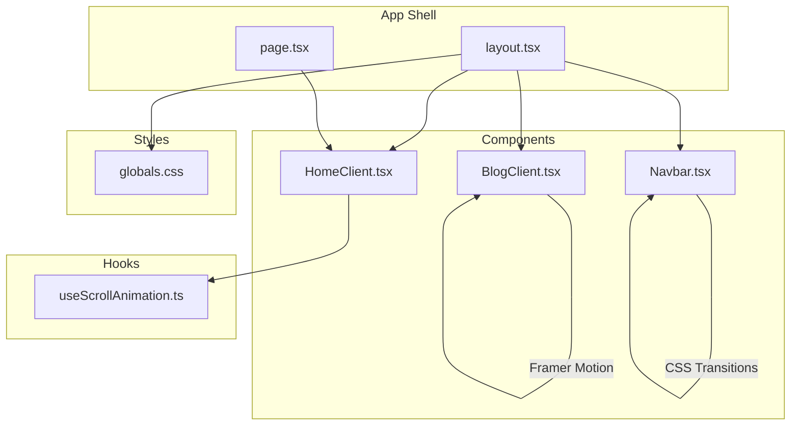
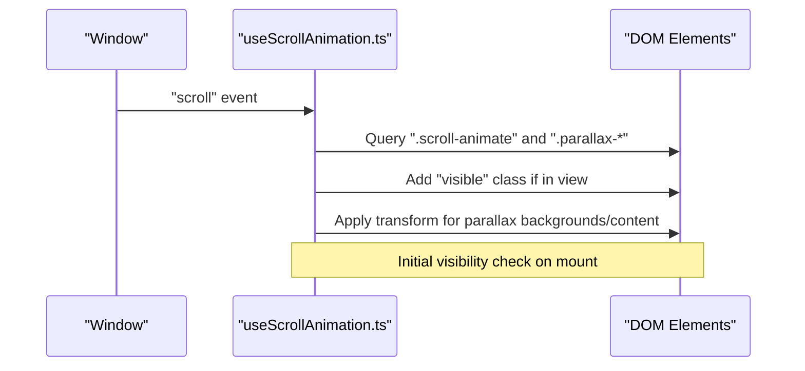
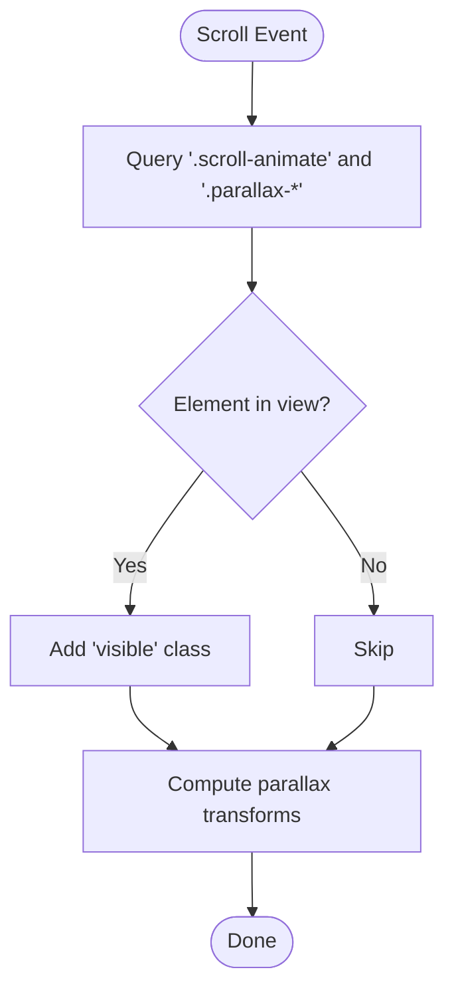
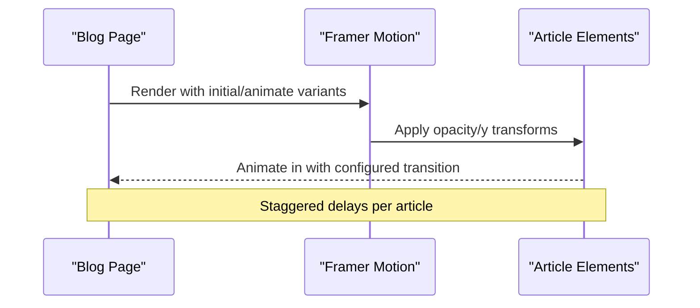
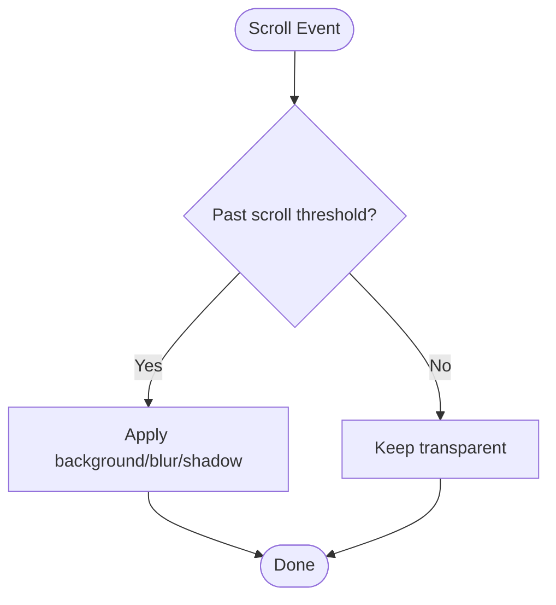
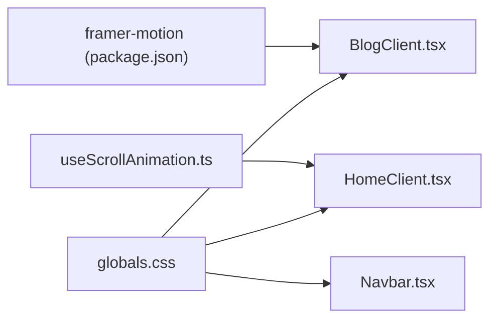

# Animations & Interactions

<cite>
**Referenced Files in This Document**
- [useScrollAnimation.ts](file://src/hooks/useScrollAnimation.ts)
- [HomeClient.tsx](file://src/components/HomeClient.tsx)
- [BlogClient.tsx](file://src/components/BlogClient.tsx)
- [Navbar.tsx](file://src/components/Navbar.tsx)
- [layout.tsx](file://src/app/layout.tsx)
- [globals.css](file://src/app/globals.css)
- [page.tsx](file://src/app/page.tsx)
- [package.json](file://package.json)
</cite>

## Table of Contents
1. [Introduction](#introduction)
2. [Project Structure](#project-structure)
3. [Core Components](#core-components)
4. [Architecture Overview](#architecture-overview)
5. [Detailed Component Analysis](#detailed-component-analysis)
6. [Dependency Analysis](#dependency-analysis)
7. [Performance Considerations](#performance-considerations)
8. [Accessibility Considerations](#accessibility-considerations)
9. [Troubleshooting Guide](#troubleshooting-guide)
10. [Conclusion](#conclusion)
11. [Appendices](#appendices)

## Introduction
This document explains the animation and interaction systems built with Framer Motion and custom scroll-driven effects. It covers scroll-triggered entrance animations, parallax behavior, and interactive transitions. It also documents the useScrollAnimation hook, event handling optimization, performance characteristics, and accessibility considerations. Practical guidance is included for extending animations, configuring motion variants, and integrating animations with user interactions.

## Project Structure
The animation system spans client components, a dedicated scroll hook, and global styles. Key areas:
- Scroll-based animations: useScrollAnimation hook handles visibility and parallax effects.
- Entrance animations: Framer Motion powers article and hero transitions.
- Interactive transitions: Navbar and hover states leverage CSS transitions and transforms.
- Global styles: Tailwind and theme variables define motion-friendly design tokens.

**Diagram sources**
- [layout.tsx:28-57](file://src/app/layout.tsx#L28-L57)
- [page.tsx:10-14](file://src/app/page.tsx#L10-L14)
- [HomeClient.tsx:12-212](file://src/components/HomeClient.tsx#L12-L212)
- [BlogClient.tsx:12-166](file://src/components/BlogClient.tsx#L12-L166)
- [Navbar.tsx:7-139](file://src/components/Navbar.tsx#L7-L139)
- [useScrollAnimation.ts:5-50](file://src/hooks/useScrollAnimation.ts#L5-L50)
- [globals.css:68-113](file://src/app/globals.css#L68-L113)

**Section sources**
- [layout.tsx:28-57](file://src/app/layout.tsx#L28-L57)
- [page.tsx:10-14](file://src/app/page.tsx#L10-L14)
- [HomeClient.tsx:12-212](file://src/components/HomeClient.tsx#L12-L212)
- [BlogClient.tsx:12-166](file://src/components/BlogClient.tsx#L12-L166)
- [Navbar.tsx:7-139](file://src/components/Navbar.tsx#L7-L139)
- [useScrollAnimation.ts:5-50](file://src/hooks/useScrollAnimation.ts#L5-L50)
- [globals.css:68-113](file://src/app/globals.css#L68-L113)

## Core Components
- useScrollAnimation hook
  - Adds a CSS class to elements when they enter the viewport during scroll.
  - Applies parallax transforms to background and content containers based on scroll position.
  - Initializes a visibility check on mount and cleans up listeners on unmount.
- Framer Motion in BlogClient
  - Uses initial and animate variants for entrance and staggered delays.
  - Integrates with Next.js Image for hover scaling and opacity transitions.
- Navbar interactions
  - Scroll-aware background and blur effect.
  - Staggered mobile menu item transitions with transform and opacity.
- Global styles
  - Theme tokens and typography variables support consistent motion timing and easing.
  - Hover and transition utilities enable performant micro-interactions.

**Section sources**
- [useScrollAnimation.ts:5-50](file://src/hooks/useScrollAnimation.ts#L5-L50)
- [BlogClient.tsx:12-166](file://src/components/BlogClient.tsx#L12-L166)
- [Navbar.tsx:7-139](file://src/components/Navbar.tsx#L7-L139)
- [globals.css:68-113](file://src/app/globals.css#L68-L113)

## Architecture Overview
The animation pipeline combines DOM queries, scroll events, and declarative motion libraries:
- Scroll triggers update DOM classes and inline transforms.
- Framer Motion manages component-level animations with variants and transitions.
- CSS transitions and transforms provide lightweight interactive feedback.

**Diagram sources**
- [useScrollAnimation.ts:5-50](file://src/hooks/useScrollAnimation.ts#L5-L50)

## Detailed Component Analysis

### Scroll Animation Hook
- Purpose: Provide scroll-triggered visibility and parallax behavior.
- Implementation highlights:
  - Visibility detection uses bounding rectangles and viewport thresholds.
  - Parallax computes transform values from scroll position with decoupled speeds for background and content.
  - Event listeners are attached on mount and removed on unmount to prevent leaks.
- Extensibility:
  - Add new selectors for additional scroll-triggered effects.
  - Introduce configurable offsets and easing curves via transition properties.

**Diagram sources**
- [useScrollAnimation.ts:7-37](file://src/hooks/useScrollAnimation.ts#L7-L37)

**Section sources**
- [useScrollAnimation.ts:5-50](file://src/hooks/useScrollAnimation.ts#L5-L50)

### Framer Motion Entrances (BlogClient)
- Behavior:
  - Hero header and articles animate in with opacity and vertical displacement.
  - Staggered delays create a cascading entrance effect.
- Variants and transitions:
  - initial and animate define start/end states.
  - transition controls delay and timing per item.
- Integration:
  - Works alongside hover transitions on images and links for cohesive motion.

**Diagram sources**
- [BlogClient.tsx:19-78](file://src/components/BlogClient.tsx#L19-L78)
- [BlogClient.tsx:82-115](file://src/components/BlogClient.tsx#L82-L115)

**Section sources**
- [BlogClient.tsx:12-166](file://src/components/BlogClient.tsx#L12-L166)

### Interactive Transitions (Navbar)
- Scroll-aware header:
  - Changes background, blur, and shadow after scrolling past a threshold.
- Mobile menu:
  - Items animate in with staggered delays and transform/opacity transitions.
- Hover states:
  - Links and buttons scale and translate with CSS transitions for tactile feedback.

**Diagram sources**
- [Navbar.tsx:12-18](file://src/components/Navbar.tsx#L12-L18)

**Section sources**
- [Navbar.tsx:7-139](file://src/components/Navbar.tsx#L7-L139)

### Global Styles and Motion Tokens
- Theme variables:
  - Define color roles and typography families used across motion-enabled components.
- Transition utilities:
  - Consistent easing and duration tokens improve motion coherence.
- Glass and overlay effects:
  - Blur and backdrop filters integrate with scroll-aware backgrounds.

**Section sources**
- [globals.css:4-66](file://src/app/globals.css#L4-L66)
- [globals.css:68-113](file://src/app/globals.css#L68-L113)

## Dependency Analysis
- External library:
  - Framer Motion is a direct dependency enabling declarative animations.
- Internal dependencies:
  - useScrollAnimation is used by HomeClient to drive scroll-triggered effects.
  - BlogClient relies on Framer Motion for entrances.
  - Navbar uses CSS transitions for interactive feedback.

**Diagram sources**
- [package.json:11-21](file://package.json#L11-L21)
- [BlogClient.tsx:6](file://src/components/BlogClient.tsx#L6)
- [useScrollAnimation.ts:5-50](file://src/hooks/useScrollAnimation.ts#L5-L50)
- [HomeClient.tsx:12-212](file://src/components/HomeClient.tsx#L12-L212)
- [globals.css:68-113](file://src/app/globals.css#L68-L113)
- [Navbar.tsx:7-139](file://src/components/Navbar.tsx#L7-L139)

**Section sources**
- [package.json:11-21](file://package.json#L11-L21)
- [BlogClient.tsx:6](file://src/components/BlogClient.tsx#L6)
- [useScrollAnimation.ts:5-50](file://src/hooks/useScrollAnimation.ts#L5-L50)
- [HomeClient.tsx:12-212](file://src/components/HomeClient.tsx#L12-L212)
- [globals.css:68-113](file://src/app/globals.css#L68-L113)
- [Navbar.tsx:7-139](file://src/components/Navbar.tsx#L7-L139)

## Performance Considerations
- Event handling optimization
  - The hook attaches two scroll handlers. To reduce overhead, consider throttling or using a single handler that toggles both behaviors.
  - Ensure cleanup removes listeners to avoid memory leaks.
- DOM queries
  - Query selectors run on every scroll tick. Cache NodeList results when possible or limit selector scope.
- Transform vs layout
  - Parallax applies transform; keep animations off the layout thread for smoother performance.
- Motion primitives
  - Prefer transform and opacity for GPU-accelerated animations.
- CSS transitions
  - Use hardware-accelerated properties (transform, opacity) for hover and scroll effects.
- Bundle and render
  - Keep motion-heavy components client-rendered and avoid unnecessary re-renders.

[No sources needed since this section provides general guidance]

## Accessibility Considerations
- Reduced motion preferences
  - Respect user preferences by detecting reduced motion and simplifying or disabling animations accordingly.
- Focus and keyboard navigation
  - Ensure interactive elements remain operable without motion; maintain visible focus states.
- Screen readers
  - Avoid animating elements that carry essential information; ensure content remains readable and scannable.
- Contrast and readability
  - Maintain sufficient contrast against animated backgrounds, especially with blur and gradient overlays.

[No sources needed since this section provides general guidance]

## Troubleshooting Guide
- Elements do not animate on scroll
  - Verify the presence of the trigger class on elements and that the hook is mounted in a client component.
  - Confirm the initial visibility check runs on mount.
- Parallax feels too fast or slow
  - Adjust the multiplier values applied to scroll position for background and content.
- Jank during scroll
  - Reduce work inside scroll handlers; defer heavy computations or use requestAnimationFrame.
- Animations not playing on first load
  - Ensure the initial visibility check is invoked after mounting and that the DOM is ready.

**Section sources**
- [useScrollAnimation.ts:5-50](file://src/hooks/useScrollAnimation.ts#L5-L50)

## Conclusion
The project blends Framer Motion for component-level entrances with a custom scroll hook for parallax and visibility-triggered animations. By leveraging CSS transitions, transform-based motion, and careful event handling, the system achieves smooth, performant interactions. Extending the hook and variants allows for consistent, scalable animation patterns across the site.

[No sources needed since this section summarizes without analyzing specific files]

## Appendices

### Practical Examples and Patterns
- Scroll-triggered entrance
  - Add a trigger class to elements and rely on the visibility handler to reveal them.
  - Reference: [useScrollAnimation.ts:7-20](file://src/hooks/useScrollAnimation.ts#L7-L20)
- Parallax backgrounds
  - Wrap hero sections with parallax classes and adjust speed multipliers for depth.
  - Reference: [useScrollAnimation.ts:22-37](file://src/hooks/useScrollAnimation.ts#L22-L37)
- Staggered entrances with Framer Motion
  - Use staggered delays for lists of items to create a natural cascade.
  - Reference: [BlogClient.tsx:82-115](file://src/components/BlogClient.tsx#L82-L115)
- Interactive hover states
  - Combine CSS transitions with transform and opacity for responsive feedback.
  - Reference: [globals.css:80-88](file://src/app/globals.css#L80-L88), [Navbar.tsx:66-73](file://src/components/Navbar.tsx#L66-L73)

### Responsive Animation Behavior
- Use media queries to adjust timing and easing for different breakpoints.
- Scale down motion on smaller screens or disable certain effects when appropriate.

[No sources needed since this section provides general guidance]