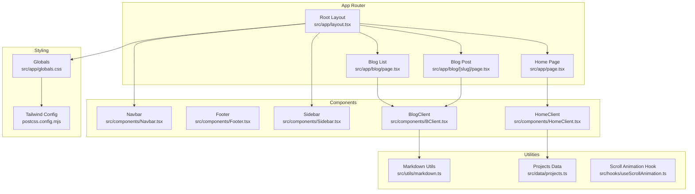
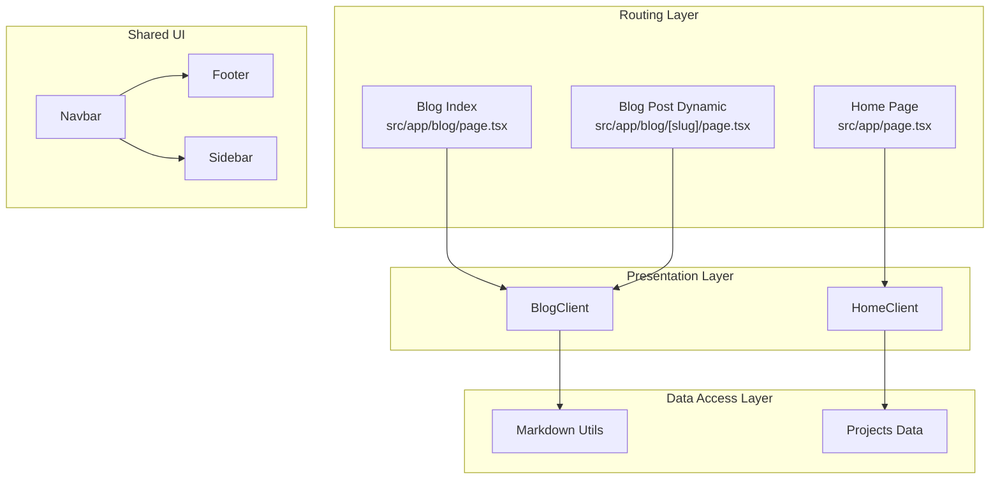
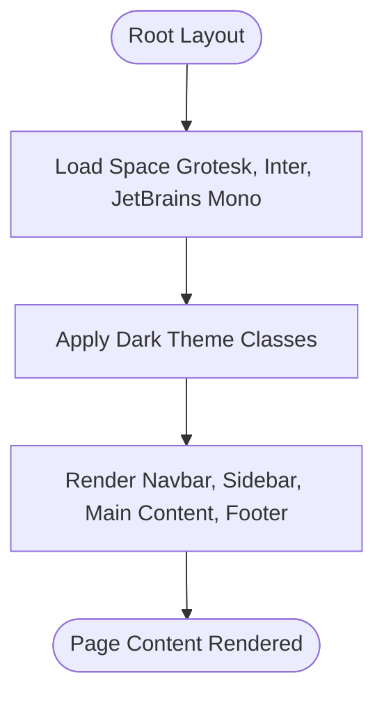
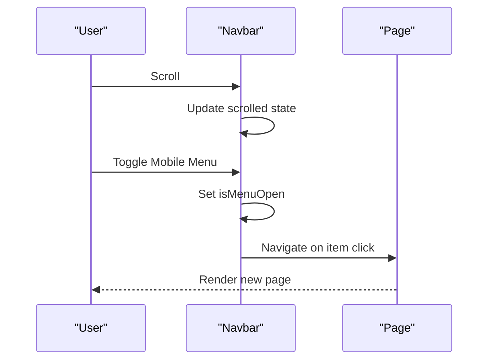
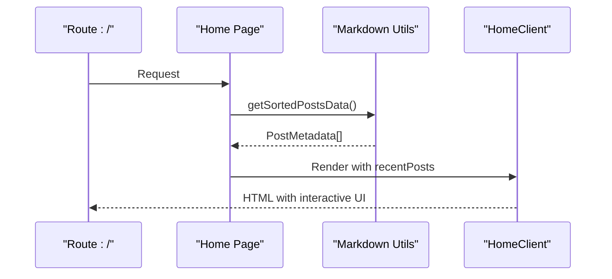
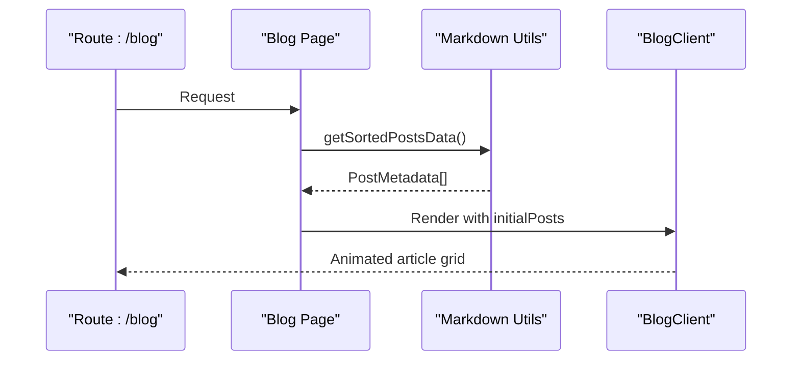
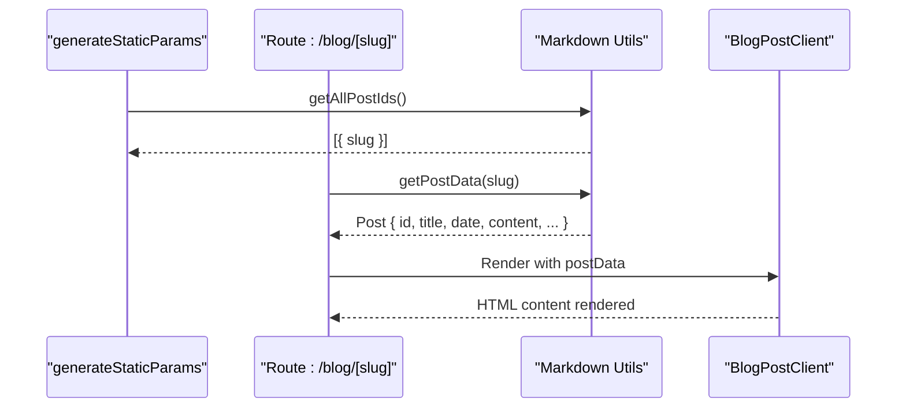
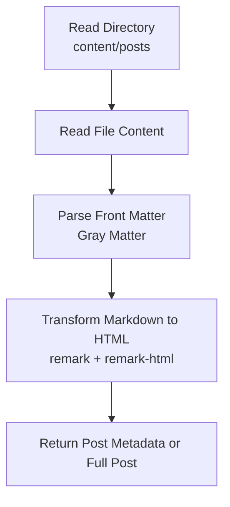
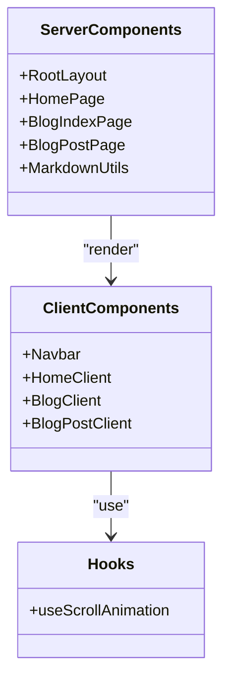
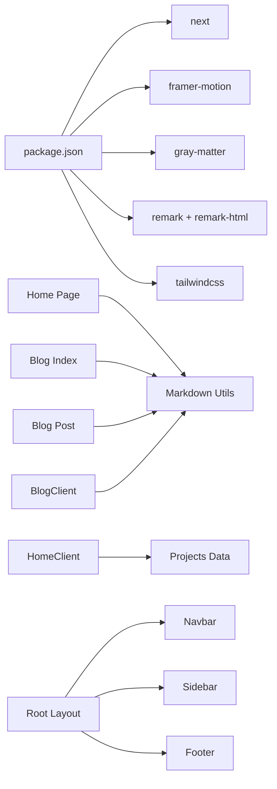

# Architecture & Design

<cite>
**Referenced Files in This Document**
- [layout.tsx](file://src/app/layout.tsx)
- [globals.css](file://src/app/globals.css)
- [Navbar.tsx](file://src/components/Navbar.tsx)
- [Footer.tsx](file://src/components/Footer.tsx)
- [Sidebar.tsx](file://src/components/Sidebar.tsx)
- [HomeClient.tsx](file://src/components/HomeClient.tsx)
- [BlogClient.tsx](file://src/components/BlogClient.tsx)
- [page.tsx](file://src/app/page.tsx)
- [page.tsx](file://src/app/blog/page.tsx)
- [page.tsx](file://src/app/blog/[slug]/page.tsx)
- [markdown.ts](file://src/utils/markdown.ts)
- [projects.ts](file://src/data/projects.ts)
- [useScrollAnimation.ts](file://src/hooks/useScrollAnimation.ts)
- [package.json](file://package.json)
- [next.config.ts](file://next.config.ts)
- [tsconfig.json](file://tsconfig.json)
- [postcss.config.mjs](file://postcss.config.mjs)
</cite>

## Table of Contents
1. [Introduction](#introduction)
2. [Project Structure](#project-structure)
3. [Core Components](#core-components)
4. [Architecture Overview](#architecture-overview)
5. [Detailed Component Analysis](#detailed-component-analysis)
6. [Dependency Analysis](#dependency-analysis)
7. [Performance Considerations](#performance-considerations)
8. [Troubleshooting Guide](#troubleshooting-guide)
9. [Conclusion](#conclusion)

## Introduction
This document describes the architecture and design of a Next.js portfolio and blog platform. It explains the component-based structure, server-side rendering approach, and static site generation strategy. It documents how layout, navigation, content components, and utility hooks interact, and how technical choices such as Framer Motion for animations, Gray Matter for markdown processing, and Tailwind CSS for styling shape the system. It also covers data flow from content management to component rendering, system boundaries, integration patterns, and architectural patterns like MVC separation. Finally, it outlines the app router structure, dynamic routing for blog posts, and client–server component separation.

## Project Structure
The project follows Next.js App Router conventions with a strict separation between server and client components. The application is organized into:
- src/app: Route handlers and pages implementing SSR/SSG
- src/components: Reusable UI components (client and server)
- src/utils: Shared utilities for data processing
- src/hooks: Client-side React hooks
- src/data: Static datasets (e.g., projects)
- Public assets: Images under public/images

Key characteristics:
- Root layout composes global fonts, styles, and shared UI (navigation, footer, sidebar)
- Pages orchestrate data fetching and render client components
- Utilities encapsulate content parsing and markdown transformations
- Styling leverages Tailwind CSS with a custom theme and PostCSS plugin pipeline

**Diagram sources**
- [layout.tsx:1-58](file://src/app/layout.tsx#L1-L58)
- [page.tsx:1-15](file://src/app/page.tsx#L1-L15)
- [page.tsx:1-15](file://src/app/blog/page.tsx#L1-L15)
- [page.tsx:1-18](file://src/app/blog/[slug]/page.tsx#L1-L18)
- [Navbar.tsx:1-140](file://src/components/Navbar.tsx#L1-L140)
- [Footer.tsx:1-49](file://src/components/Footer.tsx#L1-L49)
- [Sidebar.tsx:1-20](file://src/components/Sidebar.tsx#L1-L20)
- [HomeClient.tsx:1-212](file://src/components/HomeClient.tsx#L1-L212)
- [BlogClient.tsx:1-166](file://src/components/BlogClient.tsx#L1-L166)
- [markdown.ts:1-108](file://src/utils/markdown.ts#L1-L108)
- [projects.ts:1-43](file://src/data/projects.ts#L1-L43)
- [useScrollAnimation.ts:1-51](file://src/hooks/useScrollAnimation.ts#L1-L51)
- [globals.css:1-113](file://src/app/globals.css#L1-L113)
- [postcss.config.mjs:1-6](file://postcss.config.mjs#L1-L6)

**Section sources**
- [layout.tsx:1-58](file://src/app/layout.tsx#L1-L58)
- [globals.css:1-113](file://src/app/globals.css#L1-L113)
- [postcss.config.mjs:1-6](file://postcss.config.mjs#L1-L6)

## Core Components
- Root layout: Provides global metadata, fonts, dark mode, and composes shared UI (navigation, sidebar, footer). It wraps page content in a responsive container and applies global styles.
- Navigation: Client-side component with scroll-aware styling, responsive mobile menu, and animated transitions.
- Footer: Persistent footer with links and status indicators.
- Sidebar: Fixed social navigation panel on the left.
- Home client: Renders hero, stats, featured projects, and recent blog posts using client-side interactivity and animations.
- Blog client: Renders a curated feed of posts with animations and a sidebar for author and categories.
- Markdown utilities: Reads front matter, sorts posts, and converts markdown to HTML.
- Scroll animation hook: Adds scroll-triggered visibility and parallax effects.
- Projects data: Static dataset consumed by home page.

**Section sources**
- [layout.tsx:23-57](file://src/app/layout.tsx#L23-L57)
- [Navbar.tsx:7-139](file://src/components/Navbar.tsx#L7-L139)
- [Footer.tsx:3-48](file://src/components/Footer.tsx#L3-L48)
- [Sidebar.tsx:4-19](file://src/components/Sidebar.tsx#L4-L19)
- [HomeClient.tsx:12-211](file://src/components/HomeClient.tsx#L12-L211)
- [BlogClient.tsx:12-165](file://src/components/BlogClient.tsx#L12-L165)
- [markdown.ts:40-107](file://src/utils/markdown.ts#L40-L107)
- [useScrollAnimation.ts:5-49](file://src/hooks/useScrollAnimation.ts#L5-L49)
- [projects.ts:1-43](file://src/data/projects.ts#L1-L43)

## Architecture Overview
The system follows a layered, component-based architecture:
- Presentation layer: Client components (HomeClient, BlogClient) manage UI and animations.
- Data access layer: Utilities encapsulate filesystem reads and markdown transformations.
- Routing layer: App Router pages orchestrate data fetching and pass props to client components.
- Styling layer: Tailwind CSS with a custom theme and PostCSS pipeline.

**Diagram sources**
- [page.tsx:10-14](file://src/app/page.tsx#L10-L14)
- [page.tsx:10-14](file://src/app/blog/page.tsx#L10-L14)
- [page.tsx:12-17](file://src/app/blog/[slug]/page.tsx#L12-L17)
- [HomeClient.tsx:12-211](file://src/components/HomeClient.tsx#L12-L211)
- [BlogClient.tsx:12-165](file://src/components/BlogClient.tsx#L12-L165)
- [markdown.ts:40-107](file://src/utils/markdown.ts#L40-L107)
- [projects.ts:1-43](file://src/data/projects.ts#L1-L43)
- [Navbar.tsx:20-135](file://src/components/Navbar.tsx#L20-L135)
- [Footer.tsx:4-44](file://src/components/Footer.tsx#L4-L44)
- [Sidebar.tsx:6-15](file://src/components/Sidebar.tsx#L6-L15)

## Detailed Component Analysis

### Layout and Global Styles
- The root layout defines metadata, loads Google Fonts, injects Material Symbols styles, and applies a dark theme. It composes Navbar, Sidebar, and Footer around page content.
- Global CSS integrates Tailwind directives, typography plugin, and a custom theme with semantic color tokens and font families.

**Diagram sources**
- [layout.tsx:23-57](file://src/app/layout.tsx#L23-L57)
- [globals.css:1-113](file://src/app/globals.css#L1-L113)

**Section sources**
- [layout.tsx:23-57](file://src/app/layout.tsx#L23-L57)
- [globals.css:4-66](file://src/app/globals.css#L4-L66)

### Navigation Component
- Client-side component using path detection to highlight active routes.
- Implements scroll-aware header styling and a full-screen mobile overlay with staggered entrance animations.
- Uses Material Symbols for icons and Tailwind utilities for responsive design.

**Diagram sources**
- [Navbar.tsx:12-18](file://src/components/Navbar.tsx#L12-L18)
- [Navbar.tsx:66-73](file://src/components/Navbar.tsx#L66-L73)
- [Navbar.tsx:80-131](file://src/components/Navbar.tsx#L80-L131)

**Section sources**
- [Navbar.tsx:7-139](file://src/components/Navbar.tsx#L7-L139)

### Home Page and Client Rendering
- The home route fetches sorted posts and renders HomeClient, which displays hero content, stats, projects, and recent blog entries.
- Client-side interactivity includes hover effects, gradients, and responsive layouts.

**Diagram sources**
- [page.tsx:10-14](file://src/app/page.tsx#L10-L14)
- [markdown.ts:40-77](file://src/utils/markdown.ts#L40-L77)
- [HomeClient.tsx:12-211](file://src/components/HomeClient.tsx#L12-L211)

**Section sources**
- [page.tsx:10-14](file://src/app/page.tsx#L10-L14)
- [HomeClient.tsx:12-211](file://src/components/HomeClient.tsx#L12-L211)
- [projects.ts:1-43](file://src/data/projects.ts#L1-L43)

### Blog Index and Client Rendering
- The blog index route fetches sorted posts and renders BlogClient, which presents a featured article and a grid of articles with animations.
- Sidebar includes author info and category placeholders.

**Diagram sources**
- [page.tsx:10-14](file://src/app/blog/page.tsx#L10-L14)
- [markdown.ts:40-77](file://src/utils/markdown.ts#L40-L77)
- [BlogClient.tsx:12-165](file://src/components/BlogClient.tsx#L12-L165)

**Section sources**
- [page.tsx:10-14](file://src/app/blog/page.tsx#L10-L14)
- [BlogClient.tsx:12-165](file://src/components/BlogClient.tsx#L12-L165)

### Dynamic Blog Post Route and Static Generation
- The dynamic route generates static paths for each blog post and renders BlogPostClient with the resolved post content.
- Markdown content is transformed from markdown to HTML using remark and remark-html.

**Diagram sources**
- [page.tsx:5-10](file://src/app/blog/[slug]/page.tsx#L5-L10)
- [page.tsx:12-17](file://src/app/blog/[slug]/page.tsx#L12-L17)
- [markdown.ts:24-38](file://src/utils/markdown.ts#L24-L38)
- [markdown.ts:79-107](file://src/utils/markdown.ts#L79-L107)

**Section sources**
- [page.tsx:5-10](file://src/app/blog/[slug]/page.tsx#L5-L10)
- [page.tsx:12-17](file://src/app/blog/[slug]/page.tsx#L12-L17)
- [markdown.ts:24-38](file://src/utils/markdown.ts#L24-L38)
- [markdown.ts:79-107](file://src/utils/markdown.ts#L79-L107)

### Markdown Processing Pipeline
- Reads markdown files from content/posts, parses front matter with Gray Matter, and transforms content to HTML using remark and remark-html.
- Exposes functions to list slugs, sort posts, and fetch individual post data.

**Diagram sources**
- [markdown.ts:1-108](file://src/utils/markdown.ts#L1-L108)

**Section sources**
- [markdown.ts:1-108](file://src/utils/markdown.ts#L1-L108)

### Client–Server Component Separation
- Server components: Root layout, pages, and data-fetching utilities.
- Client components: Navbar, HomeClient, BlogClient, and BlogPostClient (marked with "use client").
- Hooks: useScrollAnimation is client-only and manages scroll events.

**Diagram sources**
- [layout.tsx:28-57](file://src/app/layout.tsx#L28-L57)
- [page.tsx:10-14](file://src/app/page.tsx#L10-L14)
- [page.tsx:10-14](file://src/app/blog/page.tsx#L10-L14)
- [page.tsx:12-17](file://src/app/blog/[slug]/page.tsx#L12-L17)
- [markdown.ts:40-107](file://src/utils/markdown.ts#L40-L107)
- [Navbar.tsx:1-1](file://src/components/Navbar.tsx#L1-L1)
- [HomeClient.tsx:1-1](file://src/components/HomeClient.tsx#L1-L1)
- [BlogClient.tsx:1-1](file://src/components/BlogClient.tsx#L1-L1)
- [useScrollAnimation.ts:1-1](file://src/hooks/useScrollAnimation.ts#L1-L1)

**Section sources**
- [Navbar.tsx:1-1](file://src/components/Navbar.tsx#L1-L1)
- [HomeClient.tsx:1-1](file://src/components/HomeClient.tsx#L1-L1)
- [BlogClient.tsx:1-1](file://src/components/BlogClient.tsx#L1-L1)
- [useScrollAnimation.ts:1-1](file://src/hooks/useScrollAnimation.ts#L1-L1)

## Dependency Analysis
External dependencies include Next.js, Framer Motion, Gray Matter, remark ecosystem, and Tailwind CSS. Internal dependencies form a clean separation:
- Pages depend on markdown utilities for data.
- Client components depend on data and hooks.
- Layout composes shared UI components.

**Diagram sources**
- [package.json:11-34](file://package.json#L11-L34)
- [page.tsx:1-14](file://src/app/page.tsx#L1-L14)
- [page.tsx:1-14](file://src/app/blog/page.tsx#L1-L14)
- [page.tsx:1-17](file://src/app/blog/[slug]/page.tsx#L1-L17)
- [markdown.ts:1-108](file://src/utils/markdown.ts#L1-L108)
- [projects.ts:1-43](file://src/data/projects.ts#L1-L43)
- [layout.tsx:4-6](file://src/app/layout.tsx#L4-L6)
- [Navbar.tsx:1-1](file://src/components/Navbar.tsx#L1-L1)
- [Sidebar.tsx:1-1](file://src/components/Sidebar.tsx#L1-L1)
- [Footer.tsx:1-1](file://src/components/Footer.tsx#L1-L1)

**Section sources**
- [package.json:11-34](file://package.json#L11-L34)

## Performance Considerations
- Static generation: The blog post dynamic route generates static paths, enabling pre-rendered pages for improved performance and SEO.
- Client-side animations: Framer Motion enhances UX but should be used judiciously to avoid layout shifts and excessive re-renders.
- Asset optimization: Next.js Image optimization is used for cover images; ensure appropriate sizes and formats.
- Font loading: Preloaded Google Fonts reduce FOIT/FOFT; consider font-display strategies.
- CSS delivery: Tailwind CSS is configured via PostCSS; ensure purging and minification are enabled in production builds.

[No sources needed since this section provides general guidance]

## Troubleshooting Guide
Common issues and resolutions:
- Missing content directory: Utility functions return empty arrays when the posts directory does not exist; ensure content/posts exists and contains markdown files.
- Incorrect slug resolution: Verify that markdown filenames match slugs without extensions.
- Build errors with Tailwind: Confirm PostCSS plugin configuration and Tailwind directives in global CSS.
- Client component warnings: Ensure "use client" is present in client components and hooks.

**Section sources**
- [markdown.ts:24-38](file://src/utils/markdown.ts#L24-L38)
- [markdown.ts:40-44](file://src/utils/markdown.ts#L40-L44)
- [postcss.config.mjs:1-6](file://postcss.config.mjs#L1-L6)
- [globals.css:1-3](file://src/app/globals.css#L1-L3)

## Conclusion
The portfolio and blog platform employs a clean, component-based architecture with clear separation between server and client concerns. Server-side rendering and static site generation optimize performance and SEO, while client components deliver polished interactions. The chosen libraries—Framer Motion, Gray Matter, and Tailwind CSS—support a modern, maintainable stack. The app router structure and dynamic routing for blog posts enable scalable content management and rendering.