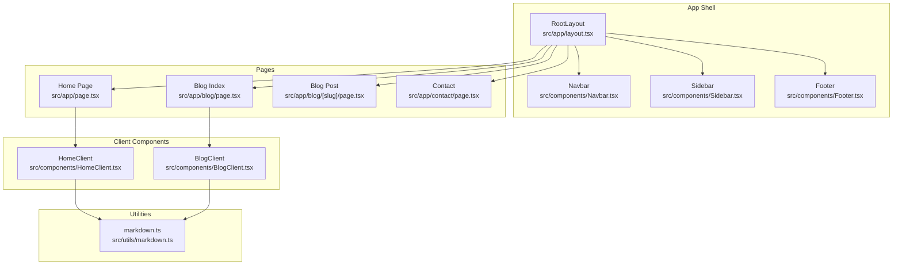
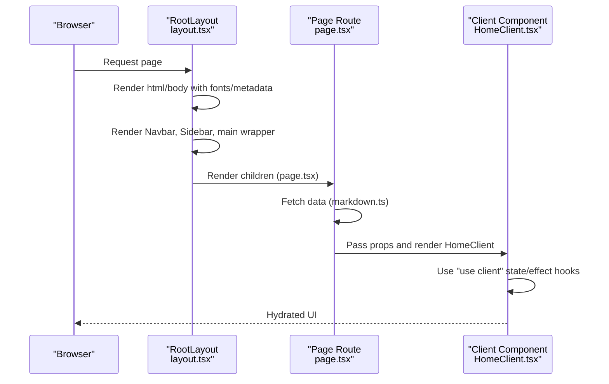
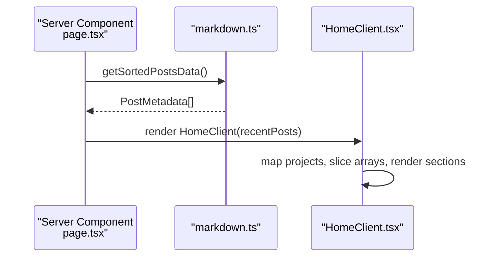
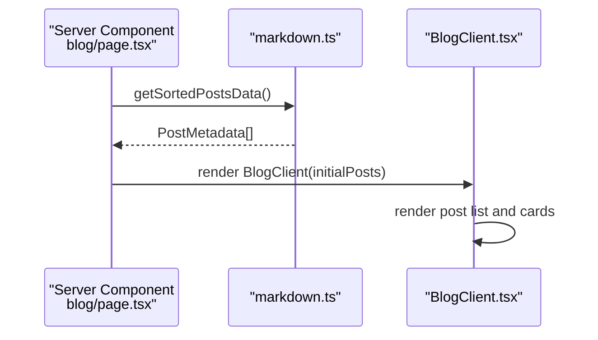
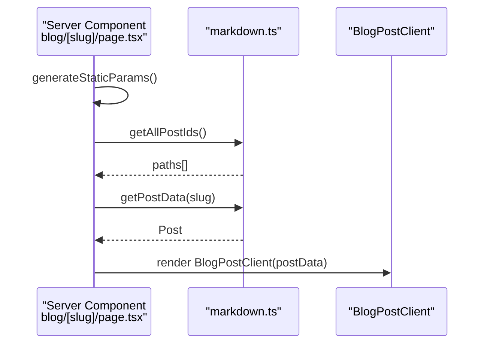
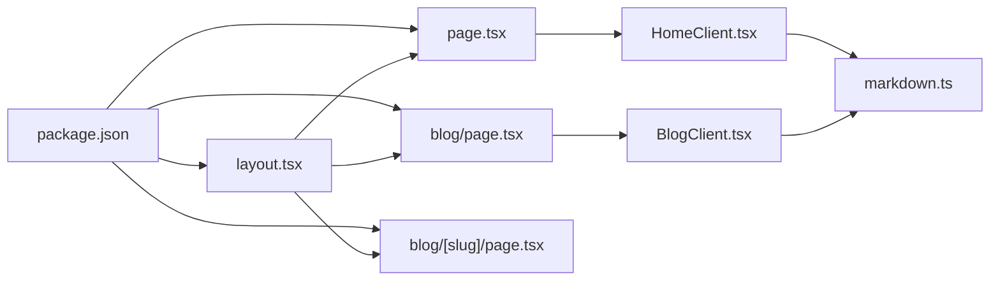

# Component Hierarchy & Structure

<cite>
**Referenced Files in This Document**
- [layout.tsx](file://src/app/layout.tsx)
- [Navbar.tsx](file://src/components/Navbar.tsx)
- [Sidebar.tsx](file://src/components/Sidebar.tsx)
- [Footer.tsx](file://src/components/Footer.tsx)
- [page.tsx](file://src/app/page.tsx)
- [HomeClient.tsx](file://src/components/HomeClient.tsx)
- [blog.page.tsx](file://src/app/blog/page.tsx)
- [BlogClient.tsx](file://src/components/BlogClient.tsx)
- [blog.[slug].page.tsx](file://src/app/blog/[slug]/page.tsx)
- [markdown.ts](file://src/utils/markdown.ts)
- [contact.page.tsx](file://src/app/contact/page.tsx)
- [package.json](file://package.json)
</cite>

## Table of Contents
1. [Introduction](#introduction)
2. [Project Structure](#project-structure)
3. [Core Components](#core-components)
4. [Architecture Overview](#architecture-overview)
5. [Detailed Component Analysis](#detailed-component-analysis)
6. [Dependency Analysis](#dependency-analysis)
7. [Performance Considerations](#performance-considerations)
8. [Troubleshooting Guide](#troubleshooting-guide)
9. [Conclusion](#conclusion)

## Introduction
This document explains the component hierarchy and structure of the Next.js portfolio platform. It focuses on the root layout system centered around RootLayout.tsx, how Navbar, Sidebar, and Footer integrate with pages, and how server components (layout.tsx) and client components (page.tsx and client-side components) collaborate. It also covers component composition, prop passing, conditional rendering, and lifecycle within the Next.js App Router context.

## Project Structure
The application follows Next.js App Router conventions:
- Root layout defines global HTML, fonts, metadata, and shared shell (Navbar, Sidebar, Footer).
- Page routes under src/app define server components that render client components.
- Client components are marked with "use client" and encapsulate interactive behavior.

**Diagram sources**
- [layout.tsx:28-56](file://src/app/layout.tsx#L28-L56)
- [Navbar.tsx:7-139](file://src/components/Navbar.tsx#L7-L139)
- [Sidebar.tsx:4-17](file://src/components/Sidebar.tsx#L4-L17)
- [Footer.tsx:3-46](file://src/components/Footer.tsx#L3-L46)
- [page.tsx:10-14](file://src/app/page.tsx#L10-L14)
- [HomeClient.tsx:12-211](file://src/components/HomeClient.tsx#L12-L211)
- [blog.page.tsx:10-14](file://src/app/blog/page.tsx#L10-L14)
- [BlogClient.tsx:11-200](file://src/components/BlogClient.tsx#L11-L200)
- [blog.[slug].page.tsx](file://src/app/blog/[slug]/page.tsx#L12-L17)
- [markdown.ts:40-77](file://src/utils/markdown.ts#L40-L77)

**Section sources**
- [layout.tsx:1-58](file://src/app/layout.tsx#L1-L58)
- [page.tsx:1-15](file://src/app/page.tsx#L1-L15)
- [blog.page.tsx:1-15](file://src/app/blog/page.tsx#L1-L15)
- [blog.[slug].page.tsx](file://src/app/blog/[slug]/page.tsx#L1-L18)
- [markdown.ts:1-108](file://src/utils/markdown.ts#L1-L108)

## Core Components
- RootLayout (server component): Provides global HTML, metadata, fonts, and the shared shell. Renders children passed from page routes.
- Navbar (client component): Handles scroll-aware styling, mobile menu toggle, and navigation links. Uses Next.js navigation hooks.
- Sidebar (client component): Fixed-position sidebar with external links.
- Footer (client component): Persistent footer with links and status info.
- Home page route: Server component that fetches blog data and renders HomeClient.
- Blog index route: Server component that fetches sorted posts and renders BlogClient.
- Blog post route: Server component that generates static paths and renders BlogPostClient (not shown here).
- Client components: HomeClient and BlogClient accept props and render UI; they rely on markdown utilities for data.

Key composition pattern:
- Server components (layout.tsx, page.tsx, blog/*.ts) are rendered on the server.
- Client components (HomeClient.tsx, BlogClient.tsx, Navbar.tsx, Sidebar.tsx, Footer.tsx) are client-rendered and can use React state and effects.
- Props are passed from server components to client components to avoid SSR hydration mismatches.

**Section sources**
- [layout.tsx:28-56](file://src/app/layout.tsx#L28-L56)
- [Navbar.tsx:1-140](file://src/components/Navbar.tsx#L1-L140)
- [Sidebar.tsx:1-20](file://src/components/Sidebar.tsx#L1-L20)
- [Footer.tsx:1-49](file://src/components/Footer.tsx#L1-L49)
- [page.tsx:10-14](file://src/app/page.tsx#L10-L14)
- [blog.page.tsx:10-14](file://src/app/blog/page.tsx#L10-L14)
- [blog.[slug].page.tsx](file://src/app/blog/[slug]/page.tsx#L12-L17)
- [HomeClient.tsx:8-211](file://src/components/HomeClient.tsx#L8-L211)
- [BlogClient.tsx:7-200](file://src/components/BlogClient.tsx#L7-L200)
- [markdown.ts:40-77](file://src/utils/markdown.ts#L40-L77)

## Architecture Overview
The layout system establishes a consistent shell across all pages:
- RootLayout composes Navbar, Sidebar, and Footer around a main content area.
- Each page route is a server component that prepares data and renders a client component.
- Client components encapsulate interactivity and consume props from server components.

**Diagram sources**
- [layout.tsx:28-56](file://src/app/layout.tsx#L28-L56)
- [page.tsx:10-14](file://src/app/page.tsx#L10-L14)
- [HomeClient.tsx:12-211](file://src/components/HomeClient.tsx#L12-L211)
- [markdown.ts:40-77](file://src/utils/markdown.ts#L40-L77)

## Detailed Component Analysis

### Root Layout and Shell Composition
RootLayout is the server component that:
- Defines metadata and font loading.
- Renders Navbar, Sidebar, and Footer outside the main content area.
- Wraps page content in a main container with responsive width and padding.
- Ensures consistent typography and theme across pages.

Rendering order within RootLayout:
1) Navbar
2) Sidebar
3) main (with children)
4) Footer

Conditional rendering highlights:
- Navbar applies scroll-aware styles and toggles a mobile overlay menu.
- Sidebar is hidden on small screens and visible on larger breakpoints.
- Footer includes responsive layouts and conditional mobile-only elements.

Lifecycle notes:
- RootLayout runs on the server; client components mount after hydration.

**Section sources**
- [layout.tsx:28-56](file://src/app/layout.tsx#L28-L56)
- [Navbar.tsx:12-18](file://src/components/Navbar.tsx#L12-L18)
- [Sidebar.tsx:4-17](file://src/components/Sidebar.tsx#L4-L17)
- [Footer.tsx:3-46](file://src/components/Footer.tsx#L3-L46)

### Home Page: Server Component to Client Component
The home route is a server component that:
- Imports markdown utilities to fetch sorted posts.
- Passes the posts array as props to HomeClient.
- HomeClient renders hero, stats, featured projects, and recent blog entries.

Prop drilling pattern:
- Server component (page.tsx) -> HomeClient props -> internal UI composition.

**Diagram sources**
- [page.tsx:10-14](file://src/app/page.tsx#L10-L14)
- [HomeClient.tsx:12-211](file://src/components/HomeClient.tsx#L12-L211)
- [markdown.ts:40-77](file://src/utils/markdown.ts#L40-L77)

**Section sources**
- [page.tsx:1-15](file://src/app/page.tsx#L1-L15)
- [HomeClient.tsx:12-211](file://src/components/HomeClient.tsx#L12-L211)
- [markdown.ts:40-77](file://src/utils/markdown.ts#L40-L77)

### Blog Index: Server Component to Client Component
The blog index route is a server component that:
- Fetches sorted posts and passes them to BlogClient.
- BlogClient renders a paginated or filtered list of posts.

**Diagram sources**
- [blog.page.tsx:10-14](file://src/app/blog/page.tsx#L10-L14)
- [BlogClient.tsx:11-200](file://src/components/BlogClient.tsx#L11-L200)
- [markdown.ts:40-77](file://src/utils/markdown.ts#L40-L77)

**Section sources**
- [blog.page.tsx:1-15](file://src/app/blog/page.tsx#L1-L15)
- [BlogClient.tsx:7-200](file://src/components/BlogClient.tsx#L7-L200)
- [markdown.ts:40-77](file://src/utils/markdown.ts#L40-L77)

### Blog Post Route: Static Generation and Client Rendering
The dynamic blog post route:
- Generates static paths from markdown files.
- Loads post data and renders BlogPostClient (client component) with post content.

**Diagram sources**
- [blog.[slug].page.tsx](file://src/app/blog/[slug]/page.tsx#L5-L17)
- [markdown.ts:24-38](file://src/utils/markdown.ts#L24-L38)
- [markdown.ts:79-107](file://src/utils/markdown.ts#L79-L107)

**Section sources**
- [blog.[slug].page.tsx](file://src/app/blog/[slug]/page.tsx#L1-L18)
- [markdown.ts:24-38](file://src/utils/markdown.ts#L24-L38)
- [markdown.ts:79-107](file://src/utils/markdown.ts#L79-L107)

### Contact Page: Pure Client Layout
The contact page is a server component that renders a rich layout without client component props. It demonstrates how pages can be purely server-rendered while still leveraging the shared shell.

**Section sources**
- [contact.page.tsx:9-154](file://src/app/contact/page.tsx#L9-L154)

## Dependency Analysis
- RootLayout depends on Navbar, Sidebar, and Footer components.
- Page routes depend on markdown utilities for data fetching.
- Client components depend on shared data structures (PostMetadata) and local data (projects).
- The project uses Next.js 15, React 19, Tailwind CSS v4, and remark ecosystem for markdown processing.

**Diagram sources**
- [package.json:11-21](file://package.json#L11-L21)
- [layout.tsx:1-6](file://src/app/layout.tsx#L1-L6)
- [page.tsx:1-2](file://src/app/page.tsx#L1-L2)
- [blog.page.tsx:1-2](file://src/app/blog/page.tsx#L1-L2)
- [blog.[slug].page.tsx](file://src/app/blog/[slug]/page.tsx#L1-L2)
- [HomeClient.tsx:5-6](file://src/components/HomeClient.tsx#L5-L6)
- [BlogClient.tsx:1-6](file://src/components/BlogClient.tsx#L1-L6)
- [markdown.ts:1-7](file://src/utils/markdown.ts#L1-L7)

**Section sources**
- [package.json:1-35](file://package.json#L1-L35)
- [layout.tsx:1-6](file://src/app/layout.tsx#L1-L6)
- [markdown.ts:1-7](file://src/utils/markdown.ts#L1-L7)

## Performance Considerations
- Server components (layout.tsx, page.tsx, blog/*.ts) render on the server, reducing initial client payload.
- Client components (HomeClient.tsx, BlogClient.tsx, Navbar.tsx) are marked "use client" and should remain lightweight to minimize hydration cost.
- Static generation for blog posts reduces server load and improves response times.
- Font preloading and CSS variables in RootLayout help avoid layout shifts.
- Conditional rendering (mobile overlay, responsive footers) ensures minimal DOM on smaller screens.

## Troubleshooting Guide
- Hydration mismatch: Ensure only client components use React state/effect hooks and avoid passing server-only data to client components without proper serialization.
- Navigation state: Navbar uses pathname and scroll effects; confirm Next.js navigation hooks are used consistently.
- Data fetching: Verify markdown utilities return expected shapes (PostMetadata[]) to prevent runtime errors in client components.
- Static paths: Confirm generateStaticParams produces slugs matching markdown filenames to avoid 404s.

**Section sources**
- [Navbar.tsx:8-18](file://src/components/Navbar.tsx#L8-L18)
- [markdown.ts:40-77](file://src/utils/markdown.ts#L40-L77)
- [blog.[slug].page.tsx](file://src/app/blog/[slug]/page.tsx#L5-L10)

## Conclusion
The portfolio platform uses a clean separation between server and client components. RootLayout provides a consistent shell, while page routes prepare data and pass it to client components. Navbar, Sidebar, and Footer are integrated at the root level, ensuring a cohesive UX across routes. The component composition pattern emphasizes predictable prop flows, conditional rendering for responsiveness, and lifecycle awareness within the Next.js App Router.