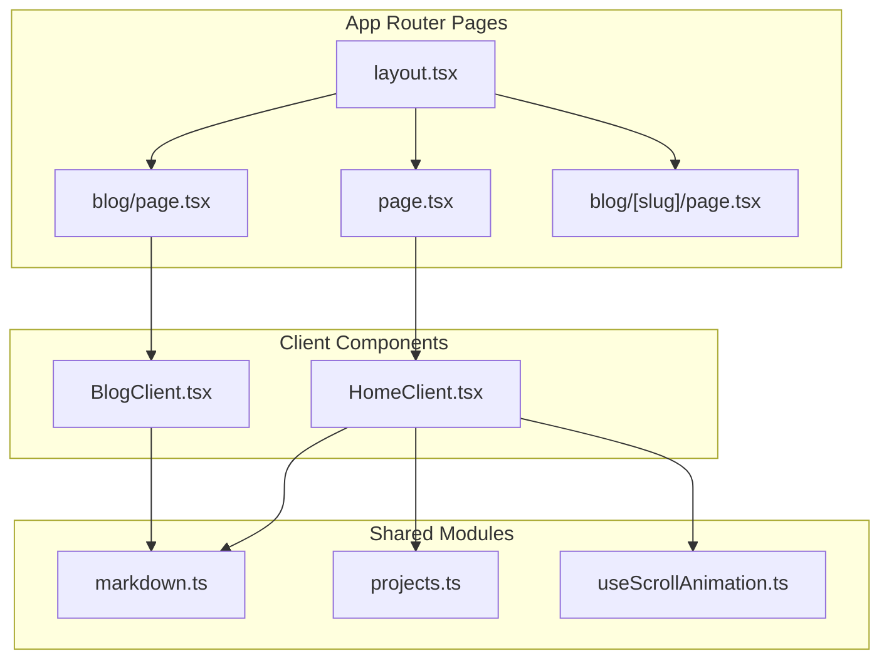
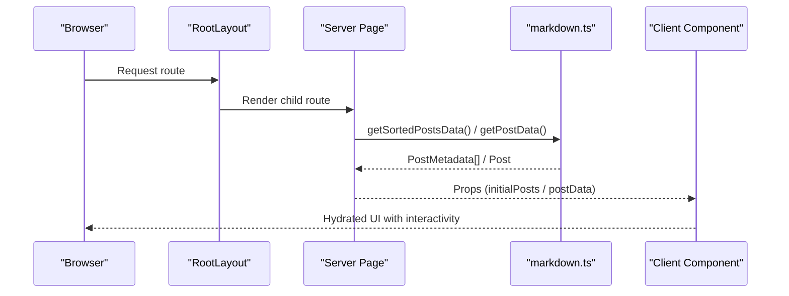
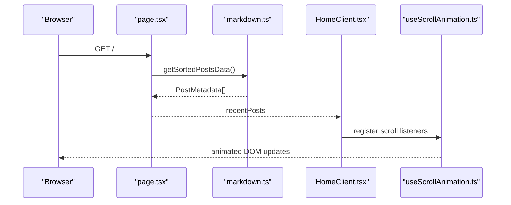
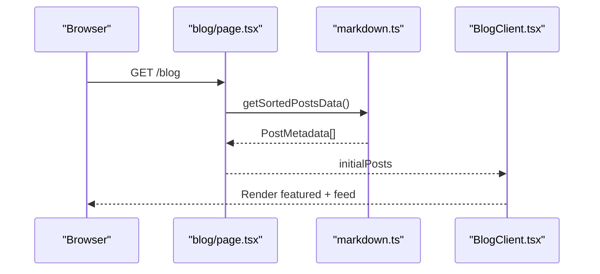
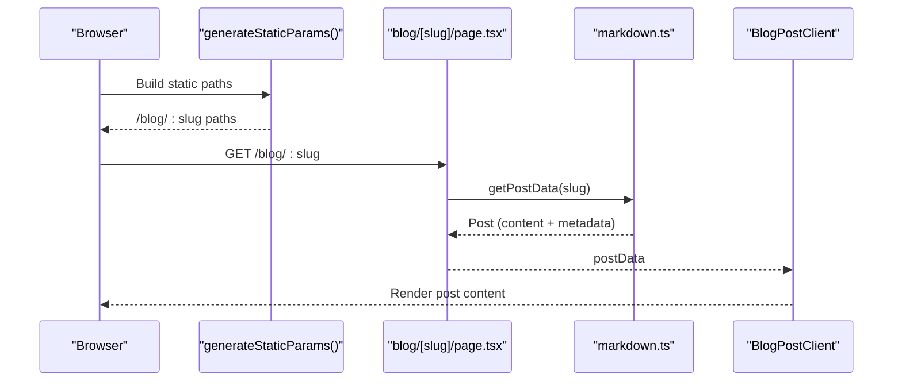
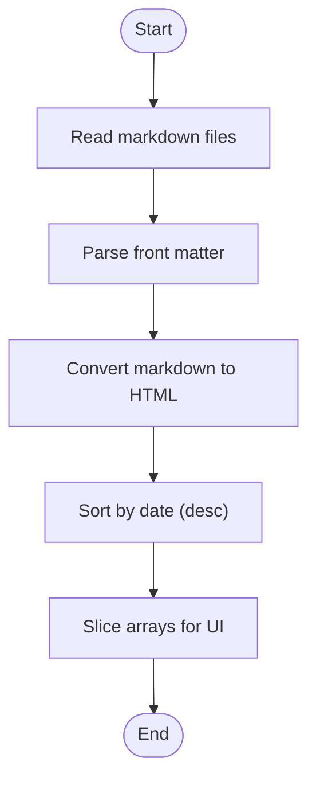
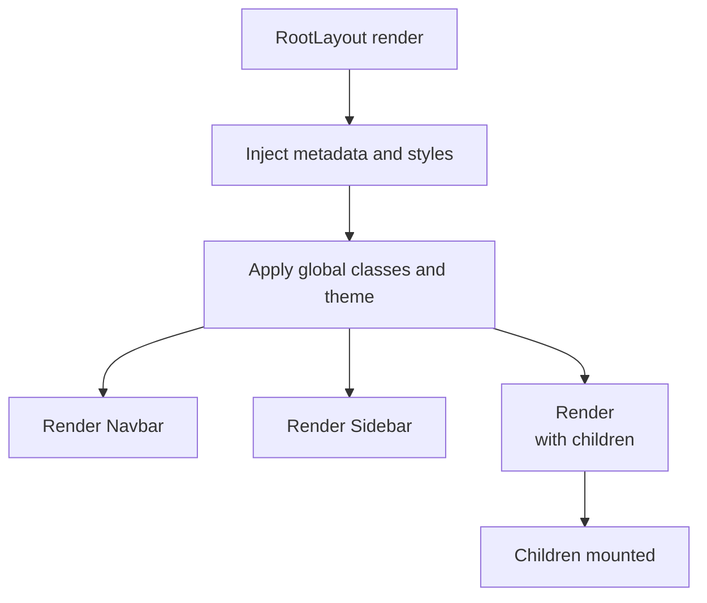
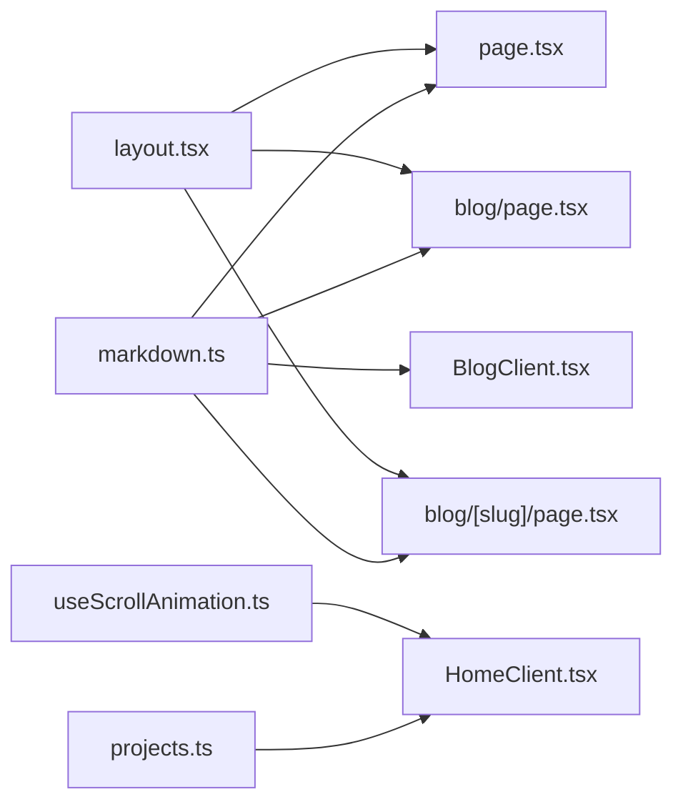

# Component Data Flow

<cite>
**Referenced Files in This Document**
- [layout.tsx](file://src/app/layout.tsx)
- [page.tsx](file://src/app/page.tsx)
- [blog.page.tsx](file://src/app/blog/page.tsx)
- [blog.[slug].page.tsx](file://src/app/blog/[slug]/page.tsx)
- [BlogClient.tsx](file://src/components/BlogClient.tsx)
- [HomeClient.tsx](file://src/components/HomeClient.tsx)
- [markdown.ts](file://src/utils/markdown.ts)
- [projects.ts](file://src/data/projects.ts)
- [error.tsx](file://src/app/error.tsx)
- [not-found.tsx](file://src/app/not-found.tsx)
- [useScrollAnimation.ts](file://src/hooks/useScrollAnimation.ts)
</cite>

## Table of Contents
1. [Introduction](#introduction)
2. [Project Structure](#project-structure)
3. [Core Components](#core-components)
4. [Architecture Overview](#architecture-overview)
5. [Detailed Component Analysis](#detailed-component-analysis)
6. [Dependency Analysis](#dependency-analysis)
7. [Performance Considerations](#performance-considerations)
8. [Troubleshooting Guide](#troubleshooting-guide)
9. [Conclusion](#conclusion)

## Introduction
This document explains how data flows through the portfolio platform’s component hierarchy. It focuses on the separation between server-side rendering (SSR/static generation) and client-side interactivity, how props propagate from server pages to client components, and how static markdown data integrates with dynamic client-side hooks. It also covers data transformation along the way and how components handle loading and error scenarios.

## Project Structure
The application follows Next.js App Router conventions:
- Server pages under src/app define routes and data fetching.
- Client components under src/components encapsulate interactive UI.
- Shared utilities under src/utils and data under src/data.
- A global layout wraps all pages and injects shared UI.

**Diagram sources**
- [layout.tsx:28-57](file://src/app/layout.tsx#L28-L57)
- [page.tsx:10-14](file://src/app/page.tsx#L10-L14)
- [blog.page.tsx:10-14](file://src/app/blog/page.tsx#L10-L14)
- [blog.[slug].page.tsx](file://src/app/blog/[slug]/page.tsx#L12-L17)
- [HomeClient.tsx:12-14](file://src/components/HomeClient.tsx#L12-L14)
- [BlogClient.tsx:12-14](file://src/components/BlogClient.tsx#L12-L14)
- [markdown.ts:40-77](file://src/utils/markdown.ts#L40-L77)
- [projects.ts:1-43](file://src/data/projects.ts#L1-L43)
- [useScrollAnimation.ts:5-49](file://src/hooks/useScrollAnimation.ts#L5-L49)

**Section sources**
- [layout.tsx:1-58](file://src/app/layout.tsx#L1-L58)
- [page.tsx:1-15](file://src/app/page.tsx#L1-L15)
- [blog.page.tsx:1-15](file://src/app/blog/page.tsx#L1-L15)
- [blog.[slug].page.tsx](file://src/app/blog/[slug]/page.tsx#L1-L18)

## Core Components
- Root layout: Provides global metadata, fonts, navigation, sidebar, and footer. It renders the page’s children, enabling per-route data injection.
- Home page: Fetches sorted posts metadata and passes them to HomeClient.
- Blog listing page: Fetches sorted posts metadata and passes them to BlogClient.
- Blog post page: Generates static paths from markdown slugs and fetches a single post’s content for rendering.
- HomeClient: Receives recent posts and displays hero, stats, projects, and a blog preview feed.
- BlogClient: Receives initial posts and renders a featured article plus a list of articles with sidebar content.
- Utilities: markdown.ts parses front matter and transforms markdown to HTML; projects.ts holds static project data.
- Hooks: useScrollAnimation.ts adds scroll-driven animations in the browser.

**Section sources**
- [layout.tsx:23-57](file://src/app/layout.tsx#L23-L57)
- [page.tsx:10-14](file://src/app/page.tsx#L10-L14)
- [blog.page.tsx:10-14](file://src/app/blog/page.tsx#L10-L14)
- [blog.[slug].page.tsx](file://src/app/blog/[slug]/page.tsx#L5-L17)
- [HomeClient.tsx:12-14](file://src/components/HomeClient.tsx#L12-L14)
- [BlogClient.tsx:12-14](file://src/components/BlogClient.tsx#L12-L14)
- [markdown.ts:40-107](file://src/utils/markdown.ts#L40-L107)
- [projects.ts:1-43](file://src/data/projects.ts#L1-L43)
- [useScrollAnimation.ts:5-49](file://src/hooks/useScrollAnimation.ts#L5-L49)

## Architecture Overview
The data flow separates concerns:
- Server pages: Collect static or fetched data (markdown metadata or content) and pass it as props to client components.
- Client components: Render UI, manage animations, and handle user interactions.
- Layout: Wraps pages and provides shared shell UI.

**Diagram sources**
- [layout.tsx:28-57](file://src/app/layout.tsx#L28-L57)
- [page.tsx:10-14](file://src/app/page.tsx#L10-L14)
- [blog.page.tsx:10-14](file://src/app/blog/page.tsx#L10-L14)
- [blog.[slug].page.tsx](file://src/app/blog/[slug]/page.tsx#L12-L17)
- [markdown.ts:40-107](file://src/utils/markdown.ts#L40-L107)
- [BlogClient.tsx:12-14](file://src/components/BlogClient.tsx#L12-L14)
- [HomeClient.tsx:12-14](file://src/components/HomeClient.tsx#L12-L14)

## Detailed Component Analysis

### Home Route Data Flow
- Server page fetches sorted posts metadata and passes them to HomeClient.
- HomeClient slices the array to show recent posts and uses static project data.
- Client-side hook manages scroll animations.

**Diagram sources**
- [page.tsx:10-14](file://src/app/page.tsx#L10-L14)
- [markdown.ts:40-77](file://src/utils/markdown.ts#L40-L77)
- [HomeClient.tsx:12-14](file://src/components/HomeClient.tsx#L12-L14)
- [useScrollAnimation.ts:5-49](file://src/hooks/useScrollAnimation.ts#L5-L49)

**Section sources**
- [page.tsx:10-14](file://src/app/page.tsx#L10-L14)
- [HomeClient.tsx:12-14](file://src/components/HomeClient.tsx#L12-L14)
- [projects.ts:1-43](file://src/data/projects.ts#L1-L43)
- [useScrollAnimation.ts:5-49](file://src/hooks/useScrollAnimation.ts#L5-L49)

### Blog Listing Data Flow
- Server page fetches sorted posts metadata and passes them to BlogClient.
- BlogClient splits the list into a featured post and a regular feed.

**Diagram sources**
- [blog.page.tsx:10-14](file://src/app/blog/page.tsx#L10-L14)
- [markdown.ts:40-77](file://src/utils/markdown.ts#L40-L77)
- [BlogClient.tsx:12-14](file://src/components/BlogClient.tsx#L12-L14)

**Section sources**
- [blog.page.tsx:10-14](file://src/app/blog/page.tsx#L10-L14)
- [BlogClient.tsx:12-14](file://src/components/BlogClient.tsx#L12-L14)

### Dynamic Blog Post Data Flow
- Static generation builds paths from markdown slugs.
- At request time, the page fetches the specific post’s content (HTML transformed from markdown) and passes it to the client component.

**Diagram sources**
- [blog.[slug].page.tsx](file://src/app/blog/[slug]/page.tsx#L5-L17)
- [markdown.ts:79-107](file://src/utils/markdown.ts#L79-L107)

**Section sources**
- [blog.[slug].page.tsx](file://src/app/blog/[slug]/page.tsx#L5-L17)
- [markdown.ts:79-107](file://src/utils/markdown.ts#L79-L107)

### Data Transformation Pipeline
- Markdown parsing: Extracts front matter and converts markdown content to HTML.
- Sorting: Posts are sorted by date in descending order.
- Slicing: Client components slice arrays to limit visible items.

**Diagram sources**
- [markdown.ts:40-107](file://src/utils/markdown.ts#L40-L107)

**Section sources**
- [markdown.ts:40-107](file://src/utils/markdown.ts#L40-L107)

### Layout and Shell Rendering
- RootLayout composes the global shell: metadata, fonts, navbar, sidebar, main content area, and footer.
- Children are rendered inside the main container, receiving props from their respective server pages.

**Diagram sources**
- [layout.tsx:23-57](file://src/app/layout.tsx#L23-L57)

**Section sources**
- [layout.tsx:23-57](file://src/app/layout.tsx#L23-L57)

## Dependency Analysis
- Server pages depend on markdown utilities for data retrieval.
- Client components depend on shared data (projects) and utilities (markdown metadata).
- Client components rely on hooks for runtime behavior.
- Layout composes UI components and forwards children.

**Diagram sources**
- [markdown.ts:40-107](file://src/utils/markdown.ts#L40-L107)
- [projects.ts:1-43](file://src/data/projects.ts#L1-L43)
- [page.tsx:10-14](file://src/app/page.tsx#L10-L14)
- [blog.page.tsx:10-14](file://src/app/blog/page.tsx#L10-L14)
- [blog.[slug].page.tsx](file://src/app/blog/[slug]/page.tsx#L12-L17)
- [HomeClient.tsx:12-14](file://src/components/HomeClient.tsx#L12-L14)
- [BlogClient.tsx:12-14](file://src/components/BlogClient.tsx#L12-L14)
- [layout.tsx:28-57](file://src/app/layout.tsx#L28-L57)
- [useScrollAnimation.ts:5-49](file://src/hooks/useScrollAnimation.ts#L5-L49)

**Section sources**
- [markdown.ts:40-107](file://src/utils/markdown.ts#L40-L107)
- [projects.ts:1-43](file://src/data/projects.ts#L1-L43)
- [page.tsx:10-14](file://src/app/page.tsx#L10-L14)
- [blog.page.tsx:10-14](file://src/app/blog/page.tsx#L10-L14)
- [blog.[slug].page.tsx](file://src/app/blog/[slug]/page.tsx#L12-L17)
- [HomeClient.tsx:12-14](file://src/components/HomeClient.tsx#L12-L14)
- [BlogClient.tsx:12-14](file://src/components/BlogClient.tsx#L12-L14)
- [layout.tsx:28-57](file://src/app/layout.tsx#L28-L57)
- [useScrollAnimation.ts:5-49](file://src/hooks/useScrollAnimation.ts#L5-L49)

## Performance Considerations
- Static data from markdown is read synchronously during build-time data fetching. Consider caching or pre-processing for very large content sets.
- Client-side hydration is minimal for these components; keep client components small and avoid heavy computations on mount.
- Scroll animations are throttled by event listeners; ensure cleanup to prevent memory leaks.
- For the blog post page, content transformation occurs at request time; consider pre-rendering HTML or caching transformed content if performance becomes a concern.

## Troubleshooting Guide
- Error boundary: The error component logs the error and provides a reset button to retry rendering the route segment.
- Not found: A dedicated not-found page handles missing routes with a friendly message and a link back to home.
- Data availability: If markdown directory is missing or empty, utility functions return empty arrays; ensure content exists or handle gracefully in components.

**Section sources**
- [error.tsx:5-34](file://src/app/error.tsx#L5-L34)
- [not-found.tsx:3-21](file://src/app/not-found.tsx#L3-L21)
- [markdown.ts:40-44](file://src/utils/markdown.ts#L40-L44)

## Conclusion
The portfolio platform cleanly separates server-side data preparation from client-side interactivity. Server pages fetch and transform markdown data, then pass props to client components. The layout system provides a consistent shell, while hooks enable smooth client-side animations. Error and not-found pages ensure robust user experiences when things go wrong.