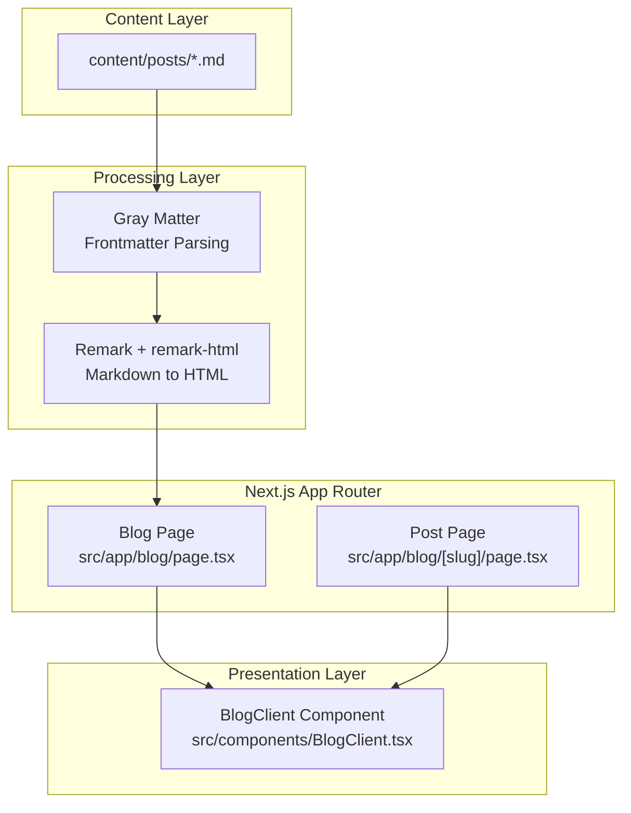
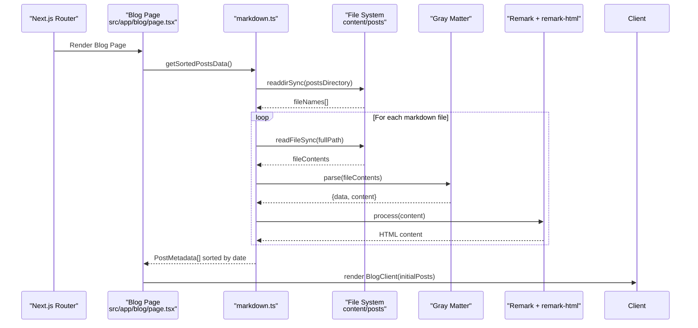
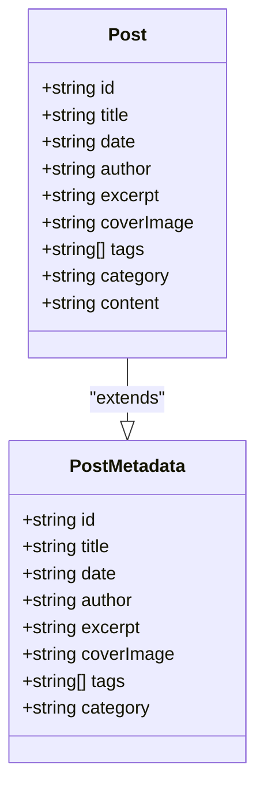
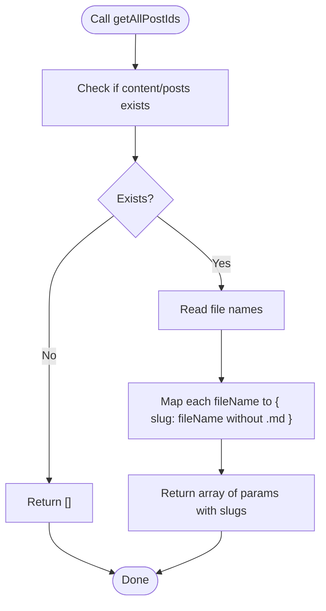
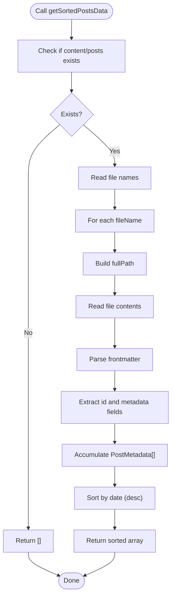
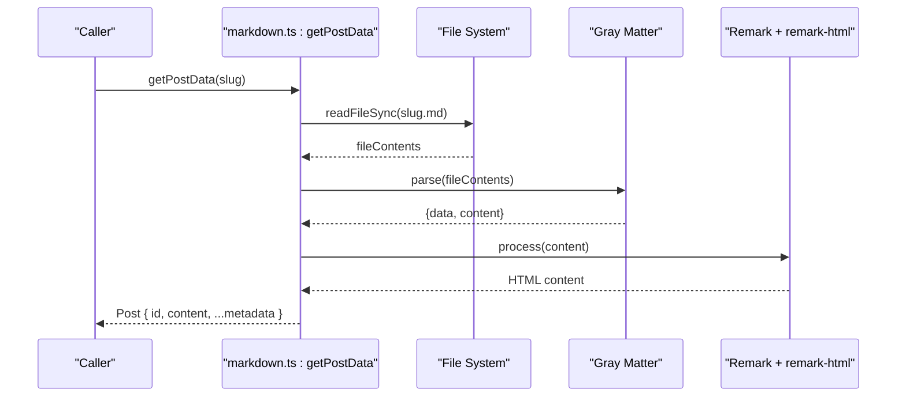
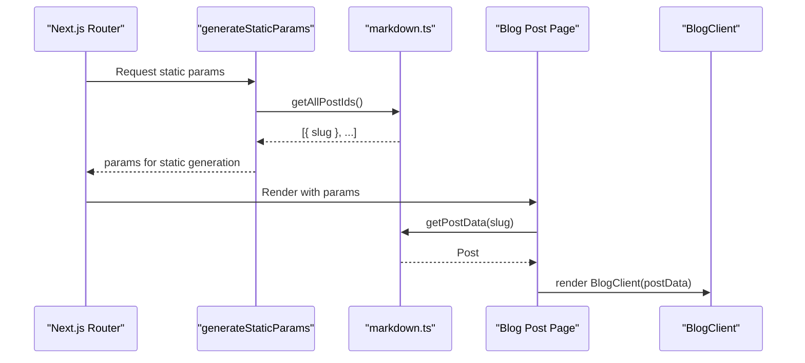
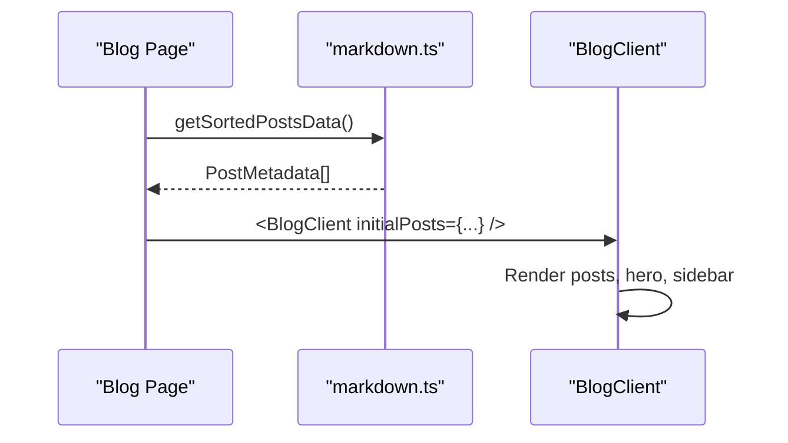
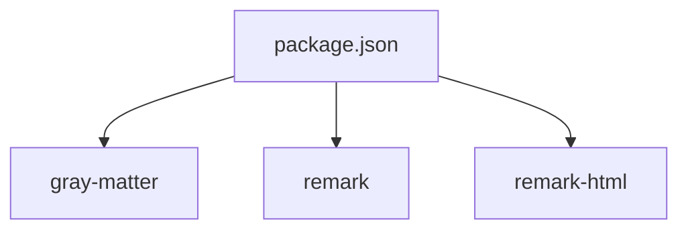

# Content Processing Pipeline

<cite>
**Referenced Files in This Document**
- [markdown.ts](file://src/utils/markdown.ts)
- [blog/page.tsx](file://src/app/blog/page.tsx)
- [blog/[slug]/page.tsx](file://src/app/blog/[slug]/page.tsx)
- [BlogClient.tsx](file://src/components/BlogClient.tsx)
- [package.json](file://package.json)
- [next.config.ts](file://next.config.ts)
- [tsconfig.json](file://tsconfig.json)
</cite>

## Table of Contents
1. [Introduction](#introduction)
2. [Project Structure](#project-structure)
3. [Core Components](#core-components)
4. [Architecture Overview](#architecture-overview)
5. [Detailed Component Analysis](#detailed-component-analysis)
6. [Dependency Analysis](#dependency-analysis)
7. [Performance Considerations](#performance-considerations)
8. [Troubleshooting Guide](#troubleshooting-guide)
9. [Conclusion](#conclusion)

## Introduction
This document explains the content processing pipeline that transforms markdown files into rendered blog content. It covers the complete workflow from file system reading to HTML generation, including frontmatter extraction using Gray Matter and content transformation using Remark. The documentation details the PostMetadata and Post interfaces, how data flows from static files to component props, and demonstrates the slug-based routing system for dynamic blog post pages.

## Project Structure
The content processing pipeline spans several key areas:
- Static content storage under `content/posts` with markdown files
- Utility functions in `src/utils/markdown.ts` for file system operations, frontmatter parsing, and markdown-to-HTML conversion
- Next.js app router pages under `src/app/blog` for listing posts and rendering individual posts
- Client components under `src/components` that consume the processed data

**Diagram sources**
- [markdown.ts:1-108](file://src/utils/markdown.ts#L1-L108)
- [blog/page.tsx:1-15](file://src/app/blog/page.tsx#L1-L15)
- [blog/[slug]/page.tsx:1-18](file://src/app/blog/[slug]/page.tsx#L1-L18)
- [BlogClient.tsx:1-166](file://src/components/BlogClient.tsx#L1-L166)

**Section sources**
- [markdown.ts:1-108](file://src/utils/markdown.ts#L1-L108)
- [blog/page.tsx:1-15](file://src/app/blog/page.tsx#L1-L15)
- [blog/[slug]/page.tsx:1-18](file://src/app/blog/[slug]/page.tsx#L1-L18)
- [BlogClient.tsx:1-166](file://src/components/BlogClient.tsx#L1-L166)

## Core Components
This section documents the primary data structures and functions that power the content pipeline.

- PostMetadata: Defines the shape of post metadata extracted from frontmatter, including identifiers, display fields, and optional enrichment fields.
- Post: Extends PostMetadata with the transformed HTML content derived from the markdown body.
- getAllPostIds: Scans the content directory and generates slugs for dynamic route generation.
- getSortedPostsData: Reads all markdown files, extracts frontmatter, and returns a sorted array of PostMetadata.
- getPostData: Loads a specific markdown file by slug, parses frontmatter, converts markdown content to HTML, and returns a Post object.

Key implementation references:
- [PostMetadata interface:9-18](file://src/utils/markdown.ts#L9-L18)
- [Post interface:20-22](file://src/utils/markdown.ts#L20-L22)
- [getAllPostIds function:24-38](file://src/utils/markdown.ts#L24-L38)
- [getSortedPostsData function:40-77](file://src/utils/markdown.ts#L40-L77)
- [getPostData function:79-107](file://src/utils/markdown.ts#L79-L107)

**Section sources**
- [markdown.ts:9-22](file://src/utils/markdown.ts#L9-L22)
- [markdown.ts:24-38](file://src/utils/markdown.ts#L24-L38)
- [markdown.ts:40-77](file://src/utils/markdown.ts#L40-L77)
- [markdown.ts:79-107](file://src/utils/markdown.ts#L79-L107)

## Architecture Overview
The pipeline follows a predictable flow:
1. File system discovery identifies markdown files and produces slugs for dynamic routes.
2. Frontmatter is parsed to extract structured metadata using Gray Matter.
3. Markdown content is transformed to HTML using Remark and remark-html.
4. The resulting Post objects are passed to client components for rendering.

**Diagram sources**
- [blog/page.tsx:10-14](file://src/app/blog/page.tsx#L10-L14)
- [markdown.ts:40-77](file://src/utils/markdown.ts#L40-L77)

**Section sources**
- [blog/page.tsx:10-14](file://src/app/blog/page.tsx#L10-L14)
- [markdown.ts:40-77](file://src/utils/markdown.ts#L40-L77)

## Detailed Component Analysis

### Data Interfaces: PostMetadata and Post
These interfaces define the contract for post data:
- PostMetadata: includes id, title, date, author, excerpt, and optional fields like coverImage, tags, and category.
- Post: adds content (HTML string) to PostMetadata.

**Diagram sources**
- [markdown.ts:9-22](file://src/utils/markdown.ts#L9-L22)

**Section sources**
- [markdown.ts:9-22](file://src/utils/markdown.ts#L9-L22)

### Function getAllPostIds: Slug Generation for Dynamic Routes
Purpose:
- Discover markdown files in the content directory and produce slugs for static generation.

Behavior:
- Checks if the content directory exists; returns an empty array if missing.
- Reads file names and maps them to route parameters with slug values derived by removing the `.md` extension.

References:
- [getAllPostIds function:24-38](file://src/utils/markdown.ts#L24-L38)

**Diagram sources**
- [markdown.ts:24-38](file://src/utils/markdown.ts#L24-L38)

**Section sources**
- [markdown.ts:24-38](file://src/utils/markdown.ts#L24-L38)

### Function getSortedPostsData: Metadata Extraction and Sorting
Purpose:
- Build a list of PostMetadata entries by reading all markdown files.

Behavior:
- Validates directory existence.
- Iterates over files, constructs full paths, reads file contents, and parses frontmatter.
- Returns a list sorted by date in descending order.

References:
- [getSortedPostsData function:40-77](file://src/utils/markdown.ts#L40-L77)

**Diagram sources**
- [markdown.ts:40-77](file://src/utils/markdown.ts#L40-L77)

**Section sources**
- [markdown.ts:40-77](file://src/utils/markdown.ts#L40-L77)

### Function getPostData: Markdown to HTML Transformation
Purpose:
- Load a single post by slug, parse frontmatter, convert markdown content to HTML, and return a Post object.

Behavior:
- Reads the specific markdown file by slug.
- Parses frontmatter and content.
- Uses Remark with remark-html to transform content to HTML.
- Returns a Post object combining metadata and HTML content.

References:
- [getPostData function:79-107](file://src/utils/markdown.ts#L79-L107)

**Diagram sources**
- [markdown.ts:79-107](file://src/utils/markdown.ts#L79-L107)

**Section sources**
- [markdown.ts:79-107](file://src/utils/markdown.ts#L79-L107)

### Slug-Based Routing and Dynamic Pages
The dynamic route `/blog/[slug]` leverages static generation:
- generateStaticParams: Calls getAllPostIds to pre-render all available post pages.
- BlogPost page: Receives params (awaited), loads post data via getPostData, and renders the client component.

References:
- [generateStaticParams:5-10](file://src/app/blog/[slug]/page.tsx#L5-L10)
- [BlogPost page:12-17](file://src/app/blog/[slug]/page.tsx#L12-L17)

**Diagram sources**
- [blog/[slug]/page.tsx:5-17](file://src/app/blog/[slug]/page.tsx#L5-L17)
- [markdown.ts:24-38](file://src/utils/markdown.ts#L24-L38)
- [markdown.ts:79-107](file://src/utils/markdown.ts#L79-L107)

**Section sources**
- [blog/[slug]/page.tsx:5-17](file://src/app/blog/[slug]/page.tsx#L5-L17)
- [markdown.ts:24-38](file://src/utils/markdown.ts#L24-L38)
- [markdown.ts:79-107](file://src/utils/markdown.ts#L79-L107)

### Client-Side Rendering and Props Flow
The Blog page passes metadata to the client component, which handles presentation and interactivity:
- Blog page fetches PostMetadata[] and renders BlogClient with initialPosts.
- BlogClient consumes PostMetadata to display lists, hero articles, and metadata.

References:
- [Blog page:10-14](file://src/app/blog/page.tsx#L10-L14)
- [BlogClient component:12-16](file://src/components/BlogClient.tsx#L12-L16)

**Diagram sources**
- [blog/page.tsx:10-14](file://src/app/blog/page.tsx#L10-L14)
- [markdown.ts:40-77](file://src/utils/markdown.ts#L40-L77)
- [BlogClient.tsx:12-16](file://src/components/BlogClient.tsx#L12-L16)

**Section sources**
- [blog/page.tsx:10-14](file://src/app/blog/page.tsx#L10-L14)
- [markdown.ts:40-77](file://src/utils/markdown.ts#L40-L77)
- [BlogClient.tsx:12-16](file://src/components/BlogClient.tsx#L12-L16)

## Dependency Analysis
External libraries and their roles:
- gray-matter: Parses YAML frontmatter from markdown files.
- remark + remark-html: Converts markdown content to HTML.
- next: Provides the app router, static generation, and dynamic route handling.

References:
- [package.json dependencies:11-21](file://package.json#L11-L21)

**Diagram sources**
- [package.json:11-21](file://package.json#L11-L21)

**Section sources**
- [package.json:11-21](file://package.json#L11-L21)

## Performance Considerations
- Directory existence checks prevent unnecessary work when content is missing.
- Synchronous file operations are used for simplicity; for large content sets, consider asynchronous alternatives to avoid blocking the event loop.
- Sorting by date occurs after metadata extraction; ensure dates are consistently formatted to avoid comparison issues.
- HTML generation happens per-request; caching strategies could reduce repeated transformations for frequently accessed posts.

## Troubleshooting Guide
Common issues and resolutions:
- Missing content directory: Functions return empty arrays when the directory does not exist, preventing runtime errors.
- Malformed frontmatter: Gray Matter parsing failures will surface as errors during file processing; validate YAML syntax in frontmatter.
- Missing markdown files: Ensure filenames match slugs; the pipeline removes the `.md` extension to derive slugs.
- Incorrect date formats: Sorting relies on string comparison; ensure date strings are compatible with chronological ordering.

**Section sources**
- [markdown.ts:24-38](file://src/utils/markdown.ts#L24-L38)
- [markdown.ts:40-77](file://src/utils/markdown.ts#L40-L77)
- [markdown.ts:79-107](file://src/utils/markdown.ts#L79-L107)

## Conclusion
The content processing pipeline integrates file system operations, frontmatter parsing, and markdown-to-HTML transformation to deliver structured blog content. The PostMetadata and Post interfaces provide a clear contract for data flow, while slug-based routing enables efficient static generation and dynamic rendering. By leveraging Gray Matter and Remark, the system supports flexible content authoring and robust presentation through client components.