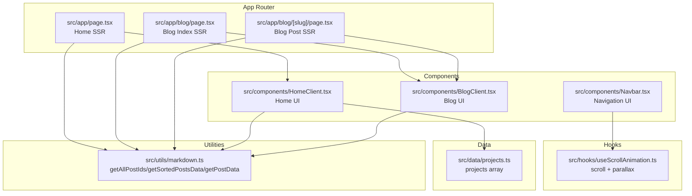
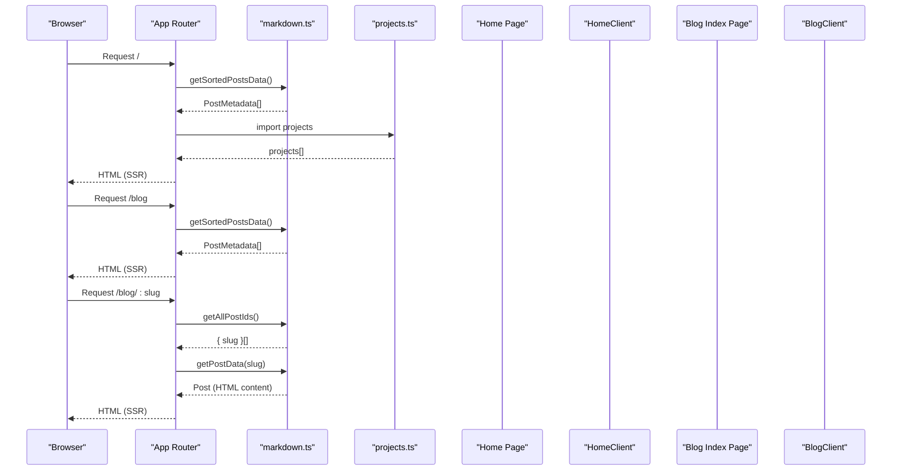
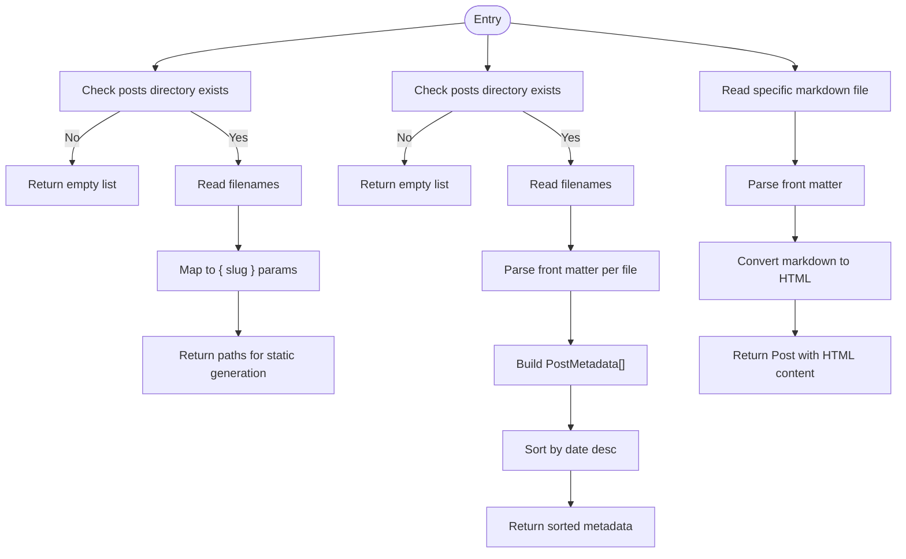
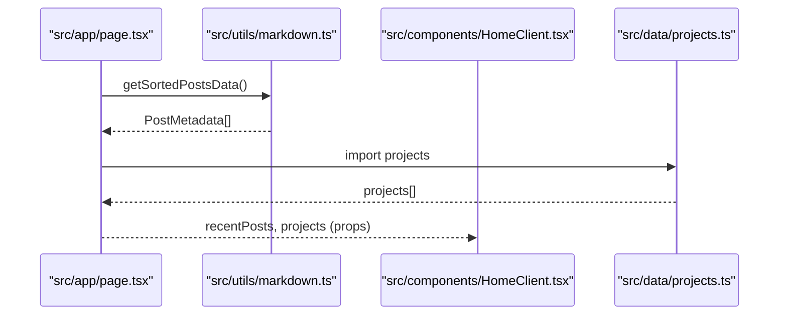
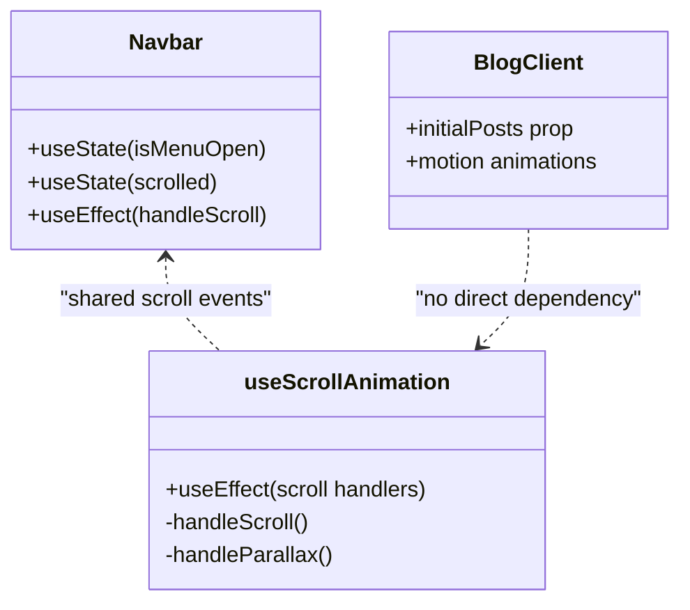
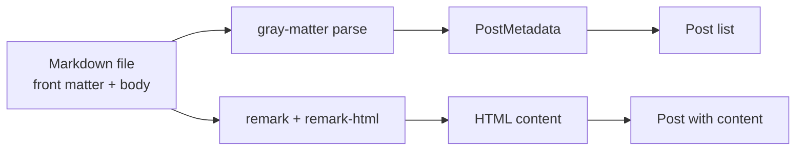
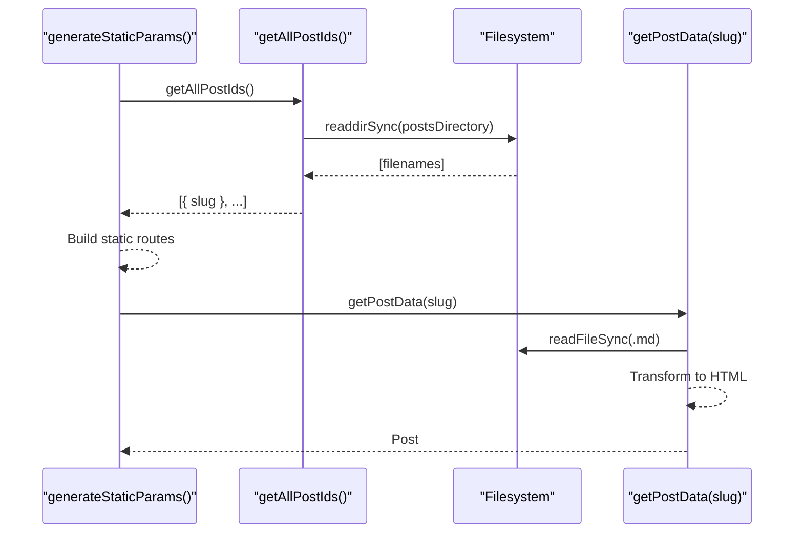
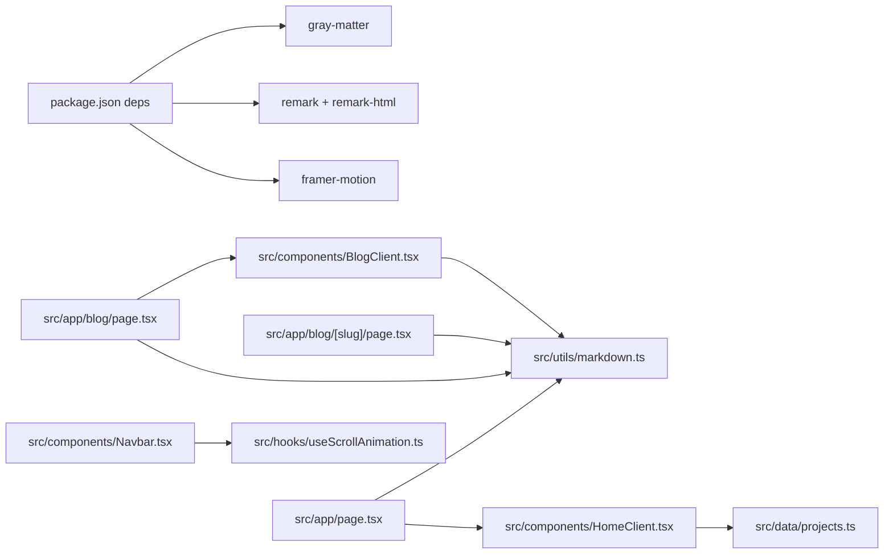

# Data Flow & State Management

<cite>
**Referenced Files in This Document**
- [markdown.ts](file://src/utils/markdown.ts)
- [projects.ts](file://src/data/projects.ts)
- [page.tsx (home)](file://src/app/page.tsx)
- [page.tsx (blog index)](file://src/app/blog/page.tsx)
- [page.tsx (blog post)](file://src/app/blog/[slug]/page.tsx)
- [HomeClient.tsx](file://src/components/HomeClient.tsx)
- [BlogClient.tsx](file://src/components/BlogClient.tsx)
- [layout.tsx](file://src/app/layout.tsx)
- [Navbar.tsx](file://src/components/Navbar.tsx)
- [useScrollAnimation.ts](file://src/hooks/useScrollAnimation.ts)
- [error.tsx](file://src/app/error.tsx)
- [not-found.tsx](file://src/app/not-found.tsx)
- [package.json](file://package.json)
- [next.config.ts](file://next.config.ts)
</cite>

## Table of Contents
1. [Introduction](#introduction)
2. [Project Structure](#project-structure)
3. [Core Components](#core-components)
4. [Architecture Overview](#architecture-overview)
5. [Detailed Component Analysis](#detailed-component-analysis)
6. [Dependency Analysis](#dependency-analysis)
7. [Performance Considerations](#performance-considerations)
8. [Troubleshooting Guide](#troubleshooting-guide)
9. [Conclusion](#conclusion)

## Introduction
This document explains how data flows through the portfolio platform, from static markdown content to rendered components, and how state is managed for client-side interactivity. It covers:
- The markdown processing pipeline that transforms front matter and markdown into structured content
- How static data (projects) and computed metadata (blog posts) reach UI components
- Animation and scroll state handled by custom hooks and client components
- Static generation strategies and how dynamic content integrates with static assets

## Project Structure
The platform follows a Next.js App Router layout with server-side rendering for static pages and client components for interactive UI. Content is authored in markdown under a dedicated directory and transformed at build/runtime. Static assets are served from a public images directory. Shared data is imported directly into components.

**Diagram sources**
- [page.tsx (home):1-15](file://src/app/page.tsx#L1-L15)
- [page.tsx (blog index):1-15](file://src/app/blog/page.tsx#L1-L15)
- [page.tsx (blog post):1-18](file://src/app/blog/[slug]/page.tsx#L1-L18)
- [markdown.ts:1-108](file://src/utils/markdown.ts#L1-L108)
- [projects.ts:1-43](file://src/data/projects.ts#L1-L43)
- [HomeClient.tsx:1-212](file://src/components/HomeClient.tsx#L1-L212)
- [BlogClient.tsx:1-166](file://src/components/BlogClient.tsx#L1-L166)
- [Navbar.tsx:1-140](file://src/components/Navbar.tsx#L1-L140)
- [useScrollAnimation.ts:1-51](file://src/hooks/useScrollAnimation.ts#L1-L51)

**Section sources**
- [layout.tsx:1-58](file://src/app/layout.tsx#L1-L58)
- [package.json:1-35](file://package.json#L1-L35)
- [next.config.ts:1-8](file://next.config.ts#L1-L8)

## Core Components
- Markdown utility: Reads markdown files, parses front matter, sorts posts, and converts markdown content to HTML.
- Static projects data: A TypeScript array of project metadata imported directly into components.
- Home page: Server-rendered page that fetches sorted posts and passes them to a client component for UI rendering.
- Blog index and post pages: Server-rendered pages that fetch post lists and individual posts respectively.
- Client components: Consume props to render UI, manage animations, and handle interactive state.
- Navigation: Client-side state for mobile menu and scroll-aware styles.
- Scroll animation hook: Manages visibility and parallax effects on scroll.

**Section sources**
- [markdown.ts:1-108](file://src/utils/markdown.ts#L1-L108)
- [projects.ts:1-43](file://src/data/projects.ts#L1-L43)
- [page.tsx (home):1-15](file://src/app/page.tsx#L1-L15)
- [page.tsx (blog index):1-15](file://src/app/blog/page.tsx#L1-L15)
- [page.tsx (blog post):1-18](file://src/app/blog/[slug]/page.tsx#L1-L18)
- [HomeClient.tsx:1-212](file://src/components/HomeClient.tsx#L1-L212)
- [BlogClient.tsx:1-166](file://src/components/BlogClient.tsx#L1-L166)
- [Navbar.tsx:1-140](file://src/components/Navbar.tsx#L1-L140)
- [useScrollAnimation.ts:1-51](file://src/hooks/useScrollAnimation.ts#L1-L51)

## Architecture Overview
The platform uses a hybrid approach:
- Server components fetch and prepare data (sorted posts, project arrays).
- Client components receive props and manage UI state and animations.
- Static generation builds routes for blog slugs based on discovered markdown files.

**Diagram sources**
- [page.tsx (home):1-15](file://src/app/page.tsx#L1-L15)
- [page.tsx (blog index):1-15](file://src/app/blog/page.tsx#L1-L15)
- [page.tsx (blog post):1-18](file://src/app/blog/[slug]/page.tsx#L1-L18)
- [markdown.ts:40-107](file://src/utils/markdown.ts#L40-L107)
- [projects.ts:1-43](file://src/data/projects.ts#L1-L43)

## Detailed Component Analysis

### Markdown Processing Pipeline
The markdown utility orchestrates:
- Discovering markdown files under the content directory
- Parsing front matter into typed metadata
- Sorting posts by date
- Converting markdown body to HTML for rendering

**Diagram sources**
- [markdown.ts:24-107](file://src/utils/markdown.ts#L24-L107)

**Section sources**
- [markdown.ts:1-108](file://src/utils/markdown.ts#L1-L108)

### Data Flow from Static Files to Components
- Home page fetches sorted posts and renders a client component that slices recent posts and projects.
- Blog index page fetches sorted posts and renders a client component that separates a featured post and a list.
- Blog post page generates static paths from markdown IDs and resolves a single post with HTML content.

**Diagram sources**
- [page.tsx (home):1-15](file://src/app/page.tsx#L1-L15)
- [HomeClient.tsx:1-212](file://src/components/HomeClient.tsx#L1-L212)
- [markdown.ts:40-77](file://src/utils/markdown.ts#L40-L77)
- [projects.ts:1-43](file://src/data/projects.ts#L1-L43)

**Section sources**
- [page.tsx (home):1-15](file://src/app/page.tsx#L1-L15)
- [HomeClient.tsx:1-212](file://src/components/HomeClient.tsx#L1-L212)
- [markdown.ts:40-77](file://src/utils/markdown.ts#L40-L77)
- [projects.ts:1-43](file://src/data/projects.ts#L1-L43)

### Client-Side Interactivity and State Management
- Navigation bar maintains local state for mobile menu and scroll-aware appearance.
- Scroll animation hook manages visibility and parallax effects on scroll.
- Blog client uses animation library for staggered entrance.

**Diagram sources**
- [Navbar.tsx:1-140](file://src/components/Navbar.tsx#L1-L140)
- [useScrollAnimation.ts:1-51](file://src/hooks/useScrollAnimation.ts#L1-L51)
- [BlogClient.tsx:1-166](file://src/components/BlogClient.tsx#L1-L166)

**Section sources**
- [Navbar.tsx:1-140](file://src/components/Navbar.tsx#L1-L140)
- [useScrollAnimation.ts:1-51](file://src/hooks/useScrollAnimation.ts#L1-L51)
- [BlogClient.tsx:1-166](file://src/components/BlogClient.tsx#L1-L166)

### Data Transformation: From Raw Content to Rendered Components
- Front matter is parsed into strongly-typed metadata.
- Markdown body is transformed to HTML for safe rendering.
- Components slice and present subsets of data (e.g., latest posts, featured projects).

**Diagram sources**
- [markdown.ts:79-107](file://src/utils/markdown.ts#L79-L107)

**Section sources**
- [markdown.ts:1-108](file://src/utils/markdown.ts#L1-L108)

### Static Generation and Dynamic Content Integration
- Static paths for blog posts are generated from markdown filenames.
- Dynamic content (HTML) is produced at runtime per post.
- Static assets (images) are referenced via public paths.

**Diagram sources**
- [page.tsx (blog post):5-17](file://src/app/blog/[slug]/page.tsx#L5-L17)
- [markdown.ts:24-38](file://src/utils/markdown.ts#L24-L38)
- [markdown.ts:79-107](file://src/utils/markdown.ts#L79-L107)

**Section sources**
- [page.tsx (blog post):1-18](file://src/app/blog/[slug]/page.tsx#L1-L18)
- [markdown.ts:24-38](file://src/utils/markdown.ts#L24-L38)
- [markdown.ts:79-107](file://src/utils/markdown.ts#L79-L107)

## Dependency Analysis
- Server components depend on the markdown utility for metadata and HTML content.
- Client components depend on shared data (projects) and typed metadata from the markdown utility.
- Navigation and animation hooks are standalone client-side concerns.

**Diagram sources**
- [package.json:11-21](file://package.json#L11-L21)
- [page.tsx (home):1-15](file://src/app/page.tsx#L1-L15)
- [page.tsx (blog index):1-15](file://src/app/blog/page.tsx#L1-L15)
- [page.tsx (blog post):1-18](file://src/app/blog/[slug]/page.tsx#L1-L18)
- [markdown.ts:1-108](file://src/utils/markdown.ts#L1-L108)
- [HomeClient.tsx:1-212](file://src/components/HomeClient.tsx#L1-L212)
- [BlogClient.tsx:1-166](file://src/components/BlogClient.tsx#L1-L166)
- [projects.ts:1-43](file://src/data/projects.ts#L1-L43)
- [Navbar.tsx:1-140](file://src/components/Navbar.tsx#L1-L140)
- [useScrollAnimation.ts:1-51](file://src/hooks/useScrollAnimation.ts#L1-L51)

**Section sources**
- [package.json:1-35](file://package.json#L1-L35)
- [markdown.ts:1-108](file://src/utils/markdown.ts#L1-L108)
- [HomeClient.tsx:1-212](file://src/components/HomeClient.tsx#L1-L212)
- [BlogClient.tsx:1-166](file://src/components/BlogClient.tsx#L1-L166)
- [projects.ts:1-43](file://src/data/projects.ts#L1-L43)
- [Navbar.tsx:1-140](file://src/components/Navbar.tsx#L1-L140)
- [useScrollAnimation.ts:1-51](file://src/hooks/useScrollAnimation.ts#L1-L51)

## Performance Considerations
- Prefer server-side rendering for content-heavy pages to reduce client work.
- Keep markdown parsing minimal; avoid heavy remark plugins unless necessary.
- Slice arrays early (e.g., latest posts, featured projects) to limit DOM rendering.
- Use lazy loading for images and defer non-critical animations until after hydration.
- Leverage Next.js static generation for predictable routing and caching.

## Troubleshooting Guide
- If blog routes fail to generate, verify the posts directory exists and contains markdown files.
- If content appears blank, confirm the markdown conversion step executes and returns HTML.
- For navigation or scroll animations not triggering, ensure client directives are present and event listeners are attached.
- For 404s, confirm the requested slug matches a file in the content directory.

**Section sources**
- [markdown.ts:24-38](file://src/utils/markdown.ts#L24-L38)
- [markdown.ts:79-107](file://src/utils/markdown.ts#L79-L107)
- [Navbar.tsx:12-18](file://src/components/Navbar.tsx#L12-L18)
- [useScrollAnimation.ts:39-48](file://src/hooks/useScrollAnimation.ts#L39-L48)
- [error.tsx:1-34](file://src/app/error.tsx#L1-L34)
- [not-found.tsx:1-21](file://src/app/not-found.tsx#L1-L21)

## Conclusion
The platform’s data flow is intentionally layered: server components fetch and transform content, while client components manage interactivity and presentation. The markdown utility centralizes parsing and HTML conversion, ensuring consistent metadata and content across pages. Static generation complements dynamic content, enabling scalable, fast-loading experiences.