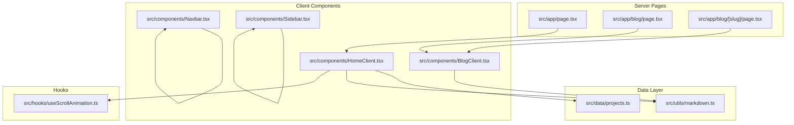
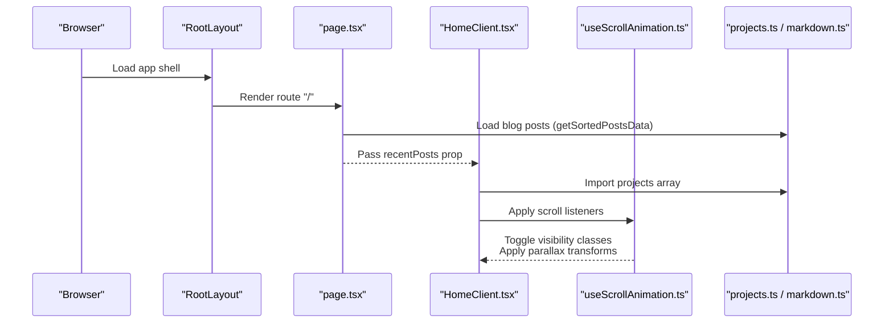
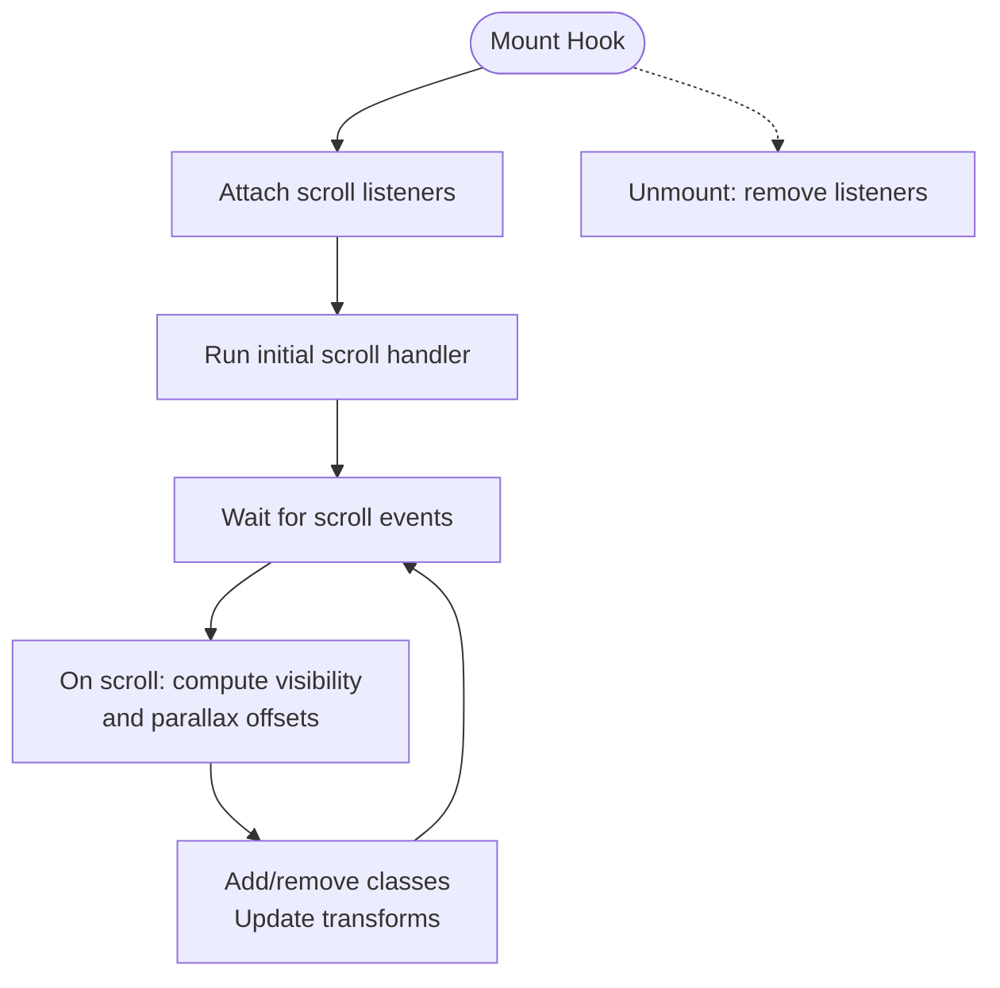
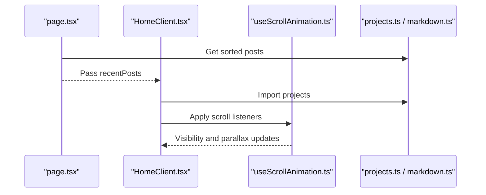
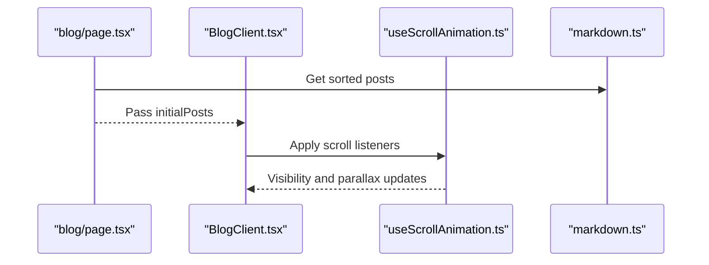
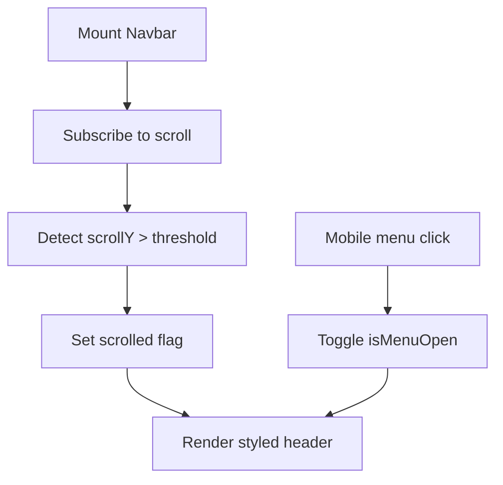
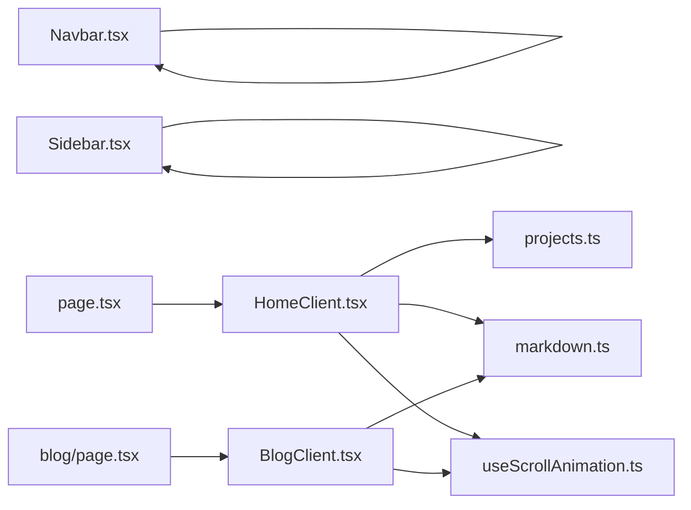

# State Management Patterns

<cite>
**Referenced Files in This Document**
- [useScrollAnimation.ts](file://src/hooks/useScrollAnimation.ts)
- [projects.ts](file://src/data/projects.ts)
- [HomeClient.tsx](file://src/components/HomeClient.tsx)
- [page.tsx](file://src/app/page.tsx)
- [layout.tsx](file://src/app/layout.tsx)
- [markdown.ts](file://src/utils/markdown.ts)
- [BlogClient.tsx](file://src/components/BlogClient.tsx)
- [blog/page.tsx](file://src/app/blog/page.tsx)
- [blog/[slug]/page.tsx](file://src/app/blog/[slug]/page.tsx)
- [Navbar.tsx](file://src/components/Navbar.tsx)
- [Sidebar.tsx](file://src/components/Sidebar.tsx)
- [package.json](file://package.json)
</cite>

## Table of Contents
1. [Introduction](#introduction)
2. [Project Structure](#project-structure)
3. [Core Components](#core-components)
4. [Architecture Overview](#architecture-overview)
5. [Detailed Component Analysis](#detailed-component-analysis)
6. [Dependency Analysis](#dependency-analysis)
7. [Performance Considerations](#performance-considerations)
8. [Troubleshooting Guide](#troubleshooting-guide)
9. [Conclusion](#conclusion)

## Introduction
This document explains the state management patterns used across the portfolio platform, focusing on:
- Scroll-based animation state via a custom client-side hook
- Static data sourcing and client-side rendering flows
- How project data and blog metadata move from server-side data loaders to client components
- Client-side state handling for interactive UI elements
- Best practices for reactivity and performance in Next.js

## Project Structure
The platform follows a conventional Next.js App Router layout with a clear separation between server-side data loading and client-side rendering. Key areas:
- Data sources: static arrays and filesystem-based markdown parsing
- Client components: stateful UI with scroll-driven effects and animations
- Server pages: data preparation and props injection into client components

**Diagram sources**
- [page.tsx:1-15](file://src/app/page.tsx#L1-L15)
- [blog/page.tsx:1-15](file://src/app/blog/page.tsx#L1-L15)
- [blog/[slug]/page.tsx](file://src/app/blog/[slug]/page.tsx#L1-L18)
- [markdown.ts:1-108](file://src/utils/markdown.ts#L1-L108)
- [projects.ts:1-43](file://src/data/projects.ts#L1-L43)
- [HomeClient.tsx:1-212](file://src/components/HomeClient.tsx#L1-L212)
- [BlogClient.tsx:1-166](file://src/components/BlogClient.tsx#L1-L166)
- [Navbar.tsx:1-140](file://src/components/Navbar.tsx#L1-L140)
- [Sidebar.tsx:1-20](file://src/components/Sidebar.tsx#L1-L20)
- [useScrollAnimation.ts:1-51](file://src/hooks/useScrollAnimation.ts#L1-L51)

**Section sources**
- [page.tsx:1-15](file://src/app/page.tsx#L1-L15)
- [blog/page.tsx:1-15](file://src/app/blog/page.tsx#L1-L15)
- [blog/[slug]/page.tsx](file://src/app/blog/[slug]/page.tsx#L1-L18)
- [markdown.ts:1-108](file://src/utils/markdown.ts#L1-L108)
- [projects.ts:1-43](file://src/data/projects.ts#L1-L43)
- [HomeClient.tsx:1-212](file://src/components/HomeClient.tsx#L1-L212)
- [BlogClient.tsx:1-166](file://src/components/BlogClient.tsx#L1-L166)
- [Navbar.tsx:1-140](file://src/components/Navbar.tsx#L1-L140)
- [Sidebar.tsx:1-20](file://src/components/Sidebar.tsx#L1-L20)
- [useScrollAnimation.ts:1-51](file://src/hooks/useScrollAnimation.ts#L1-L51)

## Core Components
- useScrollAnimation: A client hook that toggles visibility classes and applies parallax transforms based on scroll position. It attaches scroll listeners, performs initial checks, and cleans up listeners on unmount.
- HomeClient: A client component that receives static data (blog posts and projects) and renders hero, stats, projects, and blog preview sections. It does not declare local state but relies on the hook for scroll-driven effects.
- BlogClient: A client component that receives initial posts and renders a featured article plus a feed with Framer Motion animations. It does not declare local state but benefits from the hook for scroll-driven effects.
- Navbar: A client component that maintains local state for menu open/closed and scroll-aware styling.
- Static data: projects.ts provides project metadata; markdown.ts provides blog metadata via filesystem parsing.

Key state management characteristics:
- Client hook manages DOM-based state (classes and styles) triggered by scroll events.
- Server pages prepare props and pass them to client components as read-only inputs.
- Client components maintain minimal UI state (e.g., menu toggle, scroll-aware header) with local useState/useEffect.

**Section sources**
- [useScrollAnimation.ts:1-51](file://src/hooks/useScrollAnimation.ts#L1-L51)
- [HomeClient.tsx:1-212](file://src/components/HomeClient.tsx#L1-L212)
- [BlogClient.tsx:1-166](file://src/components/BlogClient.tsx#L1-L166)
- [Navbar.tsx:1-140](file://src/components/Navbar.tsx#L1-L140)
- [projects.ts:1-43](file://src/data/projects.ts#L1-L43)
- [markdown.ts:1-108](file://src/utils/markdown.ts#L1-L108)

## Architecture Overview
The platform uses a hybrid approach:
- Server-side data loading for deterministic content (blog posts and project lists)
- Client-side rendering for interactive UI and scroll-driven animations
- Minimal client-side state for UI interactions (menus, scroll-aware header)

**Diagram sources**
- [layout.tsx:1-58](file://src/app/layout.tsx#L1-L58)
- [page.tsx:1-15](file://src/app/page.tsx#L1-L15)
- [HomeClient.tsx:1-212](file://src/components/HomeClient.tsx#L1-L212)
- [useScrollAnimation.ts:1-51](file://src/hooks/useScrollAnimation.ts#L1-L51)
- [projects.ts:1-43](file://src/data/projects.ts#L1-L43)
- [markdown.ts:1-108](file://src/utils/markdown.ts#L1-L108)

## Detailed Component Analysis

### useScrollAnimation Hook
Purpose:
- Manage scroll-triggered DOM state for animations and parallax effects
- Add/remove visibility classes and apply transform styles based on scroll position

State lifecycle:
- Initialization: Attach scroll event listeners and perform an initial check
- Updates: Recalculate visibility and parallax on each scroll event
- Cleanup: Remove event listeners on component unmount

Implementation highlights:
- Uses DOM queries to find elements with specific selectors and toggles visibility classes
- Computes parallax offsets for background and content elements
- Runs initial check after mount to reflect current viewport state

**Diagram sources**
- [useScrollAnimation.ts:1-51](file://src/hooks/useScrollAnimation.ts#L1-L51)

**Section sources**
- [useScrollAnimation.ts:1-51](file://src/hooks/useScrollAnimation.ts#L1-L51)

### HomeClient Component
Responsibilities:
- Renders hero, stats, featured projects, and blog previews
- Receives blog posts via props and slices to display a subset
- Imports and displays a subset of projects from the static data module

State and interactions:
- No local state for scroll effects; relies on the hook for animations
- Uses props for immutable data (recent posts and projects)
- Leverages Next.js Image and Link components for media and navigation

**Diagram sources**
- [page.tsx:1-15](file://src/app/page.tsx#L1-L15)
- [HomeClient.tsx:1-212](file://src/components/HomeClient.tsx#L1-L212)
- [useScrollAnimation.ts:1-51](file://src/hooks/useScrollAnimation.ts#L1-L51)
- [projects.ts:1-43](file://src/data/projects.ts#L1-L43)
- [markdown.ts:1-108](file://src/utils/markdown.ts#L1-L108)

**Section sources**
- [HomeClient.tsx:1-212](file://src/components/HomeClient.tsx#L1-L212)
- [page.tsx:1-15](file://src/app/page.tsx#L1-L15)
- [projects.ts:1-43](file://src/data/projects.ts#L1-L43)
- [markdown.ts:1-108](file://src/utils/markdown.ts#L1-L108)

### BlogClient Component
Responsibilities:
- Renders a featured post and a grid of regular posts
- Uses Framer Motion for staggered entrance animations
- Receives initial posts via props

State and interactions:
- No local state for scroll effects; relies on the hook for animations
- Props-driven rendering with no internal reactive state

**Diagram sources**
- [blog/page.tsx:1-15](file://src/app/blog/page.tsx#L1-L15)
- [BlogClient.tsx:1-166](file://src/components/BlogClient.tsx#L1-L166)
- [useScrollAnimation.ts:1-51](file://src/hooks/useScrollAnimation.ts#L1-L51)
- [markdown.ts:1-108](file://src/utils/markdown.ts#L1-L108)

**Section sources**
- [BlogClient.tsx:1-166](file://src/components/BlogClient.tsx#L1-L166)
- [blog/page.tsx:1-15](file://src/app/blog/page.tsx#L1-L15)
- [markdown.ts:1-108](file://src/utils/markdown.ts#L1-L108)

### Navbar Component
Responsibilities:
- Provides responsive navigation with desktop and mobile views
- Manages menu open/close state and scroll-aware header styling

State and interactions:
- Local state for menu toggle and scroll threshold detection
- Uses Next.js navigation primitives and material icons

**Diagram sources**
- [Navbar.tsx:1-140](file://src/components/Navbar.tsx#L1-L140)

**Section sources**
- [Navbar.tsx:1-140](file://src/components/Navbar.tsx#L1-L140)

### Static Data Sources
- projects.ts: Defines a static array of project entries consumed by HomeClient
- markdown.ts: Loads and parses blog posts from the filesystem, returning metadata arrays and individual post content

Data flow:
- Server pages call data loaders and pass results as props to client components
- Client components treat these as immutable inputs and render accordingly

**Section sources**
- [projects.ts:1-43](file://src/data/projects.ts#L1-L43)
- [markdown.ts:1-108](file://src/utils/markdown.ts#L1-L108)
- [page.tsx:1-15](file://src/app/page.tsx#L1-L15)
- [blog/page.tsx:1-15](file://src/app/blog/page.tsx#L1-L15)

## Dependency Analysis
- Client components depend on:
  - Server pages for data props
  - Static data modules for project metadata
  - The scroll animation hook for DOM-based state updates
- The hook depends on:
  - DOM APIs for element queries and transforms
  - Window scroll events for reactive updates
- Navigation and layout:
  - Navbar and Sidebar are standalone client components with local state
  - Layout composes the app shell and injects global styles

**Diagram sources**
- [HomeClient.tsx:1-212](file://src/components/HomeClient.tsx#L1-L212)
- [BlogClient.tsx:1-166](file://src/components/BlogClient.tsx#L1-L166)
- [useScrollAnimation.ts:1-51](file://src/hooks/useScrollAnimation.ts#L1-L51)
- [projects.ts:1-43](file://src/data/projects.ts#L1-L43)
- [markdown.ts:1-108](file://src/utils/markdown.ts#L1-L108)
- [page.tsx:1-15](file://src/app/page.tsx#L1-L15)
- [blog/page.tsx:1-15](file://src/app/blog/page.tsx#L1-L15)

**Section sources**
- [HomeClient.tsx:1-212](file://src/components/HomeClient.tsx#L1-L212)
- [BlogClient.tsx:1-166](file://src/components/BlogClient.tsx#L1-L166)
- [useScrollAnimation.ts:1-51](file://src/hooks/useScrollAnimation.ts#L1-L51)
- [projects.ts:1-43](file://src/data/projects.ts#L1-L43)
- [markdown.ts:1-108](file://src/utils/markdown.ts#L1-L108)
- [page.tsx:1-15](file://src/app/page.tsx#L1-L15)
- [blog/page.tsx:1-15](file://src/app/blog/page.tsx#L1-L15)

## Performance Considerations
- Minimize re-renders by passing only necessary props from server pages to client components
- Keep scroll handlers lightweight; avoid heavy computations inside scroll callbacks
- Use CSS transforms for animations (already applied) to leverage GPU acceleration
- Prefer static data modules for predictable, cacheable content
- Defer non-critical client-side logic until after hydration if needed

## Troubleshooting Guide
Common issues and resolutions:
- Scroll listeners not firing:
  - Verify the hook is mounted in a client component and that the DOM elements with targeted selectors exist
- Parallax not updating:
  - Ensure the parallax elements exist in the DOM and that the hook runs after initial render
- Props mismatch:
  - Confirm server pages load and pass data correctly to client components
- Layout shifts:
  - Use aspect ratios and skeleton placeholders during hydration to prevent layout thrashing

**Section sources**
- [useScrollAnimation.ts:1-51](file://src/hooks/useScrollAnimation.ts#L1-L51)
- [HomeClient.tsx:1-212](file://src/components/HomeClient.tsx#L1-L212)
- [BlogClient.tsx:1-166](file://src/components/BlogClient.tsx#L1-L166)
- [page.tsx:1-15](file://src/app/page.tsx#L1-L15)
- [blog/page.tsx:1-15](file://src/app/blog/page.tsx#L1-L15)

## Conclusion
The portfolio platform employs a clean separation of concerns:
- Server pages load and normalize static data
- Client components render with minimal local state
- A dedicated client hook manages scroll-driven DOM state
This pattern yields predictable reactivity, strong performance characteristics, and maintainable code. Extending the platform should preserve this separation while adding new client hooks or components as needed.