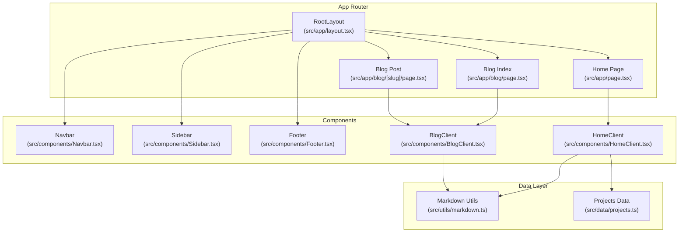
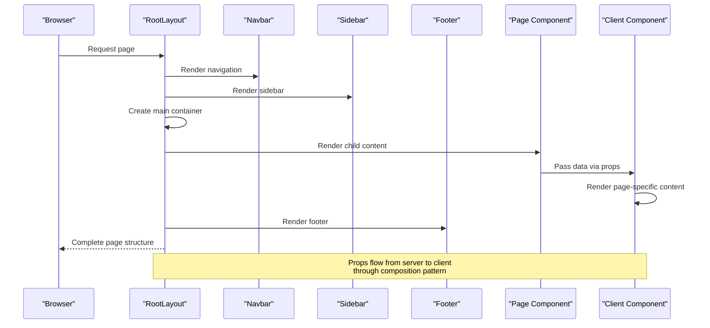
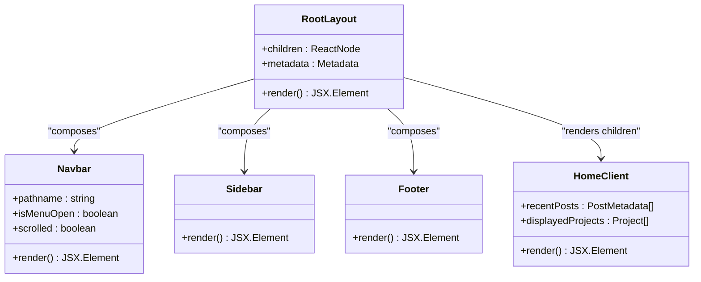
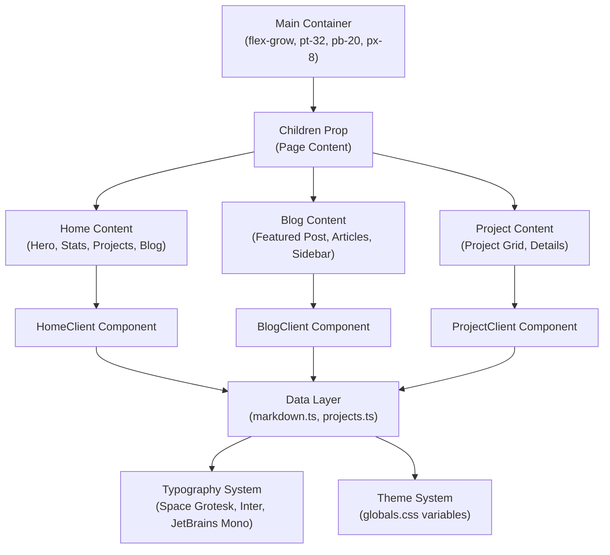
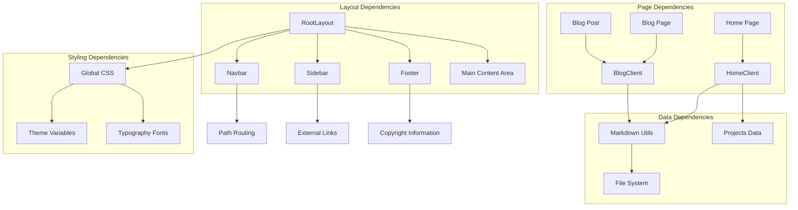

# Component Composition Pattern

<cite>
**Referenced Files in This Document**
- [layout.tsx](file://src/app/layout.tsx)
- [Navbar.tsx](file://src/components/Navbar.tsx)
- [Sidebar.tsx](file://src/components/Sidebar.tsx)
- [Footer.tsx](file://src/components/Footer.tsx)
- [HomeClient.tsx](file://src/components/HomeClient.tsx)
- [BlogClient.tsx](file://src/components/BlogClient.tsx)
- [page.tsx](file://src/app/page.tsx)
- [page.tsx](file://src/app/blog/[slug]/page.tsx)
- [globals.css](file://src/app/globals.css)
- [markdown.ts](file://src/utils/markdown.ts)
- [projects.ts](file://src/data/projects.ts)
- [useScrollAnimation.ts](file://src/hooks/useScrollAnimation.ts)
</cite>

## Table of Contents
1. [Introduction](#introduction)
2. [Project Structure](#project-structure)
3. [Core Components](#core-components)
4. [Architecture Overview](#architecture-overview)
5. [Detailed Component Analysis](#detailed-component-analysis)
6. [Dependency Analysis](#dependency-analysis)
7. [Performance Considerations](#performance-considerations)
8. [Troubleshooting Guide](#troubleshooting-guide)
9. [Conclusion](#conclusion)

## Introduction

This document explains the component composition pattern implementation in the portfolio platform, focusing on how the RootLayout serves as a container component that composes smaller UI elements (Navbar, Sidebar, Footer) into a cohesive page structure. The composition pattern prevents prop drilling by passing content through the layout system, allowing child components to receive data directly from their parent containers without requiring intermediate components to manage props.

The portfolio platform demonstrates a clean separation of concerns where:
- The RootLayout defines the global page structure and provides the main content area
- Child pages render their specific content within the layout's main container
- Shared UI elements (navigation, sidebar, footer) remain consistent across all pages
- Data flows from server-side utilities to client components through well-defined boundaries

## Project Structure

The portfolio platform follows a Next.js App Router structure with a clear separation between server components (layouts, pages) and client components (UI elements, interactive components).



**Diagram sources**
- [layout.tsx:28-57](file://src/app/layout.tsx#L28-L57)
- [page.tsx:10-14](file://src/app/page.tsx#L10-L14)
- [page.tsx:12-17](file://src/app/blog/[slug]/page.tsx#L12-L17)

**Section sources**
- [layout.tsx:1-58](file://src/app/layout.tsx#L1-L58)
- [page.tsx:1-15](file://src/app/page.tsx#L1-L15)
- [page.tsx:12-17](file://src/app/blog/[slug]/page.tsx#L12-L17)

## Core Components

The composition pattern centers around four primary components that work together to create a cohesive page structure:

### RootLayout Container
The RootLayout serves as the primary container component that orchestrates the overall page structure. It imports and renders the shared UI elements while providing a dedicated main content area for child pages.

Key characteristics:
- Defines global typography fonts and theme variables
- Establishes the page wrapper with dark mode support
- Composes Navbar, Sidebar, and Footer components
- Provides the main content container with responsive spacing
- Manages global metadata and SEO configuration

### Shared UI Elements
The composition pattern relies on three shared components that remain consistent across all pages:

- **Navbar**: Handles navigation, mobile menu, and scroll effects
- **Sidebar**: Provides social links and navigation shortcuts
- **Footer**: Contains copyright information and secondary navigation

### Content Area Composition
Child pages render their specific content within the layout's main container, receiving data through props passed from server components to client components.

**Section sources**
- [layout.tsx:28-57](file://src/app/layout.tsx#L28-L57)
- [Navbar.tsx:1-140](file://src/components/Navbar.tsx#L1-L140)
- [Sidebar.tsx:1-20](file://src/components/Sidebar.tsx#L1-L20)
- [Footer.tsx:1-49](file://src/components/Footer.tsx#L1-L49)

## Architecture Overview

The component composition pattern creates a hierarchical structure where the RootLayout acts as the foundation, composing shared elements while delegating page-specific content to child components.



**Diagram sources**
- [layout.tsx:45-53](file://src/app/layout.tsx#L45-L53)
- [page.tsx:10-14](file://src/app/page.tsx#L10-L14)
- [page.tsx:12-17](file://src/app/blog/[slug]/page.tsx#L12-L17)

The architecture ensures that:
- Global styling and typography are centralized in the layout
- Navigation remains consistent across all pages
- Content areas are isolated and maintainable
- Data flows through well-defined boundaries

## Detailed Component Analysis

### RootLayout Implementation

The RootLayout demonstrates the composition pattern by serving as a container that composes shared UI elements around page-specific content.



**Diagram sources**
- [layout.tsx:28-57](file://src/app/layout.tsx#L28-L57)
- [Navbar.tsx:7-137](file://src/components/Navbar.tsx#L7-L137)
- [Sidebar.tsx:4-16](file://src/components/Sidebar.tsx#L4-L16)
- [Footer.tsx:3-45](file://src/components/Footer.tsx#L3-L45)

### Prop Drilling Prevention Strategy

The composition pattern prevents prop drilling through several key mechanisms:

#### 1. Server-to-Client Data Flow
Server components prepare data and pass it directly to client components, eliminating the need for intermediate components to manage props.

```mermaid
flowchart TD
Start([Server Component]) --> GetData["Fetch Data<br/>(markdown.ts, projects.ts)"]
GetData --> PrepareData["Prepare Data Structure<br/>(sorted posts, project lists)"]
PrepareData --> PassProps["Pass Props to Client Component"]
PassProps --> ClientRender["Client Component Renders UI"]
ClientRender --> End([Final UI])
Note over Start,End: No intermediate components need props<br/>- prevents prop drilling
```

**Diagram sources**
- [page.tsx:10-14](file://src/app/page.tsx#L10-L14)
- [markdown.ts:40-77](file://src/utils/markdown.ts#L40-L77)
- [projects.ts:1-43](file://src/data/projects.ts#L1-L43)

#### 2. Layout-Based Composition
The RootLayout provides a centralized container where child components receive their content through the layout system rather than through intermediate props.

#### 3. Component-Specific Responsibilities
Each component has a clear responsibility:
- RootLayout: Page structure and global styling
- Navbar: Navigation and mobile menu
- Sidebar: Social links and shortcuts
- Client components: Page-specific content rendering

### Main Content Area Structure

The main content area is structured to accommodate various page types while maintaining consistent spacing and responsive behavior.



**Diagram sources**
- [layout.tsx:50-51](file://src/app/layout.tsx#L50-L51)
- [HomeClient.tsx:12-211](file://src/components/HomeClient.tsx#L12-L211)
- [BlogClient.tsx:12-165](file://src/components/BlogClient.tsx#L12-L165)

### Responsive Design Implementation

The composition pattern supports responsive design through Tailwind CSS utilities and component-specific breakpoints:

#### Mobile-First Approach
- Navbar implements a mobile menu overlay with smooth transitions
- Footer adapts content layout for mobile devices
- Main content areas use responsive grid systems

#### Breakpoint-Specific Components
- Sidebar is hidden on mobile devices (`hidden lg:flex`)
- Navbar adjusts styling based on scroll position
- Content areas adapt layout based on screen size

### Reusable Component Integration

The platform integrates reusable components through several patterns:

#### Data-Driven Components
Components receive data through props, making them reusable across different pages:
- HomeClient receives recent posts and projects data
- BlogClient receives sorted post data
- Both components use consistent data structures

#### Shared UI Patterns
Reusable patterns are implemented consistently:
- Material Symbols icons for consistent iconography
- Glass-morphism effects using shared CSS classes
- Typography system with consistent font weights and sizes

**Section sources**
- [layout.tsx:45-53](file://src/app/layout.tsx#L45-L53)
- [HomeClient.tsx:8-10](file://src/components/HomeClient.tsx#L8-L10)
- [BlogClient.tsx:8-10](file://src/components/BlogClient.tsx#L8-L10)
- [globals.css:4-66](file://src/app/globals.css#L4-L66)

## Dependency Analysis

The composition pattern creates a clear dependency hierarchy that promotes maintainability and separation of concerns.



**Diagram sources**
- [layout.tsx:4-6](file://src/app/layout.tsx#L4-L6)
- [markdown.ts:1-108](file://src/utils/markdown.ts#L1-L108)
- [projects.ts:1-43](file://src/data/projects.ts#L1-L43)
- [globals.css:4-66](file://src/app/globals.css#L4-L66)

### Component Coupling Analysis

The composition pattern minimizes coupling between components:
- **Low coupling**: Components depend primarily on their immediate dependencies
- **High cohesion**: Each component has a single responsibility
- **Clear boundaries**: Data flows through well-defined interfaces

### External Dependencies

The platform relies on several external libraries that support the composition pattern:
- **Next.js**: Provides routing and SSR capabilities
- **Tailwind CSS**: Enables responsive design and consistent styling
- **Framer Motion**: Adds smooth animations and transitions
- **Gray Matter**: Processes markdown content for blog posts

**Section sources**
- [layout.tsx:1-26](file://src/app/layout.tsx#L1-L26)
- [markdown.ts:1-108](file://src/utils/markdown.ts#L1-L108)
- [globals.css:1-113](file://src/app/globals.css#L1-L113)

## Performance Considerations

The composition pattern contributes to performance in several ways:

### Efficient Data Loading
- Server components fetch data once and pass it to client components
- Client components receive pre-processed data, reducing computation overhead
- Static generation optimizes content delivery for blog pages

### Optimized Rendering
- RootLayout provides a stable container that minimizes re-renders
- Shared components are memoized through their stateless nature
- CSS-in-JS variables reduce style computation overhead

### Bundle Size Management
- Components are tree-shaken based on usage
- Font loading is optimized through Next.js font optimization
- Minimal third-party dependencies reduce bundle size

## Troubleshooting Guide

Common issues and solutions when working with the composition pattern:

### Layout Issues
- **Problem**: Content not centered properly
- **Solution**: Verify main container classes and responsive breakpoints
- **Reference**: [layout.tsx:50](file://src/app/layout.tsx#L50)

### Navigation Problems
- **Problem**: Mobile menu not responding
- **Solution**: Check state management and event handlers in Navbar
- **Reference**: [Navbar.tsx:66-73](file://src/components/Navbar.tsx#L66-L73)

### Data Loading Issues
- **Problem**: Content not displaying in client components
- **Solution**: Verify data fetching in server components and prop passing
- **Reference**: [page.tsx:10-14](file://src/app/page.tsx#L10-L14)

### Styling Conflicts
- **Problem**: Components not inheriting styles properly
- **Solution**: Check global CSS variables and component class composition
- **Reference**: [globals.css:4-66](file://src/app/globals.css#L4-L66)

**Section sources**
- [layout.tsx:50](file://src/app/layout.tsx#L50)
- [Navbar.tsx:66-73](file://src/components/Navbar.tsx#L66-L73)
- [page.tsx:10-14](file://src/app/page.tsx#L10-L14)
- [globals.css:4-66](file://src/app/globals.css#L4-L66)

## Conclusion

The component composition pattern implementation in this portfolio platform demonstrates a robust approach to building maintainable, reusable, and scalable React applications. The RootLayout serves as an effective container component that composes shared UI elements while providing a flexible main content area for page-specific content.

Key benefits achieved through this pattern:

### Maintainability
- Clear separation of concerns between layout, navigation, and content
- Centralized styling and typography management
- Consistent component interfaces across the application

### Reusability
- Shared components can be easily adapted for different contexts
- Data flow patterns enable component reuse across pages
- Typography and theme systems support consistent branding

### Separation of Concerns
- Server components handle data fetching and preparation
- Client components focus on rendering and interactivity
- Layout components manage structural concerns

### Responsive Design Support
- Mobile-first approach with breakpoint-specific adaptations
- Flexible grid systems for content organization
- Consistent spacing and typography across devices

The composition pattern successfully prevents prop drilling by establishing clear data flow boundaries and component responsibilities. This architecture enables developers to extend functionality while maintaining code quality and performance standards.