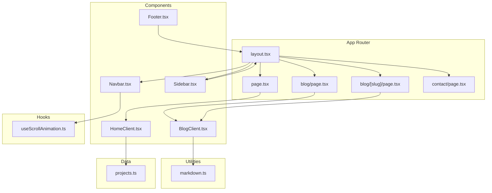
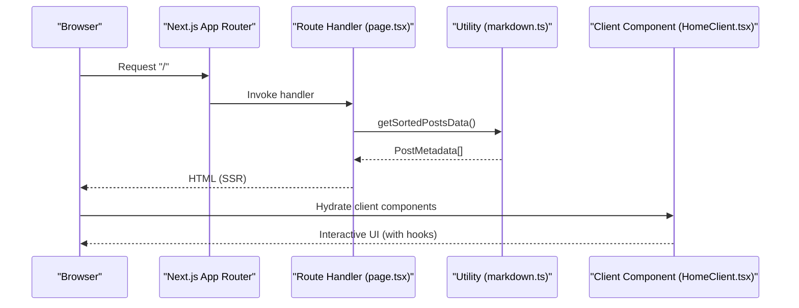
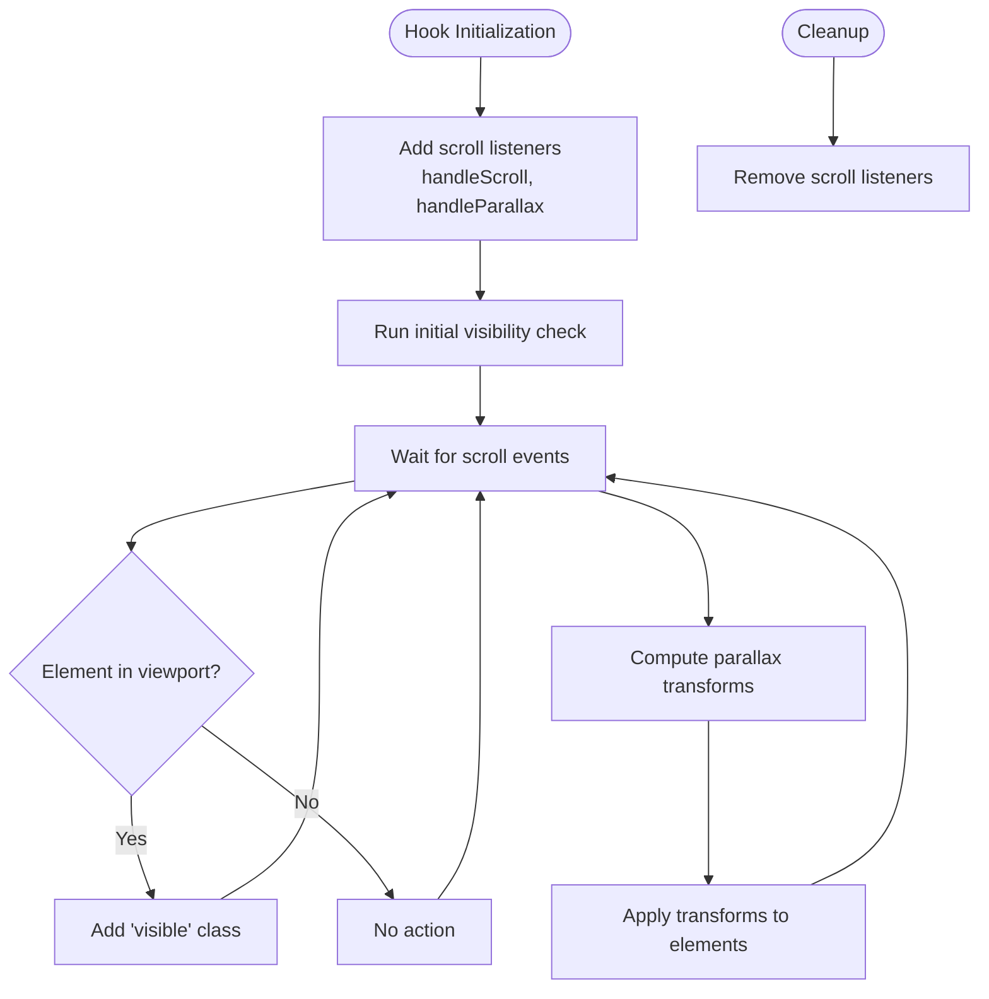
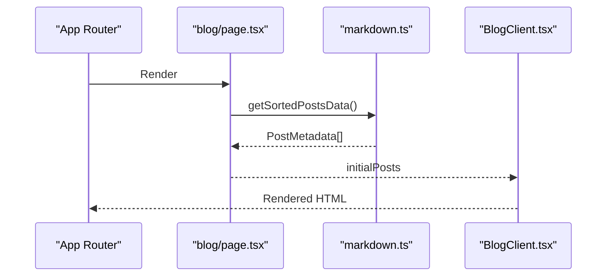
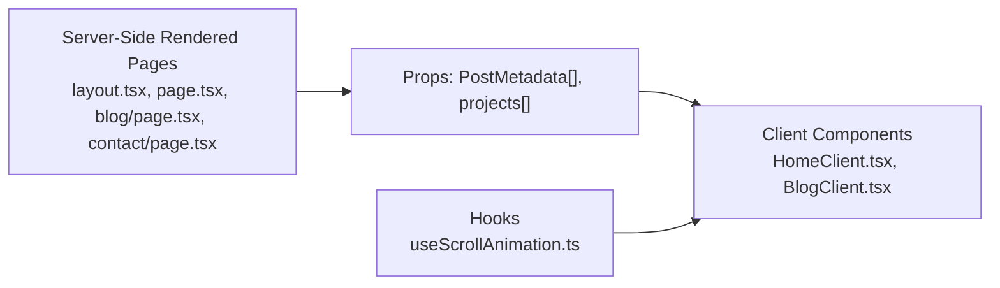
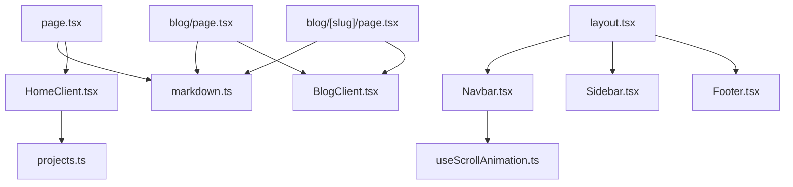

# Design Patterns & Architectural Decisions

<cite>
**Referenced Files in This Document**
- [layout.tsx](file://src/app/layout.tsx)
- [page.tsx](file://src/app/page.tsx)
- [HomeClient.tsx](file://src/components/HomeClient.tsx)
- [useScrollAnimation.ts](file://src/hooks/useScrollAnimation.ts)
- [markdown.ts](file://src/utils/markdown.ts)
- [Navbar.tsx](file://src/components/Navbar.tsx)
- [Footer.tsx](file://src/components/Footer.tsx)
- [Sidebar.tsx](file://src/components/Sidebar.tsx)
- [projects.ts](file://src/data/projects.ts)
- [package.json](file://package.json)
- [blog.page.tsx](file://src/app/blog/page.tsx)
- [blog.post.page.tsx](file://src/app/blog/[slug]/page.tsx)
- [globals.css](file://src/app/globals.css)
- [next.config.ts](file://next.config.ts)
- [contact.page.tsx](file://src/app/contact/page.tsx)
</cite>

## Table of Contents
1. [Introduction](#introduction)
2. [Project Structure](#project-structure)
3. [Core Components](#core-components)
4. [Architecture Overview](#architecture-overview)
5. [Detailed Component Analysis](#detailed-component-analysis)
6. [Dependency Analysis](#dependency-analysis)
7. [Performance Considerations](#performance-considerations)
8. [Troubleshooting Guide](#troubleshooting-guide)
9. [Conclusion](#conclusion)

## Introduction
This document explains the design patterns and architectural decisions implemented in the portfolio platform. The project follows a modern Next.js app with file-based routing and static site generation, separating concerns across:
- Views (Components): Presentational UI built with Tailwind CSS and Next.js Image.
- Hooks (Controllers): Client-side state and effects for scroll animations and navigation behavior.
- Utilities (Models): Data fetching and Markdown processing utilities.

It also documents the component composition pattern, hook-based state management for cross-cutting concerns, factory-style dynamic rendering via props, and the separation between server-rendered pages and client interactivity. Finally, it outlines the rationale for Next.js app router, file-based routing, and static generation, along with performance optimizations and trade-offs.

## Project Structure
The project is organized around Next.js app directory conventions:
- src/app: Route handlers and pages using the app router with file-based routing.
- src/components: Reusable UI components (Views).
- src/hooks: Custom React hooks encapsulating cross-cutting behaviors (Controllers).
- src/utils: Shared utilities for data modeling and content processing (Models).
- src/data: Static datasets consumed by components.
- Public assets: Images under public/images.

**Diagram sources**
- [layout.tsx:1-58](file://src/app/layout.tsx#L1-L58)
- [page.tsx:1-15](file://src/app/page.tsx#L1-L15)
- [blog.page.tsx:1-15](file://src/app/blog/page.tsx#L1-L15)
- [blog.post.page.tsx:1-18](file://src/app/blog/[slug]/page.tsx#L1-L18)
- [contact.page.tsx:1-154](file://src/app/contact/page.tsx#L1-L154)
- [Navbar.tsx:1-140](file://src/components/Navbar.tsx#L1-L140)
- [Footer.tsx:1-49](file://src/components/Footer.tsx#L1-L49)
- [Sidebar.tsx:1-20](file://src/components/Sidebar.tsx#L1-L20)
- [HomeClient.tsx:1-212](file://src/components/HomeClient.tsx#L1-L212)
- [useScrollAnimation.ts:1-51](file://src/hooks/useScrollAnimation.ts#L1-L51)
- [markdown.ts:1-108](file://src/utils/markdown.ts#L1-L108)
- [projects.ts:1-43](file://src/data/projects.ts#L1-L43)

**Section sources**
- [layout.tsx:1-58](file://src/app/layout.tsx#L1-L58)
- [page.tsx:1-15](file://src/app/page.tsx#L1-L15)
- [blog.page.tsx:1-15](file://src/app/blog/page.tsx#L1-L15)
- [blog.post.page.tsx:1-18](file://src/app/blog/[slug]/page.tsx#L1-L18)
- [contact.page.tsx:1-154](file://src/app/contact/page.tsx#L1-L154)

## Core Components
- Root layout composes global styles, fonts, and shared UI scaffolding (navigation, sidebar, footer) while delegating page content to route handlers.
- Page handlers fetch data and render client components, applying a clear separation between server-rendered pages and client interactivity.
- Client components receive props (e.g., recent posts, project lists) and render presentational UI with Tailwind classes.
- Hooks encapsulate cross-cutting behaviors such as scroll-driven animations and navigation state.
- Utilities centralize Markdown parsing and content processing, returning typed models for consumption by components.

Key architectural outcomes:
- Separation of concerns: Views (components) remain presentation-focused; hooks manage side effects; utilities encapsulate data logic.
- Composition over inheritance: Components accept props and compose smaller UI parts, enabling reuse and testability.
- Predictable data flow: Server pages pass pre-fetched data to client components, minimizing client-side hydration work.

**Section sources**
- [layout.tsx:1-58](file://src/app/layout.tsx#L1-L58)
- [page.tsx:1-15](file://src/app/page.tsx#L1-L15)
- [HomeClient.tsx:1-212](file://src/components/HomeClient.tsx#L1-L212)
- [useScrollAnimation.ts:1-51](file://src/hooks/useScrollAnimation.ts#L1-L51)
- [markdown.ts:1-108](file://src/utils/markdown.ts#L1-L108)
- [projects.ts:1-43](file://src/data/projects.ts#L1-L43)

## Architecture Overview
The platform uses Next.js app router with file-based routing and static generation. Pages are rendered on the server and hydrated on the client when marked with "use client". Data is fetched at build time or per-request depending on the route, and passed down to components as props.

**Diagram sources**
- [page.tsx:1-15](file://src/app/page.tsx#L1-L15)
- [markdown.ts:40-77](file://src/utils/markdown.ts#L40-L77)
- [HomeClient.tsx:1-212](file://src/components/HomeClient.tsx#L1-L212)

## Detailed Component Analysis

### Component Composition Pattern
The platform favors composition through props and small, focused components. For example:
- The home page handler fetches sorted posts and passes them to the client component.
- The client component slices the data and renders featured projects and blog previews.
- Navigation, footer, and sidebar are composed into the root layout, ensuring consistent shell across routes.

Benefits:
- Predictable prop contracts reduce coupling.
- Easier testing and mocking of data.
- Scalable UI construction from reusable pieces.

**Section sources**
- [page.tsx:1-15](file://src/app/page.tsx#L1-L15)
- [HomeClient.tsx:12-14](file://src/components/HomeClient.tsx#L12-L14)
- [layout.tsx:48-53](file://src/app/layout.tsx#L48-L53)

### Hook-Based State Management (Scroll Animations)
The scroll animation hook encapsulates:
- Scroll event listeners for visibility toggles and parallax effects.
- Cleanup on unmount to prevent memory leaks.
- Client-only behavior via the directive.

**Diagram sources**
- [useScrollAnimation.ts:5-50](file://src/hooks/useScrollAnimation.ts#L5-L50)

**Section sources**
- [useScrollAnimation.ts:1-51](file://src/hooks/useScrollAnimation.ts#L1-L51)

### Factory Pattern for Dynamic Rendering (Props-Driven)
Dynamic rendering is achieved by passing props to client components:
- The home page handler supplies recent posts and projects.
- The blog page handler supplies a list of posts.
- The blog post page handler supplies a single post’s content after Markdown conversion.

This pattern allows a single route handler to render different content based on props, acting as a lightweight factory for component composition.

**Diagram sources**
- [blog.page.tsx:10-14](file://src/app/blog/page.tsx#L10-L14)
- [markdown.ts:40-77](file://src/utils/markdown.ts#L40-L77)

**Section sources**
- [blog.page.tsx:1-15](file://src/app/blog/page.tsx#L1-L15)
- [blog.post.page.tsx:12-17](file://src/app/blog/[slug]/page.tsx#L12-L17)
- [markdown.ts:79-107](file://src/utils/markdown.ts#L79-L107)

### Separation of Server-Side Rendering and Client Interactivity
- Server-rendered pages: Root layout, home, blog listing, and contact page are SSR pages that deliver HTML with minimal client payload.
- Client interactivity: Components marked with "use client" hydrate interactive elements (e.g., scroll animations, mobile menu, navigation state).
- Static generation: The blog post route uses static generation with generated paths, reducing runtime overhead.

**Diagram sources**
- [layout.tsx:1-58](file://src/app/layout.tsx#L1-L58)
- [page.tsx:1-15](file://src/app/page.tsx#L1-L15)
- [blog.page.tsx:1-15](file://src/app/blog/page.tsx#L1-L15)
- [contact.page.tsx:1-154](file://src/app/contact/page.tsx#L1-L154)
- [HomeClient.tsx:1-212](file://src/components/HomeClient.tsx#L1-L212)
- [useScrollAnimation.ts:1-51](file://src/hooks/useScrollAnimation.ts#L1-L51)

**Section sources**
- [layout.tsx:1-58](file://src/app/layout.tsx#L1-L58)
- [page.tsx:1-15](file://src/app/page.tsx#L1-L15)
- [blog.page.tsx:1-15](file://src/app/blog/page.tsx#L1-L15)
- [blog.post.page.tsx:5-10](file://src/app/blog/[slug]/page.tsx#L5-L10)
- [contact.page.tsx:1-154](file://src/app/contact/page.tsx#L1-L154)

### Decision Rationale: Next.js App Router, File-Based Routing, Static Site Generation
- App Router: Provides a clear, scalable structure for nested layouts, route groups, and data fetching boundaries.
- File-based routing: Eliminates boilerplate and aligns with convention-over-configuration, simplifying navigation and deployment.
- Static generation: Pre-renders content at build time, improving performance and SEO while reducing server load. Dynamic segments (e.g., blog slugs) are generated during build to support incremental static regeneration if needed.

**Section sources**
- [blog.post.page.tsx:5-10](file://src/app/blog/[slug]/page.tsx#L5-L10)
- [next.config.ts:1-8](file://next.config.ts#L1-L8)

## Dependency Analysis
The project exhibits low coupling and high cohesion:
- Route handlers depend on utilities for data retrieval.
- Client components depend on props and local state, with minimal external coupling.
- Hooks encapsulate DOM manipulation and side effects, keeping components pure.

**Diagram sources**
- [page.tsx:1-15](file://src/app/page.tsx#L1-L15)
- [blog.page.tsx:1-15](file://src/app/blog/page.tsx#L1-L15)
- [blog.post.page.tsx:1-18](file://src/app/blog/[slug]/page.tsx#L1-L18)
- [markdown.ts:1-108](file://src/utils/markdown.ts#L1-L108)
- [HomeClient.tsx:1-212](file://src/components/HomeClient.tsx#L1-L212)
- [BlogClient.tsx:1-212](file://src/components/BlogClient.tsx#L1-L212)
- [projects.ts:1-43](file://src/data/projects.ts#L1-L43)
- [Navbar.tsx:1-140](file://src/components/Navbar.tsx#L1-L140)
- [useScrollAnimation.ts:1-51](file://src/hooks/useScrollAnimation.ts#L1-L51)
- [layout.tsx:1-58](file://src/app/layout.tsx#L1-L58)
- [Sidebar.tsx:1-20](file://src/components/Sidebar.tsx#L1-L20)
- [Footer.tsx:1-49](file://src/components/Footer.tsx#L1-L49)

**Section sources**
- [package.json:11-21](file://package.json#L11-L21)

## Performance Considerations
- Static generation: Pre-rendering reduces server requests and improves First Contentful Paint.
- Minimal client hydration: Only interactive components are client-side, reducing bundle size and hydration cost.
- Efficient data fetching: Utilities sort and filter data on the server, minimizing client-side computation.
- CSS-in-JS via Tailwind: Utility-first CSS avoids runtime style computations and leverages build-time optimizations.
- Font loading: Fonts are preloaded via Next.js font optimization to avoid layout shifts.
- Asset optimization: Next.js Image is used for responsive images, reducing bandwidth and improving CLS.

Trade-offs:
- Build-time Markdown processing: Parsing Markdown at runtime or build time balances flexibility vs. build speed.
- Static paths for dynamic routes: Generating all blog slugs ensures fast delivery but requires rebuilds on content changes.

**Section sources**
- [blog.post.page.tsx:5-10](file://src/app/blog/[slug]/page.tsx#L5-L10)
- [markdown.ts:79-107](file://src/utils/markdown.ts#L79-L107)
- [globals.css:1-113](file://src/app/globals.css#L1-L113)
- [layout.tsx:8-21](file://src/app/layout.tsx#L8-L21)

## Troubleshooting Guide
Common areas to inspect:
- Data fetching failures: Verify directory existence and file names for content posts; ensure front matter keys match the expected model.
- Client hydration mismatches: Confirm "use client" is applied only to components requiring state or effects.
- Scroll hook errors: Ensure DOM elements with targeted classes exist before scroll events fire.
- Navigation state: Validate pathname checks and mobile menu state transitions.

**Section sources**
- [markdown.ts:24-38](file://src/utils/markdown.ts#L24-L38)
- [Navbar.tsx:12-18](file://src/components/Navbar.tsx#L12-L18)
- [useScrollAnimation.ts:6-20](file://src/hooks/useScrollAnimation.ts#L6-L20)

## Conclusion
The portfolio platform demonstrates a clean separation of concerns using an MVC-like mental model: Views (components) render UI, Hooks (controllers) manage cross-cutting behaviors, and Utilities (models) encapsulate data logic. The app router and file-based routing simplify navigation and deployment, while static generation optimizes performance. The composition pattern, props-driven rendering, and selective client hydration yield a maintainable, scalable architecture suited for content-heavy personal sites.