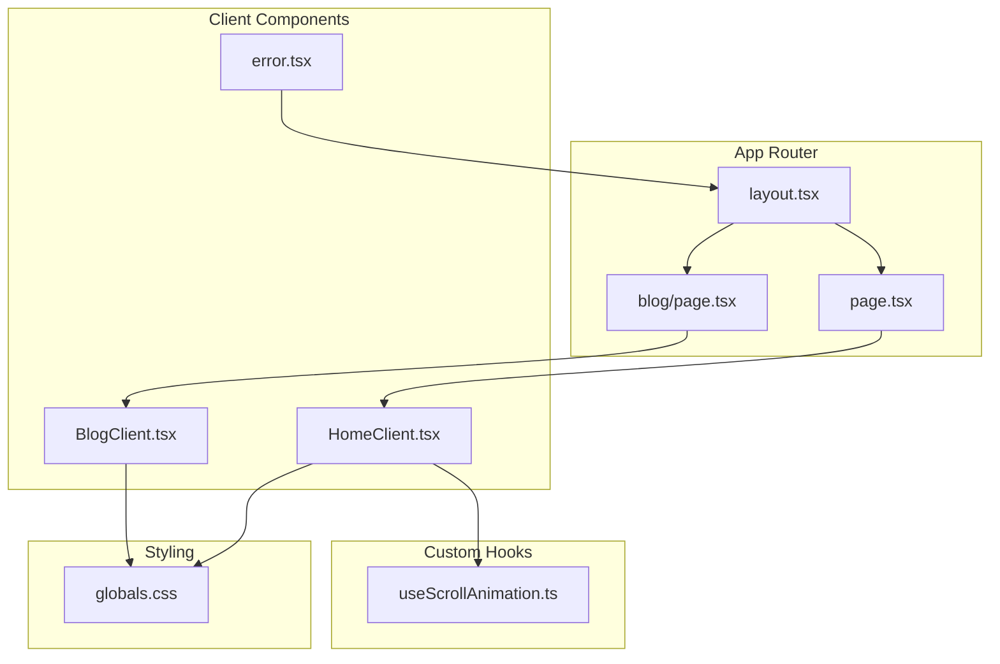
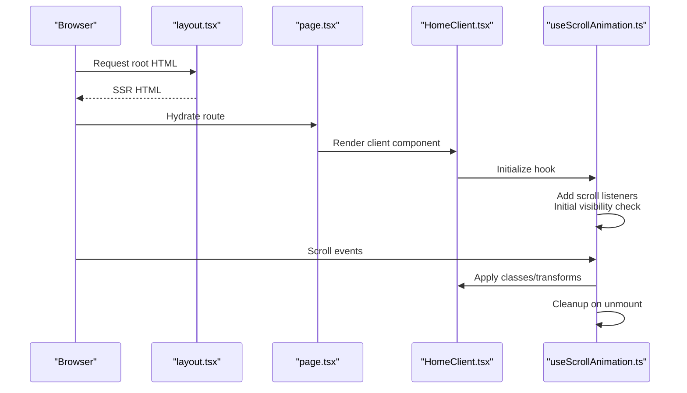
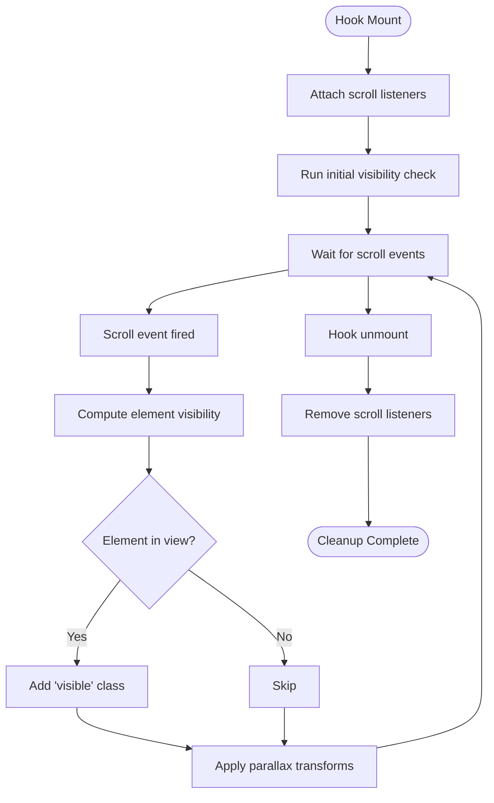
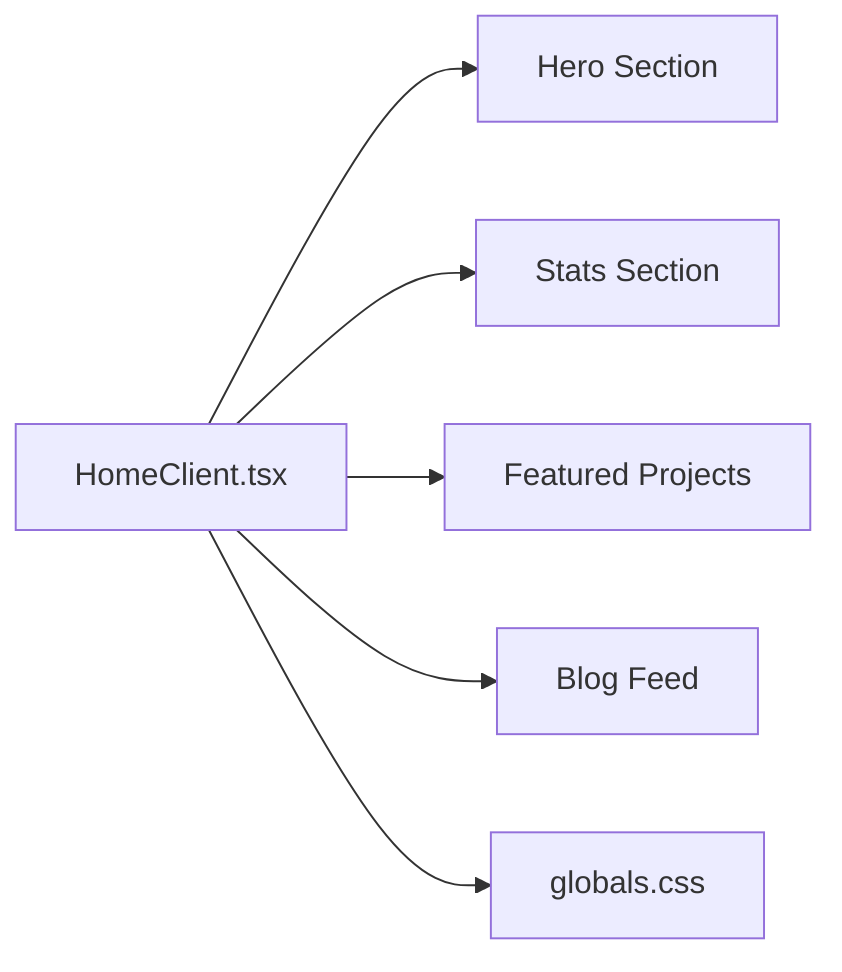
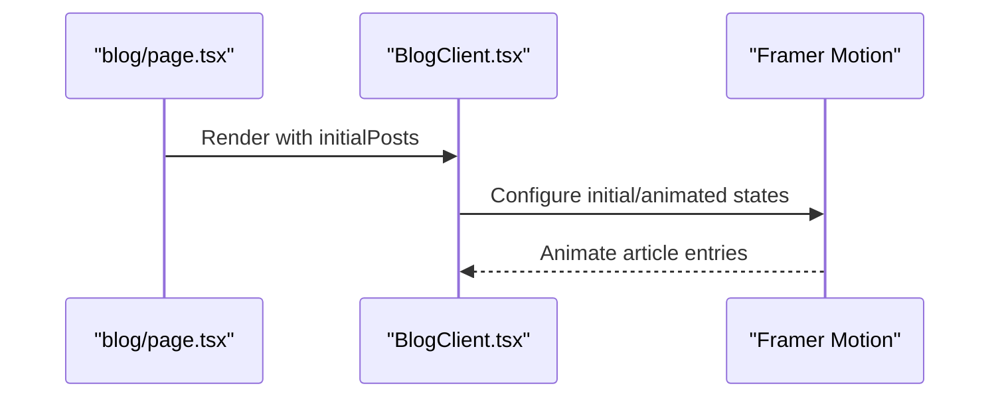
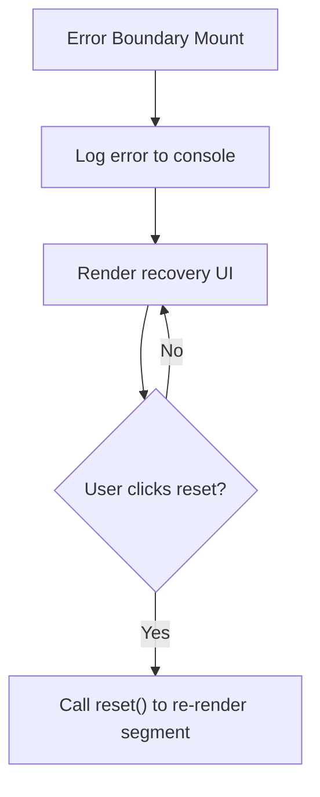
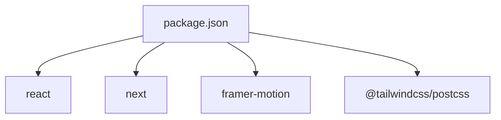

# Hook-Based State Management

<cite>
**Referenced Files in This Document**
- [useScrollAnimation.ts](file://src/hooks/useScrollAnimation.ts)
- [HomeClient.tsx](file://src/components/HomeClient.tsx)
- [BlogClient.tsx](file://src/components/BlogClient.tsx)
- [layout.tsx](file://src/app/layout.tsx)
- [page.tsx](file://src/app/page.tsx)
- [blog/page.tsx](file://src/app/blog/page.tsx)
- [globals.css](file://src/app/globals.css)
- [error.tsx](file://src/app/error.tsx)
- [package.json](file://package.json)
- [tsconfig.json](file://tsconfig.json)
- [next.config.ts](file://next.config.ts)
- [postcss.config.mjs](file://postcss.config.mjs)
</cite>

## Table of Contents
1. [Introduction](#introduction)
2. [Project Structure](#project-structure)
3. [Core Components](#core-components)
4. [Architecture Overview](#architecture-overview)
5. [Detailed Component Analysis](#detailed-component-analysis)
6. [Dependency Analysis](#dependency-analysis)
7. [Performance Considerations](#performance-considerations)
8. [Troubleshooting Guide](#troubleshooting-guide)
9. [Conclusion](#conclusion)
10. [Appendices](#appendices)

## Introduction
This document explains the hook-based state management pattern used in the application, focusing on how custom hooks encapsulate cross-cutting concerns and provide reusable functionality. It details the separation between server-side rendering (SSR) and client-side interactivity, demonstrates how hooks enable smooth client-side enhancements without compromising SSR benefits, and covers lifecycle, dependency management, and performance optimization. Practical examples show how hooks handle scroll events, animation triggers, and responsive behavior. Best practices for hook composition, testing strategies, and common pitfalls are included.

## Project Structure
The application follows a Next.js App Router structure with a clear separation between server-rendered pages and client-enhanced components. Client-side interactivity is opt-in via the "use client" directive, ensuring SSR remains intact while enabling dynamic effects.

**Diagram sources**
- [layout.tsx:28-56](file://src/app/layout.tsx#L28-L56)
- [page.tsx:10-14](file://src/app/page.tsx#L10-L14)
- [blog/page.tsx:10-14](file://src/app/blog/page.tsx#L10-L14)
- [HomeClient.tsx:12-211](file://src/components/HomeClient.tsx#L12-L211)
- [BlogClient.tsx:12-165](file://src/components/BlogClient.tsx#L12-L165)
- [useScrollAnimation.ts:5-50](file://src/hooks/useScrollAnimation.ts#L5-L50)
- [globals.css:1-113](file://src/app/globals.css#L1-L113)

**Section sources**
- [layout.tsx:28-56](file://src/app/layout.tsx#L28-L56)
- [page.tsx:10-14](file://src/app/page.tsx#L10-L14)
- [blog/page.tsx:10-14](file://src/app/blog/page.tsx#L10-L14)
- [HomeClient.tsx:12-211](file://src/components/HomeClient.tsx#L12-L211)
- [BlogClient.tsx:12-165](file://src/components/BlogClient.tsx#L12-L165)
- [useScrollAnimation.ts:5-50](file://src/hooks/useScrollAnimation.ts#L5-L50)
- [globals.css:1-113](file://src/app/globals.css#L1-L113)

## Core Components
- useScrollAnimation: A custom hook that manages scroll-driven animations and parallax effects. It attaches scroll listeners, computes visibility thresholds, toggles CSS classes for animated elements, and applies transform-based parallax to hero sections. It initializes on mount and cleans up event listeners on unmount.
- HomeClient: A client component that renders the home page content and relies on global styles and potential DOM classes for animations.
- BlogClient: A client component that renders the blog feed with Framer Motion animations and relies on global styles.
- layout.tsx: Provides the root HTML structure, fonts, and global styles, hosting client components as children.
- page.tsx and blog/page.tsx: Server-rendered pages that pass data to client components.

Key characteristics:
- Client-side interactivity is explicitly enabled via "use client".
- Hooks encapsulate DOM manipulation and event handling, keeping components declarative.
- Global CSS defines animation-related classes and visual themes.

**Section sources**
- [useScrollAnimation.ts:5-50](file://src/hooks/useScrollAnimation.ts#L5-L50)
- [HomeClient.tsx:12-211](file://src/components/HomeClient.tsx#L12-L211)
- [BlogClient.tsx:12-165](file://src/components/BlogClient.tsx#L12-L165)
- [layout.tsx:28-56](file://src/app/layout.tsx#L28-L56)
- [page.tsx:10-14](file://src/app/page.tsx#L10-L14)
- [blog/page.tsx:10-14](file://src/app/blog/page.tsx#L10-L14)

## Architecture Overview
The architecture separates SSR concerns from client interactivity. Pages are server-rendered, then hydrated on the client. Client components opt-in to interactivity using "use client". Custom hooks manage side effects and DOM interactions, ensuring SSR compatibility and efficient updates.

**Diagram sources**
- [layout.tsx:28-56](file://src/app/layout.tsx#L28-L56)
- [page.tsx:10-14](file://src/app/page.tsx#L10-L14)
- [HomeClient.tsx:12-211](file://src/components/HomeClient.tsx#L12-L211)
- [useScrollAnimation.ts:5-50](file://src/hooks/useScrollAnimation.ts#L5-L50)

## Detailed Component Analysis

### useScrollAnimation Hook
Purpose:
- Manage scroll-triggered animations by adding/removing CSS classes to elements with specific selectors.
- Apply parallax transforms to hero and content containers based on scroll position.

Implementation highlights:
- Uses useEffect to attach scroll listeners on mount and remove them on unmount.
- Computes element visibility using bounding client rectangles and viewport height.
- Applies transform styles for parallax effects on targeted elements.
- Performs an initial visibility check after mounting.

**Diagram sources**
- [useScrollAnimation.ts:5-50](file://src/hooks/useScrollAnimation.ts#L5-L50)

**Section sources**
- [useScrollAnimation.ts:5-50](file://src/hooks/useScrollAnimation.ts#L5-L50)

### HomeClient Component
Role:
- Renders the home page content, including hero sections, stats, projects, and blog previews.
- Integrates with global styles and relies on potential DOM classes for animations.

Behavior:
- Uses Next.js Image and Link components for media and navigation.
- Passes a subset of posts to child components for display.

**Diagram sources**
- [HomeClient.tsx:12-211](file://src/components/HomeClient.tsx#L12-L211)
- [globals.css:1-113](file://src/app/globals.css#L1-L113)

**Section sources**
- [HomeClient.tsx:12-211](file://src/components/HomeClient.tsx#L12-L211)
- [globals.css:1-113](file://src/app/globals.css#L1-L113)

### BlogClient Component
Role:
- Renders the blog page with a featured article and a grid of articles.
- Uses Framer Motion for entrance animations.

Behavior:
- Receives initial posts from the server-rendered page.
- Applies motion variants for staggered animations.

**Diagram sources**
- [blog/page.tsx:10-14](file://src/app/blog/page.tsx#L10-L14)
- [BlogClient.tsx:12-165](file://src/components/BlogClient.tsx#L12-L165)

**Section sources**
- [blog/page.tsx:10-14](file://src/app/blog/page.tsx#L10-L14)
- [BlogClient.tsx:12-165](file://src/components/BlogClient.tsx#L12-L165)

### Error Boundary Component
Role:
- Demonstrates client-side error handling with a useEffect hook.
- Provides a reset mechanism to recover from errors.

Behavior:
- Logs errors on client mount.
- Exposes a button to trigger recovery.

**Diagram sources**
- [error.tsx:5-34](file://src/app/error.tsx#L5-L34)

**Section sources**
- [error.tsx:5-34](file://src/app/error.tsx#L5-L34)

## Dependency Analysis
External libraries and tooling:
- React and Next.js provide runtime and SSR capabilities.
- Framer Motion enables declarative animations in client components.
- Tailwind CSS and PostCSS process global styles.

**Diagram sources**
- [package.json:11-21](file://package.json#L11-L21)
- [postcss.config.mjs:1-6](file://postcss.config.mjs#L1-L6)

**Section sources**
- [package.json:11-21](file://package.json#L11-L21)
- [postcss.config.mjs:1-6](file://postcss.config.mjs#L1-L6)

## Performance Considerations
- Event listener lifecycle: The hook adds and removes scroll listeners during mount/unmount to prevent memory leaks and redundant handlers.
- Initial visibility check: Running an immediate check after mounting ensures elements animate into view without waiting for the first scroll.
- Transform-based parallax: Using translate transforms leverages GPU acceleration for smoother scrolling compared to layout-affecting properties.
- Minimal DOM queries: Selecting elements by class and iterating avoids frequent recalculations.
- SSR-first hydration: Client components are marked explicitly, preserving SSR benefits until interactivity is needed.

[No sources needed since this section provides general guidance]

## Troubleshooting Guide
Common issues and resolutions:
- Elements not animating: Ensure target elements have the expected class names so the hook can select and toggle them.
- Parallax not working: Verify that elements with parallax classes exist and that the hook runs in a client component.
- Scroll jank: Confirm that the hook is mounted only in client components and that unnecessary DOM queries are avoided.
- Cleanup not applied: Ensure the component using the hook is unmounted to trigger cleanup of event listeners.

**Section sources**
- [useScrollAnimation.ts:5-50](file://src/hooks/useScrollAnimation.ts#L5-L50)
- [HomeClient.tsx:12-211](file://src/components/HomeClient.tsx#L12-L211)

## Conclusion
The application employs a clean hook-based state management pattern that encapsulates cross-cutting concerns like scroll-driven animations and parallax effects. By marking client components explicitly, it preserves SSR benefits while enabling robust client-side enhancements. The useScrollAnimation hook demonstrates proper lifecycle management, dependency handling, and performance-conscious DOM manipulation. Following best practices for hook composition, testing, and cleanup ensures maintainable and efficient interactive experiences.

[No sources needed since this section summarizes without analyzing specific files]

## Appendices

### Best Practices for Hook Composition
- Encapsulate side effects in custom hooks to keep components pure and declarative.
- Manage event listeners with useEffect cleanup to avoid leaks.
- Prefer transform-based animations for performance.
- Keep hooks focused on a single responsibility and compose them thoughtfully.

### Testing Strategies
- Unit test hooks by mocking DOM APIs and verifying side effects.
- Use testing libraries that support React hooks and client-side behavior.
- Simulate scroll events to validate visibility calculations and class toggles.

### Common Pitfalls
- Forgetting "use client" in client components.
- Attaching event listeners without cleanup.
- Performing heavy computations inside render loops.
- Assuming DOM availability before hydration.

**Section sources**
- [useScrollAnimation.ts:5-50](file://src/hooks/useScrollAnimation.ts#L5-L50)
- [HomeClient.tsx:12-211](file://src/components/HomeClient.tsx#L12-L211)
- [BlogClient.tsx:12-165](file://src/components/BlogClient.tsx#L12-L165)
- [layout.tsx:28-56](file://src/app/layout.tsx#L28-L56)
- [page.tsx:10-14](file://src/app/page.tsx#L10-L14)
- [blog/page.tsx:10-14](file://src/app/blog/page.tsx#L10-L14)
- [globals.css:1-113](file://src/app/globals.css#L1-L113)
- [error.tsx:5-34](file://src/app/error.tsx#L5-L34)
- [package.json:11-21](file://package.json#L11-L21)
- [tsconfig.json:1-28](file://tsconfig.json#L1-L28)
- [next.config.ts:1-8](file://next.config.ts#L1-L8)
- [postcss.config.mjs:1-6](file://postcss.config.mjs#L1-L6)