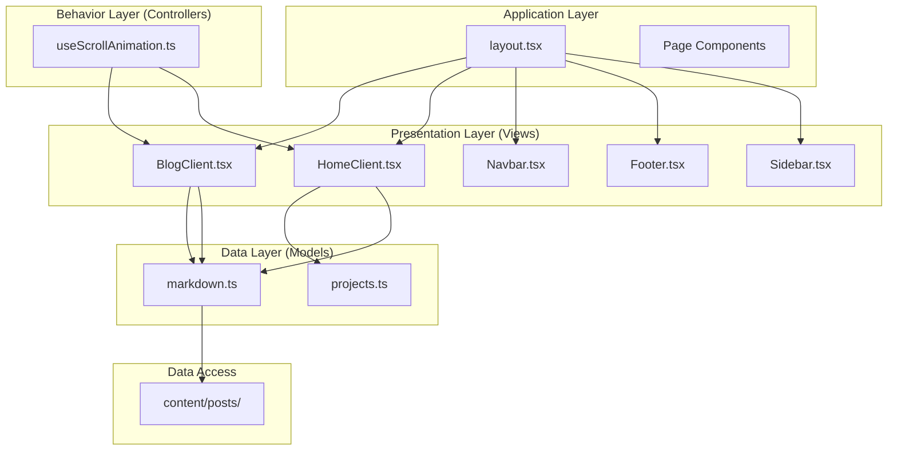
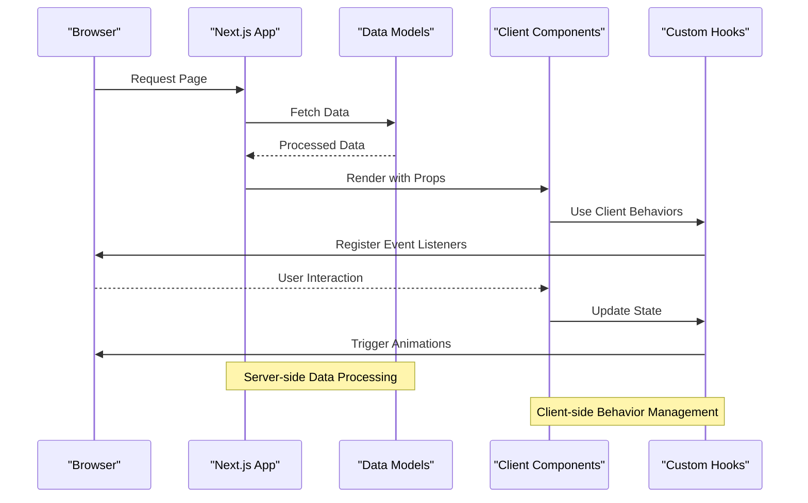
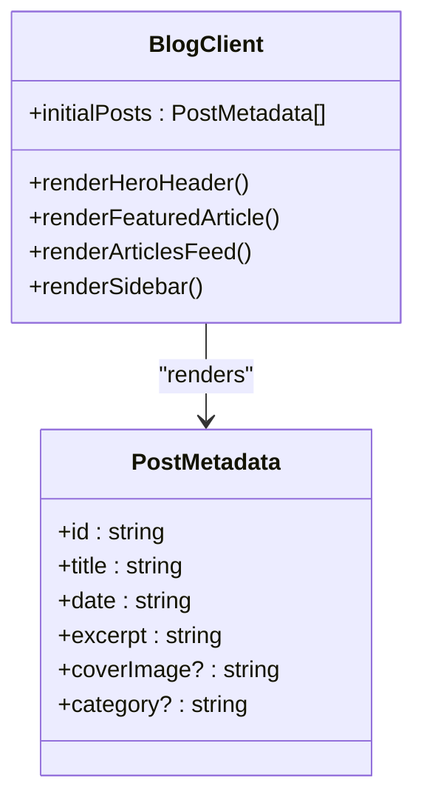
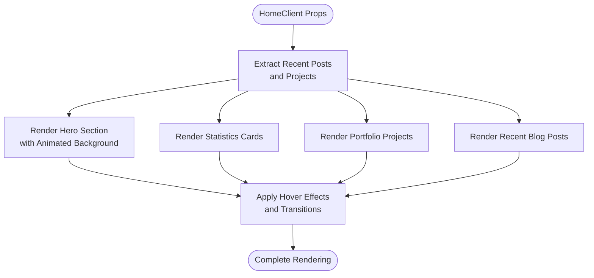
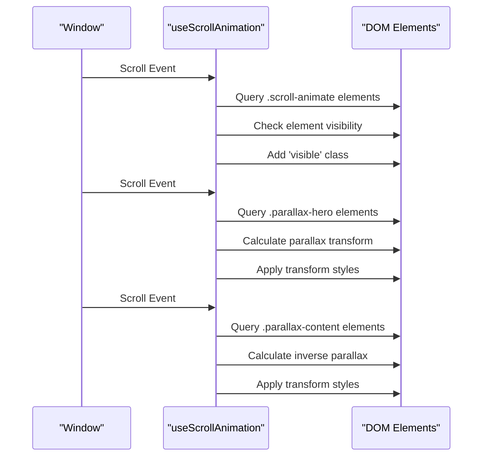
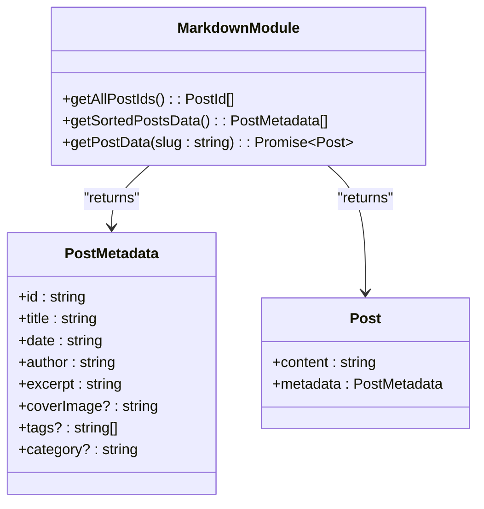
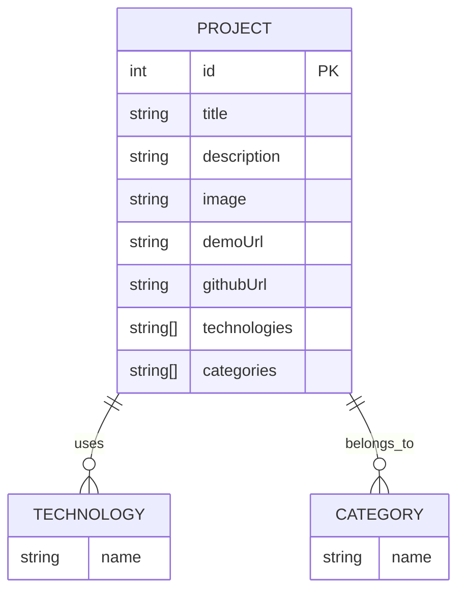

# MVC-Like Component Separation

<cite>
**Referenced Files in This Document**
- [layout.tsx](file://src/app/layout.tsx)
- [BlogClient.tsx](file://src/components/BlogClient.tsx)
- [HomeClient.tsx](file://src/components/HomeClient.tsx)
- [Navbar.tsx](file://src/components/Navbar.tsx)
- [Footer.tsx](file://src/components/Footer.tsx)
- [Sidebar.tsx](file://src/components/Sidebar.tsx)
- [useScrollAnimation.ts](file://src/hooks/useScrollAnimation.ts)
- [markdown.ts](file://src/utils/markdown.ts)
- [projects.ts](file://src/data/projects.ts)
- [blog/page.tsx](file://src/app/blog/page.tsx)
- [page.tsx](file://src/app/page.tsx)
- [blog/[slug]/page.tsx](file://src/app/blog/[slug]/page.tsx)
</cite>

## Table of Contents
1. [Introduction](#introduction)
2. [Project Structure](#project-structure)
3. [Core Components](#core-components)
4. [Architecture Overview](#architecture-overview)
5. [Detailed Component Analysis](#detailed-component-analysis)
6. [Dependency Analysis](#dependency-analysis)
7. [Performance Considerations](#performance-considerations)
8. [Testing and Maintainability Benefits](#testing-and-maintainability-benefits)
9. [Conclusion](#conclusion)

## Introduction

This document analyzes the Model-View-Controller (MVC)-like architectural pattern implemented in the portfolio website. The application demonstrates a clear separation between presentation logic (Views), state management and behavior (Controllers), and data access/processing (Models). This separation enables better testing, maintainability, and code organization while supporting modern React patterns with Next.js server-side rendering capabilities.

## Project Structure

The project follows a structured file organization that naturally maps to the MVC architectural pattern:



**Diagram sources**
- [layout.tsx:1-58](file://src/app/layout.tsx#L1-L58)
- [BlogClient.tsx:1-166](file://src/components/BlogClient.tsx#L1-L166)
- [HomeClient.tsx:1-212](file://src/components/HomeClient.tsx#L1-L212)
- [useScrollAnimation.ts:1-51](file://src/hooks/useScrollAnimation.ts#L1-L51)
- [markdown.ts:1-108](file://src/utils/markdown.ts#L1-L108)
- [projects.ts:1-43](file://src/data/projects.ts#L1-L43)

**Section sources**
- [layout.tsx:1-58](file://src/app/layout.tsx#L1-L58)
- [BlogClient.tsx:1-166](file://src/components/BlogClient.tsx#L1-L166)
- [HomeClient.tsx:1-212](file://src/components/HomeClient.tsx#L1-L212)

## Core Components

The application implements a clear MVC-like separation through three primary layers:

### Views (Presentation Layer)
Views are responsible for rendering UI elements and handling user interactions. They receive data as props and focus solely on presentation logic.

**Key View Components:**
- **BlogClient**: Renders blog feed with featured articles and sidebar
- **HomeClient**: Displays hero section, statistics, projects, and recent blog posts
- **Navbar**: Handles navigation state and responsive menu behavior
- **Footer**: Static footer component
- **Sidebar**: Fixed social links sidebar

### Controllers (Behavior Layer)
Controllers manage state, behavior, and lifecycle events. They encapsulate business logic and coordinate between views and models.

**Key Controller Components:**
- **useScrollAnimation**: Manages scroll-based animations and parallax effects
- **Navbar state management**: Handles scroll detection and mobile menu state

### Models (Data Layer)
Models provide data access, processing, and business logic. They abstract data manipulation and provide clean interfaces to views.

**Key Model Components:**
- **markdown.ts**: Handles markdown file processing, metadata extraction, and content transformation
- **projects.ts**: Provides static project data for portfolio display

**Section sources**
- [BlogClient.tsx:12-166](file://src/components/BlogClient.tsx#L12-L166)
- [HomeClient.tsx:12-212](file://src/components/HomeClient.tsx#L12-L212)
- [useScrollAnimation.ts:5-51](file://src/hooks/useScrollAnimation.ts#L5-L51)
- [markdown.ts:9-108](file://src/utils/markdown.ts#L9-L108)
- [projects.ts:1-43](file://src/data/projects.ts#L1-L43)

## Architecture Overview

The application follows a hybrid Next.js architecture that combines server-side rendering with client-side interactivity:



**Diagram sources**
- [blog/page.tsx:10-14](file://src/app/blog/page.tsx#L10-L14)
- [page.tsx:10-14](file://src/app/page.tsx#L10-L14)
- [blog/[slug]/page.tsx:12-17](file://src/app/blog/[slug]/page.tsx#L12-L17)

The architecture demonstrates clear separation of concerns:

1. **Server-side**: Data fetching and processing using models
2. **Client-side**: Presentation and interactive behaviors
3. **Hybrid**: Controlled state management through custom hooks

## Detailed Component Analysis

### View Components Analysis

#### BlogClient Component
The BlogClient component exemplifies the View responsibility by focusing purely on presentation logic:



**Diagram sources**
- [BlogClient.tsx:8-166](file://src/components/BlogClient.tsx#L8-L166)
- [markdown.ts:9-22](file://src/utils/markdown.ts#L9-L22)

The component receives pre-processed data and focuses on:
- Layout composition and responsive design
- Interactive animations using Framer Motion
- Navigation linking to individual posts
- Static content rendering

#### HomeClient Component
The HomeClient component showcases complex presentation logic with multiple sections:



**Diagram sources**
- [HomeClient.tsx:12-212](file://src/components/HomeClient.tsx#L12-L212)
- [projects.ts:1-43](file://src/data/projects.ts#L1-L43)

**Section sources**
- [BlogClient.tsx:12-166](file://src/components/BlogClient.tsx#L12-L166)
- [HomeClient.tsx:12-212](file://src/components/HomeClient.tsx#L12-L212)

### Controller Components Analysis

#### useScrollAnimation Hook
The useScrollAnimation hook demonstrates Controller responsibilities:



**Diagram sources**
- [useScrollAnimation.ts:6-50](file://src/hooks/useScrollAnimation.ts#L6-L50)

The hook manages:
- Scroll event listeners and cleanup
- Element visibility detection
- Parallax effect calculations
- Performance optimization through debouncing

**Section sources**
- [useScrollAnimation.ts:5-51](file://src/hooks/useScrollAnimation.ts#L5-L51)

### Model Components Analysis

#### markdown.ts Module
The markdown module serves as the primary Model, handling all data access and processing:



**Diagram sources**
- [markdown.ts:24-108](file://src/utils/markdown.ts#L24-L108)

The module provides:
- File system operations for content management
- YAML front matter parsing using gray-matter
- Markdown to HTML conversion using remark
- Data sorting and filtering capabilities
- Type-safe interfaces for compile-time validation

**Section sources**
- [markdown.ts:1-108](file://src/utils/markdown.ts#L1-L108)

### Data Components Analysis

#### projects.ts Module
The projects module provides static data for portfolio display:



**Diagram sources**
- [projects.ts:1-43](file://src/data/projects.ts#L1-L43)

**Section sources**
- [projects.ts:1-43](file://src/data/projects.ts#L1-L43)

## Dependency Analysis

The application demonstrates clean dependency relationships that support the MVC separation:

```mermaid
graph LR
subgraph "Server-Side"
BlogPage[blog/page.tsx]
HomePage[page.tsx]
PostPage[blog/[slug]/page.tsx]
end
subgraph "Client-Side"
BlogClient[BlogClient.tsx]
HomeClient[HomeClient.tsx]
Navbar[Navbar.tsx]
Footer[Footer.tsx]
Sidebar[Sidebar.tsx]
end
subgraph "Hooks"
ScrollHook[useScrollAnimation.ts]
end
subgraph "Models"
MarkdownModel[markdown.ts]
ProjectsModel[projects.ts]
end
BlogPage --> BlogClient
HomePage --> HomeClient
PostPage --> BlogPostClient
BlogClient --> MarkdownModel
HomeClient --> MarkdownModel
HomeClient --> ProjectsModel
BlogClient --> ScrollHook
HomeClient --> ScrollHook
Navbar --> ScrollHook
Footer --> Navbar
Sidebar --> Navbar
```

**Diagram sources**
- [blog/page.tsx:1-15](file://src/app/blog/page.tsx#L1-L15)
- [page.tsx:1-15](file://src/app/page.tsx#L1-L15)
- [blog/[slug]/page.tsx:1-18](file://src/app/blog/[slug]/page.tsx#L1-L18)
- [BlogClient.tsx:1-166](file://src/components/BlogClient.tsx#L1-L166)
- [HomeClient.tsx:1-212](file://src/components/HomeClient.tsx#L1-L212)
- [useScrollAnimation.ts:1-51](file://src/hooks/useScrollAnimation.ts#L1-L51)
- [markdown.ts:1-108](file://src/utils/markdown.ts#L1-L108)
- [projects.ts:1-43](file://src/data/projects.ts#L1-L43)

**Section sources**
- [blog/page.tsx:1-15](file://src/app/blog/page.tsx#L1-L15)
- [page.tsx:1-15](file://src/app/page.tsx#L1-L15)
- [blog/[slug]/page.tsx:1-18](file://src/app/blog/[slug]/page.tsx#L1-L18)

## Performance Considerations

The MVC-like separation provides several performance benefits:

### Server-Side Data Processing
- **Pre-processing**: Data is processed on the server before reaching clients
- **Caching**: Static generation reduces runtime computation
- **Bundle size**: Client components remain lightweight

### Client-Side Optimization
- **Selective hydration**: Only interactive components require client-side JavaScript
- **Event delegation**: Efficient event handling through hooks
- **CSS transitions**: Hardware-accelerated animations

### Memory Management
- **Automatic cleanup**: Hooks properly remove event listeners
- **Component isolation**: Clear boundaries prevent memory leaks
- **Lazy loading**: Images and content load on demand

## Testing and Maintainability Benefits

The MVC-like separation significantly improves testing and maintainability:

### Testing Advantages

#### View Testing
Components can be tested independently with mock data:
- **Isolation**: Pure presentation logic without external dependencies
- **Deterministic**: Consistent output for given props
- **Fast execution**: No network requests or heavy computations

#### Hook Testing
Custom hooks can be unit-tested for behavior:
- **State verification**: Test state transitions and effects
- **Event simulation**: Mock browser events and DOM interactions
- **Cleanup validation**: Ensure proper resource cleanup

#### Model Testing
Data access layers can be tested with controlled inputs:
- **File system mocking**: Test with predefined content
- **Parsing validation**: Verify data transformation accuracy
- **Error handling**: Test edge cases and invalid inputs

### Maintainability Benefits

#### Clear Responsibilities
- **Single responsibility**: Each layer has well-defined purposes
- **Easy refactoring**: Changes can be isolated to specific layers
- **Team collaboration**: Different developers can work on separate layers

#### Scalability Support
- **Component reuse**: Views can be composed from smaller components
- **Hook sharing**: Business logic can be shared across components
- **Model expansion**: Data access can be extended without affecting presentation

#### Debugging Efficiency
- **Layer isolation**: Issues can be traced to specific layers
- **Clear boundaries**: Error sources are easily identifiable
- **Development tools**: Each layer can leverage appropriate debugging approaches

## Conclusion

The portfolio website successfully implements an MVC-like architectural pattern that provides clear separation between presentation, behavior, and data layers. This separation enables:

- **Better testing**: Isolated components and hooks facilitate comprehensive testing strategies
- **Improved maintainability**: Well-defined responsibilities make the codebase easier to understand and modify
- **Enhanced scalability**: Modular architecture supports growth and feature additions
- **Optimized performance**: Server-side data processing combined with client-side interactivity creates efficient user experiences

The implementation demonstrates how modern React patterns, combined with Next.js server-side rendering, can achieve the benefits of traditional MVC architecture while leveraging contemporary web development practices. The clear boundaries between Views (presentation), Controllers (behavior), and Models (data) create a robust foundation for continued development and maintenance.