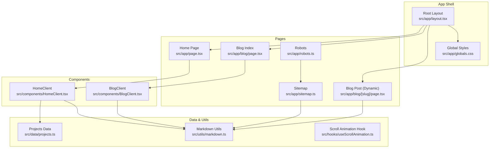
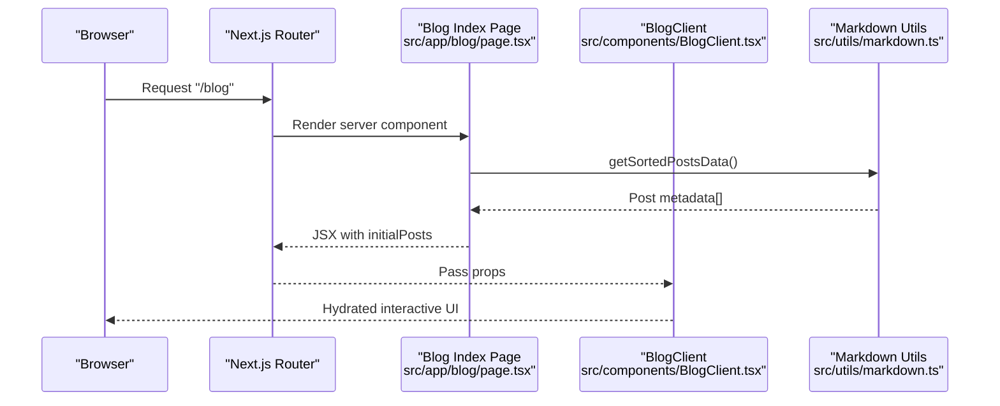
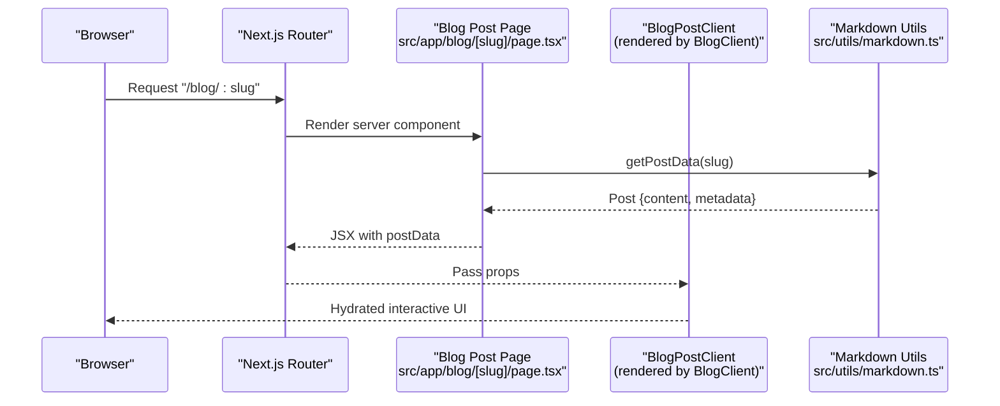
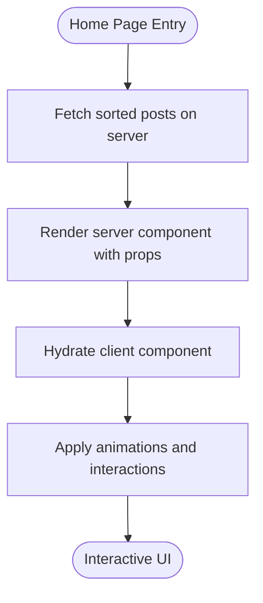
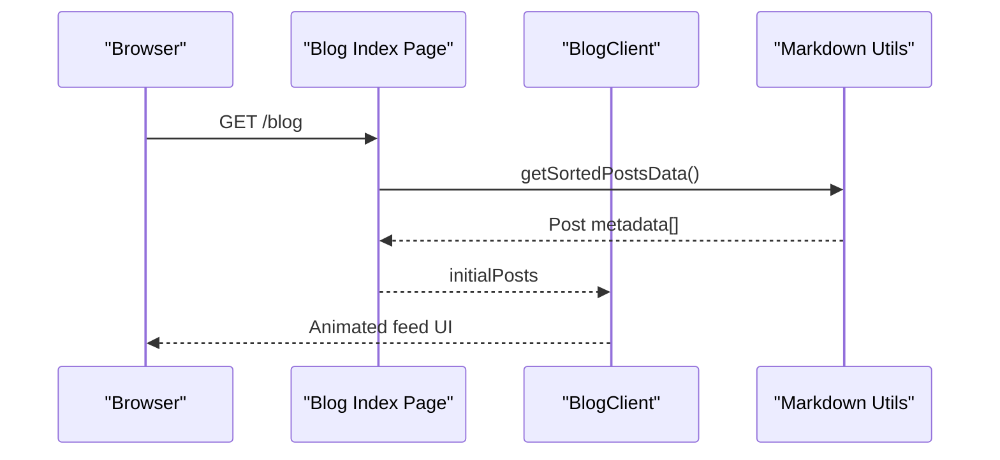
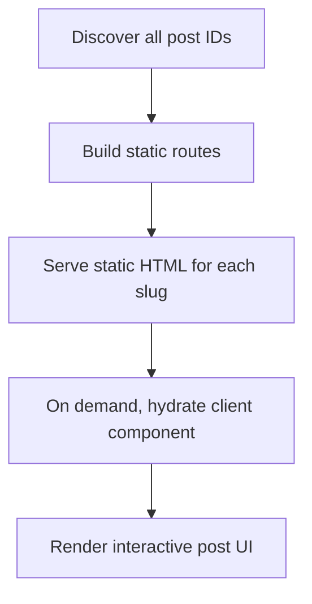
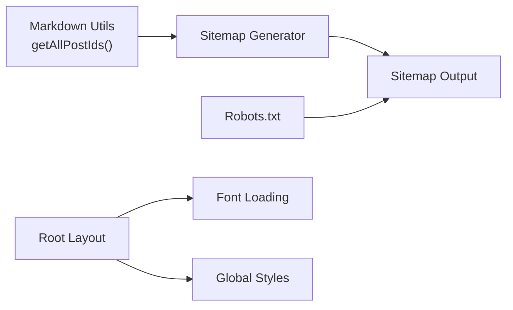
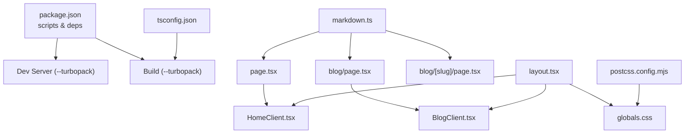

# Rendering Strategies & Performance

<cite>
**Referenced Files in This Document**
- [next.config.ts](file://next.config.ts)
- [package.json](file://package.json)
- [tsconfig.json](file://tsconfig.json)
- [postcss.config.mjs](file://postcss.config.mjs)
- [src/app/layout.tsx](file://src/app/layout.tsx)
- [src/app/page.tsx](file://src/app/page.tsx)
- [src/app/blog/page.tsx](file://src/app/blog/page.tsx)
- [src/app/blog/[slug]/page.tsx](file://src/app/blog/[slug]/page.tsx)
- [src/app/sitemap.ts](file://src/app/sitemap.ts)
- [src/app/robots.ts](file://src/app/robots.ts)
- [src/components/HomeClient.tsx](file://src/components/HomeClient.tsx)
- [src/components/BlogClient.tsx](file://src/components/BlogClient.tsx)
- [src/utils/markdown.ts](file://src/utils/markdown.ts)
- [src/data/projects.ts](file://src/data/projects.ts)
- [src/hooks/useScrollAnimation.ts](file://src/hooks/useScrollAnimation.ts)
- [src/app/globals.css](file://src/app/globals.css)
</cite>

## Table of Contents
1. [Introduction](#introduction)
2. [Project Structure](#project-structure)
3. [Core Components](#core-components)
4. [Architecture Overview](#architecture-overview)
5. [Detailed Component Analysis](#detailed-component-analysis)
6. [Dependency Analysis](#dependency-analysis)
7. [Performance Considerations](#performance-considerations)
8. [Troubleshooting Guide](#troubleshooting-guide)
9. [Conclusion](#conclusion)

## Introduction
This document explains the rendering strategies and performance optimizations implemented in the Next.js application. It focuses on the hybrid approach that leverages Static Site Generation (SSG) for performance and SEO while enabling selective Server-Side Rendering (SSR) where needed. The documentation covers file-based routing with dynamic segments, image optimization, code splitting, caching strategies, and progressive enhancement techniques. It also provides practical examples of how different pages choose appropriate rendering strategies based on content type and requirements.

## Project Structure
The application follows Next.js file-based routing under the src/app directory. Pages are grouped by feature and use dynamic segments for content such as blog posts. Shared layout and metadata are centralized in the root layout and metadata files. Utility modules encapsulate content loading and transformations, while client components manage interactive UI and animations.

**Diagram sources**
- [src/app/layout.tsx:1-58](file://src/app/layout.tsx#L1-L58)
- [src/app/page.tsx:1-15](file://src/app/page.tsx#L1-L15)
- [src/app/blog/page.tsx:1-15](file://src/app/blog/page.tsx#L1-L15)
- [src/app/blog/[slug]/page.tsx](file://src/app/blog/[slug]/page.tsx#L1-L18)
- [src/app/sitemap.ts:1-37](file://src/app/sitemap.ts#L1-L37)
- [src/app/robots.ts:1-13](file://src/app/robots.ts#L1-L13)
- [src/components/HomeClient.tsx:1-212](file://src/components/HomeClient.tsx#L1-L212)
- [src/components/BlogClient.tsx:1-166](file://src/components/BlogClient.tsx#L1-L166)
- [src/utils/markdown.ts:1-108](file://src/utils/markdown.ts#L1-L108)
- [src/data/projects.ts:1-43](file://src/data/projects.ts#L1-L43)
- [src/hooks/useScrollAnimation.ts:1-51](file://src/hooks/useScrollAnimation.ts#L1-L51)
- [src/app/globals.css:1-113](file://src/app/globals.css#L1-L113)

**Section sources**
- [src/app/layout.tsx:1-58](file://src/app/layout.tsx#L1-L58)
- [src/app/page.tsx:1-15](file://src/app/page.tsx#L1-L15)
- [src/app/blog/page.tsx:1-15](file://src/app/blog/page.tsx#L1-L15)
- [src/app/blog/[slug]/page.tsx](file://src/app/blog/[slug]/page.tsx#L1-L18)
- [src/app/sitemap.ts:1-37](file://src/app/sitemap.ts#L1-L37)
- [src/app/robots.ts:1-13](file://src/app/robots.ts#L1-L13)
- [src/components/HomeClient.tsx:1-212](file://src/components/HomeClient.tsx#L1-L212)
- [src/components/BlogClient.tsx:1-166](file://src/components/BlogClient.tsx#L1-L166)
- [src/utils/markdown.ts:1-108](file://src/utils/markdown.ts#L1-L108)
- [src/data/projects.ts:1-43](file://src/data/projects.ts#L1-L43)
- [src/hooks/useScrollAnimation.ts:1-51](file://src/hooks/useScrollAnimation.ts#L1-L51)
- [src/app/globals.css:1-113](file://src/app/globals.css#L1-L113)

## Core Components
- Root layout defines shared metadata, fonts, and global styles, and wraps child pages with navigation and footer components.
- Home page fetches sorted blog post metadata and delegates rendering to a client component for interactive UI.
- Blog index page loads all posts and renders a responsive feed using a client component.
- Dynamic blog post page uses generateStaticParams to statically generate routes for known slugs, then renders content via a client component.
- Sitemap and robots files support SEO by declaring URLs and crawl permissions.
- Utilities encapsulate markdown parsing and HTML conversion, and provide sorted post lists and per-post data.
- Client components integrate Next.js Image for optimized images, Framer Motion for animations, and Tailwind-based styling.
- Global CSS centralizes theme tokens and reusable design utilities.

**Section sources**
- [src/app/layout.tsx:1-58](file://src/app/layout.tsx#L1-L58)
- [src/app/page.tsx:1-15](file://src/app/page.tsx#L1-L15)
- [src/app/blog/page.tsx:1-15](file://src/app/blog/page.tsx#L1-L15)
- [src/app/blog/[slug]/page.tsx](file://src/app/blog/[slug]/page.tsx#L1-L18)
- [src/app/sitemap.ts:1-37](file://src/app/sitemap.ts#L1-L37)
- [src/app/robots.ts:1-13](file://src/app/robots.ts#L1-L13)
- [src/utils/markdown.ts:1-108](file://src/utils/markdown.ts#L1-L108)
- [src/components/HomeClient.tsx:1-212](file://src/components/HomeClient.tsx#L1-L212)
- [src/components/BlogClient.tsx:1-166](file://src/components/BlogClient.tsx#L1-L166)
- [src/app/globals.css:1-113](file://src/app/globals.css#L1-L113)

## Architecture Overview
The application employs a hybrid rendering model:
- Static Site Generation (SSG) for predictable, content-driven pages such as the blog index and individual blog posts generated from static slugs.
- Client-side rendering (CSR) for interactive UI and animations within client components.
- Optional SSR scenarios can be introduced by removing the static generation functions and using server components where appropriate.

**Diagram sources**
- [src/app/blog/page.tsx:1-15](file://src/app/blog/page.tsx#L1-L15)
- [src/components/BlogClient.tsx:1-166](file://src/components/BlogClient.tsx#L1-L166)
- [src/utils/markdown.ts:40-77](file://src/utils/markdown.ts#L40-L77)

**Diagram sources**
- [src/app/blog/[slug]/page.tsx](file://src/app/blog/[slug]/page.tsx#L1-L18)
- [src/utils/markdown.ts:79-107](file://src/utils/markdown.ts#L79-L107)
- [src/components/BlogClient.tsx:1-166](file://src/components/BlogClient.tsx#L1-L166)

## Detailed Component Analysis

### Home Page (SSG + Client Rendering)
- The home page fetches sorted post metadata on the server during build or request and passes it to a client component for rendering.
- Client component handles interactive hero graphics, hover effects, and image transitions using Next.js Image.
- Progressive enhancement is achieved by deferring heavy animations until hydration.

**Diagram sources**
- [src/app/page.tsx:1-15](file://src/app/page.tsx#L1-L15)
- [src/components/HomeClient.tsx:1-212](file://src/components/HomeClient.tsx#L1-L212)
- [src/utils/markdown.ts:40-77](file://src/utils/markdown.ts#L40-L77)

**Section sources**
- [src/app/page.tsx:1-15](file://src/app/page.tsx#L1-L15)
- [src/components/HomeClient.tsx:1-212](file://src/components/HomeClient.tsx#L1-L212)
- [src/utils/markdown.ts:40-77](file://src/utils/markdown.ts#L40-L77)

### Blog Index (SSG with Client Feed)
- The blog index page loads all post metadata and renders a responsive feed using a client component.
- Client component integrates animations and interactive elements for article cards and sidebar placeholders.

**Diagram sources**
- [src/app/blog/page.tsx:1-15](file://src/app/blog/page.tsx#L1-L15)
- [src/components/BlogClient.tsx:1-166](file://src/components/BlogClient.tsx#L1-L166)
- [src/utils/markdown.ts:40-77](file://src/utils/markdown.ts#L40-L77)

**Section sources**
- [src/app/blog/page.tsx:1-15](file://src/app/blog/page.tsx#L1-L15)
- [src/components/BlogClient.tsx:1-166](file://src/components/BlogClient.tsx#L1-L166)
- [src/utils/markdown.ts:40-77](file://src/utils/markdown.ts#L40-L77)

### Dynamic Blog Post (SSG with Static Params)
- The dynamic route generates static pages for known slugs using generateStaticParams, ensuring fast delivery and SEO benefits.
- The page fetches post content and metadata and renders it via a client component.

**Diagram sources**
- [src/app/blog/[slug]/page.tsx](file://src/app/blog/[slug]/page.tsx#L1-L18)
- [src/utils/markdown.ts:24-38](file://src/utils/markdown.ts#L24-L38)
- [src/utils/markdown.ts:79-107](file://src/utils/markdown.ts#L79-L107)

**Section sources**
- [src/app/blog/[slug]/page.tsx](file://src/app/blog/[slug]/page.tsx#L1-L18)
- [src/utils/markdown.ts:24-38](file://src/utils/markdown.ts#L24-L38)
- [src/utils/markdown.ts:79-107](file://src/utils/markdown.ts#L79-L107)

### SEO and Caching Support
- Sitemap generation dynamically includes all blog post URLs, aiding crawlers and improving discoverability.
- Robots file defines crawl rules and points to the sitemap.
- Global CSS centralizes theme tokens and design utilities for consistent rendering and reduced duplication.

**Diagram sources**
- [src/utils/markdown.ts:24-38](file://src/utils/markdown.ts#L24-L38)
- [src/app/sitemap.ts:1-37](file://src/app/sitemap.ts#L1-L37)
- [src/app/robots.ts:1-13](file://src/app/robots.ts#L1-L13)
- [src/app/layout.tsx:1-58](file://src/app/layout.tsx#L1-L58)
- [src/app/globals.css:1-113](file://src/app/globals.css#L1-L113)

**Section sources**
- [src/app/sitemap.ts:1-37](file://src/app/sitemap.ts#L1-L37)
- [src/app/robots.ts:1-13](file://src/app/robots.ts#L1-L13)
- [src/utils/markdown.ts:24-38](file://src/utils/markdown.ts#L24-L38)
- [src/app/layout.tsx:1-58](file://src/app/layout.tsx#L1-L58)
- [src/app/globals.css:1-113](file://src/app/globals.css#L1-L113)

## Dependency Analysis
The rendering pipeline depends on:
- Next.js runtime for file-based routing, static generation, and metadata.
- Client components for interactive UI and animations.
- Utility modules for content parsing and transformation.
- Global styles for consistent theming and design tokens.

**Diagram sources**
- [package.json:1-35](file://package.json#L1-L35)
- [src/utils/markdown.ts:1-108](file://src/utils/markdown.ts#L1-L108)
- [src/app/page.tsx:1-15](file://src/app/page.tsx#L1-L15)
- [src/app/blog/page.tsx:1-15](file://src/app/blog/page.tsx#L1-L15)
- [src/app/blog/[slug]/page.tsx](file://src/app/blog/[slug]/page.tsx#L1-L18)
- [src/components/HomeClient.tsx:1-212](file://src/components/HomeClient.tsx#L1-L212)
- [src/components/BlogClient.tsx:1-166](file://src/components/BlogClient.tsx#L1-L166)
- [src/app/layout.tsx:1-58](file://src/app/layout.tsx#L1-L58)
- [src/app/globals.css:1-113](file://src/app/globals.css#L1-L113)
- [tsconfig.json:1-28](file://tsconfig.json#L1-L28)
- [postcss.config.mjs:1-6](file://postcss.config.mjs#L1-L6)

**Section sources**
- [package.json:1-35](file://package.json#L1-L35)
- [src/utils/markdown.ts:1-108](file://src/utils/markdown.ts#L1-L108)
- [src/app/page.tsx:1-15](file://src/app/page.tsx#L1-L15)
- [src/app/blog/page.tsx:1-15](file://src/app/blog/page.tsx#L1-L15)
- [src/app/blog/[slug]/page.tsx](file://src/app/blog/[slug]/page.tsx#L1-L18)
- [src/components/HomeClient.tsx:1-212](file://src/components/HomeClient.tsx#L1-L212)
- [src/components/BlogClient.tsx:1-166](file://src/components/BlogClient.tsx#L1-L166)
- [src/app/layout.tsx:1-58](file://src/app/layout.tsx#L1-L58)
- [src/app/globals.css:1-113](file://src/app/globals.css#L1-L113)
- [tsconfig.json:1-28](file://tsconfig.json#L1-L28)
- [postcss.config.mjs:1-6](file://postcss.config.mjs#L1-L6)

## Performance Considerations
- Turbopack integration: Development and build scripts enable Turbopack for faster iteration and builds.
- Static generation: The blog index and dynamic post pages leverage static generation for instant delivery and improved SEO.
- Image optimization: Next.js Image is used across client components to serve appropriately sized and optimized assets.
- Code splitting: Client components are marked with "use client" to ensure they are bundled separately and hydrated on demand.
- Bundle optimization: TypeScript bundler resolution and incremental builds help reduce bundle sizes and rebuild times.
- Progressive enhancement: Animations and scroll-based effects are applied after hydration to prioritize content visibility and interactivity.
- CSS architecture: Tailwind-based design tokens and global CSS minimize duplication and improve maintainability.

**Section sources**
- [package.json:5-10](file://package.json#L5-L10)
- [src/app/blog/[slug]/page.tsx](file://src/app/blog/[slug]/page.tsx#L5-L10)
- [src/components/HomeClient.tsx:1-212](file://src/components/HomeClient.tsx#L1-L212)
- [src/components/BlogClient.tsx:1-166](file://src/components/BlogClient.tsx#L1-L166)
- [tsconfig.json:10-23](file://tsconfig.json#L10-L23)
- [src/hooks/useScrollAnimation.ts:1-51](file://src/hooks/useScrollAnimation.ts#L1-L51)
- [src/app/globals.css:1-113](file://src/app/globals.css#L1-L113)

## Troubleshooting Guide
- Static generation errors: If generateStaticParams does not return expected slugs, verify the content directory and file naming conventions used by the markdown utility.
- Missing content: If posts do not appear, confirm that the content directory exists and contains properly formatted markdown files with front matter.
- Hydration mismatches: Ensure client components are only used where interactivity is required and that server-rendered content matches client expectations.
- Build failures: Confirm Turbopack is enabled in scripts and that TypeScript and PostCSS configurations align with Next.js requirements.

**Section sources**
- [src/app/blog/[slug]/page.tsx](file://src/app/blog/[slug]/page.tsx#L5-L10)
- [src/utils/markdown.ts:24-38](file://src/utils/markdown.ts#L24-L38)
- [src/utils/markdown.ts:79-107](file://src/utils/markdown.ts#L79-L107)
- [package.json:5-10](file://package.json#L5-L10)
- [tsconfig.json:1-28](file://tsconfig.json#L1-L28)
- [postcss.config.mjs:1-6](file://postcss.config.mjs#L1-L6)

## Conclusion
The application combines SSG for performance and SEO with client-side rendering for rich, interactive experiences. File-based routing with dynamic segments enables efficient content delivery for blog posts, while utilities and client components encapsulate content loading and UI enhancements. With Turbopack integration, image optimization, and progressive enhancement, the site balances speed, accessibility, and maintainability. For pages requiring real-time data or user-specific content, SSR can be selectively introduced by adapting the current server component patterns.