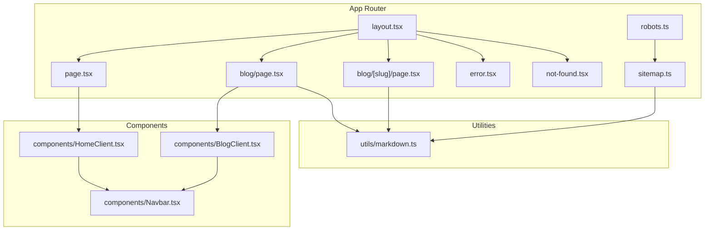
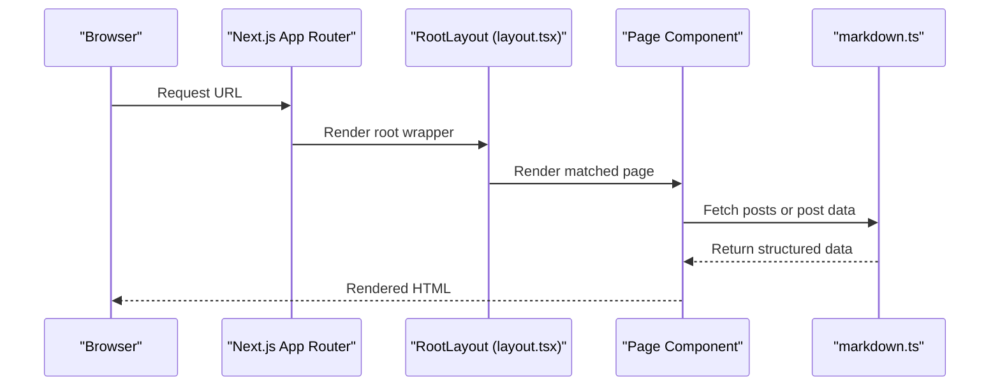
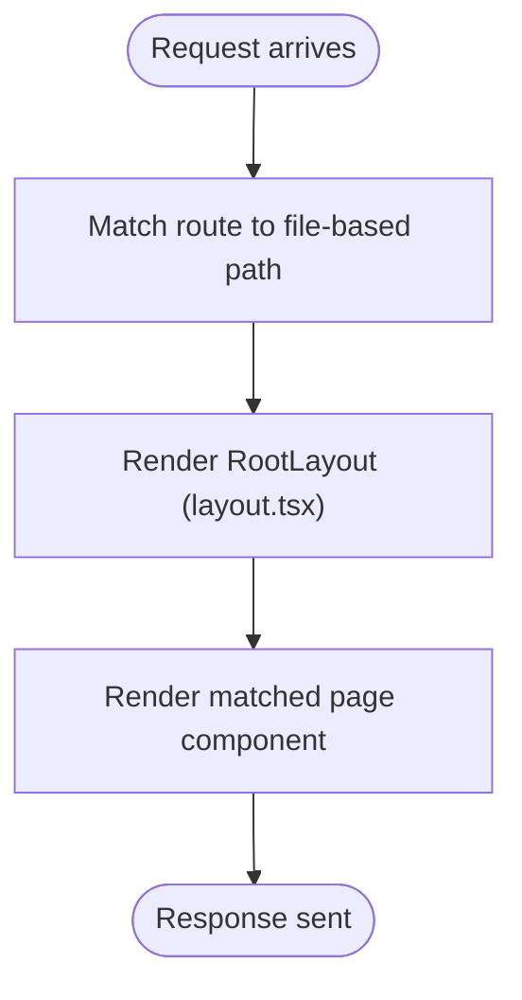
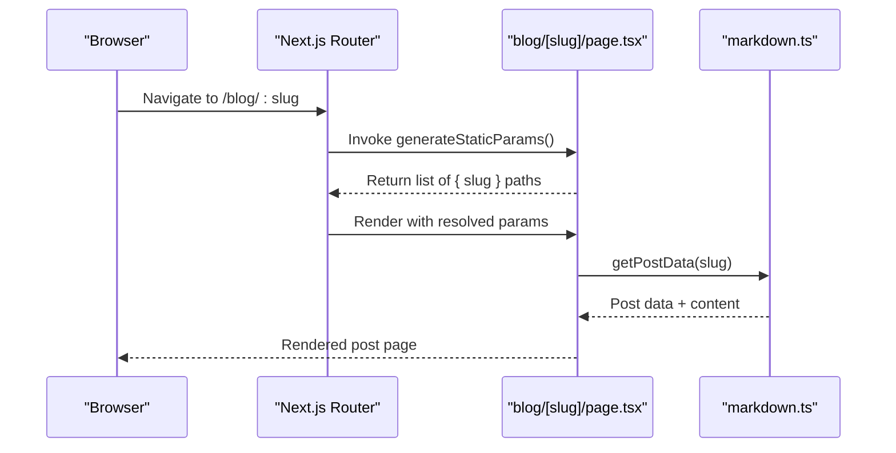
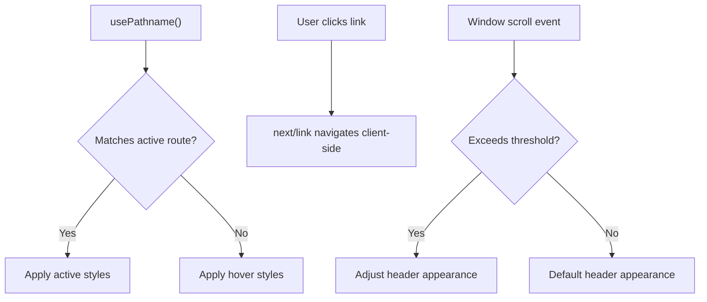
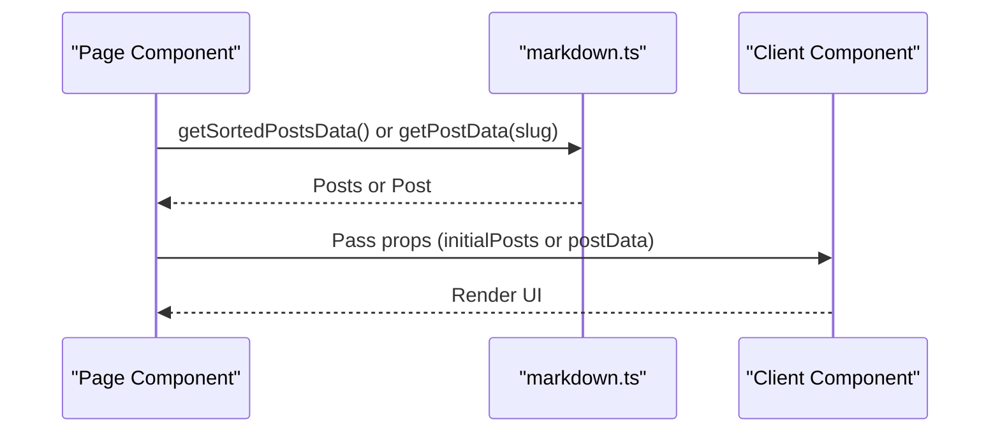
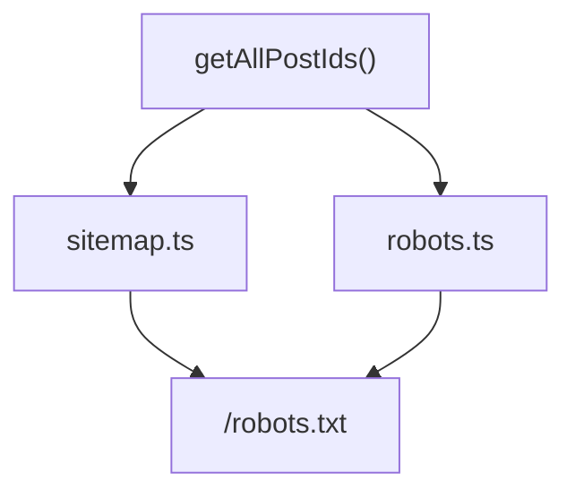
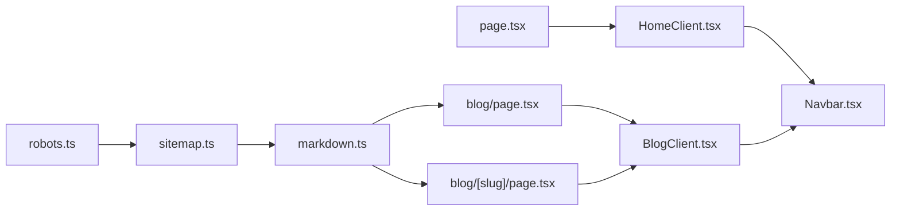

# Routing & Navigation System

<cite>
**Referenced Files in This Document**
- [layout.tsx](file://src/app/layout.tsx)
- [page.tsx](file://src/app/page.tsx)
- [blog/page.tsx](file://src/app/blog/page.tsx)
- [blog/[slug]/page.tsx](file://src/app/blog/[slug]/page.tsx)
- [sitemap.ts](file://src/app/sitemap.ts)
- [robots.ts](file://src/app/robots.ts)
- [markdown.ts](file://src/utils/markdown.ts)
- [Navbar.tsx](file://src/components/Navbar.tsx)
- [HomeClient.tsx](file://src/components/HomeClient.tsx)
- [BlogClient.tsx](file://src/components/BlogClient.tsx)
- [error.tsx](file://src/app/error.tsx)
- [not-found.tsx](file://src/app/not-found.tsx)
- [next.config.ts](file://next.config.ts)
- [package.json](file://package.json)
</cite>

## Table of Contents
1. [Introduction](#introduction)
2. [Project Structure](#project-structure)
3. [Core Components](#core-components)
4. [Architecture Overview](#architecture-overview)
5. [Detailed Component Analysis](#detailed-component-analysis)
6. [Dependency Analysis](#dependency-analysis)
7. [Performance Considerations](#performance-considerations)
8. [Troubleshooting Guide](#troubleshooting-guide)
9. [Conclusion](#conclusion)
10. [Appendices](#appendices)

## Introduction
This document explains the Next.js app router-based routing and navigation system used in the project. It covers file-based routing, dynamic routes for blog post slugs, URL-to-component rendering, layout wrapping, navigation state management, programmatic navigation, route parameters handling, SEO configuration (automatic sitemap and robots.txt), and how the navigation bar adapts to different routes.

## Project Structure
The routing follows Next.js file-based conventions under the src/app directory. Key routes include:
- Root page at src/app/page.tsx
- Blog listing at src/app/blog/page.tsx
- Dynamic blog post route at src/app/blog/[slug]/page.tsx
- Shared layout at src/app/layout.tsx
- Error and not-found handlers at src/app/error.tsx and src/app/not-found.tsx
- SEO assets at src/app/sitemap.ts and src/app/robots.ts
- Utilities for markdown parsing at src/utils/markdown.ts
- Client-side navigation components at src/components/Navbar.tsx, src/components/HomeClient.tsx, and src/components/BlogClient.tsx

**Diagram sources**
- [layout.tsx](file://src/app/layout.tsx)
- [page.tsx](file://src/app/page.tsx)
- [blog/page.tsx](file://src/app/blog/page.tsx)
- [blog/[slug]/page.tsx](file://src/app/blog/[slug]/page.tsx)
- [sitemap.ts](file://src/app/sitemap.ts)
- [robots.ts](file://src/app/robots.ts)
- [markdown.ts](file://src/utils/markdown.ts)
- [Navbar.tsx](file://src/components/Navbar.tsx)
- [HomeClient.tsx](file://src/components/HomeClient.tsx)
- [BlogClient.tsx](file://src/components/BlogClient.tsx)

**Section sources**
- [layout.tsx](file://src/app/layout.tsx)
- [page.tsx](file://src/app/page.tsx)
- [blog/page.tsx](file://src/app/blog/page.tsx)
- [blog/[slug]/page.tsx](file://src/app/blog/[slug]/page.tsx)
- [sitemap.ts](file://src/app/sitemap.ts)
- [robots.ts](file://src/app/robots.ts)
- [markdown.ts](file://src/utils/markdown.ts)
- [Navbar.tsx](file://src/components/Navbar.tsx)
- [HomeClient.tsx](file://src/components/HomeClient.tsx)
- [BlogClient.tsx](file://src/components/BlogClient.tsx)

## Core Components
- Root layout: Wraps all pages with shared UI (navigation, sidebar, footer) and global styles.
- Pages:
  - Home page fetches recent posts and renders client component.
  - Blog listing page fetches sorted posts and renders client component.
  - Dynamic blog post page resolves slug, generates static paths, and renders client component.
- Navigation bar: Uses path awareness to highlight active routes and supports responsive mobile menu.
- SEO assets: Sitemap and robots configuration generated from markdown post IDs.

**Section sources**
- [layout.tsx](file://src/app/layout.tsx)
- [page.tsx](file://src/app/page.tsx)
- [blog/page.tsx](file://src/app/blog/page.tsx)
- [blog/[slug]/page.tsx](file://src/app/blog/[slug]/page.tsx)
- [Navbar.tsx](file://src/components/Navbar.tsx)
- [sitemap.ts](file://src/app/sitemap.ts)
- [robots.ts](file://src/app/robots.ts)

## Architecture Overview
The routing system is file-based. Each route corresponds to a page.tsx file inside a folder. Dynamic segments are captured using square brackets. The layout.tsx acts as a root wrapper around all pages, injecting shared UI and global metadata.

**Diagram sources**
- [layout.tsx](file://src/app/layout.tsx)
- [page.tsx](file://src/app/page.tsx)
- [blog/page.tsx](file://src/app/blog/page.tsx)
- [blog/[slug]/page.tsx](file://src/app/blog/[slug]/page.tsx)
- [markdown.ts](file://src/utils/markdown.ts)

## Detailed Component Analysis

### File-Based Routing and Layout System
- Root layout injects Navbar, Sidebar, Footer, fonts, and global CSS. It also sets metadata at the root level.
- All pages render inside the layout’s children area, ensuring consistent header, navigation, and footer across routes.

**Diagram sources**
- [layout.tsx](file://src/app/layout.tsx)

**Section sources**
- [layout.tsx](file://src/app/layout.tsx)

### Dynamic Routes for Blog Post Slugs
- Dynamic route: src/app/blog/[slug]/page.tsx
- Static generation:
  - generateStaticParams builds a list of paths from getAllPostIds.
  - Each path maps to a slug segment.
- Runtime resolution:
  - The page awaits params to resolve the slug.
  - getPostData loads the post content and metadata from markdown.

**Diagram sources**
- [blog/[slug]/page.tsx](file://src/app/blog/[slug]/page.tsx)
- [markdown.ts](file://src/utils/markdown.ts)

**Section sources**
- [blog/[slug]/page.tsx](file://src/app/blog/[slug]/page.tsx)
- [markdown.ts](file://src/utils/markdown.ts)

### Navigation Bar and Route State
- The Navbar uses usePathname to detect the current route and applies active styles for desktop and mobile menus.
- It toggles a mobile menu state and reacts to scroll events to adjust styling.
- Links throughout the site use next/link for client-side navigation.

**Diagram sources**
- [Navbar.tsx](file://src/components/Navbar.tsx)

**Section sources**
- [Navbar.tsx](file://src/components/Navbar.tsx)

### Programmatic Navigation and Route Parameters
- Programmatic navigation:
  - next/link is used extensively in HomeClient and BlogClient to navigate between routes.
  - The Navbar demonstrates client-side navigation via next/link and state updates.
- Route parameters:
  - Dynamic slug is awaited from params in blog/[slug]/page.tsx.
  - getAllPostIds provides slug arrays for static generation.

**Section sources**
- [HomeClient.tsx](file://src/components/HomeClient.tsx)
- [BlogClient.tsx](file://src/components/BlogClient.tsx)
- [blog/[slug]/page.tsx](file://src/app/blog/[slug]/page.tsx)
- [markdown.ts](file://src/utils/markdown.ts)

### URL Routing to Component Rendering
- Home page:
  - Fetches recent posts and passes them to HomeClient.
- Blog listing:
  - Fetches sorted posts and passes them to BlogClient.
- Blog post:
  - Resolves slug, fetches post content, and renders BlogPostClient.

**Diagram sources**
- [page.tsx](file://src/app/page.tsx)
- [blog/page.tsx](file://src/app/blog/page.tsx)
- [blog/[slug]/page.tsx](file://src/app/blog/[slug]/page.tsx)
- [markdown.ts](file://src/utils/markdown.ts)
- [HomeClient.tsx](file://src/components/HomeClient.tsx)
- [BlogClient.tsx](file://src/components/BlogClient.tsx)

**Section sources**
- [page.tsx](file://src/app/page.tsx)
- [blog/page.tsx](file://src/app/blog/page.tsx)
- [blog/[slug]/page.tsx](file://src/app/blog/[slug]/page.tsx)
- [markdown.ts](file://src/utils/markdown.ts)
- [HomeClient.tsx](file://src/components/HomeClient.tsx)
- [BlogClient.tsx](file://src/components/BlogClient.tsx)

### Error Handling and Not Found Behavior
- Error boundary:
  - error.tsx is a client component that receives error and reset props, enabling recovery attempts.
- Not found:
  - not-found.tsx renders a friendly 404 page with a link back to home.

**Section sources**
- [error.tsx](file://src/app/error.tsx)
- [not-found.tsx](file://src/app/not-found.tsx)

### SEO: Sitemap and Robots
- Sitemap:
  - sitemap.ts enumerates posts via getAllPostIds and constructs URLs for each post and key pages.
- Robots:
  - robots.ts defines crawling rules and points to the generated sitemap.

**Diagram sources**
- [sitemap.ts](file://src/app/sitemap.ts)
- [robots.ts](file://src/app/robots.ts)
- [markdown.ts](file://src/utils/markdown.ts)

**Section sources**
- [sitemap.ts](file://src/app/sitemap.ts)
- [robots.ts](file://src/app/robots.ts)
- [markdown.ts](file://src/utils/markdown.ts)

## Dependency Analysis
- Pages depend on markdown utilities for content.
- Client components depend on pages for props and on Navbar for navigation.
- SEO assets depend on markdown utilities for post enumeration.

**Diagram sources**
- [markdown.ts](file://src/utils/markdown.ts)
- [blog/page.tsx](file://src/app/blog/page.tsx)
- [blog/[slug]/page.tsx](file://src/app/blog/[slug]/page.tsx)
- [BlogClient.tsx](file://src/components/BlogClient.tsx)
- [HomeClient.tsx](file://src/components/HomeClient.tsx)
- [Navbar.tsx](file://src/components/Navbar.tsx)
- [sitemap.ts](file://src/app/sitemap.ts)
- [robots.ts](file://src/app/robots.ts)

**Section sources**
- [markdown.ts](file://src/utils/markdown.ts)
- [blog/page.tsx](file://src/app/blog/page.tsx)
- [blog/[slug]/page.tsx](file://src/app/blog/[slug]/page.tsx)
- [BlogClient.tsx](file://src/components/BlogClient.tsx)
- [HomeClient.tsx](file://src/components/HomeClient.tsx)
- [Navbar.tsx](file://src/components/Navbar.tsx)
- [sitemap.ts](file://src/app/sitemap.ts)
- [robots.ts](file://src/app/robots.ts)

## Performance Considerations
- Static generation for blog posts:
  - generateStaticParams pre-builds routes for all posts, reducing server load and improving initial load times.
- Client-side navigation:
  - next/link enables fast client-side transitions without full page reloads.
- Minimal layout overhead:
  - Root layout is lightweight and only injects shared UI and fonts.

[No sources needed since this section provides general guidance]

## Troubleshooting Guide
- Dynamic route not rendering:
  - Verify generateStaticParams returns entries for each slug and that getAllPostIds matches file names.
- Missing content in blog post:
  - Ensure markdown files exist under content/posts with matching slugs and front matter.
- Navigation highlighting incorrect:
  - Confirm usePathname usage and active route comparisons in Navbar.
- Sitemap missing posts:
  - Ensure getAllPostIds reads the correct directory and returns params with slug keys.

**Section sources**
- [blog/[slug]/page.tsx](file://src/app/blog/[slug]/page.tsx)
- [markdown.ts](file://src/utils/markdown.ts)
- [Navbar.tsx](file://src/components/Navbar.tsx)
- [sitemap.ts](file://src/app/sitemap.ts)

## Conclusion
The routing system leverages Next.js file-based routing with a root layout wrapper, dynamic routes for blog slugs, and client-side navigation components. SEO is handled automatically via sitemap and robots configurations generated from markdown content. The Navbar adapts to active routes, and programmatic navigation is achieved through next/link.

[No sources needed since this section summarizes without analyzing specific files]

## Appendices

### Next.js Configuration and Dependencies
- next.config.ts is minimal; defaults apply.
- Dependencies include Next.js, React, remark ecosystem, gray-matter, and Tailwind-based styling.

**Section sources**
- [next.config.ts](file://next.config.ts)
- [package.json](file://package.json)