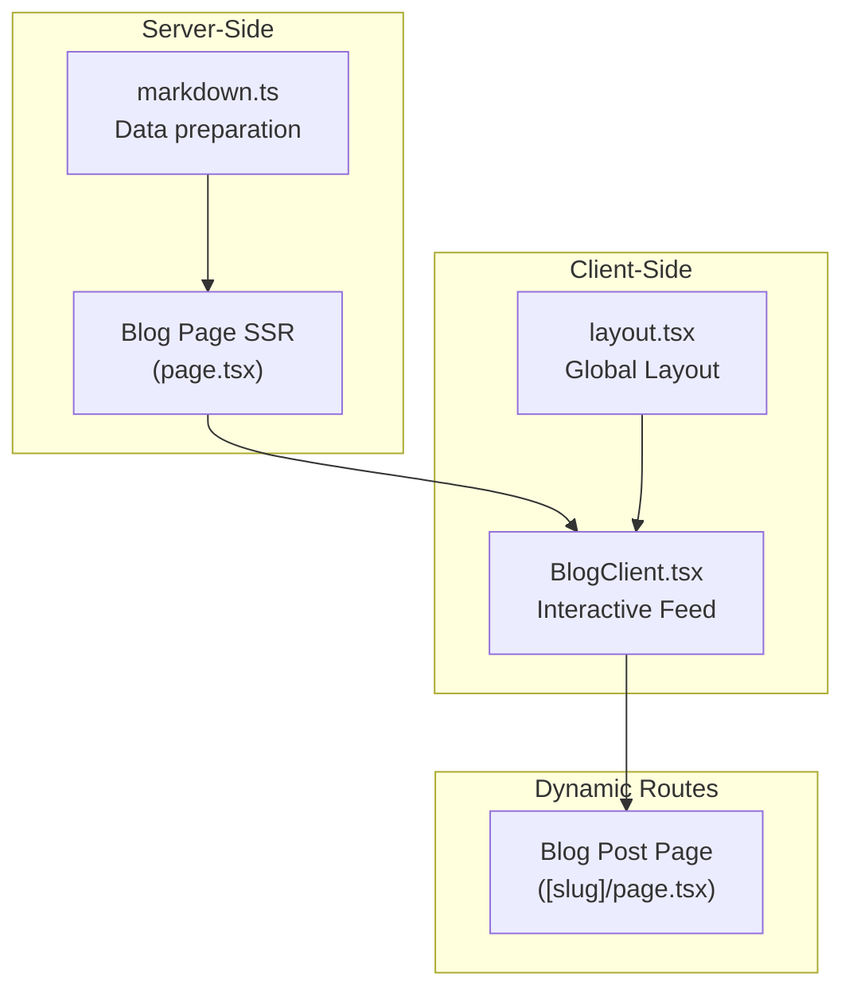
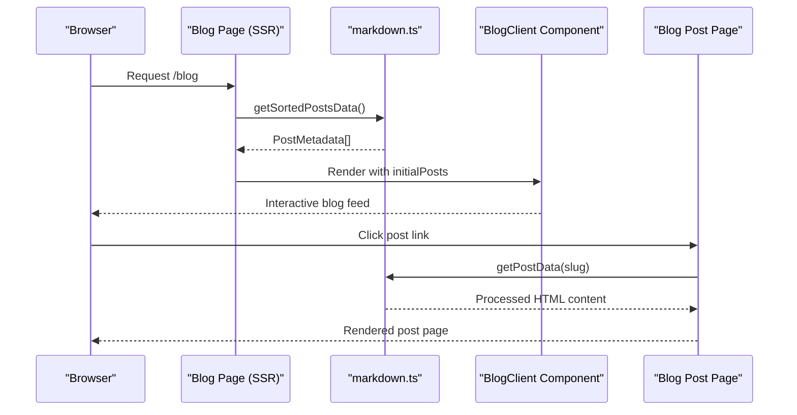
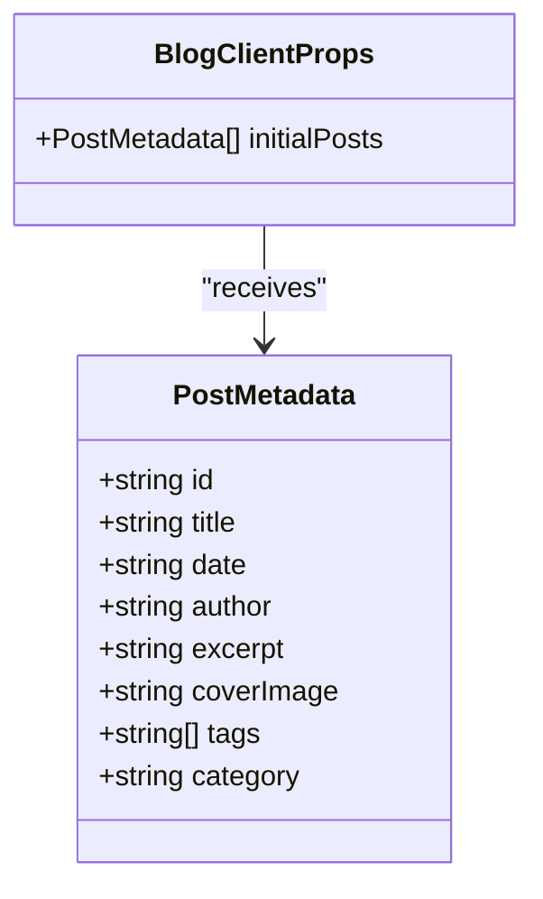
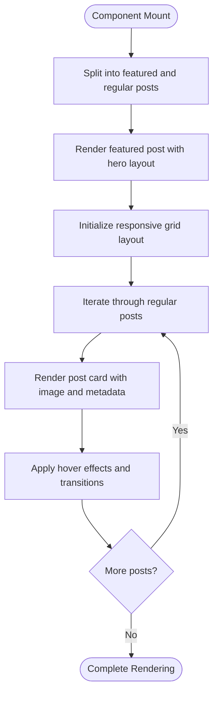
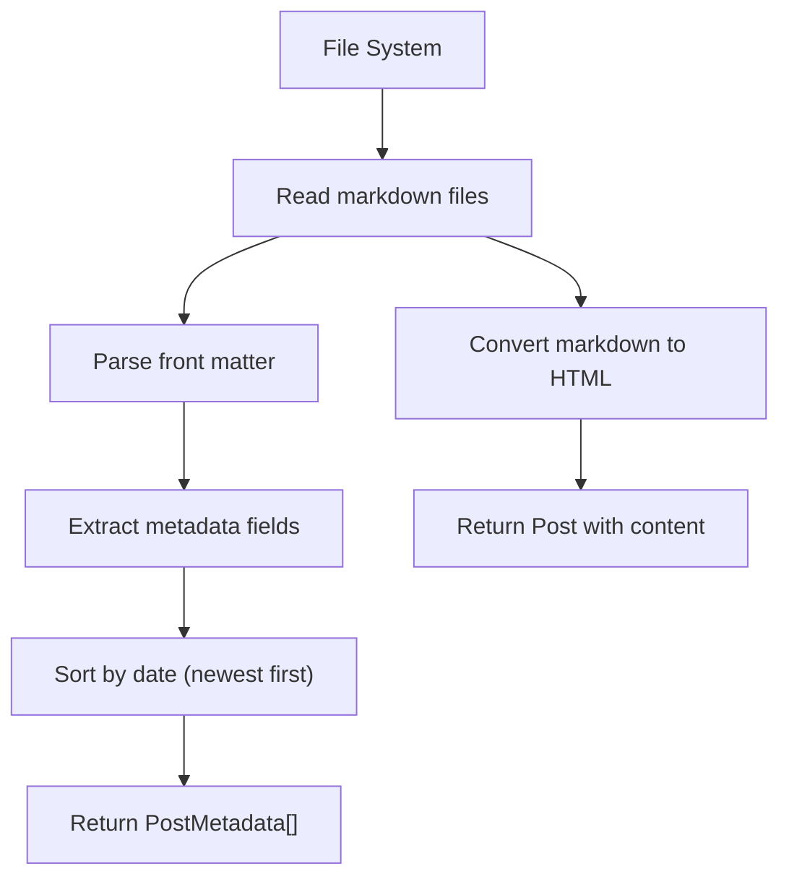
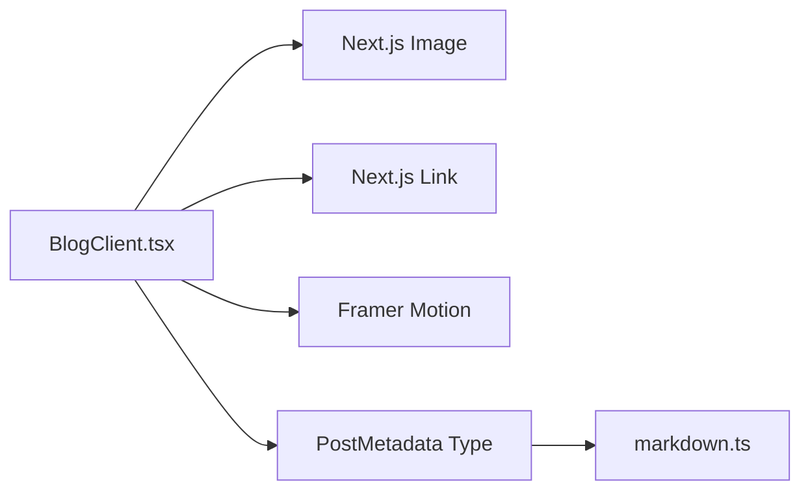

# BlogClient Component

<cite>
**Referenced Files in This Document**
- [BlogClient.tsx](file://src/components/BlogClient.tsx)
- [page.tsx](file://src/app/blog/page.tsx)
- [markdown.ts](file://src/utils/markdown.ts)
- [page.tsx](file://src/app/blog/[slug]/page.tsx)
- [layout.tsx](file://src/app/layout.tsx)
- [sitemap.ts](file://src/app/sitemap.ts)
</cite>

## Table of Contents
1. [Introduction](#introduction)
2. [Project Structure](#project-structure)
3. [Core Components](#core-components)
4. [Architecture Overview](#architecture-overview)
5. [Detailed Component Analysis](#detailed-component-analysis)
6. [Dependency Analysis](#dependency-analysis)
7. [Performance Considerations](#performance-considerations)
8. [Troubleshooting Guide](#troubleshooting-guide)
9. [Conclusion](#conclusion)

## Introduction
The BlogClient component is the interactive frontend for displaying blog post listings and managing user interactions such as post navigation, category exploration, and search functionality. It serves as the primary client-side renderer for the blog index page, organizing posts into a featured hero layout and a responsive grid of articles, while integrating with Next.js static generation and markdown processing utilities.

## Project Structure
The blog system follows a clear separation of concerns:
- Server-side data preparation in the markdown utility
- Static generation of the blog index page
- Client-side rendering of the blog feed with animations and interactive elements
- Dynamic routing for individual blog posts

**Diagram sources**
- [markdown.ts:40-77](file://src/utils/markdown.ts#L40-L77)
- [page.tsx:10-14](file://src/app/blog/page.tsx#L10-L14)
- [BlogClient.tsx:12-166](file://src/components/BlogClient.tsx#L12-L166)
- [layout.tsx:28-57](file://src/app/layout.tsx#L28-L57)
- [page.tsx:12-17](file://src/app/blog/[slug]/page.tsx#L12-L17)

**Section sources**
- [page.tsx:10-14](file://src/app/blog/page.tsx#L10-L14)
- [markdown.ts:40-77](file://src/utils/markdown.ts#L40-L77)
- [BlogClient.tsx:12-166](file://src/components/BlogClient.tsx#L12-L166)
- [layout.tsx:28-57](file://src/app/layout.tsx#L28-L57)

## Core Components
The BlogClient component manages:
- Featured post presentation with hero treatment
- Grid-based listing of regular posts
- Category display and filtering placeholders
- Search input area for archive queries
- Responsive layout with sidebar for additional navigation

Key responsibilities:
- Accepts pre-fetched post metadata from the server
- Renders animated transitions for improved UX
- Provides navigation links to individual post pages
- Maintains consistent typography and spacing using Tailwind classes

**Section sources**
- [BlogClient.tsx:8-166](file://src/components/BlogClient.tsx#L8-L166)

## Architecture Overview
The blog architecture combines server-side data fetching with client-side rendering:

**Diagram sources**
- [page.tsx:10-14](file://src/app/blog/page.tsx#L10-L14)
- [markdown.ts:40-77](file://src/utils/markdown.ts#L40-L77)
- [BlogClient.tsx:12-166](file://src/components/BlogClient.tsx#L12-L166)
- [page.tsx:12-17](file://src/app/blog/[slug]/page.tsx#L12-L17)
- [markdown.ts:79-107](file://src/utils/markdown.ts#L79-L107)

## Detailed Component Analysis

### Data Model and Props
The component expects a typed array of post metadata:
- Unique identifier for linking
- Title and excerpt for display
- Publication date for chronological ordering
- Optional cover image and category for visual grouping

**Diagram sources**
- [markdown.ts:9-22](file://src/utils/markdown.ts#L9-L22)
- [BlogClient.tsx:8-10](file://src/components/BlogClient.tsx#L8-L10)

**Section sources**
- [markdown.ts:9-22](file://src/utils/markdown.ts#L9-L22)
- [BlogClient.tsx:8-10](file://src/components/BlogClient.tsx#L8-L10)

### Rendering Pipeline
The component separates the first post as featured and renders the remainder in a responsive grid. Each article includes:
- Cover image with hover scaling effects
- Category and publication date badges
- Title with hover color transitions
- Excerpt with line clamping for readability

**Diagram sources**
- [BlogClient.tsx:12-115](file://src/components/BlogClient.tsx#L12-L115)

**Section sources**
- [BlogClient.tsx:12-115](file://src/components/BlogClient.tsx#L12-L115)

### Client-Side State Management
Current implementation:
- Uses props for initial post data
- No local state for filters or search
- Navigation handled via Next.js Link components

Recommended enhancements:
- Local state for search queries and category filters
- Pagination state for infinite scrolling
- Selected post tracking for focused views

**Section sources**
- [BlogClient.tsx:12-166](file://src/components/BlogClient.tsx#L12-L166)

### Integration with Markdown Processing
The server prepares post metadata and content:
- Reads markdown files from the content directory
- Extracts front matter for structured data
- Converts markdown content to HTML for individual posts
- Sorts posts by publication date

**Diagram sources**
- [markdown.ts:40-77](file://src/utils/markdown.ts#L40-L77)
- [markdown.ts:79-107](file://src/utils/markdown.ts#L79-L107)

**Section sources**
- [markdown.ts:40-77](file://src/utils/markdown.ts#L40-L77)
- [markdown.ts:79-107](file://src/utils/markdown.ts#L79-L107)

### Dynamic Content Rendering
Individual post pages process markdown to HTML:
- Uses remark pipeline with remark-html
- Returns structured Post object with processed content
- Enables embedding of rich content in blog posts

**Section sources**
- [markdown.ts:79-107](file://src/utils/markdown.ts#L79-L107)
- [page.tsx:12-17](file://src/app/blog/[slug]/page.tsx#L12-L17)

### Layout and Styling Integration
The component leverages:
- Global Tailwind classes for typography and spacing
- Motion animations for smooth entrance effects
- Responsive grid system for cross-device compatibility
- Material Symbols for visual indicators

**Section sources**
- [BlogClient.tsx:16-166](file://src/components/BlogClient.tsx#L16-L166)
- [layout.tsx:45-57](file://src/app/layout.tsx#L45-L57)

## Dependency Analysis
The component has minimal external dependencies:
- Next.js Image and Link for media and navigation
- Framer Motion for animations
- TypeScript interfaces from the markdown utility

**Diagram sources**
- [BlogClient.tsx:3-6](file://src/components/BlogClient.tsx#L3-L6)
- [markdown.ts:9-22](file://src/utils/markdown.ts#L9-L22)

**Section sources**
- [BlogClient.tsx:3-6](file://src/components/BlogClient.tsx#L3-L6)
- [markdown.ts:9-22](file://src/utils/markdown.ts#L9-L22)

## Performance Considerations
Current implementation characteristics:
- Server-side data fetching reduces client workload
- Static generation ensures fast initial loads
- Minimal JavaScript bundle for client-side interactions

Optimization opportunities:
- Implement virtualized lists for large post collections
- Add lazy loading for images using native loading="lazy"
- Introduce pagination or infinite scroll for better memory usage
- Cache frequently accessed post metadata
- Optimize animation performance with transform-based effects

**Section sources**
- [page.tsx:10-14](file://src/app/blog/page.tsx#L10-L14)
- [BlogClient.tsx:47-52](file://src/components/BlogClient.tsx#L47-L52)
- [BlogClient.tsx:92-98](file://src/components/BlogClient.tsx#L92-L98)

## Troubleshooting Guide
Common issues and resolutions:
- Empty content directory: The markdown utility gracefully returns empty arrays when the posts directory does not exist
- Missing post images: Conditional rendering prevents errors when coverImage is undefined
- Animation conflicts: Ensure Framer Motion is properly initialized in the global layout
- SEO considerations: Verify sitemap generation includes dynamic blog routes

**Section sources**
- [markdown.ts:24-28](file://src/utils/markdown.ts#L24-L28)
- [BlogClient.tsx:46-53](file://src/components/BlogClient.tsx#L46-L53)
- [layout.tsx:34-57](file://src/app/layout.tsx#L34-L57)
- [sitemap.ts:4-36](file://src/app/sitemap.ts#L4-L36)

## Conclusion
The BlogClient component provides an efficient foundation for interactive blog post listings. Its clean separation of server-side data preparation and client-side rendering enables scalable performance while maintaining rich user interactions. The component's modular design allows for straightforward enhancements to support advanced filtering, search capabilities, and pagination without compromising the existing architecture.