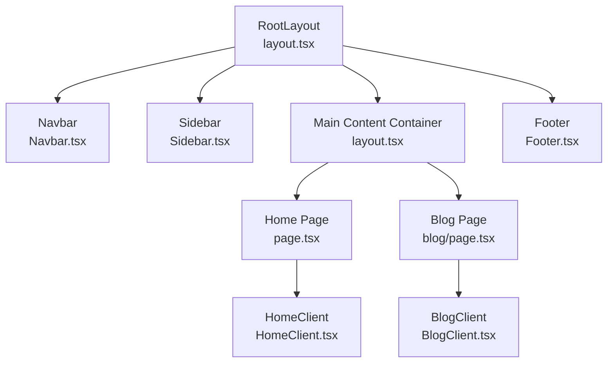
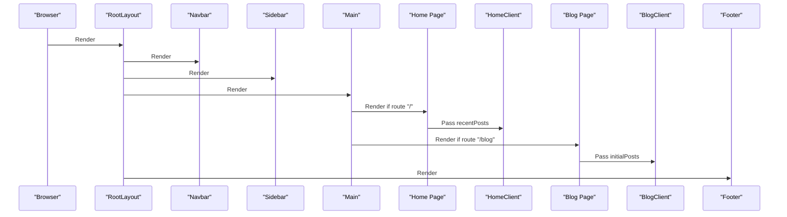
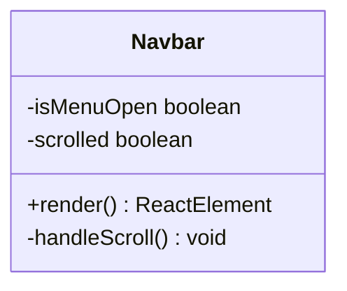
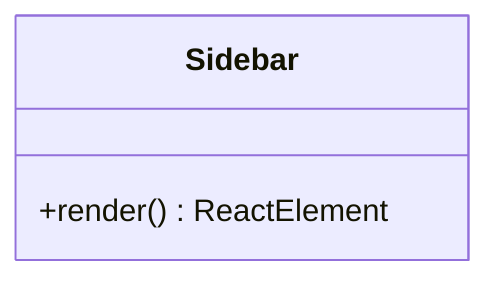
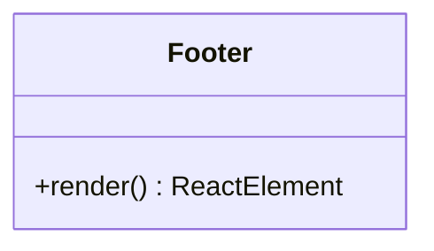
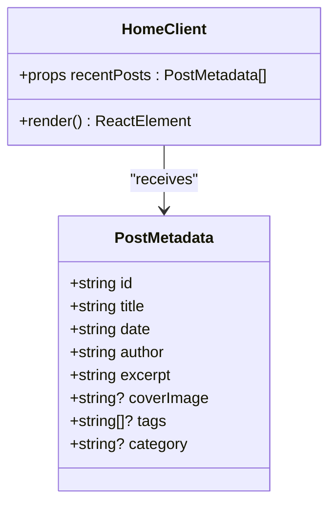
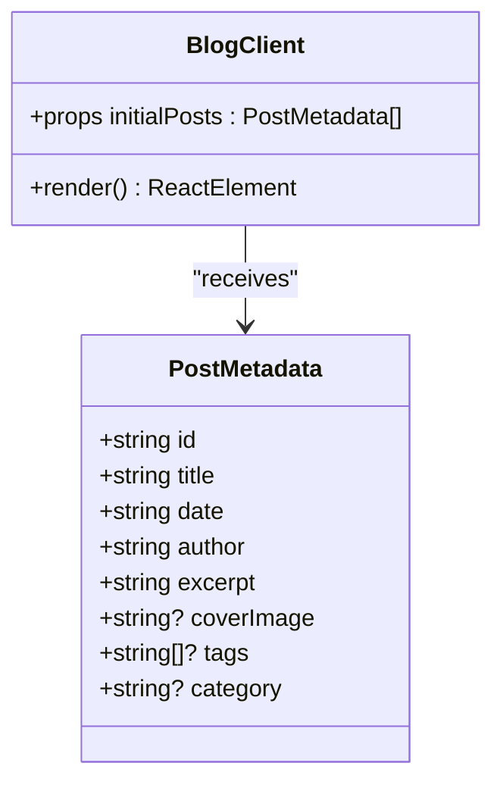
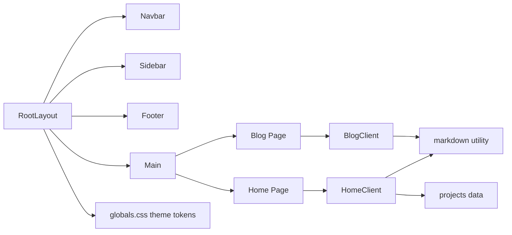

# Components & UI

<cite>
**Referenced Files in This Document**
- [Navbar.tsx](file://src/components/Navbar.tsx)
- [Sidebar.tsx](file://src/components/Sidebar.tsx)
- [Footer.tsx](file://src/components/Footer.tsx)
- [HomeClient.tsx](file://src/components/HomeClient.tsx)
- [BlogClient.tsx](file://src/components/BlogClient.tsx)
- [layout.tsx](file://src/app/layout.tsx)
- [globals.css](file://src/app/globals.css)
- [page.tsx](file://src/app/page.tsx)
- [blog/page.tsx](file://src/app/blog/page.tsx)
- [markdown.ts](file://src/utils/markdown.ts)
- [projects.ts](file://src/data/projects.ts)
- [useScrollAnimation.ts](file://src/hooks/useScrollAnimation.ts)
</cite>

## Table of Contents
1. [Introduction](#introduction)
2. [Project Structure](#project-structure)
3. [Core Components](#core-components)
4. [Architecture Overview](#architecture-overview)
5. [Detailed Component Analysis](#detailed-component-analysis)
6. [Dependency Analysis](#dependency-analysis)
7. [Performance Considerations](#performance-considerations)
8. [Troubleshooting Guide](#troubleshooting-guide)
9. [Conclusion](#conclusion)
10. [Appendices](#appendices)

## Introduction
This document describes the React component system powering the portfolio and blog platform. It focuses on the visual appearance, behavior, and user interaction patterns of the Navbar, Sidebar, Footer, HomeClient, and BlogClient components. It documents props, events, slots, customization options, responsive design, accessibility, animations/transitions, styling via Tailwind CSS, cross-browser compatibility, performance optimization, and component composition patterns.

## Project Structure
The application is structured around a shared layout that composes the global header, sidebar, and footer with page-specific content. The Navbar and Sidebar are rendered at the RootLayout level, while HomeClient and BlogClient render page-specific content.

**Diagram sources**
- [layout.tsx:28-57](file://src/app/layout.tsx#L28-L57)
- [page.tsx:10-14](file://src/app/page.tsx#L10-L14)
- [blog/page.tsx:10-14](file://src/app/blog/page.tsx#L10-L14)

**Section sources**
- [layout.tsx:28-57](file://src/app/layout.tsx#L28-L57)

## Core Components
This section summarizes the primary UI components and their roles.

- Navbar: Fixed header with desktop navigation, mobile overlay menu, and scroll-aware styling.
- Sidebar: Persistent left-side social links for GitHub and LinkedIn.
- Footer: Site footer with branding, links, and latency indicators.
- HomeClient: Hero, stats, selected projects, and recent blog posts feed for the home page.
- BlogClient: Blog hero, featured article, and a list of articles with a sidebar.

Key styling and theming:
- Tailwind CSS theme tokens define dark mode colors and typography families.
- Material Symbols icons are loaded globally for consistent iconography.
- Glass morphism and gradient effects are applied via Tailwind utilities and custom CSS.

**Section sources**
- [Navbar.tsx:7-139](file://src/components/Navbar.tsx#L7-L139)
- [Sidebar.tsx:4-19](file://src/components/Sidebar.tsx#L4-L19)
- [Footer.tsx:3-48](file://src/components/Footer.tsx#L3-L48)
- [HomeClient.tsx:12-211](file://src/components/HomeClient.tsx#L12-L211)
- [BlogClient.tsx:12-165](file://src/components/BlogClient.tsx#L12-L165)
- [globals.css:4-113](file://src/app/globals.css#L4-L113)

## Architecture Overview
The component architecture follows a top-down composition pattern:
- RootLayout composes Navbar, Sidebar, and Footer around a main content area.
- HomeClient receives recent posts from the server-side markdown utility.
- BlogClient receives sorted posts from the server-side markdown utility.
- Theming is centralized via Tailwind theme tokens and global CSS.

**Diagram sources**
- [layout.tsx:28-57](file://src/app/layout.tsx#L28-L57)
- [page.tsx:10-14](file://src/app/page.tsx#L10-L14)
- [blog/page.tsx:10-14](file://src/app/blog/page.tsx#L10-L14)

## Detailed Component Analysis

### Navbar
- Purpose: Fixed header with brand identity, desktop navigation, and a mobile overlay menu.
- Behavior:
  - Scroll-aware background change using a state flag derived from scroll position.
  - Mobile menu toggled via a button that controls overlay visibility and transforms.
  - Desktop navigation highlights the active route based on pathname.
- Props: None.
- Events: Click handlers for mobile menu toggle and navigation item clicks.
- Slots: Desktop nav and mobile overlay are separate render branches.
- Customization:
  - Adjust background blur and backdrop effect via Tailwind classes.
  - Modify active link styles by updating the active class logic.
  - Change transition timing or easing by editing duration and delay attributes.
- Accessibility:
  - Mobile menu button has a label-like affordance; consider adding aria-label for screen readers.
  - Ensure keyboard navigation is supported for desktop links.
- Responsive:
  - Desktop nav hides on small screens; mobile overlay appears below medium breakpoints.
- Animations/Transitions:
  - Smooth background and shadow transitions on scroll.
  - Overlay slide-in/out with staggered child item animations.
- Cross-browser:
  - Uses modern CSS features; ensure vendor prefixes are not required for backdrop-filter and gradient filters.
- Performance:
  - Scroll listener attached once; cleanup on unmount prevents memory leaks.

**Section sources**
- [Navbar.tsx:7-139](file://src/components/Navbar.tsx#L7-L139)

#### Navbar Class Model

**Diagram sources**
- [Navbar.tsx:7-139](file://src/components/Navbar.tsx#L7-L139)

### Sidebar
- Purpose: Persistent left-side column with social links.
- Behavior:
  - Fixed position aligned to the center vertically.
  - Hover effects animate icons and labels with transitions.
- Props: None.
- Events: Click handlers on anchor links.
- Slots: Social links are static.
- Customization:
  - Adjust blur radius, backdrop color, and border styles via Tailwind classes.
  - Change icon sizes and hover animation timing.
- Accessibility:
  - Links open in new tabs with rel="noopener noreferrer".
- Responsive:
  - Hidden on small screens; visible from large breakpoint.
- Animations/Transitions:
  - Hover-driven translation and opacity changes.
- Cross-browser:
  - Standard CSS transitions and transforms.
- Performance:
  - Stateless functional component; minimal re-renders.

**Section sources**
- [Sidebar.tsx:4-19](file://src/components/Sidebar.tsx#L4-L19)

#### Sidebar Class Model

**Diagram sources**
- [Sidebar.tsx:4-19](file://src/components/Sidebar.tsx#L4-L19)

### Footer
- Purpose: Site footer with branding, navigation links, and social profiles.
- Behavior:
  - Responsive layout adapts between stacked and horizontal arrangements.
  - Latency indicators shown conditionally by breakpoint.
- Props: None.
- Events: Click handlers on anchor links.
- Slots: Branding, links, and social icons are static.
- Customization:
  - Adjust typography, spacing, and colors via Tailwind classes.
  - Modify link hover effects and border styles.
- Accessibility:
  - Links open in new tabs with rel="noopener noreferrer" where applicable.
- Responsive:
  - Flex-direction changes at medium breakpoint; latency indicator hidden on small screens.
- Animations/Transitions:
  - Hover transitions on links and social icons.
- Cross-browser:
  - Uses standard flexbox and CSS transitions.
- Performance:
  - Stateless functional component.

**Section sources**
- [Footer.tsx:3-48](file://src/components/Footer.tsx#L3-L48)

#### Footer Class Model

**Diagram sources**
- [Footer.tsx:3-48](file://src/components/Footer.tsx#L3-L48)

### HomeClient
- Purpose: Home page client component rendering hero, stats, selected projects, and recent blog posts.
- Props:
  - recentPosts: Array of PostMetadata objects.
- Events: None (client component).
- Slots: Grid sections for hero, stats, projects, and blog feed.
- Customization:
  - Adjust grid layouts, card styles, and gradients via Tailwind classes.
  - Modify hover effects on cards and images.
- Accessibility:
  - Ensure alt texts for images and focus management on interactive elements.
- Responsive:
  - Responsive grids adapt across breakpoints; hero and stats sections adjust layout.
- Animations/Transitions:
  - Hover scaling and grayscale transitions on project and blog images.
  - Gradient and blur effects on hero terminal graphic.
- Cross-browser:
  - Uses modern CSS features; ensure fallbacks for older browsers if needed.
- Performance:
  - Limits displayed items to 3 for performance; consider virtualization for larger lists.

**Section sources**
- [HomeClient.tsx:8-211](file://src/components/HomeClient.tsx#L8-L211)
- [projects.ts:1-43](file://src/data/projects.ts#L1-L43)
- [markdown.ts:9-22](file://src/utils/markdown.ts#L9-L22)

#### HomeClient Class Model

**Diagram sources**
- [HomeClient.tsx:8-211](file://src/components/HomeClient.tsx#L8-L211)
- [markdown.ts:9-22](file://src/utils/markdown.ts#L9-L22)

### BlogClient
- Purpose: Blog page client component rendering a hero header, featured article, and a list of articles with a sidebar.
- Props:
  - initialPosts: Array of PostMetadata objects.
- Events: None (client component).
- Slots: Hero header, articles feed, and sidebar content.
- Customization:
  - Adjust grid columns, card layouts, and sidebar styles via Tailwind classes.
  - Customize search input and category chips.
- Accessibility:
  - Ensure focus management and readable contrast for category chips.
- Responsive:
  - Two-column layout on large screens; single column on smaller screens.
- Animations/Transitions:
  - Framer Motion animations for hero and article entries with staggered delays.
- Cross-browser:
  - Framer Motion requires modern browser support; ensure polyfills if targeting legacy browsers.
- Performance:
  - Limits displayed items to 3 for hero and feeds; consider pagination for larger lists.

**Section sources**
- [BlogClient.tsx:8-165](file://src/components/BlogClient.tsx#L8-L165)
- [markdown.ts:9-22](file://src/utils/markdown.ts#L9-L22)

#### BlogClient Class Model

**Diagram sources**
- [BlogClient.tsx:8-165](file://src/components/BlogClient.tsx#L8-L165)
- [markdown.ts:9-22](file://src/utils/markdown.ts#L9-L22)

## Dependency Analysis
- RootLayout composes Navbar, Sidebar, and Footer and passes children to the main content area.
- HomeClient depends on:
  - markdown utility for fetching sorted posts.
  - projects data for selected projects.
- BlogClient depends on:
  - markdown utility for fetching sorted posts.
- Theming:
  - Tailwind theme tokens define color and typography variables.
  - Global CSS defines glass morphism and pattern backgrounds.

**Diagram sources**
- [layout.tsx:28-57](file://src/app/layout.tsx#L28-L57)
- [page.tsx:10-14](file://src/app/page.tsx#L10-L14)
- [blog/page.tsx:10-14](file://src/app/blog/page.tsx#L10-L14)
- [markdown.ts:40-77](file://src/utils/markdown.ts#L40-L77)
- [projects.ts:1-43](file://src/data/projects.ts#L1-L43)
- [globals.css:4-113](file://src/app/globals.css#L4-L113)

**Section sources**
- [layout.tsx:28-57](file://src/app/layout.tsx#L28-L57)
- [markdown.ts:40-77](file://src/utils/markdown.ts#L40-L77)
- [projects.ts:1-43](file://src/data/projects.ts#L1-L43)
- [globals.css:4-113](file://src/app/globals.css#L4-L113)

## Performance Considerations
- Client components:
  - Navbar attaches a scroll event listener; ensure cleanup on unmount to prevent memory leaks.
  - HomeClient and BlogClient limit displayed items to reduce DOM size.
- Images:
  - Next.js Image component is used for responsive and optimized images.
- Animations:
  - Framer Motion animations are used selectively; consider disabling on reduced motion preferences.
- Theming:
  - Centralized theme tokens minimize CSS overrides and improve maintainability.
- Rendering:
  - Static pages with client components keep server-side rendering efficient.

[No sources needed since this section provides general guidance]

## Troubleshooting Guide
- Navbar scroll effect not triggering:
  - Verify the scroll listener is attached and cleaned up on unmount.
  - Ensure the component is mounted on the client.
- Mobile menu not closing:
  - Confirm the click handler updates the menu state and closes the overlay.
- BlogClient animations not appearing:
  - Ensure Framer Motion is installed and configured.
  - Check that the component runs on the client.
- Theming inconsistencies:
  - Verify Tailwind theme tokens are defined and used consistently.
  - Confirm global CSS is included in the layout.

**Section sources**
- [Navbar.tsx:12-18](file://src/components/Navbar.tsx#L12-L18)
- [BlogClient.tsx:12-165](file://src/components/BlogClient.tsx#L12-L165)
- [globals.css:4-113](file://src/app/globals.css#L4-L113)

## Conclusion
The component system integrates a cohesive, responsive, and visually consistent UI across the portfolio and blog. Navbar, Sidebar, and Footer establish a strong foundation, while HomeClient and BlogClient deliver rich, interactive experiences with thoughtful animations and performance considerations. Tailwind CSS and centralized theming enable easy customization and accessibility compliance.

[No sources needed since this section summarizes without analyzing specific files]

## Appendices

### Theming and Style Customization
- Color tokens:
  - Primary, secondary, surface, background, and on-surface variants are defined in theme tokens.
- Typography:
  - Headline, body, and mono fonts are configured via CSS variables.
- Utility classes:
  - Glass morphism, grid patterns, and tonal layering are provided via global CSS.
- Customization tips:
  - Override color tokens to change the overall palette.
  - Adjust font variables to modify typography family.
  - Extend utility classes for additional effects.

**Section sources**
- [globals.css:4-113](file://src/app/globals.css#L4-L113)

### Accessibility Guidelines
- Focus management:
  - Ensure keyboard navigable menus and links.
- Contrast:
  - Maintain sufficient contrast for text and interactive elements.
- ARIA:
  - Add labels and roles where implicit semantics are insufficient.
- Reduced motion:
  - Respect prefers-reduced-motion and disable heavy animations.

[No sources needed since this section provides general guidance]

### Responsive Design Patterns
- Breakpoints:
  - Components adapt using Tailwind’s responsive modifiers (e.g., md:, lg:).
- Layouts:
  - Grid and flex layouts adjust across breakpoints for optimal readability.
- Media:
  - Next.js Image handles responsive sizing and optimization.

**Section sources**
- [Navbar.tsx:28-53](file://src/components/Navbar.tsx#L28-L53)
- [HomeClient.tsx:129-163](file://src/components/HomeClient.tsx#L129-L163)
- [BlogClient.tsx:33-116](file://src/components/BlogClient.tsx#L33-L116)

### Component Composition Patterns
- RootLayout composes global UI elements and delegates content to page components.
- Page components fetch data and pass it to client components.
- Client components encapsulate UI logic and animations.

**Section sources**
- [layout.tsx:28-57](file://src/app/layout.tsx#L28-L57)
- [page.tsx:10-14](file://src/app/page.tsx#L10-L14)
- [blog/page.tsx:10-14](file://src/app/blog/page.tsx#L10-L14)