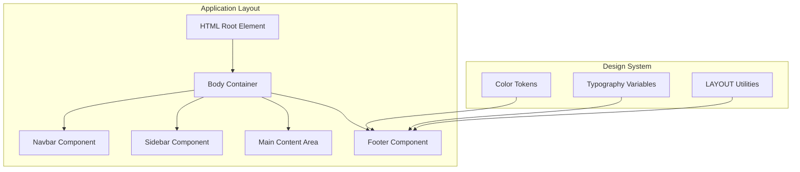
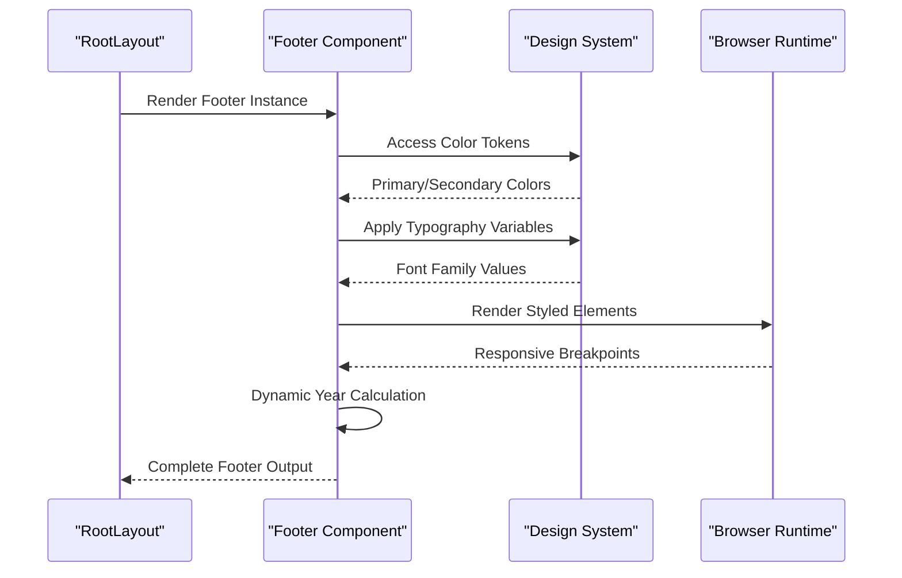
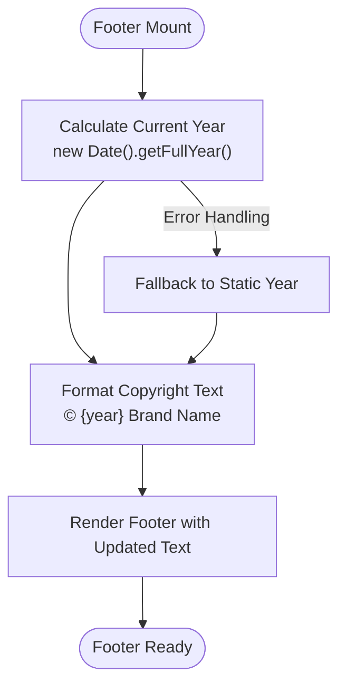
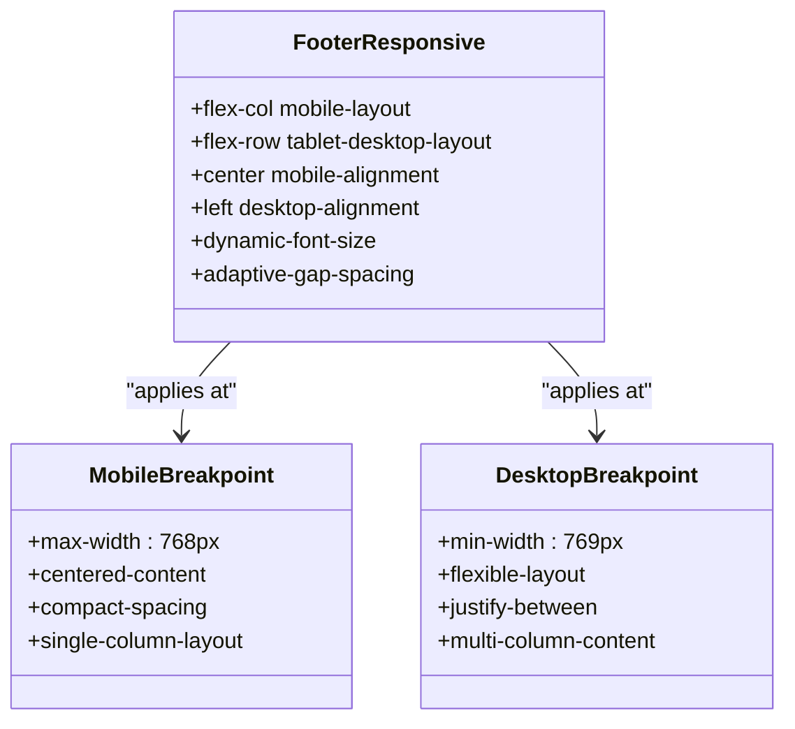
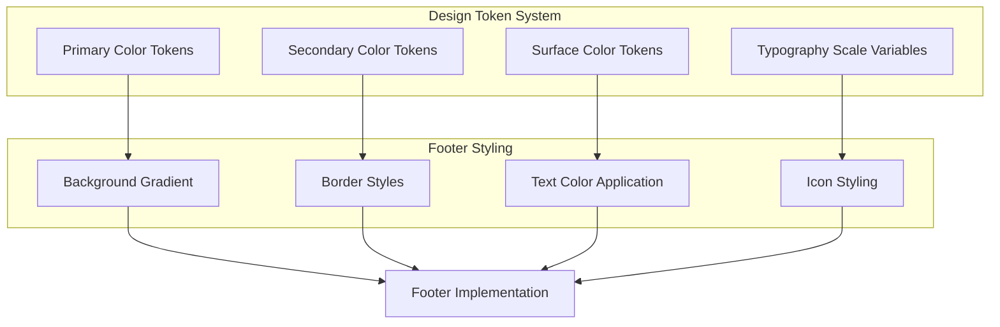
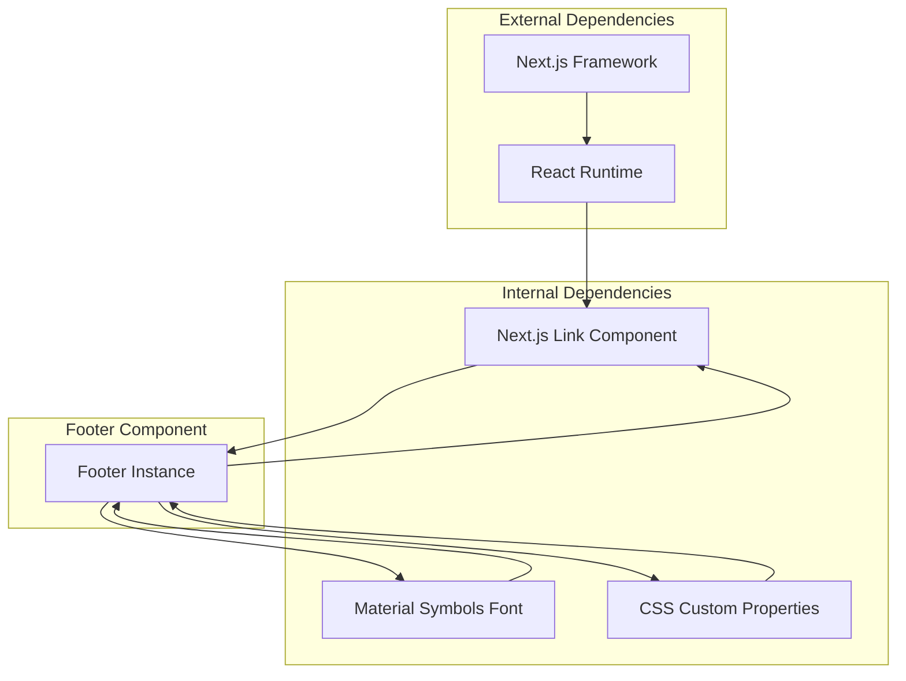

# Footer Component

<cite>
**Referenced Files in This Document**
- [Footer.tsx](file://src/components/Footer.tsx)
- [layout.tsx](file://src/app/layout.tsx)
- [globals.css](file://src/app/globals.css)
- [Navbar.tsx](file://src/components/Navbar.tsx)
- [Sidebar.tsx](file://src/components/Sidebar.tsx)
- [robots.ts](file://src/app/robots.ts)
- [sitemap.ts](file://src/app/sitemap.ts)
</cite>

## Table of Contents
1. [Introduction](#introduction)
2. [Project Structure](#project-structure)
3. [Core Components](#core-components)
4. [Architecture Overview](#architecture-overview)
5. [Detailed Component Analysis](#detailed-component-analysis)
6. [Dependency Analysis](#dependency-analysis)
7. [Performance Considerations](#performance-considerations)
8. [Troubleshooting Guide](#troubleshooting-guide)
9. [Conclusion](#conclusion)

## Introduction
The Footer component serves as a centralized hub for copyright information, legal navigation, and social media integration across all pages of the website. It maintains consistent branding through standardized typography, color schemes, and layout patterns while providing essential legal compliance elements such as privacy policy links and source code repositories. The component dynamically calculates copyright years and integrates seamlessly with the overall design system through shared color tokens and typography variables.

## Project Structure
The Footer component is strategically positioned within the application's layout architecture, appearing consistently across all pages through the RootLayout wrapper. This placement ensures uniform presentation and accessibility of legal information regardless of the user's location within the site.



**Diagram sources**
- [layout.tsx:28-57](file://src/app/layout.tsx#L28-L57)
- [Footer.tsx:3-48](file://src/components/Footer.tsx#L3-L48)

**Section sources**
- [layout.tsx:28-57](file://src/app/layout.tsx#L28-L57)
- [Footer.tsx:3-48](file://src/components/Footer.tsx#L3-L48)

## Core Components
The Footer component consists of three primary functional areas that work together to provide comprehensive legal and navigational support:

### Copyright Information Block
The left-side copyright section establishes brand identity through consistent typography and dynamic content updates. It displays the creator's name, a decorative separator element, and a copyright notice with automatically calculated year.

### Legal Navigation Links
The center navigation area provides essential legal and informational links including source code repository access, documentation resources, and privacy policy references. These links guide users to important legal documents and development resources.

### Social Media Integration
The right-side social media section offers direct access to external platforms through styled circular buttons containing Material Symbols icons. This integration maintains visual consistency with the overall design system while providing clear pathways to social profiles.

**Section sources**
- [Footer.tsx:5-44](file://src/components/Footer.tsx#L5-L44)

## Architecture Overview
The Footer component participates in a cohesive design system that spans multiple application layers, from global styling to component-specific implementations.



**Diagram sources**
- [layout.tsx:53](file://src/app/layout.tsx#L53)
- [Footer.tsx:10](file://src/components/Footer.tsx#L10)
- [globals.css:4-66](file://src/app/globals.css#L4-L66)

## Detailed Component Analysis

### Copyright Year Calculation and Dynamic Updates
The Footer implements automatic copyright year calculation through JavaScript's Date object, ensuring the displayed year remains current without manual intervention. This dynamic approach eliminates the risk of outdated copyright notices while maintaining consistent branding across all pages.



**Diagram sources**
- [Footer.tsx:10](file://src/components/Footer.tsx#L10)

### Responsive Behavior and Layout Adaptations
The Footer demonstrates sophisticated responsive design patterns that adapt content presentation based on screen size breakpoints. Mobile-first design principles ensure optimal readability and usability across all device categories.



**Diagram sources**
- [Footer.tsx:6](file://src/components/Footer.tsx#L6)

### Social Media Integration Patterns
The Footer incorporates external social media links through standardized Next.js Link components with appropriate security attributes. This implementation ensures proper cross-origin handling while maintaining visual consistency with the design system.

```mermaid
graph LR
subgraph "Social Media Integration"
GitHub[GitHub Profile Link]
LinkedIn[LinkedIn Profile Link]
Email[Contact Form Link]
end
subgraph "Security Attributes"
TargetBlank[target="_blank"]
NoOpener[rel="noopener noreferrer"]
end
subgraph "Visual Consistency"
CircularButtons[Round Button Design]
MaterialSymbols[Material Symbols Icons]
HoverEffects[Primary Color Transitions]
end
GitHub --> TargetBlank
GitHub --> NoOpener
LinkedIn --> TargetBlank
LinkedIn --> NoOpener
Email --> CircularButtons
Email --> MaterialSymbols
Email --> HoverEffects
```

**Diagram sources**
- [Footer.tsx:25-32](file://src/components/Footer.tsx#L25-L32)

**Section sources**
- [Footer.tsx:3-48](file://src/components/Footer.tsx#L3-L48)

### Styling System Integration
The Footer component leverages the application's comprehensive design token system, accessing color variables and typography scales through CSS custom properties. This integration ensures consistent visual presentation across all components while maintaining design flexibility.



**Diagram sources**
- [globals.css:4-66](file://src/app/globals.css#L4-L66)
- [Footer.tsx:5](file://src/components/Footer.tsx#L5)

**Section sources**
- [Footer.tsx:5-44](file://src/components/Footer.tsx#L5-L44)
- [globals.css:4-66](file://src/app/globals.css#L4-L66)

## Dependency Analysis
The Footer component maintains minimal external dependencies while integrating deeply with the application's design infrastructure and routing system.



**Diagram sources**
- [Footer.tsx:1](file://src/components/Footer.tsx#L1)
- [layout.tsx:4-5](file://src/app/layout.tsx#L4-L5)

**Section sources**
- [Footer.tsx:1](file://src/components/Footer.tsx#L1)
- [layout.tsx:4-5](file://src/app/layout.tsx#L4-L5)

## Performance Considerations
The Footer component is designed with performance optimization in mind, utilizing lightweight rendering patterns and efficient CSS properties. Its static nature and minimal re-render requirements contribute positively to overall page performance while providing essential user interface elements.

Key performance characteristics include:
- Stateless component rendering
- Minimal DOM manipulation requirements
- Efficient CSS property animations
- Optimized font loading through Google Fonts integration
- Responsive design that reduces layout thrashing

## Troubleshooting Guide
Common issues and solutions for the Footer component:

### Copyright Year Not Updating
**Issue**: Copyright year displays incorrectly or fails to update
**Solution**: Verify JavaScript execution environment and Date object availability

### Social Media Links Not Opening
**Issue**: External links fail to open in new tabs
**Solution**: Ensure target="_blank" and rel="noopener noreferrer" attributes are properly applied

### Styling Inconsistencies
**Issue**: Footer colors or typography appear incorrect
**Solution**: Verify CSS custom property definitions and design token availability

### Responsive Layout Problems
**Issue**: Footer layout breaks on specific screen sizes
**Solution**: Review breakpoint configurations and flexbox properties

**Section sources**
- [Footer.tsx:10](file://src/components/Footer.tsx#L10)
- [Footer.tsx:14](file://src/components/Footer.tsx#L14)
- [Footer.tsx:26](file://src/components/Footer.tsx#L26)

## Conclusion
The Footer component exemplifies modern web development practices through its integration of dynamic content generation, responsive design patterns, and comprehensive design system adherence. Its strategic placement within the application layout ensures consistent user experience while providing essential legal and navigational functionality. The component's thoughtful implementation of accessibility considerations, performance optimizations, and maintainable code structure positions it as a robust foundation for the application's user interface ecosystem.

The Footer's contribution to SEO extends beyond basic semantic markup through its integration with the site's structured content architecture, including sitemap generation and robots.txt configuration. This holistic approach to web presence ensures that the Footer component serves not only as a visual element but as a crucial component of the overall digital experience strategy.