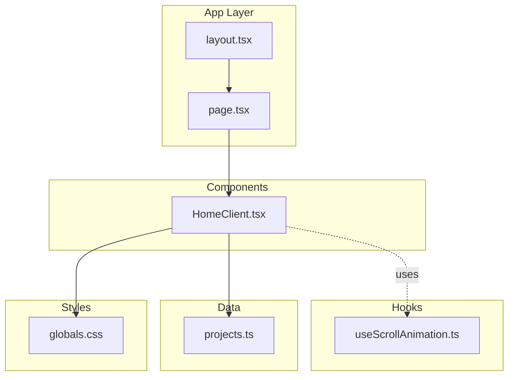
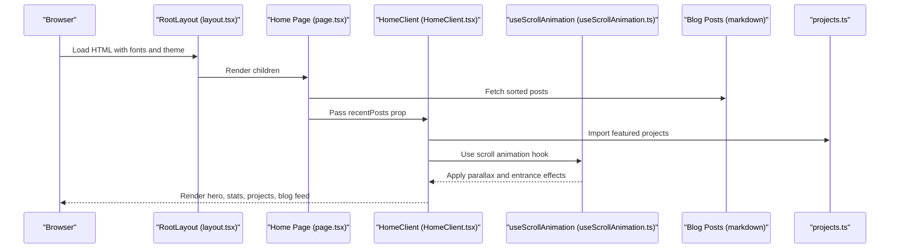
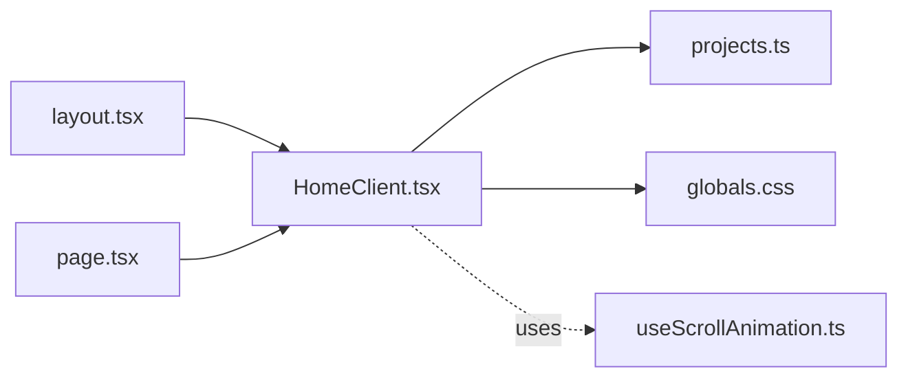

# HomeClient Component

<cite>
**Referenced Files in This Document**
- [HomeClient.tsx](file://src/components/HomeClient.tsx)
- [useScrollAnimation.ts](file://src/hooks/useScrollAnimation.ts)
- [layout.tsx](file://src/app/layout.tsx)
- [page.tsx](file://src/app/page.tsx)
- [projects.ts](file://src/data/projects.ts)
- [globals.css](file://src/app/globals.css)
- [package.json](file://package.json)
</cite>

## Table of Contents
1. [Introduction](#introduction)
2. [Project Structure](#project-structure)
3. [Core Components](#core-components)
4. [Architecture Overview](#architecture-overview)
5. [Detailed Component Analysis](#detailed-component-analysis)
6. [Dependency Analysis](#dependency-analysis)
7. [Performance Considerations](#performance-considerations)
8. [Troubleshooting Guide](#troubleshooting-guide)
9. [Conclusion](#conclusion)

## Introduction
The HomeClient component serves as the interactive presentation layer for the homepage, delivering an engaging hero experience with animated text effects and call-to-action buttons. It showcases featured projects, integrates a scroll animation system for parallax effects and entrance animations, and establishes visual hierarchy across the landing page. This document explains how the component orchestrates these experiences, how it integrates with the broader layout system, and how to customize hero content, animation timing, and interactive elements while maintaining performance and responsive design.

## Project Structure
The HomeClient component resides within the components directory and is rendered by the root page. It leverages shared data, global styles, and a dedicated scroll animation hook for dynamic effects.

**Diagram sources**
- [layout.tsx:28-57](file://src/app/layout.tsx#L28-L57)
- [page.tsx:10-14](file://src/app/page.tsx#L10-L14)
- [HomeClient.tsx:12-212](file://src/components/HomeClient.tsx#L12-L212)
- [useScrollAnimation.ts:5-50](file://src/hooks/useScrollAnimation.ts#L5-L50)
- [projects.ts:1-43](file://src/data/projects.ts#L1-L43)
- [globals.css:1-113](file://src/app/globals.css#L1-L113)

**Section sources**
- [layout.tsx:28-57](file://src/app/layout.tsx#L28-L57)
- [page.tsx:10-14](file://src/app/page.tsx#L10-L14)
- [HomeClient.tsx:12-212](file://src/components/HomeClient.tsx#L12-L212)
- [useScrollAnimation.ts:5-50](file://src/hooks/useScrollAnimation.ts#L5-L50)
- [projects.ts:1-43](file://src/data/projects.ts#L1-L43)
- [globals.css:1-113](file://src/app/globals.css#L1-L113)

## Core Components
- HomeClient: Renders the hero section with animated text, call-to-action buttons, stats, featured projects, and recent blog posts. It slices recent posts and projects to display a curated subset.
- useScrollAnimation: Provides scroll-driven animations via DOM queries for elements marked with specific classes, enabling parallax backgrounds and entrance animations.
- layout.tsx: Wraps the page with global fonts, theme classes, navigation, and footer, ensuring consistent spacing and typography.
- page.tsx: Fetches blog post metadata and passes it to HomeClient as props.
- projects.ts: Supplies project data for the featured projects section.
- globals.css: Defines theme tokens, typography variables, and reusable utility classes for glass panels, grid patterns, and transitions.

Key responsibilities:
- Hero content delivery with gradient text and animated terminal graphic.
- Interactive call-to-action buttons with hover states and icons.
- Visual hierarchy through typography scales, spacing, and color accents.
- Scroll animation integration for parallax and entrance effects.
- Responsive design using Tailwind-based grid layouts and breakpoints.

**Section sources**
- [HomeClient.tsx:12-212](file://src/components/HomeClient.tsx#L12-L212)
- [useScrollAnimation.ts:5-50](file://src/hooks/useScrollAnimation.ts#L5-L50)
- [layout.tsx:28-57](file://src/app/layout.tsx#L28-L57)
- [page.tsx:10-14](file://src/app/page.tsx#L10-L14)
- [projects.ts:1-43](file://src/data/projects.ts#L1-L43)
- [globals.css:1-113](file://src/app/globals.css#L1-L113)

## Architecture Overview
The homepage rendering pipeline connects the root page to the HomeClient component, which composes multiple sections and integrates with the scroll animation hook for dynamic effects. The layout system provides global styling and navigation context.

**Diagram sources**
- [layout.tsx:28-57](file://src/app/layout.tsx#L28-L57)
- [page.tsx:10-14](file://src/app/page.tsx#L10-L14)
- [HomeClient.tsx:12-212](file://src/components/HomeClient.tsx#L12-L212)
- [useScrollAnimation.ts:5-50](file://src/hooks/useScrollAnimation.ts#L5-L50)
- [projects.ts:1-43](file://src/data/projects.ts#L1-L43)

## Detailed Component Analysis

### Hero Section and Animated Text Effects
The hero section establishes visual impact through:
- Gradient text for headline emphasis.
- Animated terminal graphic with pulsing cursor and code-like content.
- Status indicator with animated pulse effect.
- Call-to-action buttons with hover effects and icons.

Customization examples:
- Modify gradient colors by adjusting the gradient classes applied to the headline.
- Adjust button sizes and hover effects by editing padding, border, and transition classes.
- Change icon usage by replacing material symbols with alternative icons or adding new ones.

Entrance animations:
- The hero content relies on the scroll animation hook to reveal elements when scrolled into view. Elements with the class used by the hook become visible upon crossing the viewport threshold.

Parallax integration:
- Parallax classes for background and content elements are processed by the hook to create layered motion during scroll.

**Section sources**
- [HomeClient.tsx:22-97](file://src/components/HomeClient.tsx#L22-L97)
- [useScrollAnimation.ts:22-37](file://src/hooks/useScrollAnimation.ts#L22-L37)

### Scroll Animation System Integration
The useScrollAnimation hook manages two primary effects:
- Entrance animations: Adds a visibility class to elements when they enter the viewport.
- Parallax effects: Applies transform translations to background and content elements at different speeds for depth perception.

Integration steps:
- Add the hook in HomeClient to initialize scroll listeners and apply initial checks.
- Tag elements with the appropriate classes so the hook can target them for animations.
- Tune scroll offsets and transform multipliers to balance responsiveness and perceived motion.

Performance considerations:
- Debounce or throttle scroll handlers if extending the hook to avoid excessive reflows.
- Limit DOM queries to essential elements and reuse selectors efficiently.

**Section sources**
- [useScrollAnimation.ts:5-50](file://src/hooks/useScrollAnimation.ts#L5-L50)
- [HomeClient.tsx:12-212](file://src/components/HomeClient.tsx#L12-L212)

### Featured Projects Showcase
The component renders a grid of featured projects with:
- Project thumbnails with hover scaling and grayscale transitions.
- Overlay gradients and technology tags.
- Hover states that reveal subtle indicators and micro-interactions.

Customization examples:
- Adjust the number of displayed projects by changing the slice bounds.
- Modify hover behaviors by editing transition durations and transforms.
- Update technology tag limits to reflect project complexity.

**Section sources**
- [HomeClient.tsx:117-164](file://src/components/HomeClient.tsx#L117-L164)
- [projects.ts:1-43](file://src/data/projects.ts#L1-L43)

### Blog Feed Integration
The recent blog posts are presented with:
- Cover images with hover transitions.
- Clean typography hierarchy for dates, titles, and excerpts.
- Hover-driven directional indicators.

Customization examples:
- Increase or decrease the number of displayed posts by adjusting the slice range.
- Modify date formatting by updating the date parsing logic.
- Enhance readability by adjusting line clamp values and font sizes.

**Section sources**
- [HomeClient.tsx:166-208](file://src/components/HomeClient.tsx#L166-L208)

### Stats Section and Visual Hierarchy
The stats section communicates professional metrics with:
- Left-border accents and hover transitions.
- Large numeric values with consistent typography.
- Hover effects that emphasize key metrics.

Customization examples:
- Replace stat values with dynamic data sources.
- Adjust border accent colors to align with brand themes.
- Modify hover transitions to match overall animation timing.

**Section sources**
- [HomeClient.tsx:99-115](file://src/components/HomeClient.tsx#L99-L115)

### Layout Coordination and Navigation
The layout system ensures:
- Consistent typography and theme variables across the site.
- Proper spacing and container widths for optimal readability.
- Global navigation and footer placement that complement the hero’s prominence.

Coordination details:
- The main container applies top padding to account for fixed navigation height.
- Font variables are globally defined to maintain typographic consistency.
- Material Symbols are loaded for consistent iconography.

**Section sources**
- [layout.tsx:28-57](file://src/app/layout.tsx#L28-L57)
- [globals.css:1-113](file://src/app/globals.css#L1-L113)

## Dependency Analysis
The HomeClient component depends on:
- Shared data for projects.
- Global styles for theme tokens and utility classes.
- The scroll animation hook for dynamic effects.
- The layout system for consistent presentation.

**Diagram sources**
- [HomeClient.tsx:6,14,129-162](file://src/components/HomeClient.tsx#L6,L14,L129-L162)
- [projects.ts:1-43](file://src/data/projects.ts#L1-L43)
- [globals.css:1-113](file://src/app/globals.css#L1-L113)
- [useScrollAnimation.ts:5-50](file://src/hooks/useScrollAnimation.ts#L5-L50)
- [layout.tsx:28-57](file://src/app/layout.tsx#L28-L57)
- [page.tsx:10-14](file://src/app/page.tsx#L10-L14)

**Section sources**
- [HomeClient.tsx:6,14,129-162](file://src/components/HomeClient.tsx#L6,L14,L129-L162)
- [projects.ts:1-43](file://src/data/projects.ts#L1-L43)
- [globals.css:1-113](file://src/app/globals.css#L1-L113)
- [useScrollAnimation.ts:5-50](file://src/hooks/useScrollAnimation.ts#L5-L50)
- [layout.tsx:28-57](file://src/app/layout.tsx#L28-L57)
- [page.tsx:10-14](file://src/app/page.tsx#L10-L14)

## Performance Considerations
- Prefer CSS-based animations over JavaScript where possible to leverage GPU acceleration.
- Minimize heavy computations inside scroll handlers; cache element references and use efficient selectors.
- Use lazy loading for images to reduce initial load time.
- Keep animation durations and easing functions consistent to avoid jarring transitions.
- Test on various devices to ensure smooth performance across screen sizes.

## Troubleshooting Guide
Common issues and resolutions:
- Animations not triggering: Verify that elements are tagged with the correct classes recognized by the scroll animation hook and that the hook is initialized in the component.
- Parallax feels too slow or too fast: Adjust the transform multipliers in the parallax handler to fine-tune motion.
- Content overlaps navigation: Ensure the main container includes adequate top padding to accommodate fixed navigation heights.
- Icons not rendering: Confirm that the Material Symbols stylesheet is loaded in the layout.

**Section sources**
- [useScrollAnimation.ts:5-50](file://src/hooks/useScrollAnimation.ts#L5-L50)
- [layout.tsx:34-56](file://src/app/layout.tsx#L34-L56)

## Conclusion
The HomeClient component delivers a polished, performance-conscious homepage experience by combining visually appealing hero content, interactive call-to-action elements, and scroll-driven animations. Its integration with the layout system and the useScrollAnimation hook ensures consistent presentation and smooth motion. By customizing hero content, animation timing, and interactive elements, developers can tailor the component to evolving design needs while preserving responsiveness and performance.