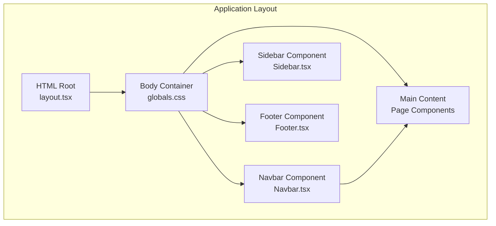
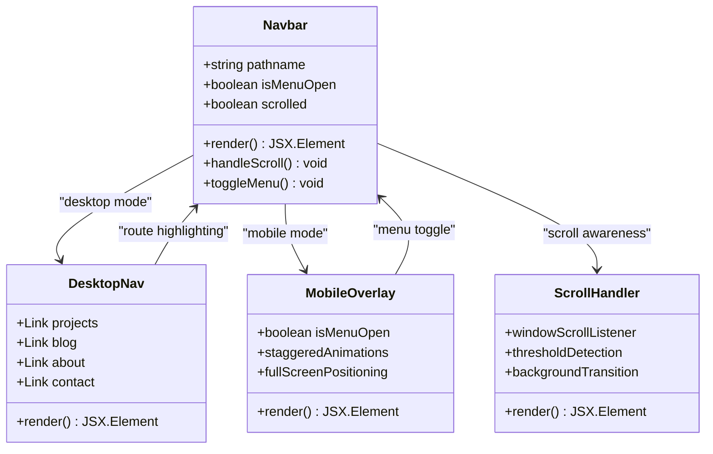
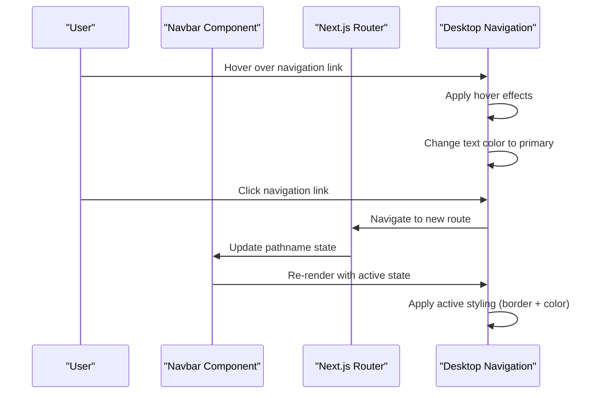
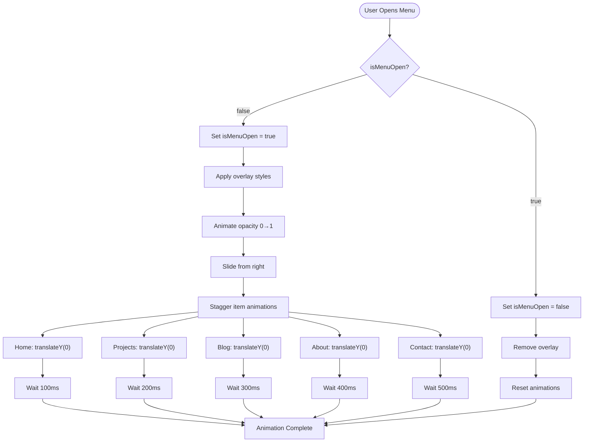
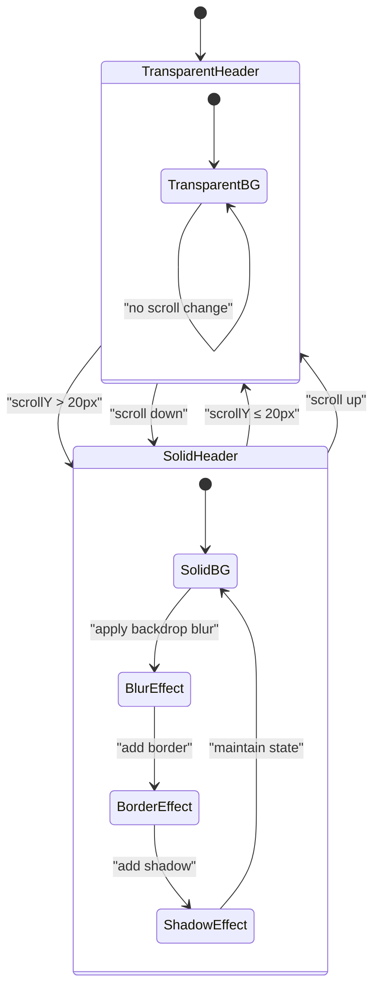
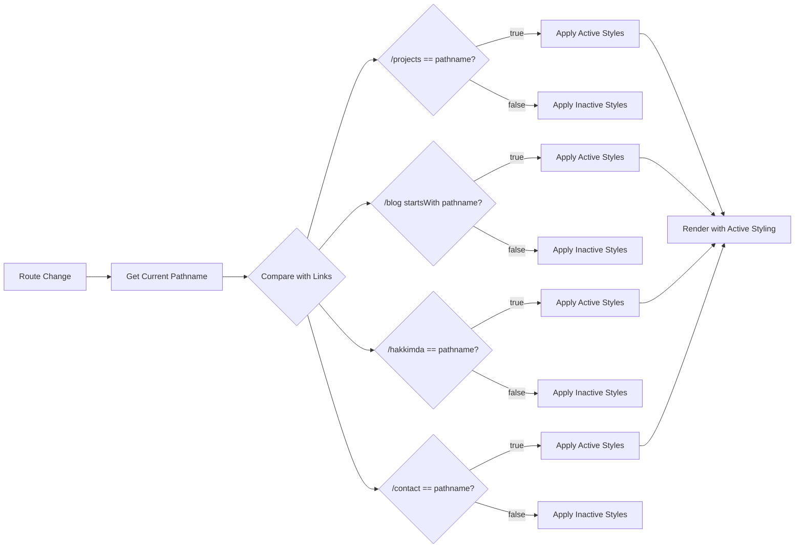
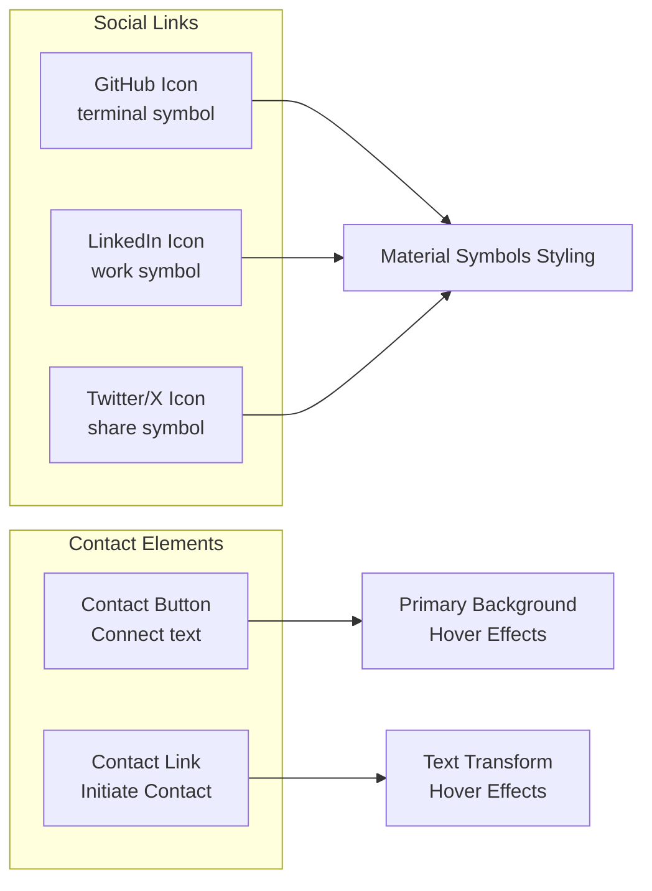
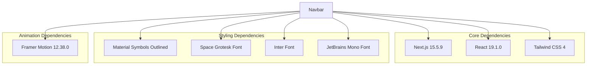
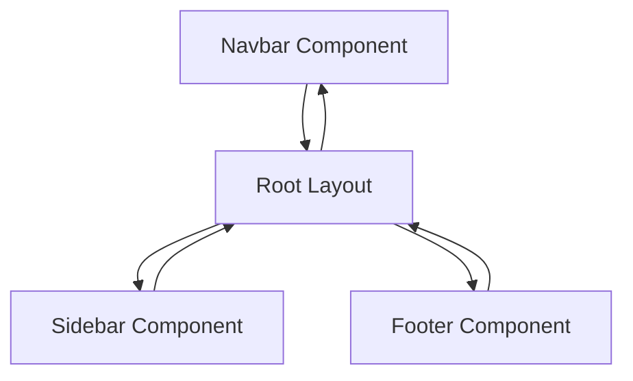

# Navbar Component

<cite>
**Referenced Files in This Document**
- [Navbar.tsx](file://src/components/Navbar.tsx)
- [layout.tsx](file://src/app/layout.tsx)
- [globals.css](file://src/app/globals.css)
- [Footer.tsx](file://src/components/Footer.tsx)
- [useScrollAnimation.ts](file://src/hooks/useScrollAnimation.ts)
- [package.json](file://package.json)
</cite>

## Table of Contents
1. [Introduction](#introduction)
2. [Project Structure](#project-structure)
3. [Core Components](#core-components)
4. [Architecture Overview](#architecture-overview)
5. [Detailed Component Analysis](#detailed-component-analysis)
6. [Dependency Analysis](#dependency-analysis)
7. [Performance Considerations](#performance-considerations)
8. [Troubleshooting Guide](#troubleshooting-guide)
9. [Conclusion](#conclusion)
10. [Appendices](#appendices)

## Introduction
The Navbar component serves as the primary navigation system for this portfolio and blog platform. It implements a sophisticated dual-mode navigation experience with distinct desktop and mobile patterns, featuring scroll-aware header behavior, animated mobile menu overlays, and active route highlighting. The component integrates seamlessly with Next.js routing, Material Symbols for icons, and a comprehensive dark theme system with glass morphism effects.

## Project Structure
The Navbar component is strategically positioned within the application's layout hierarchy, serving as the top-level navigation interface that remains consistent across all pages while adapting to different viewport sizes and user interactions.

**Diagram sources**
- [layout.tsx:28-57](file://src/app/layout.tsx#L28-L57)
- [globals.css:45-56](file://src/app/globals.css#L45-L56)

**Section sources**
- [layout.tsx:28-57](file://src/app/layout.tsx#L28-L57)
- [globals.css:45-56](file://src/app/globals.css#L45-L56)

## Core Components
The Navbar component consists of several interconnected subsystems that work together to provide a cohesive navigation experience:

### Navigation Modes
- **Desktop Mode**: Features horizontal navigation links with hover effects and active state indicators
- **Mobile Mode**: Implements a full-screen overlay menu with staggered entrance animations
- **Scroll-Aware Header**: Transforms from transparent to solid with blur effect based on scroll position

### State Management
- **Menu State**: Tracks mobile menu open/closed status using React state
- **Scroll State**: Monitors scroll position to trigger header transformations
- **Route State**: Uses Next.js pathname for active navigation highlighting

### Styling System
- **Typography**: Utilizes three distinct font families (Space Grotesk, Inter, JetBrains Mono)
- **Color Scheme**: Implements a dark theme with primary accent colors
- **Glass Effects**: Employs backdrop blur and transparency for modern UI aesthetics

**Section sources**
- [Navbar.tsx:7-18](file://src/components/Navbar.tsx#L7-L18)
- [globals.css:56-60](file://src/app/globals.css#L56-L60)

## Architecture Overview
The Navbar component follows a modular architecture pattern with clear separation of concerns between desktop and mobile navigation modes, state management, and styling systems.

**Diagram sources**
- [Navbar.tsx:27-53](file://src/components/Navbar.tsx#L27-L53)
- [Navbar.tsx:76-134](file://src/components/Navbar.tsx#L76-L134)
- [Navbar.tsx:12-18](file://src/components/Navbar.tsx#L12-L18)

## Detailed Component Analysis

### Desktop Navigation System
The desktop navigation implements a sophisticated link-based interface with conditional styling based on the current route.

**Diagram sources**
- [Navbar.tsx:28-53](file://src/components/Navbar.tsx#L28-L53)
- [Navbar.tsx:29-52](file://src/components/Navbar.tsx#L29-L52)

The desktop navigation features:
- **Responsive Breakpoint**: Hidden on mobile screens (md breakpoint)
- **Active State Detection**: Uses `usePathname` hook for precise route matching
- **Hover Effects**: Smooth color transitions and subtle scaling
- **Visual Indicators**: Bottom border for active routes with primary color

**Section sources**
- [Navbar.tsx:28-53](file://src/components/Navbar.tsx#L28-L53)

### Mobile Navigation Overlay
The mobile navigation implements a full-screen overlay system with sophisticated entrance animations and positioning.

**Diagram sources**
- [Navbar.tsx:76-134](file://src/components/Navbar.tsx#L76-L134)
- [Navbar.tsx:80-131](file://src/components/Navbar.tsx#L80-L131)

Key mobile features:
- **Full-Screen Positioning**: Fixed overlay covering entire viewport
- **Gradient Background**: Subtle gradient overlay for depth perception
- **Staggered Animations**: Items enter with increasing delays (100ms intervals)
- **Transform Effects**: Smooth slide-in transitions with fade-in
- **Pointer Events**: Proper event handling during animations

**Section sources**
- [Navbar.tsx:76-134](file://src/components/Navbar.tsx#L76-L134)

### Scroll-Aware Header Behavior
The header implements intelligent scroll detection that transforms the navigation bar from transparent to solid with blur effects.

**Diagram sources**
- [Navbar.tsx:20-21](file://src/components/Navbar.tsx#L20-L21)
- [Navbar.tsx:12-18](file://src/components/Navbar.tsx#L12-L18)

The scroll behavior includes:
- **Threshold Detection**: 20px scroll threshold for state changes
- **Background Transformation**: Transparent to semi-transparent dark background
- **Blur Effect**: Backdrop blur with `backdrop-blur-xl` class
- **Shadow Effects**: Subtle glow effect with blue tint
- **Border Addition**: Subtle border for visual separation

**Section sources**
- [Navbar.tsx:12-18](file://src/components/Navbar.tsx#L12-L18)
- [Navbar.tsx:20-21](file://src/components/Navbar.tsx#L20-L21)

### Active Route Highlighting Mechanism
The component uses Next.js's `usePathname` hook to implement precise active route detection with conditional styling.

**Diagram sources**
- [Navbar.tsx:8](file://src/components/Navbar.tsx#L8)
- [Navbar.tsx:29-52](file://src/components/Navbar.tsx#L29-L52)

**Section sources**
- [Navbar.tsx:8](file://src/components/Navbar.tsx#L8)
- [Navbar.tsx:29-52](file://src/components/Navbar.tsx#L29-L52)

### Social Media Integration and Contact Styling
The Navbar integrates social media links and contact buttons with consistent styling and hover effects.

**Diagram sources**
- [Navbar.tsx:55-63](file://src/components/Navbar.tsx#L55-L63)
- [Navbar.tsx:121-131](file://src/components/Navbar.tsx#L121-L131)

**Section sources**
- [Navbar.tsx:55-63](file://src/components/Navbar.tsx#L55-L63)
- [Navbar.tsx:121-131](file://src/components/Navbar.tsx#L121-L131)

## Dependency Analysis

### External Dependencies
The Navbar component relies on several key dependencies for its functionality:

**Diagram sources**
- [package.json:11-21](file://package.json#L11-L21)
- [layout.tsx:8-21](file://src/app/layout.tsx#L8-L21)

### Internal Dependencies
The component interacts with other application components through well-defined interfaces:

**Diagram sources**
- [layout.tsx:4-6](file://src/app/layout.tsx#L4-L6)

**Section sources**
- [package.json:11-21](file://package.json#L11-L21)
- [layout.tsx:4-6](file://src/app/layout.tsx#L4-L6)

## Performance Considerations
The Navbar component implements several performance optimizations:

### Event Listener Management
- **Cleanup Functions**: Scroll listeners are properly removed on component unmount
- **Debounced Updates**: Scroll events are handled efficiently without excessive re-renders
- **Memory Management**: Event listeners prevent memory leaks in long-running sessions

### Animation Performance
- **Hardware Acceleration**: CSS transforms utilize GPU acceleration
- **Optimized Transitions**: Smooth 300-500ms transitions for optimal user experience
- **Pointer Events Control**: Disabled during animations to prevent interaction conflicts

### Rendering Optimizations
- **Conditional Rendering**: Mobile overlay only renders when needed
- **State Minimization**: Only essential state is tracked (menu open, scroll position)
- **CSS-in-JS**: Tailwind classes minimize runtime styling calculations

**Section sources**
- [Navbar.tsx:12-18](file://src/components/Navbar.tsx#L12-L18)
- [Navbar.tsx:76-78](file://src/components/Navbar.tsx#L76-L78)

## Troubleshooting Guide

### Common Issues and Solutions

#### Mobile Menu Not Opening
**Symptoms**: Clicking menu button has no effect
**Causes**: 
- Missing event handler binding
- Incorrect state management
- CSS conflicts blocking pointer events

**Solutions**:
- Verify `onClick` handler is properly bound
- Check `isMenuOpen` state updates correctly
- Ensure `pointer-events-none` is not applied to interactive elements

#### Scroll Effects Not Triggering
**Symptoms**: Header remains transparent regardless of scroll position
**Causes**:
- Scroll listener not attached
- Incorrect threshold value
- CSS specificity conflicts

**Solutions**:
- Confirm scroll event listener initialization
- Verify threshold comparison logic
- Check CSS class precedence

#### Active State Not Highlighting
**Symptoms**: Active navigation link not receiving special styling
**Causes**:
- Incorrect pathname comparison
- Route structure changes not reflected
- CSS class conflicts

**Solutions**:
- Validate pathname values match actual routes
- Update comparison logic for dynamic routes
- Check CSS specificity overrides

#### Animation Performance Issues
**Symptoms**: Choppy or delayed animations
**Causes**:
- Excessive DOM manipulation
- Inefficient CSS properties
- Hardware acceleration conflicts

**Solutions**:
- Use transform instead of position changes
- Optimize transition durations
- Reduce animation complexity

**Section sources**
- [Navbar.tsx:12-18](file://src/components/Navbar.tsx#L12-L18)
- [Navbar.tsx:76-78](file://src/components/Navbar.tsx#L76-L78)

## Conclusion
The Navbar component represents a sophisticated implementation of modern web navigation patterns, combining responsive design principles with advanced animation techniques and thoughtful user experience considerations. Its dual-mode approach ensures optimal usability across all device types while maintaining visual consistency and performance standards.

The component's strength lies in its modular architecture, efficient state management, and seamless integration with the broader application ecosystem. The scroll-aware header behavior, animated mobile overlay, and precise active route highlighting demonstrate a deep understanding of user interaction patterns and modern web development best practices.

## Appendices

### Customization Options

#### Color Schemes
- **Primary Colors**: Adjust `--color-primary` and related variants in CSS variables
- **Background Tones**: Modify `--color-background` and `--color-surface` values
- **Accent Colors**: Customize `--color-secondary` and `--color-tertiary` palettes

#### Typography Settings
- **Headline Fonts**: Change `--font-headline` variable for different font families
- **Body Text**: Adjust `--font-body` for paragraph and content text
- **Monospace**: Modify `--font-mono` for code-like elements and labels

#### Responsive Breakpoints
- **Mobile Threshold**: Adjust scroll threshold in `useEffect` hook
- **Desktop Breakpoint**: Modify `md:` Tailwind prefixes for different viewport sizes
- **Animation Timing**: Tune transition durations for different performance profiles

#### Accessibility Features
- **Keyboard Navigation**: Implement tab order and focus management
- **Screen Reader Support**: Add ARIA labels and roles for interactive elements
- **High Contrast Mode**: Ensure sufficient color contrast ratios
- **Reduced Motion**: Respect user motion preferences with CSS prefers-reduced-motion

### Integration Guidelines
- **Route Configuration**: Update navigation links to match application routing structure
- **Icon System**: Extend Material Symbols library with additional icon sets
- **Theme Consistency**: Maintain color scheme coherence across all components
- **Performance Monitoring**: Track animation performance and adjust timing as needed