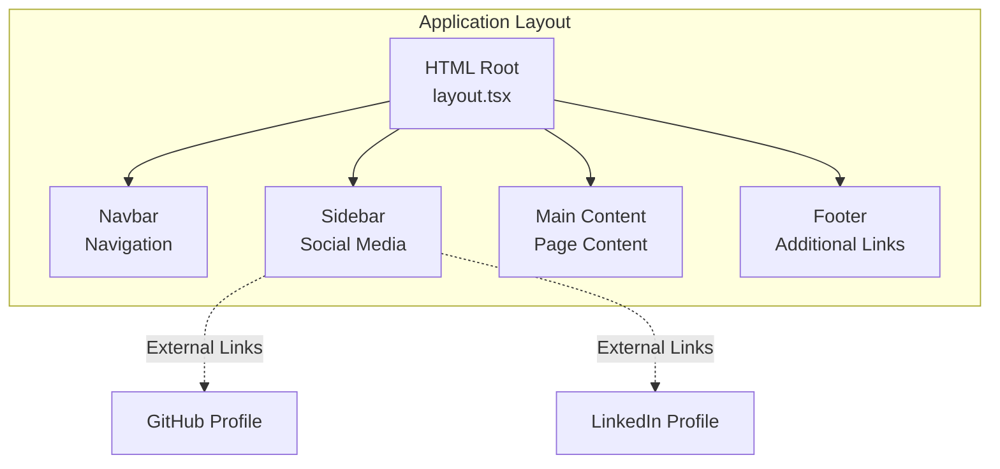
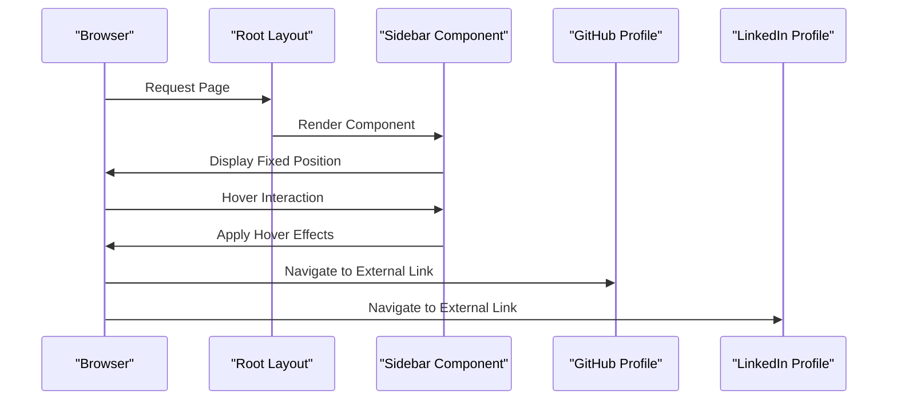
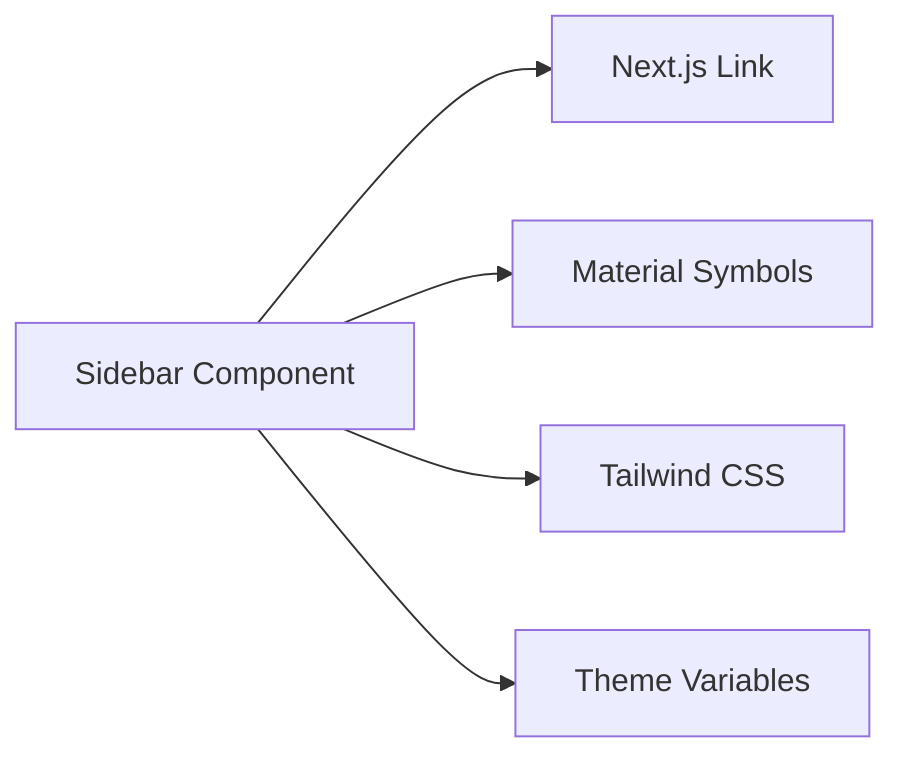

# Sidebar Component

<cite>
**Referenced Files in This Document**
- [Sidebar.tsx](file://src/components/Sidebar.tsx)
- [layout.tsx](file://src/app/layout.tsx)
- [Navbar.tsx](file://src/components/Navbar.tsx)
- [Footer.tsx](file://src/components/Footer.tsx)
- [globals.css](file://src/app/globals.css)
- [contact/page.tsx](file://src/app/contact/page.tsx)
</cite>

## Table of Contents
1. [Introduction](#introduction)
2. [Project Structure](#project-structure)
3. [Core Components](#core-components)
4. [Architecture Overview](#architecture-overview)
5. [Detailed Component Analysis](#detailed-component-analysis)
6. [Dependency Analysis](#dependency-analysis)
7. [Performance Considerations](#performance-considerations)
8. [Troubleshooting Guide](#troubleshooting-guide)
9. [Conclusion](#conclusion)

## Introduction
The Sidebar component serves as a secondary navigation element positioned on the left side of the viewport, providing quick access to external professional profiles and social media platforms. It integrates seamlessly with the overall layout system while maintaining responsive behavior across different screen sizes. The component focuses on delivering efficient navigation to GitHub and LinkedIn profiles with a clean, modern design aesthetic.

## Project Structure
The Sidebar component is part of a cohesive design system that spans multiple layout components. It works in conjunction with the Navbar, Footer, and main content areas to create a unified user experience.

**Diagram sources**
- [layout.tsx:28-56](file://src/app/layout.tsx#L28-L56)
- [Sidebar.tsx:4-16](file://src/components/Sidebar.tsx#L4-L16)

**Section sources**
- [layout.tsx:1-58](file://src/app/layout.tsx#L1-L58)
- [Sidebar.tsx:1-20](file://src/components/Sidebar.tsx#L1-L20)

## Core Components
The Sidebar component consists of two primary social media links configured with Material Symbols icons and responsive design patterns.

### Component Structure
The Sidebar utilizes a fixed positioning strategy with Tailwind CSS utility classes for responsive behavior and visual styling. It employs a glass-morphism effect with backdrop blur and subtle borders to integrate with the dark theme aesthetic.

**Section sources**
- [Sidebar.tsx:4-16](file://src/components/Sidebar.tsx#L4-L16)

## Architecture Overview
The Sidebar component operates within Next.js's server-side rendering architecture, integrating through the root layout system. It maintains consistent styling through shared CSS variables and responsive breakpoints.

**Diagram sources**
- [layout.tsx:48-49](file://src/app/layout.tsx#L48-L49)
- [Sidebar.tsx:6-15](file://src/components/Sidebar.tsx#L6-L15)

## Detailed Component Analysis

### Social Media Integration
The Sidebar provides external link access to professional platforms through carefully configured anchor elements with security best practices.

#### GitHub Integration
The GitHub link uses the Material Symbols "code" icon with a terminal-style appearance. It implements proper security attributes for external navigation while maintaining visual consistency with the design system.

#### LinkedIn Integration
The LinkedIn link utilizes the "account_circle" Material Symbol icon, providing clear visual identification of the professional networking platform. The implementation follows the same security and accessibility patterns as the GitHub integration.

**Section sources**
- [Sidebar.tsx:7-14](file://src/components/Sidebar.tsx#L7-L14)

### Icon Styling and Material Symbols
The component leverages Google's Material Symbols library for consistent iconography across the application. The implementation includes custom CSS styling for optimal visual presentation.

#### Material Symbols Configuration
The Material Symbols library is loaded globally through the root layout with specific CSS custom properties for consistent icon rendering across different contexts.

#### Icon Visual Hierarchy
Each social media icon follows a consistent pattern of:
- Material Symbols icon with primary color styling
- Subtle opacity transitions on hover
- Scale transformations for visual feedback
- Monospace typography for platform labels

**Section sources**
- [layout.tsx:36-43](file://src/app/layout.tsx#L36-L43)
- [Sidebar.tsx:8-13](file://src/components/Sidebar.tsx#L8-L13)

### Positioning Strategy
The Sidebar employs a sophisticated fixed positioning system designed for optimal user experience across different viewport sizes.

#### Fixed Positioning
The component uses Tailwind's fixed positioning utilities combined with transform-based centering for precise vertical alignment. The `-translate-y-1/2` transform ensures perfect centering regardless of viewport height.

#### Responsive Breakpoints
The component implements a mobile-first responsive strategy using Tailwind's breakpoint system:
- Hidden on small screens (`hidden lg:flex`)
- Visible on large screens and above (`lg:flex`)
- Automatic adaptation to different viewport widths

**Section sources**
- [Sidebar.tsx:6](file://src/components/Sidebar.tsx#L6)

### Hover Effects and Animations
The component implements sophisticated hover animations using Tailwind CSS utilities and group selectors for coordinated visual feedback.

#### Group-Based Hover States
The `group` utility enables coordinated hover effects across multiple child elements, ensuring consistent visual transitions throughout the component.

#### Motion Design Elements
Hover interactions include:
- Smooth translation transitions (`hover:translate-x-1`)
- Duration-based animations (`duration-300`)
- Opacity transitions for text elements
- Scale transformations for icon emphasis

**Section sources**
- [Sidebar.tsx:7-14](file://src/components/Sidebar.tsx#L7-L14)

### Integration with Layout System
The Sidebar integrates seamlessly with the overall layout architecture through the root layout component, maintaining consistent styling and responsive behavior.

#### Global Styling Integration
The component inherits styling from the global CSS system, utilizing theme variables for consistent color application across light and dark modes.

#### Z-Index Layering
Proper z-index management ensures the Sidebar appears above main content while remaining below interactive overlays and modals.

**Section sources**
- [layout.tsx:48-49](file://src/app/layout.tsx#L48-L49)
- [globals.css:4-66](file://src/app/globals.css#L4-L66)

### Accessibility Features
The component implements several accessibility best practices for external link navigation.

#### Security Attributes
All external links include `target="_blank"` and `rel="noopener noreferrer"` attributes to prevent security vulnerabilities and ensure proper browser behavior.

#### Semantic Structure
The component uses semantic HTML elements with appropriate ARIA roles and labels for screen reader compatibility.

#### Focus Management
Interactive elements maintain proper keyboard navigation support and focus indicators for accessibility compliance.

**Section sources**
- [Sidebar.tsx:7-14](file://src/components/Sidebar.tsx#L7-L14)

## Dependency Analysis

### Component Dependencies
The Sidebar component has minimal external dependencies, relying primarily on Next.js routing and Material Symbols integration.

**Diagram sources**
- [Sidebar.tsx:2](file://src/components/Sidebar.tsx#L2)
- [layout.tsx:36-43](file://src/app/layout.tsx#L36-L43)

### Styling Dependencies
The component relies on the global theme system for consistent color application and responsive behavior.

**Section sources**
- [globals.css:4-66](file://src/app/globals.css#L4-L66)
- [layout.tsx:45-54](file://src/app/layout.tsx#L45-L54)

## Performance Considerations
The Sidebar component is optimized for performance through several design decisions:

### Lightweight Implementation
- Minimal DOM structure with essential elements only
- Efficient CSS class composition using Tailwind utilities
- No JavaScript event handlers or complex state management

### Rendering Optimization
- Static positioning reduces layout calculations
- Transform-based animations leverage GPU acceleration
- Fixed positioning minimizes reflow scenarios

### Bundle Size Impact
- Material Symbols loaded globally reduces duplication
- Shared theme variables minimize CSS repetition
- Utility-first CSS approach optimizes for reuse

## Troubleshooting Guide

### Common Issues and Solutions

#### Material Symbols Not Displaying
Ensure the Material Symbols stylesheet is properly loaded in the root layout. Verify the font loading configuration and network connectivity.

#### Hover Effects Not Working
Check that group utilities are properly applied to parent containers. Verify CSS specificity and ensure no conflicting styles override hover states.

#### Responsive Behavior Problems
Confirm breakpoint configurations match expected viewport sizes. Test component behavior across different device widths and orientations.

#### External Link Security Warnings
Verify that all external links include proper `target="_blank"` and `rel="noopener noreferrer"` attributes. Test navigation behavior in different browsers.

**Section sources**
- [layout.tsx:36-43](file://src/app/layout.tsx#L36-L43)
- [Sidebar.tsx:7-14](file://src/components/Sidebar.tsx#L7-L14)

## Conclusion
The Sidebar component successfully fulfills its role as a secondary navigation element for social media integration. Its implementation demonstrates best practices in responsive design, accessibility, and performance optimization. The component's clean architecture and thoughtful styling contribute to the overall user experience while maintaining consistency with the application's design system.

The component's modular design allows for easy extension with additional social media platforms while preserving existing functionality and styling patterns. Its integration with the broader layout system ensures seamless user navigation across the application's various sections.