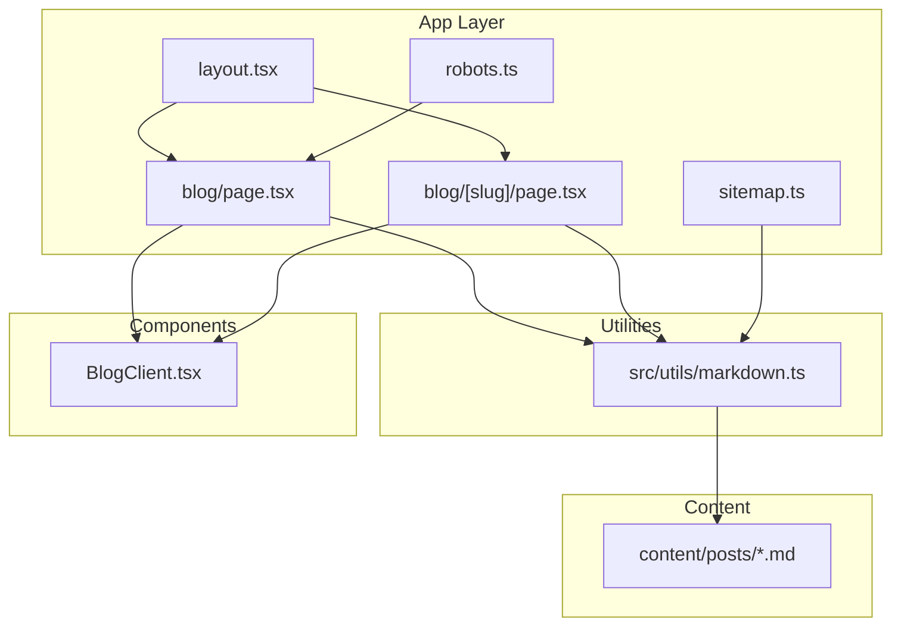
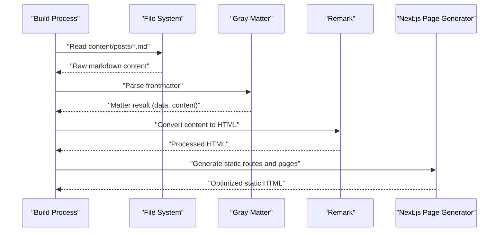
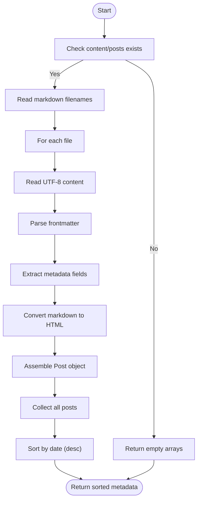
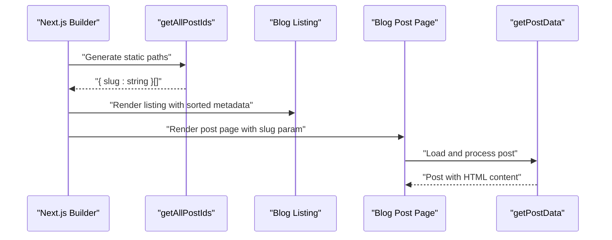
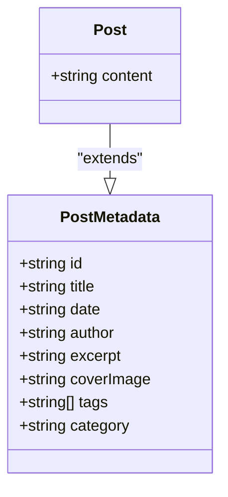
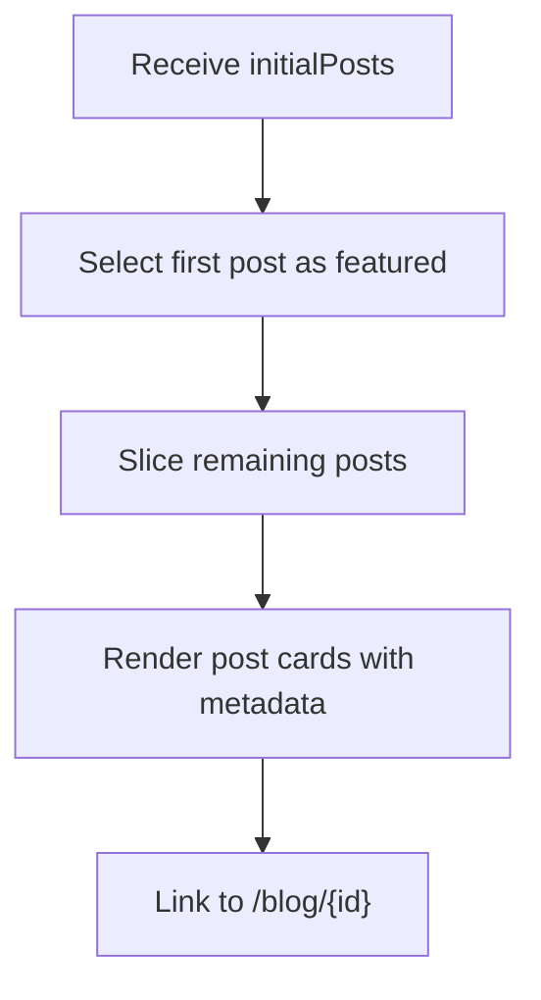
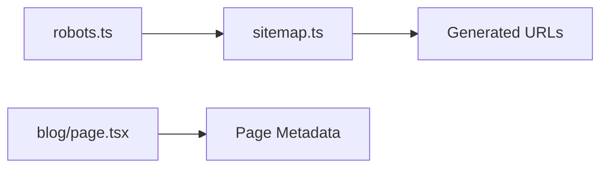
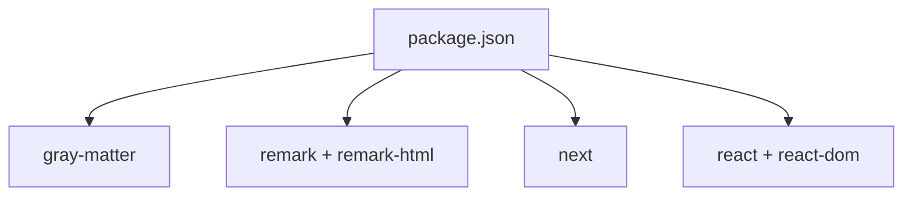

# Blog Content System

<cite>
**Referenced Files in This Document**
- [markdown.ts](file://src/utils/markdown.ts)
- [blog.page.tsx](file://src/app/blog/page.tsx)
- [blog.[slug].page.tsx](file://src/app/blog/[slug]/page.tsx)
- [BlogClient.tsx](file://src/components/BlogClient.tsx)
- [layout.tsx](file://src/app/layout.tsx)
- [sitemap.ts](file://src/app/sitemap.ts)
- [robots.ts](file://src/app/robots.ts)
- [package.json](file://package.json)
</cite>

## Table of Contents
1. [Introduction](#introduction)
2. [Project Structure](#project-structure)
3. [Core Components](#core-components)
4. [Architecture Overview](#architecture-overview)
5. [Detailed Component Analysis](#detailed-component-analysis)
6. [Dependency Analysis](#dependency-analysis)
7. [Performance Considerations](#performance-considerations)
8. [Troubleshooting Guide](#troubleshooting-guide)
9. [Conclusion](#conclusion)

## Introduction
This document describes a Next.js-powered blog content management system built around markdown-based posts with structured frontmatter metadata. It covers the complete content processing pipeline using Gray Matter for frontmatter parsing and Remark for markdown-to-HTML conversion, the static generation of blog listing pages, and dynamic routing for individual post pages. Practical guidance is included for creating posts, organizing content by categories and tags, implementing content previews, and optimizing SEO and performance.

## Project Structure
The system follows a conventional Next.js file-based routing structure with a dedicated content directory for markdown posts and a utilities module for content processing.

**Diagram sources**
- [layout.tsx:1-58](file://src/app/layout.tsx#L1-L58)
- [blog.page.tsx:1-15](file://src/app/blog/page.tsx#L1-L15)
- [blog.[slug].page.tsx:1-18](file://src/app/blog/[slug]/page.tsx#L1-L18)
- [markdown.ts:1-108](file://src/utils/markdown.ts#L1-L108)
- [BlogClient.tsx:1-166](file://src/components/BlogClient.tsx#L1-L166)
- [sitemap.ts:1-36](file://src/app/sitemap.ts#L1-L36)
- [robots.ts:1-13](file://src/app/robots.ts#L1-L13)

**Section sources**
- [layout.tsx:1-58](file://src/app/layout.tsx#L1-L58)
- [blog.page.tsx:1-15](file://src/app/blog/page.tsx#L1-L15)
- [blog.[slug].page.tsx:1-18](file://src/app/blog/[slug]/page.tsx#L1-L18)
- [markdown.ts:1-108](file://src/utils/markdown.ts#L1-L108)
- [BlogClient.tsx:1-166](file://src/components/BlogClient.tsx#L1-L166)
- [sitemap.ts:1-36](file://src/app/sitemap.ts#L1-L36)
- [robots.ts:1-13](file://src/app/robots.ts#L1-L13)

## Core Components
- Content processing utilities:
  - getAllPostIds: discovers markdown files and generates slugs for static generation
  - getSortedPostsData: reads and parses frontmatter, returning sorted metadata
  - getPostData: loads a single post, converts markdown to HTML, and returns enriched Post object
- Interfaces:
  - PostMetadata: defines the frontmatter contract (title, date, author, excerpt, coverImage, tags, category)
  - Post: extends PostMetadata with rendered HTML content
- Pages:
  - Blog listing page fetches sorted posts and renders them via BlogClient
  - Dynamic post page generates static paths and renders a single post

**Section sources**
- [markdown.ts:9-22](file://src/utils/markdown.ts#L9-L22)
- [markdown.ts:24-38](file://src/utils/markdown.ts#L24-L38)
- [markdown.ts:40-77](file://src/utils/markdown.ts#L40-L77)
- [markdown.ts:79-107](file://src/utils/markdown.ts#L79-L107)
- [blog.page.tsx:1-15](file://src/app/blog/page.tsx#L1-L15)
- [blog.[slug].page.tsx:1-18](file://src/app/blog/[slug]/page.tsx#L1-L18)

## Architecture Overview
The system uses static site generation for the blog listing and per-post pages, with content loaded at build time from markdown files. The pipeline transforms raw markdown into HTML and enriches it with structured metadata.

**Diagram sources**
- [markdown.ts:50-90](file://src/utils/markdown.ts#L50-L90)
- [blog.[slug].page.tsx:5-10](file://src/app/blog/[slug]/page.tsx#L5-L10)

## Detailed Component Analysis

### Content Processing Pipeline
The pipeline performs three primary tasks:
- Frontmatter parsing using Gray Matter to extract structured metadata
- Markdown-to-HTML conversion using Remark with remark-html
- Aggregation and sorting of post metadata for listing

**Diagram sources**
- [markdown.ts:40-77](file://src/utils/markdown.ts#L40-L77)
- [markdown.ts:79-107](file://src/utils/markdown.ts#L79-L107)

**Section sources**
- [markdown.ts:40-77](file://src/utils/markdown.ts#L40-L77)
- [markdown.ts:79-107](file://src/utils/markdown.ts#L79-L107)

### Static Generation and Dynamic Routing
- Blog listing page:
  - Uses getSortedPostsData to fetch metadata and passes it to BlogClient for rendering
- Individual post pages:
  - generateStaticParams builds static routes from getAllPostIds
  - getPostData resolves the requested slug and returns a fully-rendered Post

**Diagram sources**
- [blog.page.tsx:10-14](file://src/app/blog/page.tsx#L10-L14)
- [blog.[slug].page.tsx:5-10](file://src/app/blog/[slug]/page.tsx#L5-L10)
- [blog.[slug].page.tsx:12-17](file://src/app/blog/[slug]/page.tsx#L12-L17)
- [markdown.ts:24-38](file://src/utils/markdown.ts#L24-L38)
- [markdown.ts:79-107](file://src/utils/markdown.ts#L79-L107)

**Section sources**
- [blog.page.tsx:1-15](file://src/app/blog/page.tsx#L1-L15)
- [blog.[slug].page.tsx:1-18](file://src/app/blog/[slug]/page.tsx#L1-L18)
- [markdown.ts:24-38](file://src/utils/markdown.ts#L24-L38)
- [markdown.ts:79-107](file://src/utils/markdown.ts#L79-L107)

### Frontmatter Schema and Data Models
The system defines a strict PostMetadata interface that governs frontmatter fields and a Post interface that adds rendered content. This ensures consistent data across the application.

**Diagram sources**
- [markdown.ts:9-22](file://src/utils/markdown.ts#L9-L22)

**Section sources**
- [markdown.ts:9-22](file://src/utils/markdown.ts#L9-L22)

### Client Rendering and Preview Implementation
The BlogClient component renders a featured post and a feed of regular posts, using metadata fields for previews and navigation. It handles optional image rendering and date formatting.

**Diagram sources**
- [BlogClient.tsx:12-115](file://src/components/BlogClient.tsx#L12-L115)

**Section sources**
- [BlogClient.tsx:1-166](file://src/components/BlogClient.tsx#L1-L166)

### SEO Configuration
- robots.txt allows crawling and references a sitemap URL
- sitemap generation uses getAllPostIds to enumerate all published posts
- Blog listing page sets explicit metadata for title and description

**Diagram sources**
- [robots.ts:3-12](file://src/app/robots.ts#L3-L12)
- [sitemap.ts:4-36](file://src/app/sitemap.ts#L4-L36)
- [blog.page.tsx:5-8](file://src/app/blog/page.tsx#L5-L8)

**Section sources**
- [robots.ts:1-13](file://src/app/robots.ts#L1-L13)
- [sitemap.ts:1-36](file://src/app/sitemap.ts#L1-L36)
- [blog.page.tsx:5-8](file://src/app/blog/page.tsx#L5-L8)

## Dependency Analysis
External dependencies enable the content processing pipeline and Next.js features.

**Diagram sources**
- [package.json:11-21](file://package.json#L11-L21)

**Section sources**
- [package.json:1-35](file://package.json#L1-L35)

## Performance Considerations
- Static generation: Both listing and post pages are statically generated, reducing runtime overhead and improving load times.
- Minimal runtime work: Content is processed at build time; runtime only renders precomputed HTML.
- File system access: Reads are synchronous during build; ensure content directory is present and accessible.
- Sorting strategy: Sorting by date is O(n log n); keep the number of posts reasonable for build performance.
- Image optimization: Client-side image components handle responsive images and lazy loading.

[No sources needed since this section provides general guidance]

## Troubleshooting Guide
Common issues and resolutions:
- Missing content/posts directory:
  - Symptom: Empty arrays returned by content functions
  - Resolution: Create the directory and add markdown files with proper frontmatter
- Incorrect frontmatter format:
  - Symptom: Missing or malformed metadata
  - Resolution: Validate YAML frontmatter keys and ensure correct types
- Slug mismatch:
  - Symptom: 404 on post page
  - Resolution: Ensure filename matches slug and includes .md extension
- Build errors on Windows:
  - Symptom: Path-related errors
  - Resolution: Use path.join for cross-platform compatibility (already handled)
- HTML rendering issues:
  - Symptom: Unprocessed markdown in content
  - Resolution: Verify remark-html plugin is applied and content is converted

**Section sources**
- [markdown.ts:24-38](file://src/utils/markdown.ts#L24-L38)
- [markdown.ts:40-77](file://src/utils/markdown.ts#L40-L77)
- [markdown.ts:79-107](file://src/utils/markdown.ts#L79-L107)

## Conclusion
This blog system provides a robust, static-first architecture for managing markdown-based content with structured metadata. By leveraging Gray Matter and Remark, it offers predictable performance and SEO-friendly output. The design supports easy content creation, flexible previews, and scalable organization through categories and tags.