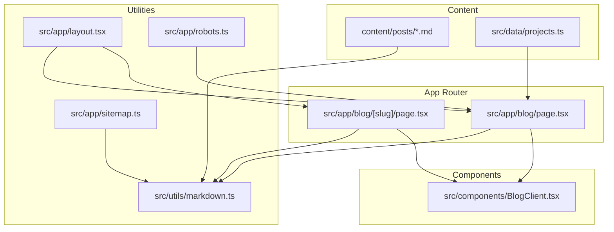
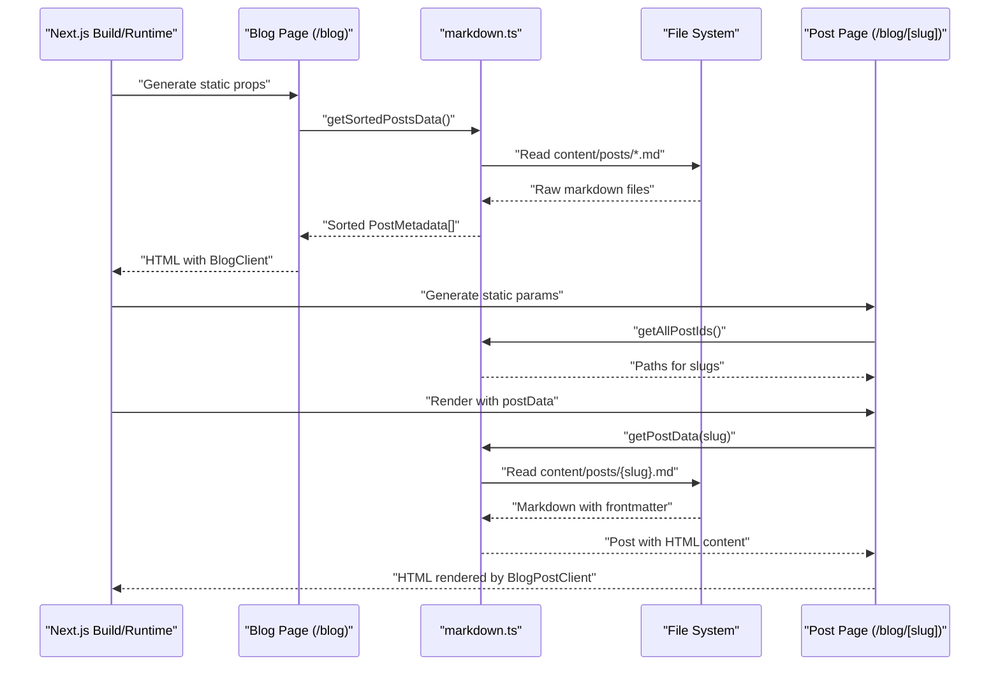
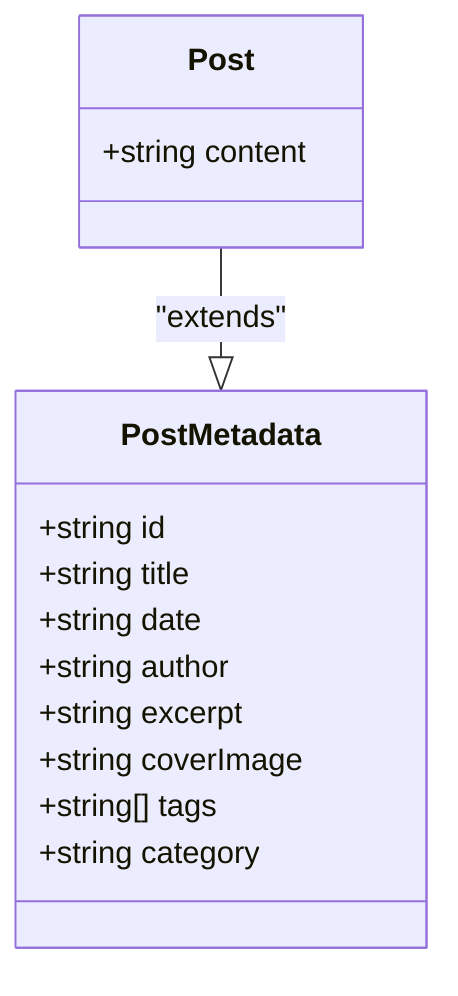
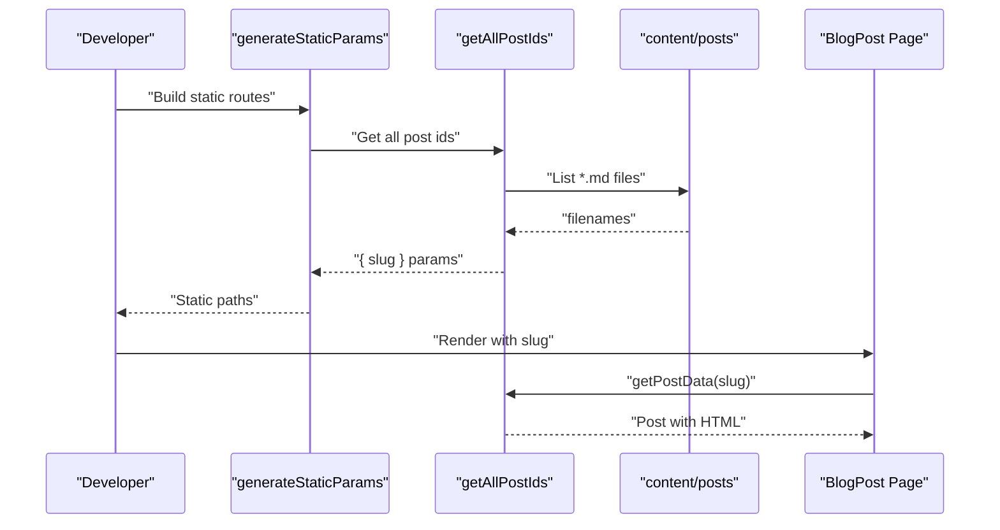
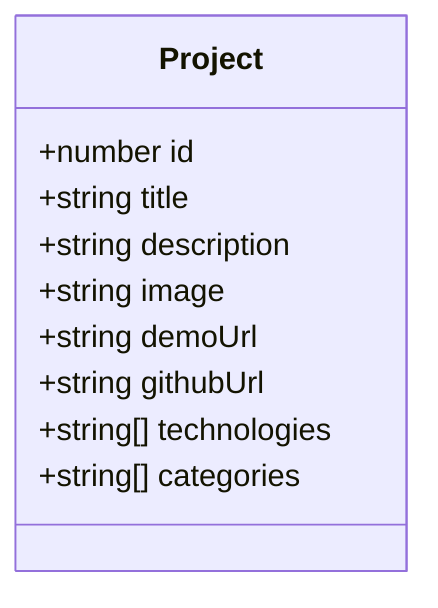
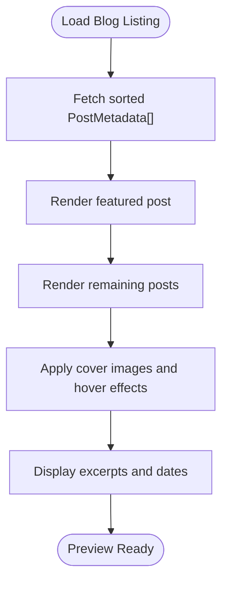
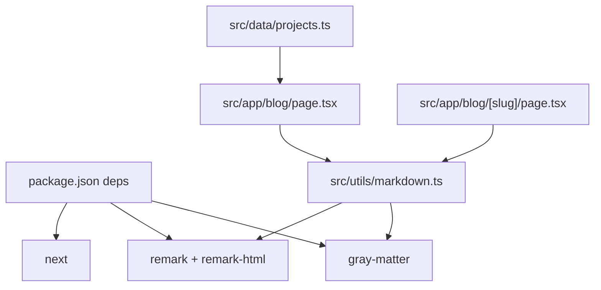

# Content Management

<cite>
**Referenced Files in This Document**
- [projects.ts](file://src/data/projects.ts)
- [markdown.ts](file://src/utils/markdown.ts)
- [blog.page.tsx](file://src/app/blog/page.tsx)
- [blog.[slug].page.tsx](file://src/app/blog/[slug]/page.tsx)
- [BlogClient.tsx](file://src/components/BlogClient.tsx)
- [layout.tsx](file://src/app/layout.tsx)
- [sitemap.ts](file://src/app/sitemap.ts)
- [robots.ts](file://src/app/robots.ts)
- [package.json](file://package.json)
- [next.config.ts](file://next.config.ts)
</cite>

## Table of Contents
1. [Introduction](#introduction)
2. [Project Structure](#project-structure)
3. [Core Components](#core-components)
4. [Architecture Overview](#architecture-overview)
5. [Detailed Component Analysis](#detailed-component-analysis)
6. [Dependency Analysis](#dependency-analysis)
7. [Performance Considerations](#performance-considerations)
8. [Troubleshooting Guide](#troubleshooting-guide)
9. [Conclusion](#conclusion)
10. [Appendices](#appendices)

## Introduction
This document explains how content is managed in the markdown-based blog and project showcase system. It covers the structure and processing of blog posts, the data model for projects, the static generation and dynamic routing for blog content, and the content preview workflow. It also provides guidance for content creators and developers on validation, SEO, and performance.

## Project Structure
The system is organized around:
- A content directory for blog posts
- A data module for project listings
- Next.js app router pages for listing and individual posts
- Utility functions for reading and transforming markdown
- Client components for rendering content
- SEO assets for robots and sitemap generation



**Diagram sources**
- [blog.page.tsx:1-15](file://src/app/blog/page.tsx#L1-L15)
- [blog.[slug].page.tsx](file://src/app/blog/[slug]/page.tsx#L1-L18)
- [markdown.ts:1-108](file://src/utils/markdown.ts#L1-L108)
- [BlogClient.tsx:1-166](file://src/components/BlogClient.tsx#L1-L166)
- [layout.tsx:1-58](file://src/app/layout.tsx#L1-L58)
- [sitemap.ts:1-37](file://src/app/sitemap.ts#L1-L37)
- [robots.ts:1-13](file://src/app/robots.ts#L1-L13)
- [projects.ts:1-43](file://src/data/projects.ts#L1-L43)

**Section sources**
- [blog.page.tsx:1-15](file://src/app/blog/page.tsx#L1-L15)
- [blog.[slug].page.tsx](file://src/app/blog/[slug]/page.tsx#L1-L18)
- [markdown.ts:1-108](file://src/utils/markdown.ts#L1-L108)
- [BlogClient.tsx:1-166](file://src/components/BlogClient.tsx#L1-L166)
- [layout.tsx:1-58](file://src/app/layout.tsx#L1-L58)
- [sitemap.ts:1-37](file://src/app/sitemap.ts#L1-L37)
- [robots.ts:1-13](file://src/app/robots.ts#L1-L13)
- [projects.ts:1-43](file://src/data/projects.ts#L1-L43)

## Core Components
- Blog post data extraction and transformation: reads markdown files, parses frontmatter, sorts posts, and converts content to HTML.
- Static generation for blog listing and dynamic routes for individual posts.
- Project data model for showcasing work with technology stacks and links.
- Client-side rendering for the blog feed and author sidebar.
- SEO configuration via robots.txt and sitemap generation.

**Section sources**
- [markdown.ts:24-107](file://src/utils/markdown.ts#L24-L107)
- [blog.page.tsx:1-15](file://src/app/blog/page.tsx#L1-L15)
- [blog.[slug].page.tsx](file://src/app/blog/[slug]/page.tsx#L5-L17)
- [BlogClient.tsx:12-165](file://src/components/BlogClient.tsx#L12-L165)
- [projects.ts:1-43](file://src/data/projects.ts#L1-L43)
- [sitemap.ts:1-37](file://src/app/sitemap.ts#L1-L37)
- [robots.ts:1-13](file://src/app/robots.ts#L1-L13)

## Architecture Overview
The content pipeline for blogs:
- Static generation builds the blog listing from sorted post metadata.
- Dynamic routes generate static paths for each post and render individual post pages.
- Markdown is parsed for frontmatter and transformed to HTML for safe rendering.



**Diagram sources**
- [blog.page.tsx:10-14](file://src/app/blog/page.tsx#L10-L14)
- [blog.[slug].page.tsx](file://src/app/blog/[slug]/page.tsx#L5-L17)
- [markdown.ts:40-107](file://src/utils/markdown.ts#L40-L107)

## Detailed Component Analysis

### Blog Post Data Model and Processing
- PostMetadata includes identifiers, title, publication date, author, excerpt, optional cover image, tags, and category.
- Post extends PostMetadata with content as HTML.
- Functions:
  - getAllPostIds: enumerates markdown files and maps them to slug params for static generation.
  - getSortedPostsData: reads all posts, extracts frontmatter, and sorts by date descending.
  - getPostData: reads a single post by slug, parses frontmatter, converts markdown to HTML, and returns Post.



**Diagram sources**
- [markdown.ts:9-22](file://src/utils/markdown.ts#L9-L22)

**Section sources**
- [markdown.ts:9-22](file://src/utils/markdown.ts#L9-L22)
- [markdown.ts:24-38](file://src/utils/markdown.ts#L24-L38)
- [markdown.ts:40-77](file://src/utils/markdown.ts#L40-L77)
- [markdown.ts:79-107](file://src/utils/markdown.ts#L79-L107)

### Static Generation and Dynamic Routing
- Blog listing page fetches sorted post metadata and renders a client component.
- Individual post page generates static paths for all posts and resolves post data at runtime.
- The slug is derived from the filename without extension.



**Diagram sources**
- [blog.[slug].page.tsx](file://src/app/blog/[slug]/page.tsx#L5-L10)
- [markdown.ts:24-38](file://src/utils/markdown.ts#L24-L38)
- [markdown.ts:79-107](file://src/utils/markdown.ts#L79-L107)

**Section sources**
- [blog.page.tsx:1-15](file://src/app/blog/page.tsx#L1-L15)
- [blog.[slug].page.tsx](file://src/app/blog/[slug]/page.tsx#L1-L18)
- [markdown.ts:24-38](file://src/utils/markdown.ts#L24-L38)
- [markdown.ts:79-107](file://src/utils/markdown.ts#L79-L107)

### Project Data Structure
Projects are defined as a typed array with fields for identification, title, description, images, demo and GitHub URLs, technology stack, and categories. This structure supports filtering and categorization in the UI.



**Diagram sources**
- [projects.ts:1-43](file://src/data/projects.ts#L1-L43)

**Section sources**
- [projects.ts:1-43](file://src/data/projects.ts#L1-L43)

### Client Rendering and Preview Workflow
- The blog listing uses a client component to render a featured article and a grid of posts, including cover images and excerpts.
- The client component handles hover effects, typography, and responsive layouts.
- The preview workflow relies on frontmatter fields and the HTML-converted content for safe rendering.



**Diagram sources**
- [BlogClient.tsx:12-165](file://src/components/BlogClient.tsx#L12-L165)
- [blog.page.tsx:10-14](file://src/app/blog/page.tsx#L10-L14)

**Section sources**
- [BlogClient.tsx:1-166](file://src/components/BlogClient.tsx#L1-L166)
- [blog.page.tsx:1-15](file://src/app/blog/page.tsx#L1-L15)

### SEO and Sitemap
- robots.txt allows crawling and specifies a sitemap location.
- sitemap generation builds URLs for the home page, blog listing, author page, and all blog posts using static paths.

```mermaid
graph LR
Sitemap["src/app/sitemap.ts"] --> Paths["getAllPostIds()"]
Paths --> BlogPostURLs["/blog/{slug}"]
Sitemap --> BaseURLs["/", "/blog", "/hakkimda"]
```

**Diagram sources**
- [sitemap.ts:1-37](file://src/app/sitemap.ts#L1-L37)
- [markdown.ts:24-38](file://src/utils/markdown.ts#L24-L38)

**Section sources**
- [robots.ts:1-13](file://src/app/robots.ts#L1-L13)
- [sitemap.ts:1-37](file://src/app/sitemap.ts#L1-L37)
- [markdown.ts:24-38](file://src/utils/markdown.ts#L24-L38)

## Dependency Analysis
The system depends on Next.js for static generation and routing, Gray Matter for frontmatter parsing, and Remark for markdown-to-HTML conversion. Project data is imported directly into the app.



**Diagram sources**
- [package.json:11-21](file://package.json#L11-L21)
- [markdown.ts:3-5](file://src/utils/markdown.ts#L3-L5)
- [blog.page.tsx:1-2](file://src/app/blog/page.tsx#L1-L2)
- [blog.[slug].page.tsx](file://src/app/blog/[slug]/page.tsx#L1-L2)
- [projects.ts:1-43](file://src/data/projects.ts#L1-L43)

**Section sources**
- [package.json:11-21](file://package.json#L11-L21)
- [markdown.ts:3-5](file://src/utils/markdown.ts#L3-L5)
- [blog.page.tsx:1-2](file://src/app/blog/page.tsx#L1-L2)
- [blog.[slug].page.tsx](file://src/app/blog/[slug]/page.tsx#L1-L2)
- [projects.ts:1-43](file://src/data/projects.ts#L1-L43)

## Performance Considerations
- Static generation: Use static paths for blog listing and individual posts to improve load times and reduce server costs.
- Minimal client-side logic: Keep client components lightweight; most data is prepared server-side.
- Asset optimization: Serve images via Next.js Image for automatic optimization and responsive behavior.
- Build-time transformations: Convert markdown to HTML during build or SSR to avoid runtime overhead.
- File system access: Cache or memoize repeated reads in development; rely on Next.js caching in production.

## Troubleshooting Guide
Common issues and resolutions:
- Missing content/posts directory: Ensure the directory exists and contains markdown files with proper frontmatter.
- Incorrect slug resolution: Verify filenames match the expected slug pattern and that getAllPostIds returns the intended params.
- Frontmatter parsing errors: Confirm frontmatter keys align with PostMetadata and are valid YAML.
- HTML rendering warnings: Ensure remark-html is applied consistently and sanitize any user-provided HTML if added later.
- SEO configuration: Update sitemap base URL and confirm robots rules match deployment needs.

**Section sources**
- [markdown.ts:24-38](file://src/utils/markdown.ts#L24-L38)
- [markdown.ts:40-77](file://src/utils/markdown.ts#L40-L77)
- [markdown.ts:79-107](file://src/utils/markdown.ts#L79-L107)
- [blog.[slug].page.tsx](file://src/app/blog/[slug]/page.tsx#L5-L10)
- [sitemap.ts:5-13](file://src/app/sitemap.ts#L5-L13)

## Conclusion
This system provides a robust, static-first approach to managing a markdown-based blog and project showcase. By leveraging Next.js static generation, Gray Matter, and Remark, it delivers fast, SEO-friendly pages while keeping content creation straightforward for authors.

## Appendices

### Creating a New Blog Post
- Place a markdown file in the content/posts directory with a .md extension.
- Include frontmatter fields aligned with PostMetadata (title, date, author, excerpt, optional coverImage, tags, category).
- Use the slug derived from the filename (without .md) for the URL.
- Build or start the app to regenerate static routes and include the post in the listing.

**Section sources**
- [markdown.ts:7-8](file://src/utils/markdown.ts#L7-L8)
- [markdown.ts:24-38](file://src/utils/markdown.ts#L24-L38)
- [markdown.ts:40-77](file://src/utils/markdown.ts#L40-L77)

### Managing Project Listings
- Edit the projects array in the data module to add, remove, or update entries.
- Use the technologies and categories arrays to enable filtering and categorization in the UI.
- Ensure image paths are correct and accessible under the public/images/projects directory.

**Section sources**
- [projects.ts:1-43](file://src/data/projects.ts#L1-L43)

### Content Validation Checklist
- Frontmatter completeness: title, date, author, excerpt.
- Optional fields: coverImage, tags, category.
- File naming: lowercase, hyphenated slugs; no spaces or special characters.
- Content: valid markdown; convert to HTML using remark-html.
- SEO: update sitemap base URL and robots rules as needed.

**Section sources**
- [markdown.ts:9-22](file://src/utils/markdown.ts#L9-L22)
- [sitemap.ts:5-13](file://src/app/sitemap.ts#L5-L13)
- [robots.ts:4-10](file://src/app/robots.ts#L4-L10)