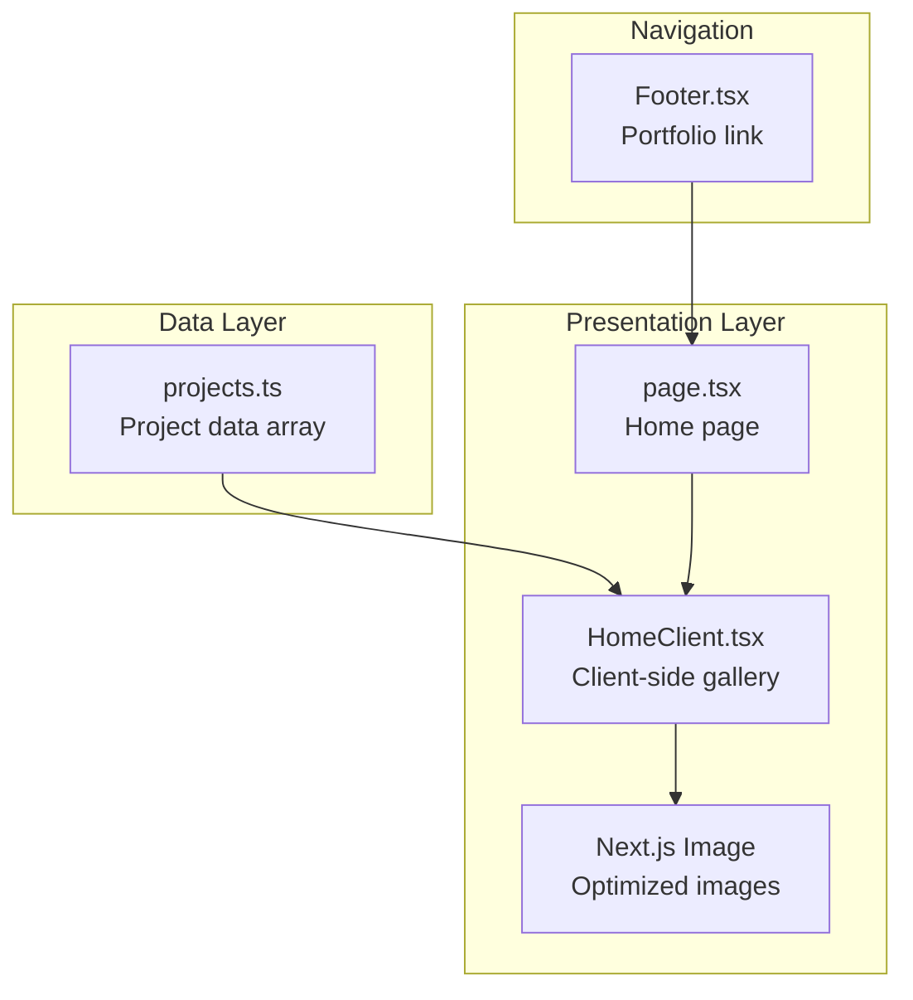
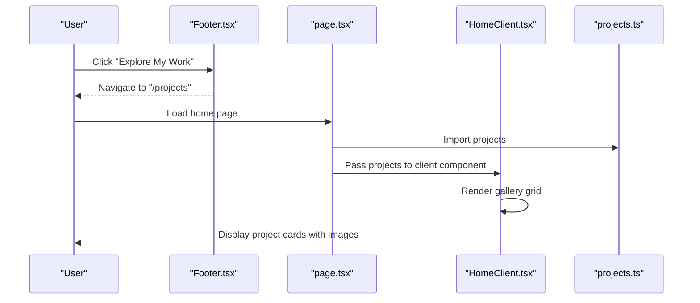
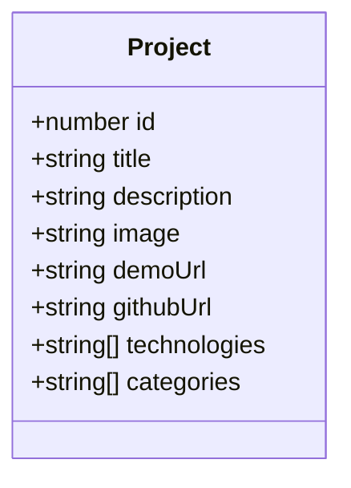
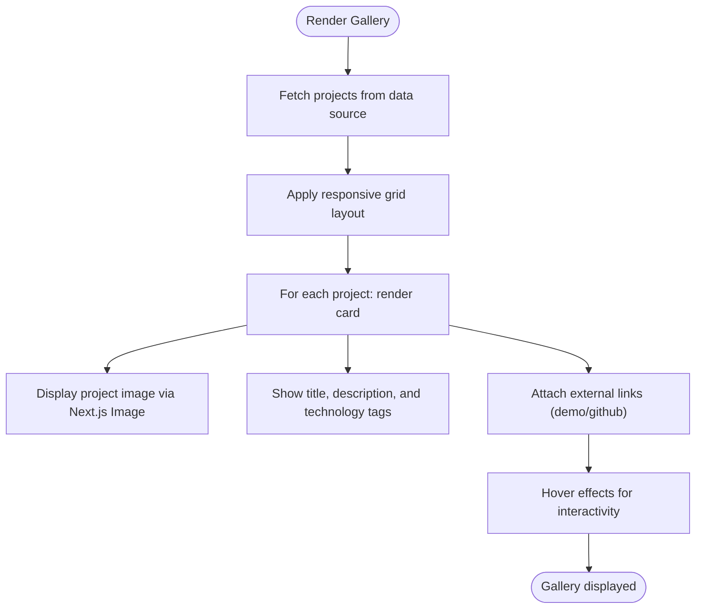
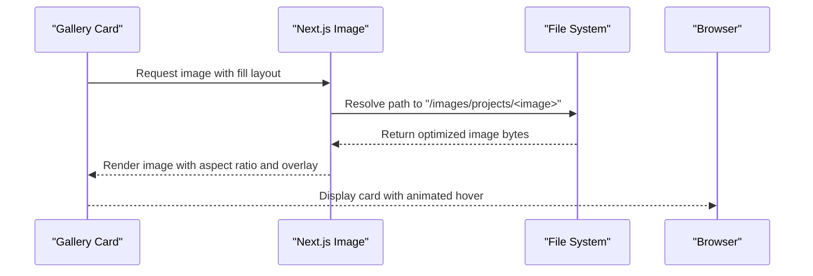
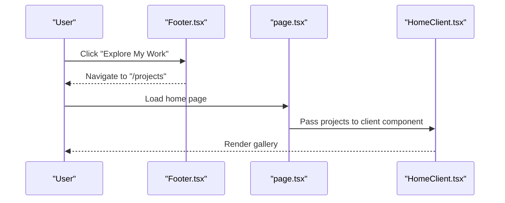
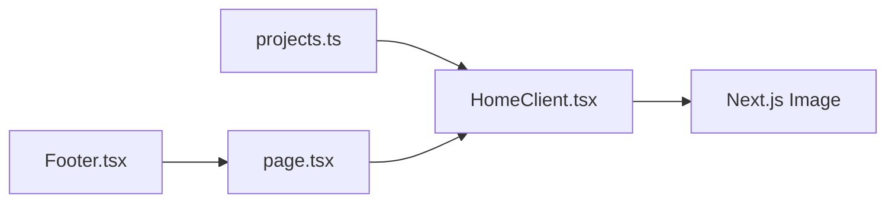

# Project Showcase System

<cite>
**Referenced Files in This Document**
- [projects.ts](file://src/data/projects.ts)
- [HomeClient.tsx](file://src/components/HomeClient.tsx)
- [page.tsx](file://src/app/page.tsx)
- [Footer.tsx](file://src/components/Footer.tsx)
- [next.config.ts](file://next.config.ts)
</cite>

## Table of Contents
1. [Introduction](#introduction)
2. [Project Structure](#project-structure)
3. [Core Components](#core-components)
4. [Architecture Overview](#architecture-overview)
5. [Detailed Component Analysis](#detailed-component-analysis)
6. [Dependency Analysis](#dependency-analysis)
7. [Performance Considerations](#performance-considerations)
8. [Troubleshooting Guide](#troubleshooting-guide)
9. [Conclusion](#conclusion)

## Introduction
This document describes the project showcase system that powers the portfolio section of the website. It focuses on the project data model, how projects are organized and filtered, and how they are rendered in the gallery component. It also covers integration with Next.js Image for optimized image loading, responsive grid layouts, and guidelines for adding and maintaining projects.

## Project Structure
The project showcase system is composed of:
- A centralized data source for projects
- A client-side component that renders a responsive gallery
- A home page that orchestrates data fetching and rendering
- A footer that links to the portfolio section

**Diagram sources**
- [projects.ts:1-42](file://src/data/projects.ts#L1-L42)
- [HomeClient.tsx:129-163](file://src/components/HomeClient.tsx#L129-L163)
- [page.tsx:10-14](file://src/app/page.tsx#L10-L14)
- [Footer.tsx:13-23](file://src/components/Footer.tsx#L13-L23)

**Section sources**
- [projects.ts:1-42](file://src/data/projects.ts#L1-L42)
- [HomeClient.tsx:129-163](file://src/components/HomeClient.tsx#L129-L163)
- [page.tsx:10-14](file://src/app/page.tsx#L10-L14)
- [Footer.tsx:13-23](file://src/components/Footer.tsx#L13-L23)

## Core Components
This section documents the project data structure and how it is used to render the gallery.

- Project data structure
  - Each project object includes:
    - id: Unique identifier
    - title: Display title
    - description: Short description
    - image: Filename of the project image asset
    - demoUrl: External URL for live demo
    - githubUrl: External URL for source code
    - technologies: Array of technology names
    - categories: Array of category identifiers
  - Example project entries demonstrate how to define projects with realistic tech stacks and categories.

- Gallery rendering
  - The gallery displays a fixed number of projects (selected from the data source) in a responsive grid.
  - Each card includes:
    - An image placeholder area with gradient overlay
    - Title and description
    - Technology tags (limited to a subset)
    - Interactive elements with hover effects

- Navigation
  - The footer provides a link to the portfolio section, encouraging visitors to explore projects.

**Section sources**
- [projects.ts:1-42](file://src/data/projects.ts#L1-L42)
- [HomeClient.tsx:129-163](file://src/components/HomeClient.tsx#L129-L163)
- [Footer.tsx:13-23](file://src/components/Footer.tsx#L13-L23)

## Architecture Overview
The showcase system follows a straightforward data-to-presentation pipeline:
- Data source: projects.ts exports an array of project objects
- Presentation: HomeClient renders a grid of project cards
- Navigation: Footer links to the portfolio section
- Image optimization: Next.js Image handles responsive image loading

**Diagram sources**
- [Footer.tsx:13-23](file://src/components/Footer.tsx#L13-L23)
- [page.tsx:10-14](file://src/app/page.tsx#L10-L14)
- [HomeClient.tsx:129-163](file://src/components/HomeClient.tsx#L129-L163)
- [projects.ts:1-42](file://src/data/projects.ts#L1-L42)

## Detailed Component Analysis

### Project Data Model
The project data model defines the shape and semantics of each project entry. It supports:
- Unique identification via id
- Human-readable presentation via title and description
- Asset linkage via image filename
- External navigation via demoUrl and githubUrl
- Technology and category taxonomy for filtering and discovery

**Diagram sources**
- [projects.ts:1-42](file://src/data/projects.ts#L1-L42)

**Section sources**
- [projects.ts:1-42](file://src/data/projects.ts#L1-L42)

### Gallery Rendering Component
The gallery component renders a responsive grid of project cards. Key behaviors:
- Responsive grid layout adapts from single column to three-column on larger screens
- Each card displays:
  - A hero-style image area with gradient overlay
  - Title and concise description
  - Technology tags (limited subset)
  - Hover animations and transitions
- Links to external resources:
  - GitHub URLs open external repositories
  - Portfolio fallback link when GitHub URL is unavailable

**Diagram sources**
- [HomeClient.tsx:129-163](file://src/components/HomeClient.tsx#L129-L163)

**Section sources**
- [HomeClient.tsx:129-163](file://src/components/HomeClient.tsx#L129-L163)

### Integration with Next.js Image
The system leverages Next.js Image for optimized image loading:
- Images are served from the public images directory under a projects subfolder
- The component uses fill-based layout with aspect ratio constraints
- Image overlays include gradient and hover scaling effects
- The configuration file allows extending optimization options if needed

**Diagram sources**
- [HomeClient.tsx:133-139](file://src/components/HomeClient.tsx#L133-L139)
- [next.config.ts:1-7](file://next.config.ts#L1-L7)

**Section sources**
- [HomeClient.tsx:133-139](file://src/components/HomeClient.tsx#L133-L139)
- [next.config.ts:1-7](file://next.config.ts#L1-L7)

### Navigation and Portfolio Access
The footer provides a persistent link to the portfolio section, guiding users to explore the full set of projects. The home page coordinates data fetching and passes the project dataset to the client component for rendering.

**Diagram sources**
- [Footer.tsx:13-23](file://src/components/Footer.tsx#L13-L23)
- [page.tsx:10-14](file://src/app/page.tsx#L10-L14)
- [HomeClient.tsx:129-163](file://src/components/HomeClient.tsx#L129-L163)

**Section sources**
- [Footer.tsx:13-23](file://src/components/Footer.tsx#L13-L23)
- [page.tsx:10-14](file://src/app/page.tsx#L10-L14)
- [HomeClient.tsx:129-163](file://src/components/HomeClient.tsx#L129-L163)

## Dependency Analysis
The showcase system exhibits clear separation of concerns:
- Data dependency: HomeClient imports the project array from projects.ts
- Presentation dependency: HomeClient renders the gallery UI
- Navigation dependency: Footer links to the portfolio route
- Image dependency: Next.js Image optimizes assets

**Diagram sources**
- [projects.ts:1-42](file://src/data/projects.ts#L1-L42)
- [HomeClient.tsx:129-163](file://src/components/HomeClient.tsx#L129-L163)
- [page.tsx:10-14](file://src/app/page.tsx#L10-L14)
- [Footer.tsx:13-23](file://src/components/Footer.tsx#L13-L23)

**Section sources**
- [projects.ts:1-42](file://src/data/projects.ts#L1-L42)
- [HomeClient.tsx:129-163](file://src/components/HomeClient.tsx#L129-L163)
- [page.tsx:10-14](file://src/app/page.tsx#L10-L14)
- [Footer.tsx:13-23](file://src/components/Footer.tsx#L13-L23)

## Performance Considerations
- Image optimization
  - Use Next.js Image for automatic optimization and responsive serving
  - Keep image sizes appropriate for the display area to minimize bandwidth
  - Consider lazy loading for large galleries by deferring offscreen images
- Rendering efficiency
  - Limit the number of projects rendered per page to reduce DOM nodes
  - Use CSS transforms for hover animations to leverage GPU acceleration
- Scalability
  - For very large galleries, consider pagination or virtualization
  - Preload critical images to improve perceived performance

## Troubleshooting Guide
Common issues and resolutions:
- Missing images
  - Verify that the image filenames match the assets in the public images directory
  - Ensure the image paths in the data source correspond to the actual file locations
- Broken external links
  - Confirm that demoUrl and githubUrl are valid and accessible
  - Provide fallback behavior when links are unavailable
- Layout problems
  - Check responsive breakpoints and adjust grid classes as needed
  - Validate aspect ratio constraints for image containers

**Section sources**
- [HomeClient.tsx:133-139](file://src/components/HomeClient.tsx#L133-L139)
- [projects.ts:1-42](file://src/data/projects.ts#L1-L42)

## Conclusion
The project showcase system provides a clean, maintainable way to present a portfolio of projects. Its modular design separates data, presentation, and navigation concerns, while leveraging Next.js Image for optimized media delivery. By following the guidelines outlined here, contributors can easily add new projects, organize them by technology and category, and maintain a performant and visually appealing gallery.