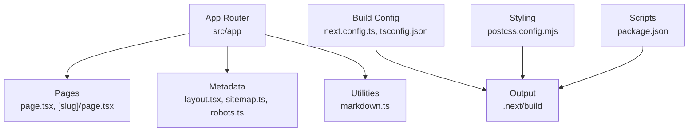
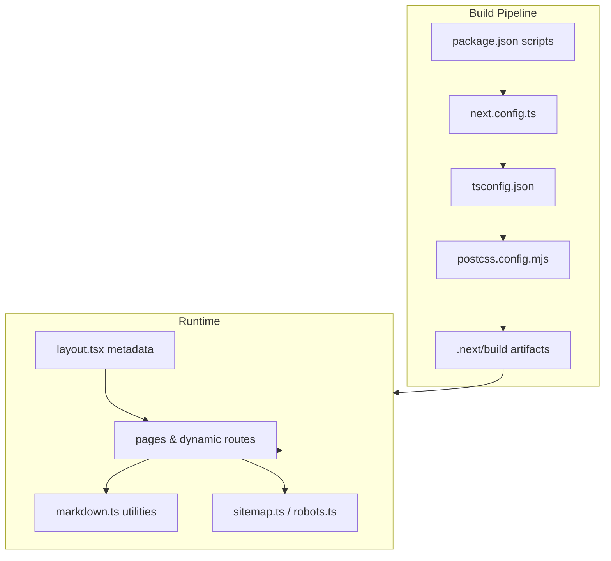
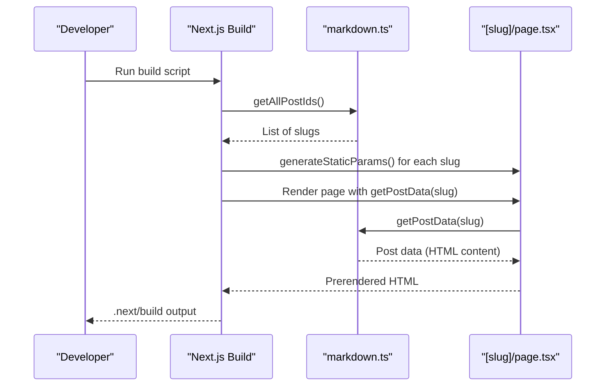
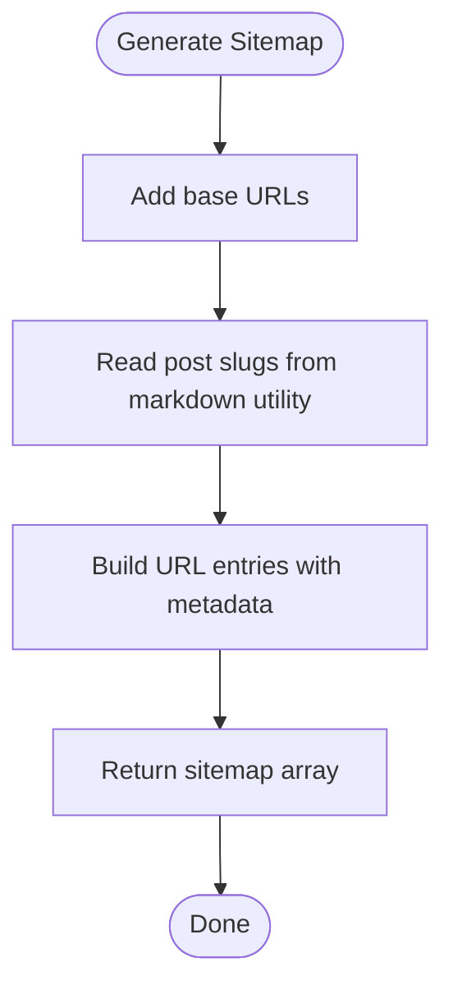
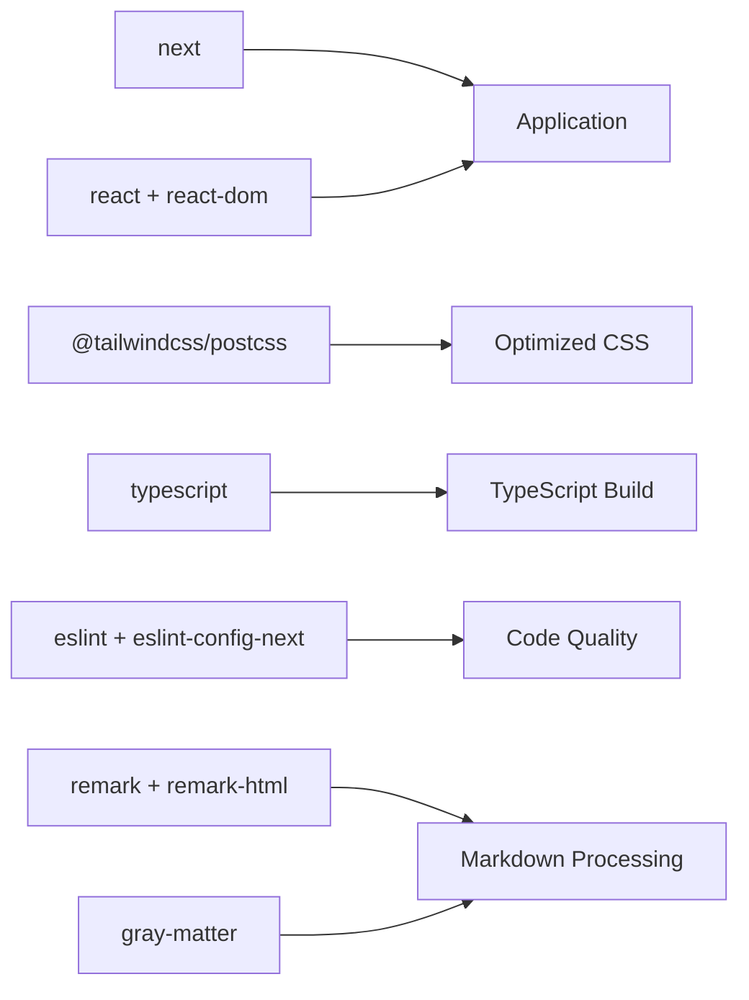

# Deployment & Production

<cite>
**Referenced Files in This Document**
- [next.config.ts](file://next.config.ts)
- [package.json](file://package.json)
- [tsconfig.json](file://tsconfig.json)
- [postcss.config.mjs](file://postcss.config.mjs)
- [eslint.config.mjs](file://eslint.config.mjs)
- [src/app/layout.tsx](file://src/app/layout.tsx)
- [src/app/sitemap.ts](file://src/app/sitemap.ts)
- [src/app/robots.ts](file://src/app/robots.ts)
- [src/utils/markdown.ts](file://src/utils/markdown.ts)
- [src/app/blog/[slug]/page.tsx](file://src/app/blog/[slug]/page.tsx)
</cite>

## Table of Contents
1. [Introduction](#introduction)
2. [Project Structure](#project-structure)
3. [Core Components](#core-components)
4. [Architecture Overview](#architecture-overview)
5. [Detailed Component Analysis](#detailed-component-analysis)
6. [Dependency Analysis](#dependency-analysis)
7. [Performance Considerations](#performance-considerations)
8. [Troubleshooting Guide](#troubleshooting-guide)
9. [Conclusion](#conclusion)
10. [Appendices](#appendices)

## Introduction
This document provides comprehensive deployment and production guidance for the Next.js application. It covers the build process, static site generation, server-side rendering compilation, asset optimization, platform-specific deployment strategies (Vercel, Netlify, traditional hosts), environment configuration, production optimization, performance monitoring, CI/CD pipeline configuration, automated testing integration, SEO optimization (sitemap, robots.txt, meta tags), security considerations, HTTPS configuration, and troubleshooting.

## Project Structure
The project follows a Next.js App Router structure with:
- Application pages under src/app
- Shared layout and metadata configuration
- Dynamic routes for blog posts
- Utility functions for markdown processing and content discovery
- Build-time configuration via next.config.ts and TypeScript configuration
- Styling via Tailwind PostCSS plugin

**Diagram sources**
- [src/app/layout.tsx:1-58](file://src/app/layout.tsx#L1-L58)
- [src/app/sitemap.ts:1-37](file://src/app/sitemap.ts#L1-L37)
- [src/app/robots.ts:1-13](file://src/app/robots.ts#L1-L13)
- [src/utils/markdown.ts:1-108](file://src/utils/markdown.ts#L1-L108)
- [next.config.ts:1-8](file://next.config.ts#L1-L8)
- [tsconfig.json:1-28](file://tsconfig.json#L1-L28)
- [postcss.config.mjs:1-6](file://postcss.config.mjs#L1-L6)
- [package.json:1-35](file://package.json#L1-L35)

**Section sources**
- [package.json:1-35](file://package.json#L1-L35)
- [next.config.ts:1-8](file://next.config.ts#L1-L8)
- [tsconfig.json:1-28](file://tsconfig.json#L1-L28)
- [postcss.config.mjs:1-6](file://postcss.config.mjs#L1-L6)

## Core Components
- Build scripts and runtime commands are defined in package.json, enabling development, building, and production start.
- next.config.ts is the central place to configure Next.js behavior for production builds.
- TypeScript configuration enforces strictness and module resolution suitable for Next.js.
- PostCSS/Tailwind configuration enables CSS optimization and utility-first styling.
- Layout defines global metadata and theme classes applied across pages.
- Sitemap and robots files define SEO and crawling policies.
- Markdown utilities support static generation of blog content and dynamic routes.

**Section sources**
- [package.json:5-10](file://package.json#L5-L10)
- [next.config.ts:3-5](file://next.config.ts#L3-L5)
- [tsconfig.json:2-24](file://tsconfig.json#L2-L24)
- [postcss.config.mjs:1-6](file://postcss.config.mjs#L1-L6)
- [src/app/layout.tsx:23-26](file://src/app/layout.tsx#L23-L26)
- [src/app/sitemap.ts:4-36](file://src/app/sitemap.ts#L4-L36)
- [src/app/robots.ts:3-12](file://src/app/robots.ts#L3-L12)
- [src/utils/markdown.ts:24-38](file://src/utils/markdown.ts#L24-L38)

## Architecture Overview
The application leverages Next.js App Router with static generation for blog posts and shared metadata across pages. The build pipeline compiles TypeScript, optimizes CSS, and generates static assets. Runtime relies on Next.js serverless or serverful hosting depending on provider.

**Diagram sources**
- [package.json:5-10](file://package.json#L5-L10)
- [next.config.ts:3-5](file://next.config.ts#L3-L5)
- [tsconfig.json:2-24](file://tsconfig.json#L2-L24)
- [postcss.config.mjs:1-6](file://postcss.config.mjs#L1-L6)
- [src/app/layout.tsx:23-26](file://src/app/layout.tsx#L23-L26)
- [src/app/sitemap.ts:4-36](file://src/app/sitemap.ts#L4-L36)
- [src/app/robots.ts:3-12](file://src/app/robots.ts#L3-L12)
- [src/utils/markdown.ts:24-38](file://src/utils/markdown.ts#L24-L38)

## Detailed Component Analysis

### Build Process and Static Site Generation
- Static generation for blog posts is enabled via generateStaticParams in the dynamic route, ensuring all slugs are prerendered at build time.
- The markdown utility discovers content files and transforms front matter and markdown to HTML, supporting static rendering.
- Asset optimization is handled by Next.js and PostCSS/Tailwind during build.

**Diagram sources**
- [src/app/blog/[slug]/page.tsx:5-10](file://src/app/blog/[slug]/page.tsx#L5-L10)
- [src/utils/markdown.ts:24-38](file://src/utils/markdown.ts#L24-L38)
- [src/utils/markdown.ts:79-107](file://src/utils/markdown.ts#L79-L107)

**Section sources**
- [src/app/blog/[slug]/page.tsx:5-10](file://src/app/blog/[slug]/page.tsx#L5-L10)
- [src/utils/markdown.ts:24-38](file://src/utils/markdown.ts#L24-L38)
- [src/utils/markdown.ts:79-107](file://src/utils/markdown.ts#L79-L107)

### Server-Side Rendering Compilation
- The application uses App Router with dynamic routes. generateStaticParams ensures prerendering; SSR is available if prerendering is disabled or partial.
- Layout metadata and global styles are applied consistently across pages.

**Section sources**
- [src/app/layout.tsx:23-26](file://src/app/layout.tsx#L23-L26)
- [src/app/blog/[slug]/page.tsx:12-17](file://src/app/blog/[slug]/page.tsx#L12-L17)

### Asset Optimization
- Tailwind PostCSS plugin is configured for CSS optimization and purging.
- Next.js automatically handles image optimization, static asset hashing, and compression.

**Section sources**
- [postcss.config.mjs:1-6](file://postcss.config.mjs#L1-L6)
- [package.json:11-21](file://package.json#L11-L21)

### Environment Configuration Management
- Environment variables are referenced in metadata and sitemap generation. Ensure environment variables are set appropriately for production domains and APIs.
- next.config.ts can be extended to include environment-dependent settings.

**Section sources**
- [src/app/sitemap.ts:5](file://src/app/sitemap.ts#L5)
- [src/app/robots.ts:10](file://src/app/robots.ts#L10)
- [next.config.ts:3-5](file://next.config.ts#L3-L5)

### SEO Optimization
- Sitemap generation lists homepage, blog index, “about” page, and all blog post URLs with frequency and priority.
- Robots file defines crawling rules and links to the sitemap.
- Global metadata sets title and description at the root layout level.

**Diagram sources**
- [src/app/sitemap.ts:4-36](file://src/app/sitemap.ts#L4-L36)
- [src/utils/markdown.ts:24-38](file://src/utils/markdown.ts#L24-L38)

**Section sources**
- [src/app/sitemap.ts:4-36](file://src/app/sitemap.ts#L4-L36)
- [src/app/robots.ts:3-12](file://src/app/robots.ts#L3-L12)
- [src/app/layout.tsx:23-26](file://src/app/layout.tsx#L23-L26)

### Security Considerations and HTTPS
- Ensure HTTPS termination occurs at the edge or load balancer. Configure redirect rules to enforce HTTPS in production.
- Sanitize user-generated content if applicable and avoid exposing sensitive environment variables in client bundles.

[No sources needed since this section provides general guidance]

### Performance Monitoring Setup
- Integrate analytics and APM tools in the root layout or middleware to track page views, errors, and performance metrics.
- Monitor Core Web Vitals and build performance using Next.js telemetry and provider dashboards.

[No sources needed since this section provides general guidance]

## Dependency Analysis
The application’s production runtime depends on Next.js, React, and related ecosystem packages. Build-time dependencies include TypeScript, ESLint, and Tailwind PostCSS plugin. The markdown utility depends on gray-matter and remark for content processing.

**Diagram sources**
- [package.json:11-32](file://package.json#L11-L32)
- [postcss.config.mjs:1-6](file://postcss.config.mjs#L1-L6)
- [src/utils/markdown.ts:3-5](file://src/utils/markdown.ts#L3-L5)

**Section sources**
- [package.json:11-32](file://package.json#L11-L32)
- [src/utils/markdown.ts:3-5](file://src/utils/markdown.ts#L3-L5)

## Performance Considerations
- Enable Next.js automatic optimizations (image optimization, static export, ISR if needed).
- Keep build output minimal by configuring Tailwind purge and avoiding unnecessary polyfills.
- Use dynamic imports for heavy components to reduce initial bundle size.
- Monitor and optimize Largest Contentful Paint (LCP), First Input Delay (FID), and Cumulative Layout Shift (CLS).

[No sources needed since this section provides general guidance]

## Troubleshooting Guide
Common deployment issues and resolutions:
- Build failures due to TypeScript strict mode: adjust tsconfig.json compiler options as needed for your environment.
- Missing content in sitemap: verify content directory path and permissions; ensure getAllPostIds returns expected slugs.
- Incorrect sitemap URLs: confirm the base URL is updated to the production domain.
- PostCSS/Tailwind errors: ensure @tailwind directives are present and PostCSS plugin is configured correctly.
- Lint errors blocking CI: resolve ESLint violations or adjust ignore patterns in eslint.config.mjs.

**Section sources**
- [tsconfig.json:2-24](file://tsconfig.json#L2-L24)
- [src/app/sitemap.ts:5](file://src/app/sitemap.ts#L5)
- [src/utils/markdown.ts:24-38](file://src/utils/markdown.ts#L24-L38)
- [postcss.config.mjs:1-6](file://postcss.config.mjs#L1-L6)
- [eslint.config.mjs:12-23](file://eslint.config.mjs#L12-L23)

## Conclusion
This guide outlined a production-ready deployment strategy for the Next.js application, covering build processes, static generation, asset optimization, SEO, environment configuration, and operational best practices. By aligning provider-specific configurations with the repository’s structure and leveraging the included metadata and utility modules, teams can achieve reliable deployments and strong performance in production.

## Appendices

### Platform Deployment Strategies

- Vercel
  - Connect repository and use Vercel’s defaults for Next.js projects.
  - Set environment variables for production domains and APIs.
  - Enable automatic HTTPS and preview deployments for pull requests.

- Netlify
  - Use the Next.js build command and publish directory from the build output.
  - Configure redirects for client-side routing and ensure trailing slash behavior matches.
  - Add environment variables for production domains and analytics.

- Traditional Hosting Providers
  - Build the application locally or in CI and deploy the Next.js output directory.
  - Serve the runtime using Node.js with the production start command.
  - Configure reverse proxy rules for client-side routing and static asset serving.

[No sources needed since this section provides general guidance]

### CI/CD Pipeline Configuration
- Build and test stages: run lint, type checks, and tests before building.
- Build stage: execute the Next.js build command to produce the production output.
- Deploy stage: upload artifacts to the target platform or serve via Node.js runtime.
- Optional: run accessibility and performance checks against the built output.

[No sources needed since this section provides general guidance]

### Automated Testing Integration
- Integrate unit and integration tests in CI to validate rendering and navigation.
- Snapshot tests for static pages and markdown-rendered content.
- End-to-end tests for critical user journeys (e.g., visiting a blog post).

[No sources needed since this section provides general guidance]