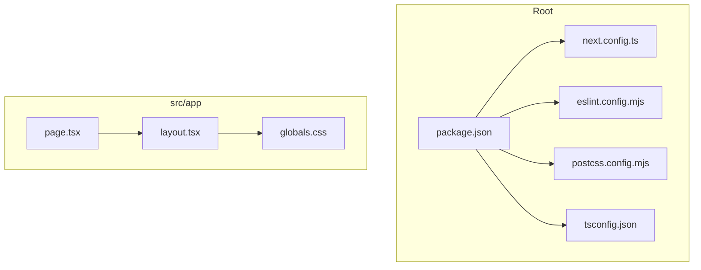
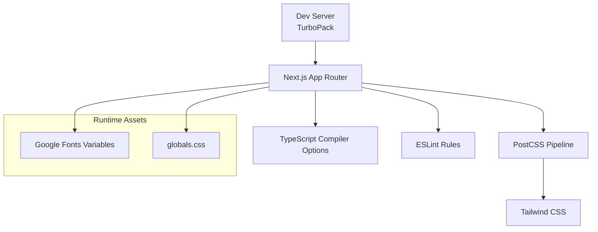
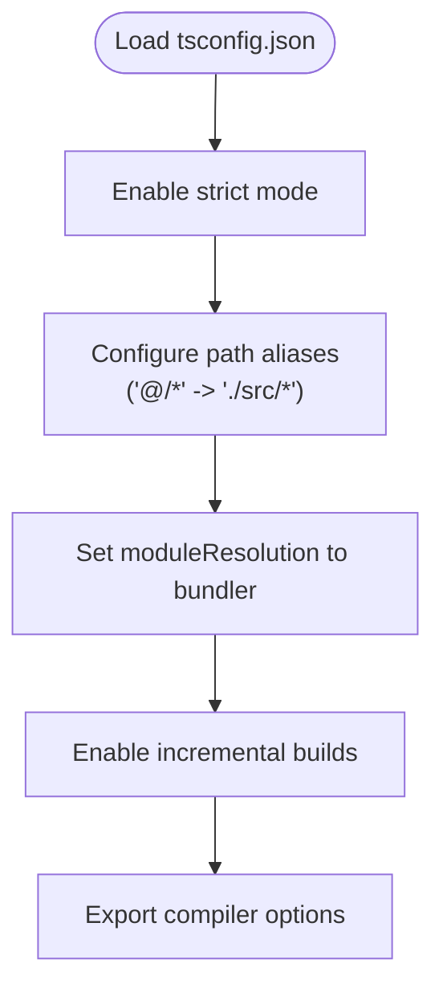
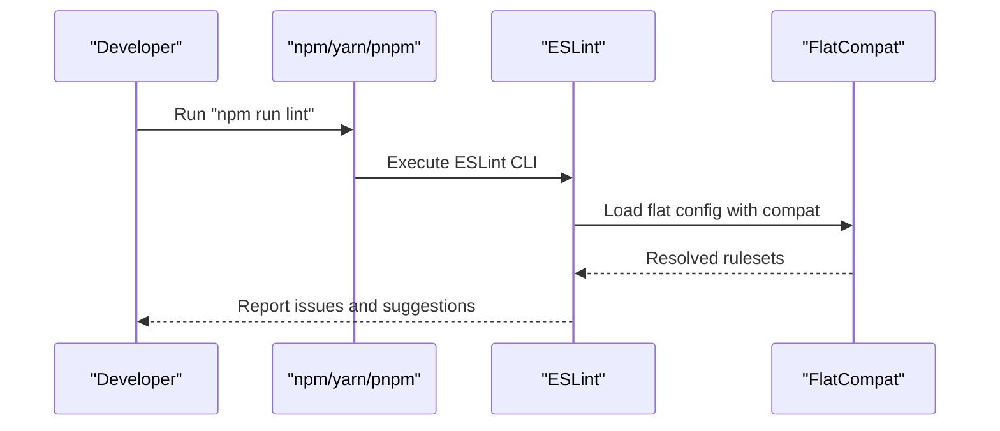
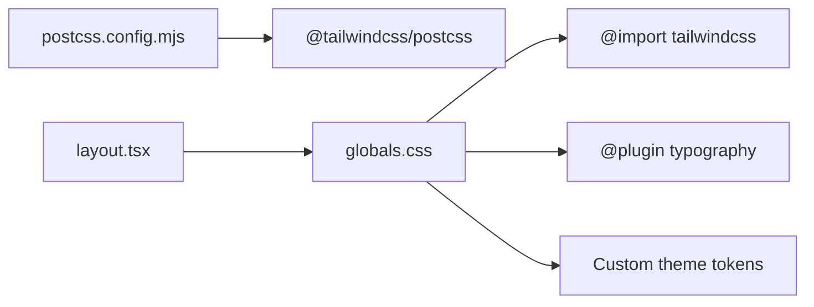
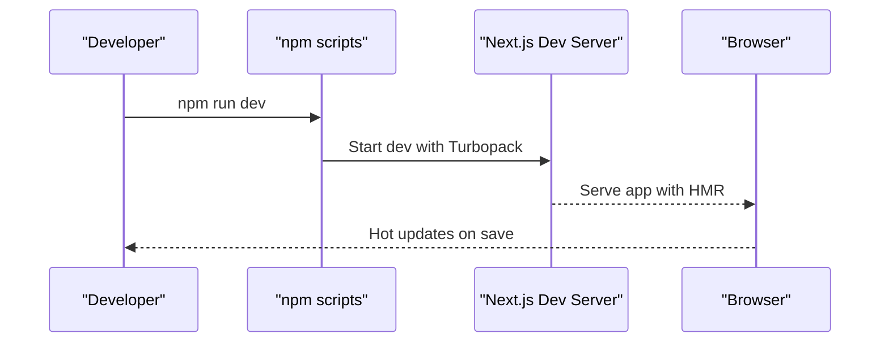
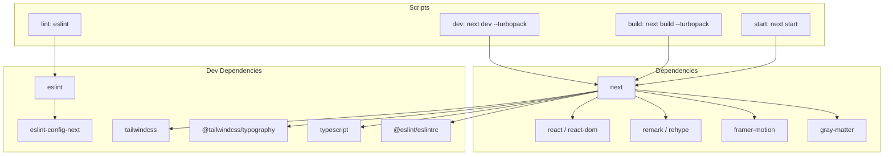

# Development Tools & Configuration

<cite>
**Referenced Files in This Document**
- [next.config.ts](file://next.config.ts)
- [tsconfig.json](file://tsconfig.json)
- [eslint.config.mjs](file://eslint.config.mjs)
- [postcss.config.mjs](file://postcss.config.mjs)
- [package.json](file://package.json)
- [src/app/globals.css](file://src/app/globals.css)
- [src/app/layout.tsx](file://src/app/layout.tsx)
- [src/app/page.tsx](file://src/app/page.tsx)
</cite>

## Table of Contents
1. [Introduction](#introduction)
2. [Project Structure](#project-structure)
3. [Core Components](#core-components)
4. [Architecture Overview](#architecture-overview)
5. [Detailed Component Analysis](#detailed-component-analysis)
6. [Dependency Analysis](#dependency-analysis)
7. [Performance Considerations](#performance-considerations)
8. [Troubleshooting Guide](#troubleshooting-guide)
9. [Conclusion](#conclusion)
10. [Appendices](#appendices)

## Introduction
This document provides comprehensive development tools and configuration guidance for the Next.js project. It covers Next.js configuration, TypeScript strictness and path aliases, ESLint setup, PostCSS/Tailwind integration, development workflow (hot reloading, debugging, profiling), environment and build optimization, and extension strategies for linting and build customization.

## Project Structure
The project follows a conventional Next.js App Router layout with a dedicated src directory. Key configuration files reside at the repository root, while global styles and application-wide layout are centralized under src/app.

**Diagram sources**
- [package.json:1-35](file://package.json#L1-L35)
- [next.config.ts:1-8](file://next.config.ts#L1-L8)
- [eslint.config.mjs:1-26](file://eslint.config.mjs#L1-L26)
- [postcss.config.mjs:1-6](file://postcss.config.mjs#L1-L6)
- [tsconfig.json:1-28](file://tsconfig.json#L1-L28)
- [src/app/layout.tsx:1-58](file://src/app/layout.tsx#L1-L58)
- [src/app/globals.css:1-113](file://src/app/globals.css#L1-L113)
- [src/app/page.tsx:1-15](file://src/app/page.tsx#L1-L15)

**Section sources**
- [package.json:1-35](file://package.json#L1-L35)
- [next.config.ts:1-8](file://next.config.ts#L1-L8)
- [eslint.config.mjs:1-26](file://eslint.config.mjs#L1-L26)
- [postcss.config.mjs:1-6](file://postcss.config.mjs#L1-L6)
- [tsconfig.json:1-28](file://tsconfig.json#L1-L28)
- [src/app/layout.tsx:1-58](file://src/app/layout.tsx#L1-L58)
- [src/app/globals.css:1-113](file://src/app/globals.css#L1-L113)
- [src/app/page.tsx:1-15](file://src/app/page.tsx#L1-L15)

## Core Components
- Next.js configuration: Minimal default configuration file is present and ready for Turbopack and future enhancements.
- TypeScript configuration: Strict mode enabled, bundler module resolution, path aliases via compilerOptions.paths, and isolatedModules for fast builds.
- ESLint configuration: Flat config extends Next.js recommended rules and TypeScript support, with standard ignores.
- PostCSS/Tailwind: Tailwind PostCSS plugin configured; typography plugin imported in CSS.
- Scripts: Dev server runs with Turbopack; build also uses Turbopack; linting integrated via npm script.

**Section sources**
- [next.config.ts:1-8](file://next.config.ts#L1-L8)
- [tsconfig.json:1-28](file://tsconfig.json#L1-L28)
- [eslint.config.mjs:1-26](file://eslint.config.mjs#L1-L26)
- [postcss.config.mjs:1-6](file://postcss.config.mjs#L1-L6)
- [package.json:5-10](file://package.json#L5-L10)

## Architecture Overview
The development stack integrates Next.js App Router, Turbopack for fast rebuilds, Tailwind CSS via PostCSS, and ESLint for code quality. TypeScript strictness ensures robust type safety across components and utilities.

**Diagram sources**
- [package.json:6-7](file://package.json#L6-L7)
- [tsconfig.json:2-23](file://tsconfig.json#L2-L23)
- [eslint.config.mjs:12-23](file://eslint.config.mjs#L12-L23)
- [postcss.config.mjs:1-3](file://postcss.config.mjs#L1-L3)
- [src/app/globals.css:1-2](file://src/app/globals.css#L1-L2)
- [src/app/layout.tsx:8-21](file://src/app/layout.tsx#L8-L21)

## Detailed Component Analysis

### Next.js Configuration
- Purpose: Centralized Next.js options container.
- Current state: Empty configuration block; ready for Turbopack and advanced optimizations.
- Recommendations:
  - Enable experimental features cautiously and document rationale.
  - Add output tracing for build insights.
  - Configure image optimization and static generation policies.
  - Set up redirects/rewrites for routing needs.
  - Integrate with external analytics or monitoring libraries.

**Section sources**
- [next.config.ts:1-8](file://next.config.ts#L1-L8)

### TypeScript Configuration
- Strict Mode: Enabled for safer code and better DX.
- Module Resolution: Bundler-aware resolution for compatibility with Turbopack and Vercel.
- Path Aliases: @/* mapped to ./src/* for concise imports.
- Incremental Builds: Enabled to speed up local development.
- JSX Preservation: Preserved for Next.js JSX runtime.
- Plugins: Next TypeScript plugin enabled.

**Diagram sources**
- [tsconfig.json:2-23](file://tsconfig.json#L2-L23)

**Section sources**
- [tsconfig.json:1-28](file://tsconfig.json#L1-L28)

### ESLint Configuration
- Flat Config: Uses @eslint/eslintrc FlatCompat to bridge legacy configs.
- Extends: next/core-web-vitals and next/typescript for modern web and TS support.
- Ignores: Standard directories and generated files excluded from linting.
- Integration: npm script "lint" invokes ESLint.

**Diagram sources**
- [package.json:9](file://package.json#L9)
- [eslint.config.mjs:12-23](file://eslint.config.mjs#L12-L23)

**Section sources**
- [eslint.config.mjs:1-26](file://eslint.config.mjs#L1-L26)
- [package.json:9](file://package.json#L9)

### PostCSS and Tailwind Integration
- PostCSS Plugin: Tailwind PostCSS plugin configured.
- Typography: Tailwind typography plugin imported in globals.css.
- Theme Tokens: Custom CSS variables defined for colors and fonts.
- Layout Integration: Global styles applied in layout.tsx.

**Diagram sources**
- [postcss.config.mjs:1-3](file://postcss.config.mjs#L1-L3)
- [src/app/globals.css:1-2](file://src/app/globals.css#L1-L2)
- [src/app/globals.css:2](file://src/app/globals.css#L2)
- [src/app/layout.tsx:3](file://src/app/layout.tsx#L3)

**Section sources**
- [postcss.config.mjs:1-6](file://postcss.config.mjs#L1-L6)
- [src/app/globals.css:1-113](file://src/app/globals.css#L1-L113)
- [src/app/layout.tsx:1-58](file://src/app/layout.tsx#L1-L58)

### Development Workflow
- Hot Reloading: Enabled by default in Next.js dev server.
- Turbopack: Dev and build scripts use --turbopack for faster iteration.
- Debugging: Use browser devtools and React DevTools; set breakpoints in components and hooks.
- Profiling: Use React Profiler to identify heavy components; analyze bundle sizes with Next.js output tracing.
- Environment: No explicit environment files detected; rely on process.env and Next.js runtime environment.

**Diagram sources**
- [package.json:6](file://package.json#L6)
- [src/app/layout.tsx:34](file://src/app/layout.tsx#L34)

**Section sources**
- [package.json:6-7](file://package.json#L6-L7)
- [src/app/layout.tsx:34](file://src/app/layout.tsx#L34)

## Dependency Analysis
- Runtime Dependencies: Next.js, React, remark/rehype ecosystem, framer-motion, gray-matter.
- Dev Dependencies: ESLint v9, Next ESLint config, Tailwind CSS v4, TypeScript, Tailwind typography plugin, eslintrc compatibility.
- Scripts: dev/build/start controlled via npm scripts; lint command bound to ESLint.

**Diagram sources**
- [package.json:5-10](file://package.json#L5-L10)
- [package.json:11-21](file://package.json#L11-L21)
- [package.json:22-33](file://package.json#L22-L33)

**Section sources**
- [package.json:1-35](file://package.json#L1-L35)

## Performance Considerations
- Turbopack: Enabled for dev and build; keep updated for optimal performance.
- Strict TypeScript: Helps catch errors early and improves DX.
- Bundler Module Resolution: Aligns with Next.js and Turbopack expectations.
- Incremental Builds: Speeds up local iteration.
- PostCSS Pipeline: Keep plugins minimal; remove unused ones to reduce CSS bundle size.
- Image Optimization: Configure next/image and next/future/image appropriately in next.config.ts.
- Static Generation: Prefer static generation for content-heavy pages; use dynamic routes sparingly.
- Bundle Analysis: Use Next.js output tracing and external tools to inspect bundle composition.

[No sources needed since this section provides general guidance]

## Troubleshooting Guide
- ESLint Issues:
  - Verify flat config compatibility and rule extensions.
  - Ensure ignores exclude generated and node_modules directories.
  - Run lint with verbose flags to diagnose misconfiguration.
- TypeScript Errors:
  - Confirm strict mode and bundler module resolution.
  - Validate path aliases and include/exclude patterns.
- PostCSS/Tailwind Problems:
  - Confirm Tailwind PostCSS plugin presence.
  - Ensure typography plugin import in globals.css.
  - Check that theme tokens are defined and referenced consistently.
- Dev Server Not Starting:
  - Confirm Turbopack availability and script flags.
  - Clear caches if stale state occurs.

**Section sources**
- [eslint.config.mjs:12-23](file://eslint.config.mjs#L12-L23)
- [tsconfig.json:2-23](file://tsconfig.json#L2-L23)
- [postcss.config.mjs:1-3](file://postcss.config.mjs#L1-L3)
- [src/app/globals.css:1-2](file://src/app/globals.css#L1-L2)
- [package.json:6-7](file://package.json#L6-L7)

## Conclusion
The project establishes a modern Next.js development environment with Turbopack acceleration, strict TypeScript configuration, Tailwind CSS via PostCSS, and ESLint for code quality. The configuration is minimal yet extensible—ready to incorporate advanced Next.js features, performance optimizations, and custom linting rules.

[No sources needed since this section summarizes without analyzing specific files]

## Appendices

### Extending the Development Toolchain
- Adding New Linting Rules:
  - Extend the flat config array with custom rulesets.
  - Use FlatCompat for legacy rule compatibility.
  - Add overrides for specific file patterns.
- Customizing the Build Process:
  - Enhance next.config.ts with experimental features and output tracing.
  - Integrate image optimization and static generation policies.
  - Add external plugins or custom webpack loaders if necessary.
- Environment Configuration:
  - Define environment variables via process.env and Next.js runtime.
  - Keep secrets out of client bundles; use server-side env only for sensitive data.

**Section sources**
- [eslint.config.mjs:12-23](file://eslint.config.mjs#L12-L23)
- [next.config.ts:1-8](file://next.config.ts#L1-L8)
- [package.json:11-21](file://package.json#L11-L21)