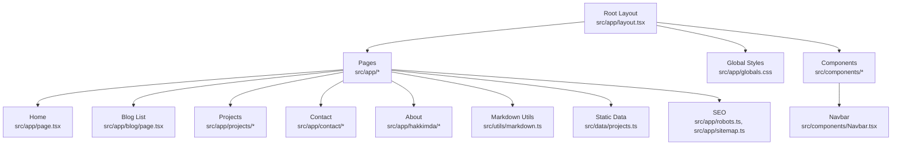

# Getting Started

<cite>
**Referenced Files in This Document**
- [package.json](file://package.json)
- [next.config.ts](file://next.config.ts)
- [tsconfig.json](file://tsconfig.json)
- [eslint.config.mjs](file://eslint.config.mjs)
- [postcss.config.mjs](file://postcss.config.mjs)
- [src/app/layout.tsx](file://src/app/layout.tsx)
- [src/app/page.tsx](file://src/app/page.tsx)
- [src/app/blog/page.tsx](file://src/app/blog/page.tsx)
- [src/utils/markdown.ts](file://src/utils/markdown.ts)
- [src/data/projects.ts](file://src/data/projects.ts)
- [src/components/Navbar.tsx](file://src/components/Navbar.tsx)
- [src/app/globals.css](file://src/app/globals.css)
- [src/app/robots.ts](file://src/app/robots.ts)
- [src/app/sitemap.ts](file://src/app/sitemap.ts)
</cite>

## Table of Contents
1. [Introduction](#introduction)
2. [Prerequisites](#prerequisites)
3. [Installation](#installation)
4. [Development Workflow](#development-workflow)
5. [Build and Deployment](#build-and-deployment)
6. [Environment Variables and Configuration](#environment-variables-and-configuration)
7. [Project Structure Overview](#project-structure-overview)
8. [Local Development Setup](#local-development-setup)
9. [Troubleshooting](#troubleshooting)
10. [Verification Checklist](#verification-checklist)
11. [Advanced Configuration](#advanced-configuration)
12. [Conclusion](#conclusion)

## Introduction
This guide helps you install, run, and deploy a Next.js portfolio and blog platform. It covers prerequisites, environment setup, dependency installation, development server startup, build process, deployment preparation, and troubleshooting. The project uses Next.js App Router, TypeScript, Tailwind CSS v4, and Markdown-based blog posts.

## Prerequisites
- Node.js: The project specifies Next.js 15.5.9 and React 19.1.0. Use a modern LTS Node.js version compatible with these packages. Confirm compatibility with your system’s package manager.
- Git: Required to clone the repository.
- Package Manager: npm, pnpm, or Yarn. The repository uses npm-style scripts in package.json.

**Section sources**
- [package.json:11-21](file://package.json#L11-L21)
- [package.json:22-33](file://package.json#L22-L33)

## Installation
Follow these steps to prepare your environment and install dependencies:

1. Clone the repository to your machine.
2. Open a terminal in the project root.
3. Install dependencies using your preferred package manager:
   - npm: npm install
   - pnpm: pnpm install
   - Yarn: yarn install

After installation, you can run the development server locally.

**Section sources**
- [package.json:5-10](file://package.json#L5-L10)

## Development Workflow
The project supports a typical Next.js development cycle:

- Run the development server with hot reloading:
  - npm run dev
  - pnpm dev
  - yarn dev

- Lint your code:
  - npm run lint

- Build for production:
  - npm run build

- Start the production server:
  - npm run start

Hot reloading is enabled by default in development mode. The project uses Turbopack for faster builds and reloads.

**Section sources**
- [package.json:5-10](file://package.json#L5-L10)

## Build and Deployment
- Build artifacts are generated during the build script execution. The project uses Turbopack by default for development and build commands.
- To start the production server after building, use the start script.
- Prepare your hosting provider to serve Next.js static exports or SSR depending on your deployment target. The project does not define a custom Next.js configuration file, so defaults apply.

**Section sources**
- [package.json:6-8](file://package.json#L6-L8)
- [next.config.ts:1-8](file://next.config.ts#L1-L8)

## Environment Variables and Configuration
- No runtime environment variables are required by default. The project does not define a .env file.
- The site metadata and routing are configured via Next.js files:
  - Global metadata and fonts are defined in the root layout.
  - Robots and sitemap generation are handled by dedicated files.
- Tailwind CSS v4 is configured via PostCSS plugin and theme tokens in global styles.

**Section sources**
- [src/app/layout.tsx:23-26](file://src/app/layout.tsx#L23-L26)
- [src/app/robots.ts:3-12](file://src/app/robots.ts#L3-L12)
- [src/app/sitemap.ts:4-36](file://src/app/sitemap.ts#L4-L36)
- [postcss.config.mjs:1-6](file://postcss.config.mjs#L1-L6)
- [src/app/globals.css:1-113](file://src/app/globals.css#L1-L113)

## Project Structure Overview
High-level structure and key areas:
- App Router pages under src/app (home, blog, projects, contact, about, etc.)
- Components under src/components (UI building blocks)
- Data under src/data (static content like projects)
- Utilities under src/utils (Markdown parsing and rendering)
- Global styles and fonts under src/app/globals.css and layout.tsx
- SEO metadata under robots.ts and sitemap.ts

**Diagram sources**
- [src/app/layout.tsx:1-58](file://src/app/layout.tsx#L1-L58)
- [src/app/page.tsx:1-15](file://src/app/page.tsx#L1-L15)
- [src/app/blog/page.tsx:1-15](file://src/app/blog/page.tsx#L1-L15)
- [src/components/Navbar.tsx:1-140](file://src/components/Navbar.tsx#L1-L140)
- [src/utils/markdown.ts:1-108](file://src/utils/markdown.ts#L1-L108)
- [src/data/projects.ts:1-43](file://src/data/projects.ts#L1-L43)
- [src/app/robots.ts:1-13](file://src/app/robots.ts#L1-L13)
- [src/app/sitemap.ts:1-37](file://src/app/sitemap.ts#L1-L37)
- [src/app/globals.css:1-113](file://src/app/globals.css#L1-L113)

## Local Development Setup
- Start the development server:
  - npm run dev
- Access the site at http://localhost:3000 by default.
- Hot reloading is enabled automatically in development mode.
- The project uses Turbopack for faster rebuilds.

Port configuration:
- The default port is 3000. If you need to change it, configure the Next.js dev server port in your environment or pass the appropriate flag to the dev command.

Linting:
- Run npm run lint to validate code quality against ESLint rules.

**Section sources**
- [package.json:5-10](file://package.json#L5-L10)
- [eslint.config.mjs:12-23](file://eslint.config.mjs#L12-L23)

## Troubleshooting
Common issues and resolutions:

- Missing content/posts directory
  - Symptom: Empty blog list or errors related to missing directory.
  - Cause: The Markdown utility expects a content/posts directory containing .md files.
  - Fix: Create the directory and add Markdown files with front matter. See the Markdown utility interface for expected front matter keys.

- Fonts not loading
  - Symptom: Text appears unstyled or fallback fonts are used.
  - Fix: Ensure the layout includes the Google Fonts links and font variables are applied in global styles.

- Tailwind classes not applying
  - Symptom: Styles appear incorrect or missing.
  - Fix: Verify Tailwind CSS v4 is installed and PostCSS plugin is configured. Check global CSS imports and theme tokens.

- Sitemap and robots not reflecting content
  - Symptom: Sitemap URLs do not include blog posts.
  - Fix: Ensure the content/posts directory exists and contains properly formatted Markdown files with front matter. Update the base URL in robots and sitemap files to match your domain.

- Lint errors
  - Symptom: ESLint reports issues.
  - Fix: Run npm run lint and address reported issues. The project uses Next.js core-web-vitals and TypeScript configs.

**Section sources**
- [src/utils/markdown.ts:79-107](file://src/utils/markdown.ts#L79-L107)
- [src/utils/markdown.ts:40-77](file://src/utils/markdown.ts#L40-L77)
- [src/app/layout.tsx:34-56](file://src/app/layout.tsx#L34-L56)
- [postcss.config.mjs:1-6](file://postcss.config.mjs#L1-L6)
- [src/app/robots.ts:4-11](file://src/app/robots.ts#L4-L11)
- [src/app/sitemap.ts:4-36](file://src/app/sitemap.ts#L4-L36)
- [eslint.config.mjs:12-23](file://eslint.config.mjs#L12-L23)

## Verification Checklist
- Dependencies installed: npm install completes without errors.
- Development server starts: npm run dev runs without errors and opens http://localhost:3000.
- Blog posts visible: content/posts exists and contains Markdown files; blog page lists posts.
- Navigation works: Navbar links navigate correctly across routes.
- SEO metadata present: robots and sitemap files render without errors.
- Styling applied: Tailwind classes and fonts are visible in the browser.

**Section sources**
- [package.json:5-10](file://package.json#L5-L10)
- [src/app/blog/page.tsx:10-14](file://src/app/blog/page.tsx#L10-L14)
- [src/components/Navbar.tsx:20-136](file://src/components/Navbar.tsx#L20-L136)
- [src/app/robots.ts:3-12](file://src/app/robots.ts#L3-L12)
- [src/app/sitemap.ts:4-36](file://src/app/sitemap.ts#L4-L36)
- [src/app/globals.css:1-113](file://src/app/globals.css#L1-L113)

## Advanced Configuration
- TypeScript strictness and module resolution
  - The project enables strict TypeScript checks and uses bundler module resolution. Adjust tsconfig.json if you need different compiler options.

- Next.js configuration
  - next.config.ts currently defines an empty configuration object. Add custom Next.js settings (image optimization, redirects, headers, etc.) as needed.

- PostCSS and Tailwind
  - Tailwind CSS v4 is configured via @tailwindcss/postcss plugin. Customize theme tokens and utilities in globals.css.

- Markdown pipeline
  - The Markdown utility uses gray-matter for front matter and remark with remark-html for conversion. Extend or modify the pipeline by editing the utility functions.

- Static data
  - Projects data is statically imported. Add or edit entries in projects.ts for portfolio content.

**Section sources**
- [tsconfig.json:2-27](file://tsconfig.json#L2-L27)
- [next.config.ts:3-5](file://next.config.ts#L3-L5)
- [postcss.config.mjs:1-6](file://postcss.config.mjs#L1-L6)
- [src/app/globals.css:1-113](file://src/app/globals.css#L1-L113)
- [src/utils/markdown.ts:1-108](file://src/utils/markdown.ts#L1-L108)
- [src/data/projects.ts:1-43](file://src/data/projects.ts#L1-L43)

## Conclusion
You now have the essentials to install, develop, build, and deploy the Next.js portfolio and blog platform. Use the development server for rapid iteration, verify content and styling, and prepare your environment variables and hosting for production. For advanced customization, adjust TypeScript, Next.js, PostCSS/Tailwind, and Markdown configurations as needed.