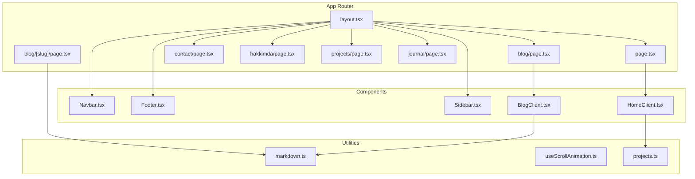
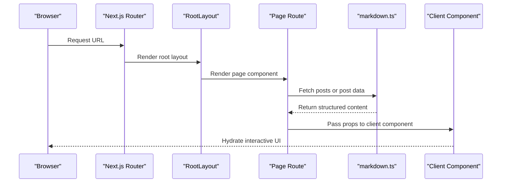
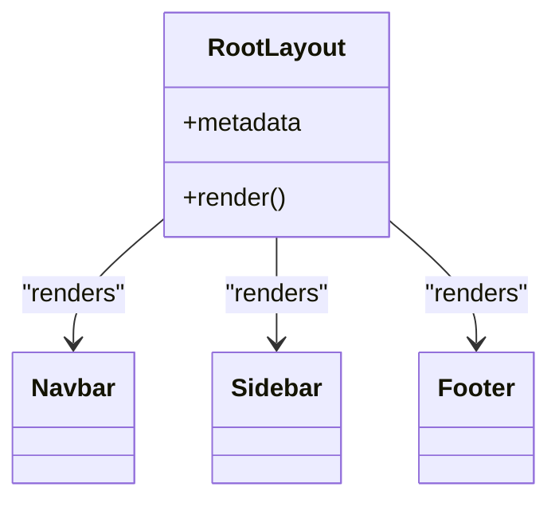
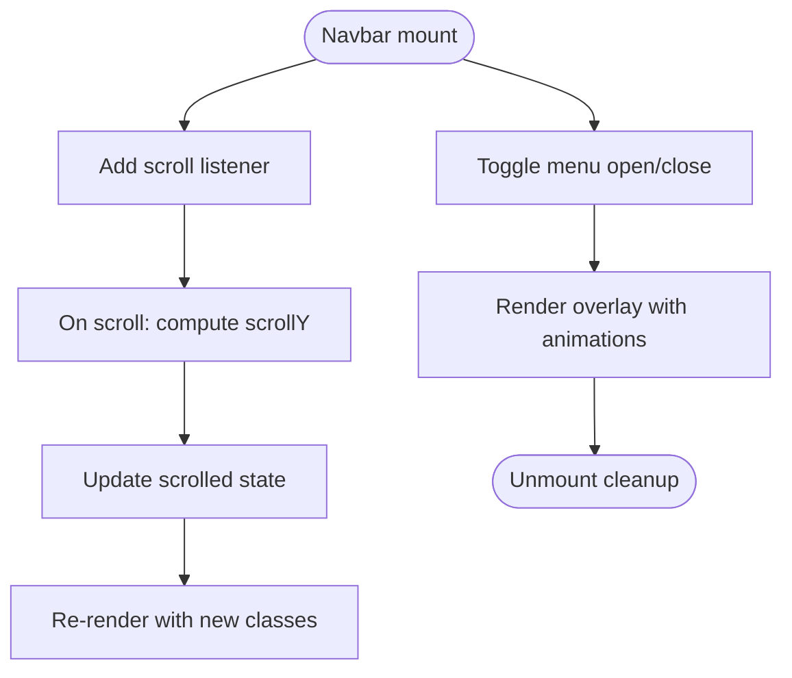
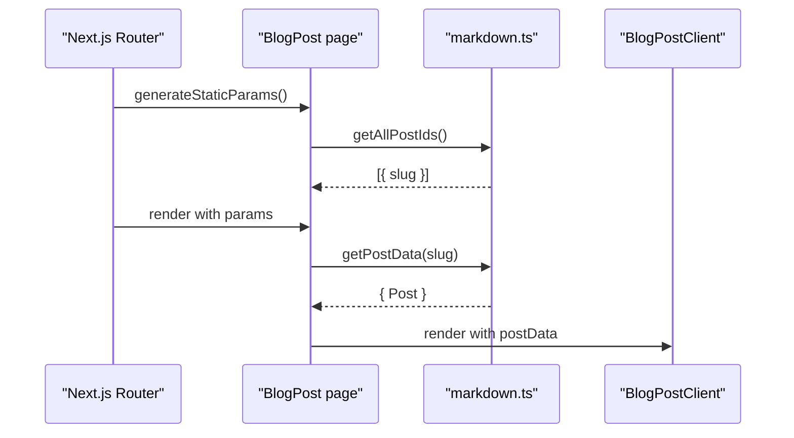
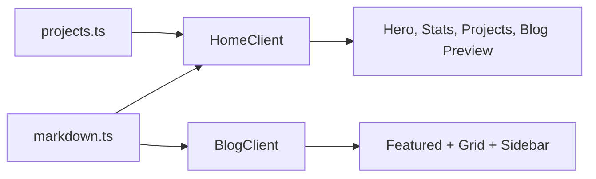
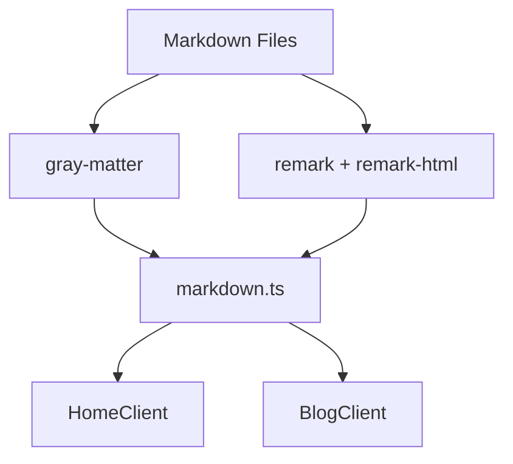
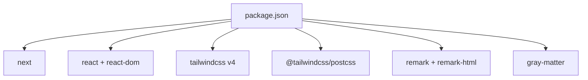

# Architecture Overview

<cite>
**Referenced Files in This Document**
- [layout.tsx](file://src/app/layout.tsx)
- [globals.css](file://src/app/globals.css)
- [page.tsx](file://src/app/page.tsx)
- [blog/[slug]/page.tsx](file://src/app/blog/[slug]/page.tsx)
- [Navbar.tsx](file://src/components/Navbar.tsx)
- [Footer.tsx](file://src/components/Footer.tsx)
- [Sidebar.tsx](file://src/components/Sidebar.tsx)
- [HomeClient.tsx](file://src/components/HomeClient.tsx)
- [BlogClient.tsx](file://src/components/BlogClient.tsx)
- [markdown.ts](file://src/utils/markdown.ts)
- [useScrollAnimation.ts](file://src/hooks/useScrollAnimation.ts)
- [projects.ts](file://src/data/projects.ts)
- [package.json](file://package.json)
- [next.config.ts](file://next.config.ts)
- [postcss.config.mjs](file://postcss.config.mjs)
</cite>

## Table of Contents
1. [Introduction](#introduction)
2. [Project Structure](#project-structure)
3. [Core Components](#core-components)
4. [Architecture Overview](#architecture-overview)
5. [Detailed Component Analysis](#detailed-component-analysis)
6. [Dependency Analysis](#dependency-analysis)
7. [Performance Considerations](#performance-considerations)
8. [Troubleshooting Guide](#troubleshooting-guide)
9. [Conclusion](#conclusion)

## Introduction
This document presents the architectural design of a modern portfolio and blog platform built with Next.js App Router. It explains the file-based routing model, dynamic routes for blog posts, component hierarchy from root layout to content layers, and the separation between server-side rendering for SEO and client-side interactivity. It also documents data flow patterns from content sources through utility functions to component presentation, design patterns such as component composition and custom hooks, the styling architecture with Tailwind CSS and design tokens, and build/deployment characteristics including static site generation and performance optimizations.

## Project Structure
The project follows Next.js App Router conventions with a strict file-based routing model. The application is organized around:
- App directory with route segments and pages
- Shared UI components under components/
- Utility modules under utils/
- Design tokens and global styles under app/globals.css
- Static assets under public/images

**Diagram sources**
- [layout.tsx:1-58](file://src/app/layout.tsx#L1-L58)
- [page.tsx:1-15](file://src/app/page.tsx#L1-L15)
- [blog/[slug]/page.tsx:1-18](file://src/app/blog/[slug]/page.tsx#L1-L18)
- [Navbar.tsx:1-140](file://src/components/Navbar.tsx#L1-L140)
- [Footer.tsx:1-49](file://src/components/Footer.tsx#L1-L49)
- [Sidebar.tsx:1-20](file://src/components/Sidebar.tsx#L1-L20)
- [HomeClient.tsx:1-212](file://src/components/HomeClient.tsx#L1-L212)
- [BlogClient.tsx:1-166](file://src/components/BlogClient.tsx#L1-L166)
- [markdown.ts:1-108](file://src/utils/markdown.ts#L1-L108)
- [useScrollAnimation.ts:1-51](file://src/hooks/useScrollAnimation.ts#L1-L51)
- [projects.ts](file://src/data/projects.ts)

**Section sources**
- [layout.tsx:1-58](file://src/app/layout.tsx#L1-L58)
- [page.tsx:1-15](file://src/app/page.tsx#L1-L15)
- [blog/[slug]/page.tsx:1-18](file://src/app/blog/[slug]/page.tsx#L1-L18)

## Core Components
- Root layout: Provides global metadata, fonts, theme tokens, and composes shared UI (navigation, sidebar, footer).
- Page routes: Render content using server-side rendering for SEO and pass data to client components for interactivity.
- Content utilities: Parse markdown files, extract front matter, and convert markdown to HTML.
- Client components: Present blog feeds, hero sections, and interactive experiences with animations and transitions.
- Hooks: Encapsulate cross-cutting concerns like scroll-based animations.

Key architectural patterns:
- Component composition: Root layout composes Navbar, Sidebar, and Footer; page routes compose client components.
- Separation of concerns: Server-side rendering for SEO and metadata; client components manage interactivity.
- Modular architecture: Utilities and data modules are decoupled from UI.

**Section sources**
- [layout.tsx:23-57](file://src/app/layout.tsx#L23-L57)
- [page.tsx:10-14](file://src/app/page.tsx#L10-L14)
- [markdown.ts:24-107](file://src/utils/markdown.ts#L24-L107)
- [HomeClient.tsx:12-212](file://src/components/HomeClient.tsx#L12-L212)
- [BlogClient.tsx:12-166](file://src/components/BlogClient.tsx#L12-L166)
- [useScrollAnimation.ts:5-50](file://src/hooks/useScrollAnimation.ts#L5-L50)

## Architecture Overview
The platform uses Next.js App Router with file-based routing. Dynamic routes resolve blog slugs, while static routes serve the home page and other sections. The root layout centralizes design tokens and global UI. Server-side rendering generates SEO-friendly HTML, and client components add interactivity.

**Diagram sources**
- [layout.tsx:28-56](file://src/app/layout.tsx#L28-L56)
- [page.tsx:10-14](file://src/app/page.tsx#L10-L14)
- [blog/[slug]/page.tsx:12-17](file://src/app/blog/[slug]/page.tsx#L12-L17)
- [markdown.ts:40-107](file://src/utils/markdown.ts#L40-L107)
- [HomeClient.tsx:12-212](file://src/components/HomeClient.tsx#L12-L212)
- [BlogClient.tsx:12-166](file://src/components/BlogClient.tsx#L12-L166)

## Detailed Component Analysis

### Root Layout and Global Styles
The root layout defines metadata, loads Google Fonts, injects Material Symbols, and applies design tokens via Tailwind CSS variables. It composes shared UI elements and centers content within a responsive container.

**Diagram sources**
- [layout.tsx:28-56](file://src/app/layout.tsx#L28-L56)
- [Navbar.tsx:7-139](file://src/components/Navbar.tsx#L7-L139)
- [Sidebar.tsx:4-19](file://src/components/Sidebar.tsx#L4-L19)
- [Footer.tsx:3-48](file://src/components/Footer.tsx#L3-L48)

**Section sources**
- [layout.tsx:23-57](file://src/app/layout.tsx#L23-L57)
- [globals.css:4-66](file://src/app/globals.css#L4-L66)

### Navigation Component
The Navbar manages scroll-aware styling, mobile menu overlay, and active link highlighting. It uses Next.js navigation primitives and Tailwind utilities for responsive behavior.

**Diagram sources**
- [Navbar.tsx:12-18](file://src/components/Navbar.tsx#L12-L18)
- [Navbar.tsx:77-134](file://src/components/Navbar.tsx#L77-L134)

**Section sources**
- [Navbar.tsx:7-139](file://src/components/Navbar.tsx#L7-L139)

### Blog Post Dynamic Route
The dynamic route for blog posts uses static generation with generated paths. It fetches post data via a utility and renders a client component for interactive presentation.

**Diagram sources**
- [blog/[slug]/page.tsx:5-17](file://src/app/blog/[slug]/page.tsx#L5-L17)
- [markdown.ts:24-38](file://src/utils/markdown.ts#L24-L38)
- [markdown.ts:79-107](file://src/utils/markdown.ts#L79-L107)

**Section sources**
- [blog/[slug]/page.tsx:1-18](file://src/app/blog/[slug]/page.tsx#L1-L18)
- [markdown.ts:24-107](file://src/utils/markdown.ts#L24-L107)

### Content Presentation Layers
- Home page: Server-side renders sorted posts and passes them to HomeClient for interactive presentation.
- Blog list: Server-side renders a feed and passes initial posts to BlogClient for interactive layouts.
- Client components: Use Framer Motion for animations, Tailwind utilities for styling, and Next.js Image for optimized media.

**Diagram sources**
- [page.tsx:10-14](file://src/app/page.tsx#L10-L14)
- [HomeClient.tsx:12-212](file://src/components/HomeClient.tsx#L12-L212)
- [BlogClient.tsx:12-166](file://src/components/BlogClient.tsx#L12-L166)
- [markdown.ts:40-77](file://src/utils/markdown.ts#L40-L77)
- [projects.ts](file://src/data/projects.ts)

**Section sources**
- [page.tsx:10-14](file://src/app/page.tsx#L10-L14)
- [HomeClient.tsx:12-212](file://src/components/HomeClient.tsx#L12-L212)
- [BlogClient.tsx:12-166](file://src/components/BlogClient.tsx#L12-L166)

### Data Flow Patterns
- Content sources: Markdown files under content/posts with front matter.
- Utilities: Parse front matter, sort posts, convert markdown to HTML.
- Presentation: Client components receive structured data and render UI.

**Diagram sources**
- [markdown.ts:1-108](file://src/utils/markdown.ts#L1-L108)

**Section sources**
- [markdown.ts:1-108](file://src/utils/markdown.ts#L1-L108)

### Design Patterns
- Component composition: Root layout composes shared UI; page routes compose client components.
- Custom hooks: useScrollAnimation encapsulates scroll and parallax logic.
- Modular architecture: Utilities and data modules are separate from UI.

**Section sources**
- [useScrollAnimation.ts:5-50](file://src/hooks/useScrollAnimation.ts#L5-L50)

## Dependency Analysis
The project relies on Next.js for routing and SSR/SSG, Tailwind CSS v4 for styling, and remark ecosystem for markdown processing. The build pipeline integrates Tailwind via PostCSS.

**Diagram sources**
- [package.json:11-34](file://package.json#L11-L34)
- [postcss.config.mjs:1-6](file://postcss.config.mjs#L1-L6)

**Section sources**
- [package.json:11-34](file://package.json#L11-L34)
- [postcss.config.mjs:1-6](file://postcss.config.mjs#L1-L6)

## Performance Considerations
- Static generation: Dynamic blog routes leverage generateStaticParams for pre-rendered pages, improving load times and SEO.
- Client hydration: Client components are marked with "use client" and only hydrate interactive parts.
- Asset optimization: Next.js Image is used for optimized images; Tailwind utilities minimize CSS overhead.
- Build configuration: Next.js Turbopack is enabled for faster development builds.

[No sources needed since this section provides general guidance]

## Troubleshooting Guide
Common areas to inspect:
- Routing: Verify dynamic route generation and slug resolution.
- Content parsing: Ensure markdown files exist and front matter is valid.
- Fonts and icons: Confirm Google Fonts and Material Symbols are loaded.
- Styling: Check Tailwind variables and custom CSS classes.

**Section sources**
- [blog/[slug]/page.tsx:5-17](file://src/app/blog/[slug]/page.tsx#L5-L17)
- [markdown.ts:24-38](file://src/utils/markdown.ts#L24-L38)
- [layout.tsx:36-43](file://src/app/layout.tsx#L36-L43)
- [globals.css:4-66](file://src/app/globals.css#L4-L66)

## Conclusion
The platform employs a clean separation between server-side rendering for SEO and client-side interactivity, with a modular architecture that separates content utilities from UI components. The design system is driven by Tailwind CSS and a centralized token system, while Next.js App Router enables efficient file-based routing and static generation for performance.