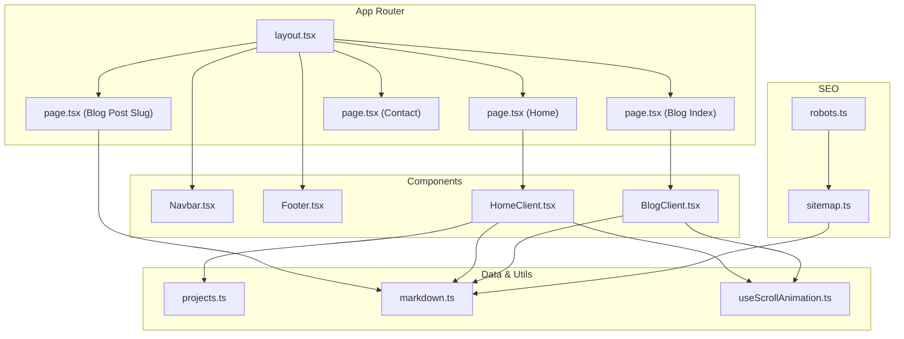
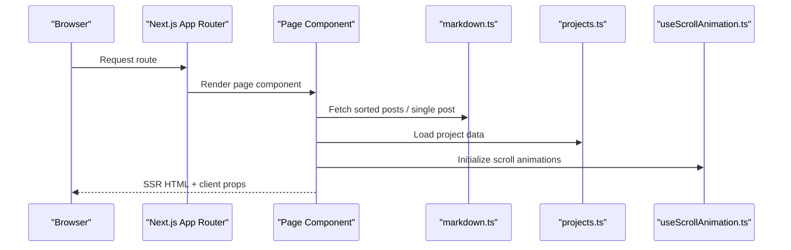
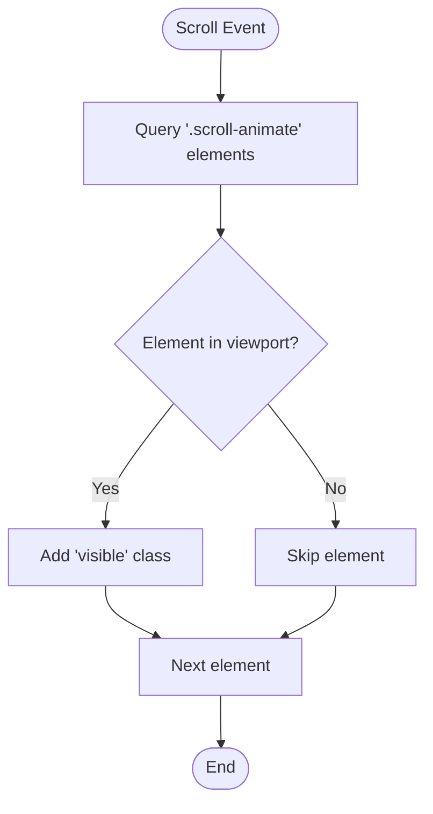
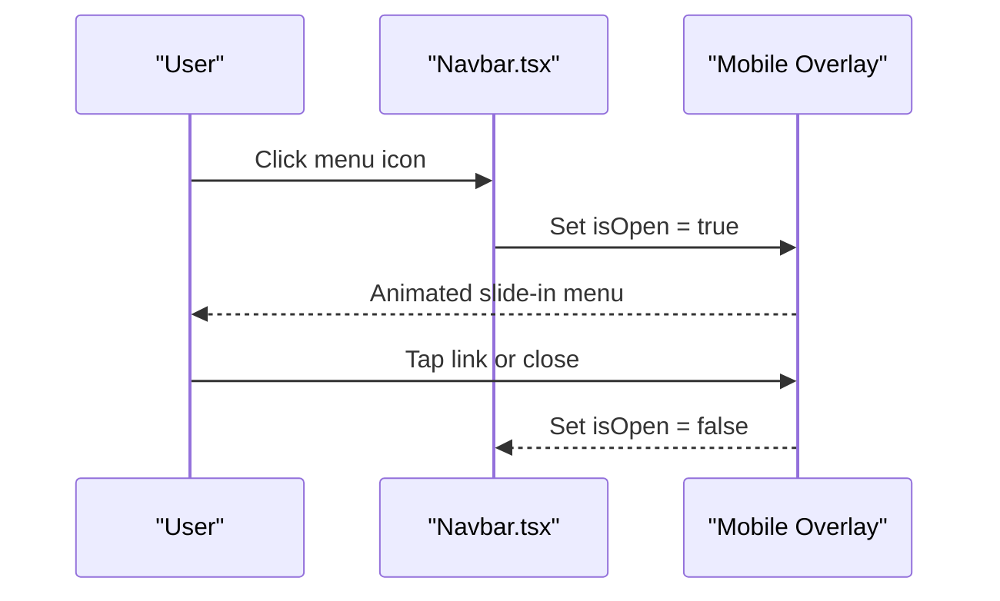
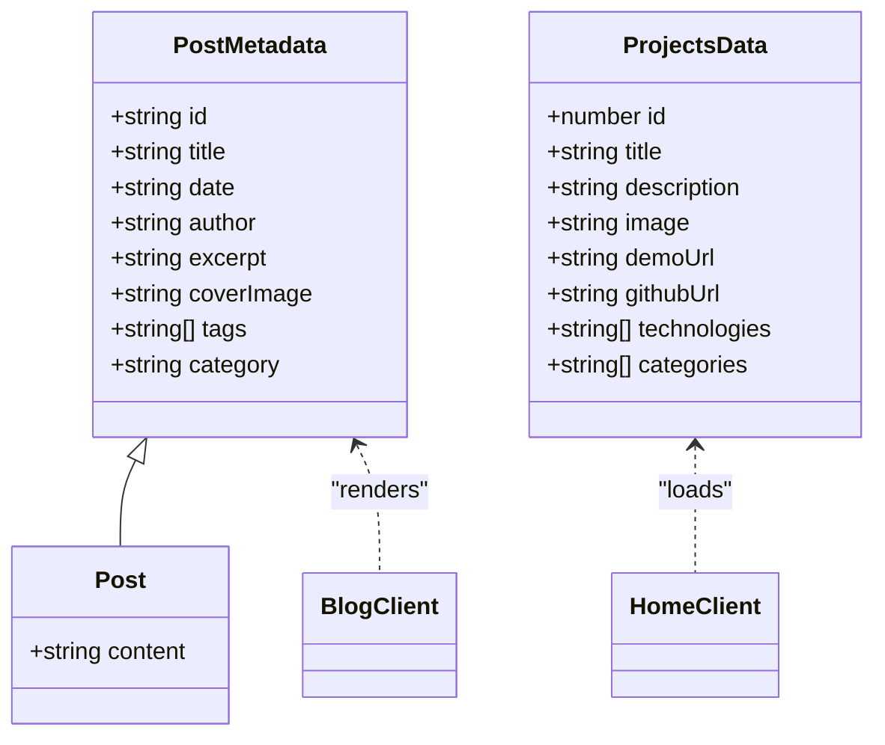
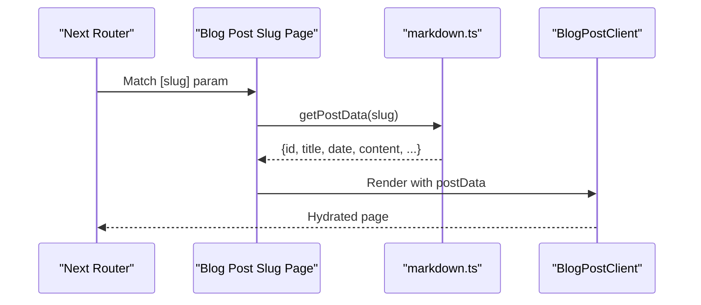
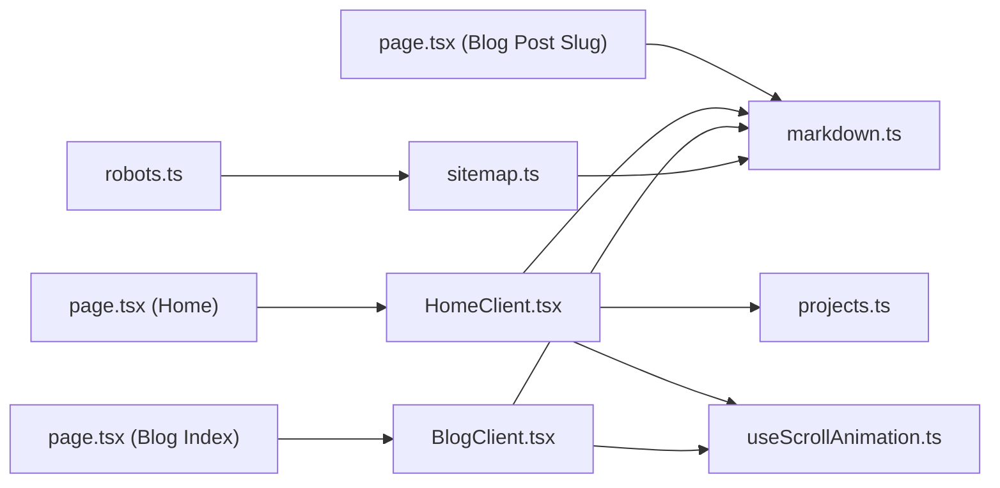

# Features Overview

<cite>
**Referenced Files in This Document**
- [layout.tsx](file://src/app/layout.tsx)
- [Navbar.tsx](file://src/components/Navbar.tsx)
- [Footer.tsx](file://src/components/Footer.tsx)
- [HomeClient.tsx](file://src/components/HomeClient.tsx)
- [BlogClient.tsx](file://src/components/BlogClient.tsx)
- [page.tsx (Home)](file://src/app/page.tsx)
- [page.tsx (Blog Index)](file://src/app/blog/page.tsx)
- [page.tsx (Blog Post Slug)](file://src/app/blog/[slug]/page.tsx)
- [markdown.ts](file://src/utils/markdown.ts)
- [projects.ts](file://src/data/projects.ts)
- [useScrollAnimation.ts](file://src/hooks/useScrollAnimation.ts)
- [page.tsx (Contact)](file://src/app/contact/page.tsx)
- [sitemap.ts](file://src/app/sitemap.ts)
- [robots.ts](file://src/app/robots.ts)
</cite>

## Table of Contents
1. Introduction
2. Project Structure
3. Core Components
4. Architecture Overview
5. Detailed Component Analysis
6. Dependency Analysis
7. Performance Considerations
8. Troubleshooting Guide
9. Conclusion

## Introduction
This section documents the key features that define the portfolio and blog platform. The platform combines a professional project showcase with a technical blog, emphasizing modern aesthetics and interactive experiences. It leverages Next.js App Router for routing and metadata, markdown-driven content for blogs, structured JSON for projects, responsive design with a dark theme and glass-morphism visuals, and interactive elements such as scroll animations and parallax effects. Navigation is optimized for both desktop and mobile, while SEO is supported through automatic sitemap generation and robots.txt configuration. The contact form and social media integration points are integrated into a cohesive user experience.

## Project Structure
The platform follows a Next.js App Router structure with a clear separation between pages, components, data, and utilities. Pages under src/app define routes and metadata, while reusable UI components live under src/components. Content is managed via markdown files for blog posts and a TypeScript data file for projects. Utilities encapsulate content parsing and rendering logic. The global layout applies fonts, theme, and shared UI elements.

**Diagram sources**
- [layout.tsx:1-58](file://src/app/layout.tsx#L1-L58)
- [Navbar.tsx:1-140](file://src/components/Navbar.tsx#L1-L140)
- [Footer.tsx:1-49](file://src/components/Footer.tsx#L1-L49)
- [HomeClient.tsx:1-212](file://src/components/HomeClient.tsx#L1-L212)
- [BlogClient.tsx:1-166](file://src/components/BlogClient.tsx#L1-L166)
- [page.tsx (Home):1-15](file://src/app/page.tsx#L1-L15)
- [page.tsx (Blog Index):1-15](file://src/app/blog/page.tsx#L1-L15)
- [page.tsx (Blog Post Slug):1-18](file://src/app/blog/[slug]/page.tsx#L1-L18)
- [markdown.ts:1-108](file://src/utils/markdown.ts#L1-L108)
- [projects.ts:1-43](file://src/data/projects.ts#L1-L43)
- [useScrollAnimation.ts:1-51](file://src/hooks/useScrollAnimation.ts#L1-L51)
- [sitemap.ts:1-37](file://src/app/sitemap.ts#L1-L37)
- [robots.ts:1-13](file://src/app/robots.ts#L1-L13)

**Section sources**
- [layout.tsx:1-58](file://src/app/layout.tsx#L1-L58)
- [page.tsx (Home):1-15](file://src/app/page.tsx#L1-L15)
- [page.tsx (Blog Index):1-15](file://src/app/blog/page.tsx#L1-L15)
- [page.tsx (Blog Post Slug):1-18](file://src/app/blog/[slug]/page.tsx#L1-L18)
- [markdown.ts:1-108](file://src/utils/markdown.ts#L1-L108)
- [projects.ts:1-43](file://src/data/projects.ts#L1-L43)
- [useScrollAnimation.ts:1-51](file://src/hooks/useScrollAnimation.ts#L1-L51)
- [sitemap.ts:1-37](file://src/app/sitemap.ts#L1-L37)
- [robots.ts:1-13](file://src/app/robots.ts#L1-L13)

## Core Components
- Global layout and theme: The root layout sets the dark theme, loads typography, and renders shared header, sidebar, and footer components. It also injects Material Symbols styles for icons.
- Navigation: The navbar adapts to scroll with a backdrop blur effect and supports desktop and mobile menus with animated transitions.
- Footer: Provides links to documentation, privacy, and social profiles, along with latency indicators.
- Home client: Presents hero content, stats, featured projects, and recent blog posts with interactive hover states and terminal-style visuals.
- Blog client: Renders a curated feed of posts with a featured article, regular articles, and a sidebar with author and category placeholders.
- Content utilities: Markdown parsing extracts front matter and converts content to HTML, while project data is loaded from a structured dataset.
- Scroll animation hook: Implements scroll-triggered visibility and parallax effects for layered hero content.
- Contact page: Includes a styled form, social connection cards, and geographic anchor visualization.
- SEO: Automatic sitemap generation and robots.txt configuration ensure discoverability.

**Section sources**
- [layout.tsx:1-58](file://src/app/layout.tsx#L1-L58)
- [Navbar.tsx:1-140](file://src/components/Navbar.tsx#L1-L140)
- [Footer.tsx:1-49](file://src/components/Footer.tsx#L1-L49)
- [HomeClient.tsx:1-212](file://src/components/HomeClient.tsx#L1-L212)
- [BlogClient.tsx:1-166](file://src/components/BlogClient.tsx#L1-L166)
- [markdown.ts:1-108](file://src/utils/markdown.ts#L1-L108)
- [projects.ts:1-43](file://src/data/projects.ts#L1-L43)
- [useScrollAnimation.ts:1-51](file://src/hooks/useScrollAnimation.ts#L1-L51)
- [page.tsx (Contact):1-154](file://src/app/contact/page.tsx#L1-L154)
- [sitemap.ts:1-37](file://src/app/sitemap.ts#L1-L37)
- [robots.ts:1-13](file://src/app/robots.ts#L1-L13)

## Architecture Overview
The platform uses Next.js App Router with static generation for blog post detail pages and server-rendered metadata. Content is managed separately for blogs (markdown) and projects (structured data), enabling efficient rendering and maintainability. Interactive enhancements are client-side hooks and Framer Motion animations.

**Diagram sources**
- [page.tsx (Blog Post Slug):1-18](file://src/app/blog/[slug]/page.tsx#L1-L18)
- [page.tsx (Blog Index):1-15](file://src/app/blog/page.tsx#L1-L15)
- [page.tsx (Home):1-15](file://src/app/page.tsx#L1-L15)
- [markdown.ts:1-108](file://src/utils/markdown.ts#L1-L108)
- [projects.ts:1-43](file://src/data/projects.ts#L1-L43)
- [useScrollAnimation.ts:1-51](file://src/hooks/useScrollAnimation.ts#L1-L51)

## Detailed Component Analysis

### Responsive Design and Dark Theme with Glass-Morphism
- Dark theme: The root layout applies a dark class and gradient backgrounds for depth.
- Typography: Google Fonts are injected via Next.js font variables for consistent headings and mono fonts.
- Glass-morphism: Surface containers, backdrop blur, and subtle borders create translucent panels and overlays.
- Adaptive layouts: Components use responsive grids and breakpoints to optimize readability and spacing across devices.

**Section sources**
- [layout.tsx:1-58](file://src/app/layout.tsx#L1-L58)
- [HomeClient.tsx:1-212](file://src/components/HomeClient.tsx#L1-L212)
- [BlogClient.tsx:1-166](file://src/components/BlogClient.tsx#L1-L166)
- [page.tsx (Contact):1-154](file://src/app/contact/page.tsx#L1-L154)

### Interactive Elements: Scroll Animations and Parallax
- Scroll-triggered visibility: The hook detects elements entering the viewport and toggles visibility classes for fade-in effects.
- Parallax hero/content: Background and content layers move at different speeds during scroll to create depth.
- Smooth transitions: Hover states on images and cards scale and transition with easing for tactile feedback.

**Diagram sources**
- [useScrollAnimation.ts:1-51](file://src/hooks/useScrollAnimation.ts#L1-L51)

**Section sources**
- [useScrollAnimation.ts:1-51](file://src/hooks/useScrollAnimation.ts#L1-L51)
- [HomeClient.tsx:1-212](file://src/components/HomeClient.tsx#L1-L212)
- [BlogClient.tsx:1-166](file://src/components/BlogClient.tsx#L1-L166)

### Navigation System: Desktop and Mobile Interfaces
- Desktop: Fixed header with logo, navigation links, and CTA buttons; active link highlighting based on pathname.
- Mobile: Slide-in overlay menu with staggered entrance animations and persistent footer gradient overlay.
- Accessibility: Semantic markup, focus states, and controlled open/close behavior.

**Diagram sources**
- [Navbar.tsx:1-140](file://src/components/Navbar.tsx#L1-L140)

**Section sources**
- [Navbar.tsx:1-140](file://src/components/Navbar.tsx#L1-L140)
- [Footer.tsx:1-49](file://src/components/Footer.tsx#L1-L49)

### Content Management: Markdown for Blogs and Structured Data for Projects
- Blog posts: Stored as markdown with front matter (title, date, excerpt, category, cover image). Utility functions read, parse, sort, and convert to HTML.
- Project showcase: Project entries are defined in a TypeScript array with fields for title, description, images, URLs, technologies, and categories.
- Rendering: Home and blog pages fetch content and pass initial props to client components for hydration.

**Diagram sources**
- [markdown.ts:9-22](file://src/utils/markdown.ts#L9-L22)
- [projects.ts:1-43](file://src/data/projects.ts#L1-L43)
- [HomeClient.tsx:1-212](file://src/components/HomeClient.tsx#L1-L212)
- [BlogClient.tsx:1-166](file://src/components/BlogClient.tsx#L1-L166)

**Section sources**
- [markdown.ts:1-108](file://src/utils/markdown.ts#L1-L108)
- [projects.ts:1-43](file://src/data/projects.ts#L1-L43)
- [page.tsx (Blog Index):1-15](file://src/app/blog/page.tsx#L1-L15)
- [page.tsx (Blog Post Slug):1-18](file://src/app/blog/[slug]/page.tsx#L1-L18)
- [page.tsx (Home):1-15](file://src/app/page.tsx#L1-L15)

### Professional Project Showcase
- Curated selection: The home client displays a subset of projects with cover images, descriptions, and technology tags.
- Visual polish: Hover scaling, grayscale transitions, and gradient overlays enhance perceived depth.
- Call-to-action: Links to project repositories and a dedicated projects page for the full catalog.

**Section sources**
- [HomeClient.tsx:1-212](file://src/components/HomeClient.tsx#L1-L212)
- [projects.ts:1-43](file://src/data/projects.ts#L1-L43)

### Technical Blogging Capabilities
- Static generation: Post detail pages are generated statically using dynamic routes and a static params generator.
- Content rendering: Front matter is parsed and markdown content is transformed to HTML for safe rendering.
- Feed presentation: The blog client organizes a featured post and a grid of regular posts with metadata and excerpts.

**Diagram sources**
- [page.tsx (Blog Post Slug):1-18](file://src/app/blog/[slug]/page.tsx#L1-L18)
- [markdown.ts:79-107](file://src/utils/markdown.ts#L79-L107)
- [BlogClient.tsx:1-166](file://src/components/BlogClient.tsx#L1-L166)

**Section sources**
- [page.tsx (Blog Post Slug):1-18](file://src/app/blog/[slug]/page.tsx#L1-L18)
- [markdown.ts:79-107](file://src/utils/markdown.ts#L79-L107)
- [BlogClient.tsx:1-166](file://src/components/BlogClient.tsx#L1-L166)

### Contact Form and Social Media Integration
- Contact form: Styled inputs and textarea with focus states, a prominent submit button, and semantic labeling.
- Social connections: Cards linking to GitHub, LinkedIn, and X/Twitter with hover animations and directional icons.
- Geographic anchor: A stylized map visualization with location metadata and gradient overlays.

**Section sources**
- [page.tsx (Contact):1-154](file://src/app/contact/page.tsx#L1-L154)
- [Footer.tsx:1-49](file://src/components/Footer.tsx#L1-L49)

### SEO Optimization: Sitemap and Robots
- Automatic sitemap: Generates URLs for the home, blog, about, and all blog posts with appropriate priorities and change frequencies.
- Robots configuration: Allows indexing and specifies the sitemap URL for crawlers.

**Section sources**
- [sitemap.ts:1-37](file://src/app/sitemap.ts#L1-L37)
- [robots.ts:1-13](file://src/app/robots.ts#L1-L13)

### Performance Optimizations: Server-Side Rendering and Static Site Generation
- Server-rendered metadata: Pages define metadata for improved initial load and SEO.
- Static generation for posts: Dynamic blog post pages are pre-rendered at build time, reducing runtime work and improving speed.
- Client hydration: Interactive components hydrate after SSR, preserving SEO benefits while adding motion and scroll effects.

**Section sources**
- [page.tsx (Home):1-15](file://src/app/page.tsx#L1-L15)
- [page.tsx (Blog Post Slug):1-18](file://src/app/blog/[slug]/page.tsx#L1-L18)
- [HomeClient.tsx:1-212](file://src/components/HomeClient.tsx#L1-L212)
- [BlogClient.tsx:1-166](file://src/components/BlogClient.tsx#L1-L166)

## Dependency Analysis
The platform exhibits low coupling between concerns:
- Pages depend on utilities for content retrieval and on client components for rendering.
- Client components depend on data providers and hooks for interactivity.
- SEO utilities depend on content utilities to enumerate posts.

**Diagram sources**
- [page.tsx (Home):1-15](file://src/app/page.tsx#L1-L15)
- [page.tsx (Blog Index):1-15](file://src/app/blog/page.tsx#L1-L15)
- [page.tsx (Blog Post Slug):1-18](file://src/app/blog/[slug]/page.tsx#L1-L18)
- [HomeClient.tsx:1-212](file://src/components/HomeClient.tsx#L1-L212)
- [BlogClient.tsx:1-166](file://src/components/BlogClient.tsx#L1-L166)
- [markdown.ts:1-108](file://src/utils/markdown.ts#L1-L108)
- [projects.ts:1-43](file://src/data/projects.ts#L1-L43)
- [useScrollAnimation.ts:1-51](file://src/hooks/useScrollAnimation.ts#L1-L51)
- [sitemap.ts:1-37](file://src/app/sitemap.ts#L1-L37)
- [robots.ts:1-13](file://src/app/robots.ts#L1-L13)

**Section sources**
- [page.tsx (Home):1-15](file://src/app/page.tsx#L1-L15)
- [page.tsx (Blog Index):1-15](file://src/app/blog/page.tsx#L1-L15)
- [page.tsx (Blog Post Slug):1-18](file://src/app/blog/[slug]/page.tsx#L1-L18)
- [HomeClient.tsx:1-212](file://src/components/HomeClient.tsx#L1-L212)
- [BlogClient.tsx:1-166](file://src/components/BlogClient.tsx#L1-L166)
- [markdown.ts:1-108](file://src/utils/markdown.ts#L1-L108)
- [projects.ts:1-43](file://src/data/projects.ts#L1-L43)
- [useScrollAnimation.ts:1-51](file://src/hooks/useScrollAnimation.ts#L1-L51)
- [sitemap.ts:1-37](file://src/app/sitemap.ts#L1-L37)
- [robots.ts:1-13](file://src/app/robots.ts#L1-L13)

## Performance Considerations
- Static generation for blog detail pages reduces server load and improves response times.
- Client-side animations and scroll effects are opt-in and initialized after hydration to avoid blocking render.
- Minimal third-party dependencies and efficient CSS-in-JS via Tailwind reduce bundle overhead.
- Image optimization through Next.js Image component ensures responsive assets and lazy loading.

## Troubleshooting Guide
- Missing content: Verify that the content directory exists and markdown files include required front matter fields.
- Broken links: Confirm sitemap URLs match the deployed domain and robots.txt allows crawling.
- Animation not triggering: Ensure elements have the expected classes and the scroll event listener is attached after mount.
- Mobile menu not closing: Check that overlay state toggles correctly and click handlers update state.

**Section sources**
- [markdown.ts:24-38](file://src/utils/markdown.ts#L24-L38)
- [sitemap.ts:4-13](file://src/app/sitemap.ts#L4-L13)
- [robots.ts:3-11](file://src/app/robots.ts#L3-L11)
- [useScrollAnimation.ts:5-49](file://src/hooks/useScrollAnimation.ts#L5-L49)
- [Navbar.tsx:66-74](file://src/components/Navbar.tsx#L66-L74)

## Conclusion
The platform delivers a cohesive blend of professional portfolio presentation and technical blogging, enriched by a dark theme, glass-morphism visuals, and interactive motion. Its responsive navigation, SEO-ready infrastructure, and content-first architecture contribute to a strong user experience across devices and use cases.