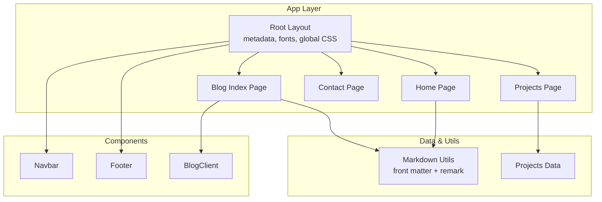
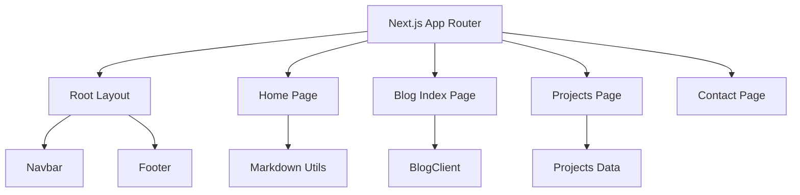
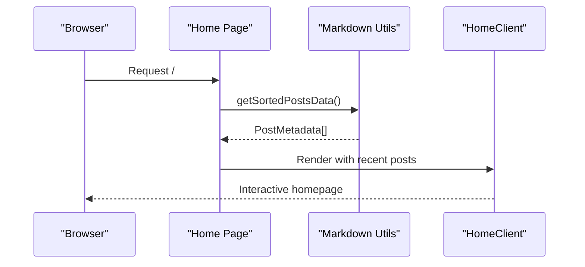
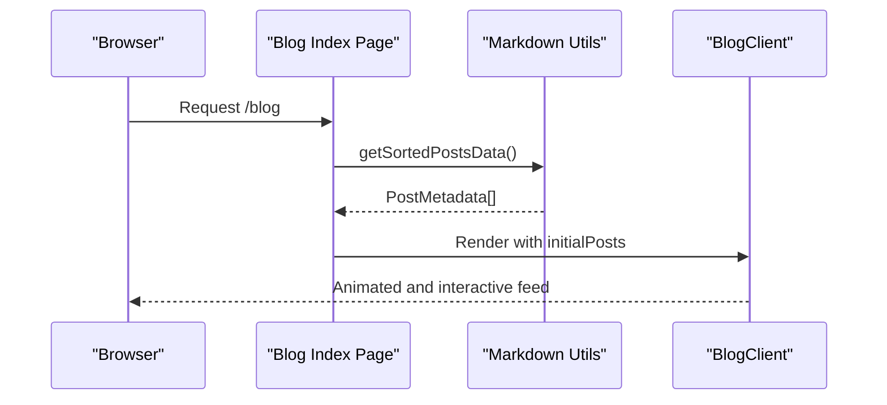
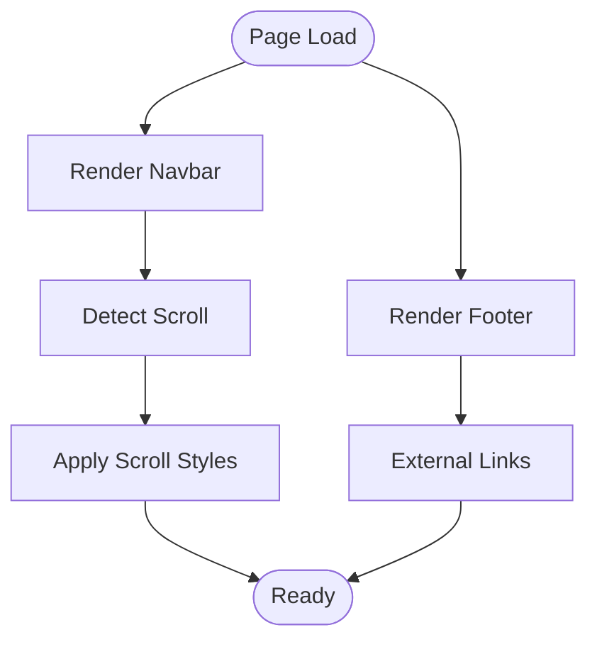
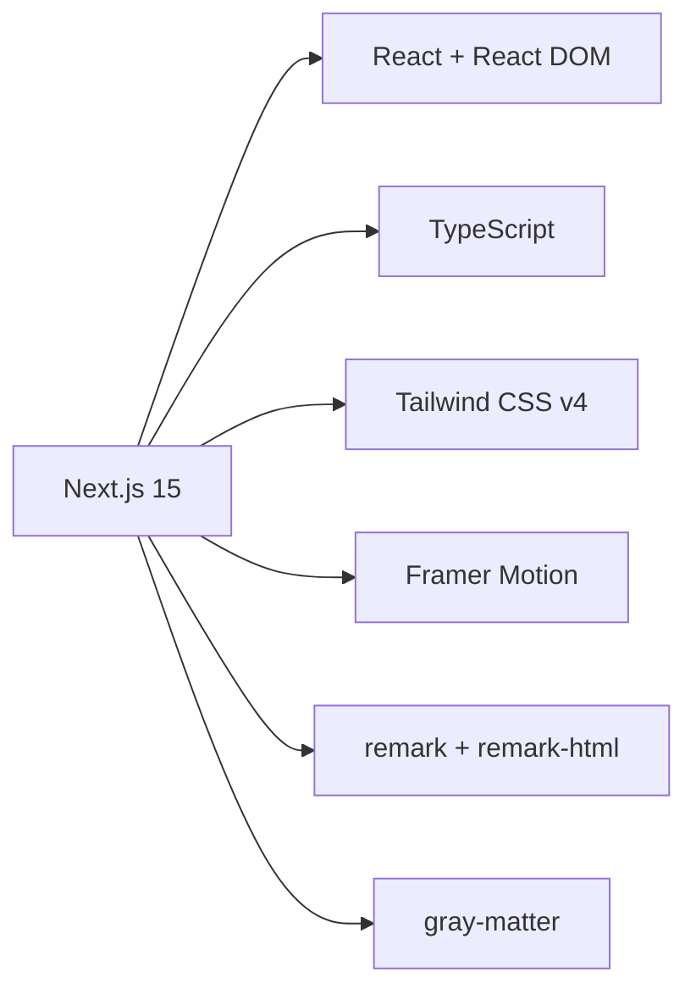

# Introduction

<cite>
**Referenced Files in This Document**
- [package.json](file://package.json)
- [next.config.ts](file://next.config.ts)
- [src/app/layout.tsx](file://src/app/layout.tsx)
- [src/app/page.tsx](file://src/app/page.tsx)
- [src/components/Navbar.tsx](file://src/components/Navbar.tsx)
- [src/components/Footer.tsx](file://src/components/Footer.tsx)
- [src/utils/markdown.ts](file://src/utils/markdown.ts)
- [src/data/projects.ts](file://src/data/projects.ts)
- [src/app/blog/page.tsx](file://src/app/blog/page.tsx)
- [src/components/BlogClient.tsx](file://src/components/BlogClient.tsx)
- [src/app/contact/page.tsx](file://src/app/contact/page.tsx)
</cite>

## Table of Contents
1. [Introduction](#introduction)
2. [Project Structure](#project-structure)
3. [Core Components](#core-components)
4. [Architecture Overview](#architecture-overview)
5. [Detailed Component Analysis](#detailed-component-analysis)
6. [Dependency Analysis](#dependency-analysis)
7. [Performance Considerations](#performance-considerations)
8. [Troubleshooting Guide](#troubleshooting-guide)
9. [Conclusion](#conclusion)

## Introduction
This personal portfolio and technical blog platform is a modern Next.js 15 application designed to showcase the work and technical expertise of a Full-Stack Engineer. The platform serves a dual purpose: presenting a professional portfolio of projects while simultaneously hosting a technical blog that shares insights, tutorials, and deep dives on software engineering topics. It is built to establish a strong online presence, demonstrate development skills, and provide educational value to the developer community.

The platform targets three primary audiences:
- Potential employers seeking to evaluate technical capabilities and cultural fit
- Collaborators and clients looking for architectural precision and high-performance system design
- Tech enthusiasts interested in practical knowledge sharing and learning resources

The vision behind this platform is to create a unified digital space where code meets communication—where visitors can explore real-world projects and gain actionable insights from technical articles. By combining a portfolio presentation with a blog, the site positions itself as both a professional showcase and a learning hub, reinforcing the developer’s brand and thought leadership.

Why Next.js 15 and this technology stack were chosen:
- Next.js 15 provides a robust full-stack framework with static generation, server-side rendering, and modern React features, enabling fast, SEO-friendly pages and efficient content delivery.
- The stack emphasizes TypeScript for type safety, Tailwind CSS for utility-first styling, and Framer Motion for smooth animations, aligning with contemporary frontend and full-stack best practices.
- Markdown-based content management allows easy authoring and maintenance of blog posts, while gray-matter and remark handle front matter parsing and Markdown-to-HTML conversion.

These choices collectively support the platform’s goals of performance, maintainability, and developer-friendly content creation.

**Section sources**
- [package.json:11-21](file://package.json#L11-L21)
- [src/app/layout.tsx:23-26](file://src/app/layout.tsx#L23-L26)
- [src/app/page.tsx:5-8](file://src/app/page.tsx#L5-L8)
- [src/app/blog/page.tsx:5-8](file://src/app/blog/page.tsx#L5-L8)
- [src/app/contact/page.tsx:4-7](file://src/app/contact/page.tsx#L4-L7)

## Project Structure
The project follows a conventional Next.js 15 app directory structure with a clear separation of concerns:
- Content-driven pages under src/app (home, blog, projects, contact, and shared layout)
- Shared UI components under src/components (navigation, footer, sidebar, and client-side blog rendering)
- Data and utilities under src/data and src/utils (project listings and Markdown processing)
- Global styles and fonts configured in the root layout

Key characteristics:
- Centralized metadata and typography configuration in the root layout
- Client-side components for interactive experiences (e.g., animated blog feed)
- Utility functions for content ingestion and transformation
- Static generation and routing for performance and SEO

**Diagram sources**
- [src/app/layout.tsx:23-57](file://src/app/layout.tsx#L23-L57)
- [src/components/Navbar.tsx:20-74](file://src/components/Navbar.tsx#L20-L74)
- [src/components/Footer.tsx:4-44](file://src/components/Footer.tsx#L4-L44)
- [src/app/page.tsx:10-14](file://src/app/page.tsx#L10-L14)
- [src/app/blog/page.tsx:10-14](file://src/app/blog/page.tsx#L10-L14)
- [src/utils/markdown.ts:40-77](file://src/utils/markdown.ts#L40-L77)
- [src/data/projects.ts:1-43](file://src/data/projects.ts#L1-L43)

**Section sources**
- [src/app/layout.tsx:1-58](file://src/app/layout.tsx#L1-L58)
- [src/app/page.tsx:1-15](file://src/app/page.tsx#L1-L15)
- [src/app/blog/page.tsx:1-15](file://src/app/blog/page.tsx#L1-L15)
- [src/utils/markdown.ts:1-108](file://src/utils/markdown.ts#L1-L108)
- [src/data/projects.ts:1-43](file://src/data/projects.ts#L1-L43)

## Core Components
This section highlights the foundational pieces that define the platform’s identity and functionality.

- Root layout and metadata: Establishes the site’s branding, fonts, and global theme, while configuring metadata for SEO and social previews.
- Navigation and footer: Provide consistent navigation and branding across pages, with responsive mobile menus and external links.
- Home page: Renders recent blog posts via a client component, integrating Markdown-based content.
- Blog index: Lists posts with a featured article and a sidebar, leveraging client-side animations and typography.
- Projects data: Supplies structured project information for portfolio presentation.
- Contact page: Offers a professional channel for collaboration and outreach.

These components collectively deliver a cohesive user experience that balances visual appeal, readability, and functional depth.

**Section sources**
- [src/app/layout.tsx:23-57](file://src/app/layout.tsx#L23-L57)
- [src/components/Navbar.tsx:7-139](file://src/components/Navbar.tsx#L7-L139)
- [src/components/Footer.tsx:3-49](file://src/components/Footer.tsx#L3-L49)
- [src/app/page.tsx:10-14](file://src/app/page.tsx#L10-L14)
- [src/components/BlogClient.tsx:12-165](file://src/components/BlogClient.tsx#L12-L165)
- [src/data/projects.ts:1-43](file://src/data/projects.ts#L1-L43)
- [src/app/contact/page.tsx:9-153](file://src/app/contact/page.tsx#L9-L153)

## Architecture Overview
The platform architecture centers on Next.js 15’s app directory, with a clear separation between server-rendered pages and client-side components. The home and blog index pages fetch Markdown-based content and render it using client components for enhanced interactivity. The layout coordinates global styles, fonts, and metadata, while shared components provide navigation and branding.

**Diagram sources**
- [src/app/layout.tsx:28-57](file://src/app/layout.tsx#L28-L57)
- [src/components/Navbar.tsx:20-74](file://src/components/Navbar.tsx#L20-L74)
- [src/components/Footer.tsx:4-44](file://src/components/Footer.tsx#L4-L44)
- [src/app/page.tsx:10-14](file://src/app/page.tsx#L10-L14)
- [src/app/blog/page.tsx:10-14](file://src/app/blog/page.tsx#L10-L14)
- [src/utils/markdown.ts:40-77](file://src/utils/markdown.ts#L40-L77)
- [src/data/projects.ts:1-43](file://src/data/projects.ts#L1-L43)

**Section sources**
- [src/app/layout.tsx:28-57](file://src/app/layout.tsx#L28-L57)
- [src/app/page.tsx:10-14](file://src/app/page.tsx#L10-L14)
- [src/app/blog/page.tsx:10-14](file://src/app/blog/page.tsx#L10-L14)
- [src/utils/markdown.ts:40-77](file://src/utils/markdown.ts#L40-L77)
- [src/data/projects.ts:1-43](file://src/data/projects.ts#L1-L43)

## Detailed Component Analysis

### Portfolio and Blog Dual-Purpose Design
The platform’s dual-purpose design integrates a portfolio and a blog to maximize reach and engagement:
- Portfolio presentation showcases real projects with descriptions, technologies, and links.
- Blog provides technical insights, tutorials, and thought leadership, encouraging repeat visits and sharing.

This combination positions the site as both a professional profile and an educational resource, appealing to recruiters, collaborators, and learners.

**Section sources**
- [src/data/projects.ts:1-43](file://src/data/projects.ts#L1-L43)
- [src/app/blog/page.tsx:5-8](file://src/app/blog/page.tsx#L5-L8)

### Home Page and Recent Posts Rendering
The home page demonstrates how content is ingested and rendered:
- Fetches sorted post metadata from Markdown utilities.
- Passes the data to a client component for rendering recent posts.

**Diagram sources**
- [src/app/page.tsx:10-14](file://src/app/page.tsx#L10-L14)
- [src/utils/markdown.ts:40-77](file://src/utils/markdown.ts#L40-L77)

**Section sources**
- [src/app/page.tsx:10-14](file://src/app/page.tsx#L10-L14)
- [src/utils/markdown.ts:40-77](file://src/utils/markdown.ts#L40-L77)

### Blog Index and Client-Side Rendering
The blog index page illustrates client-side rendering for dynamic experiences:
- Loads initial post metadata server-side.
- Renders a featured article and a feed of regular posts using a client component.
- Applies animations and responsive layouts for readability and engagement.

**Diagram sources**
- [src/app/blog/page.tsx:10-14](file://src/app/blog/page.tsx#L10-L14)
- [src/utils/markdown.ts:40-77](file://src/utils/markdown.ts#L40-L77)
- [src/components/BlogClient.tsx:12-165](file://src/components/BlogClient.tsx#L12-L165)

**Section sources**
- [src/app/blog/page.tsx:10-14](file://src/app/blog/page.tsx#L10-L14)
- [src/utils/markdown.ts:40-77](file://src/utils/markdown.ts#L40-L77)
- [src/components/BlogClient.tsx:12-165](file://src/components/BlogClient.tsx#L12-L165)

### Navigation and Footer Components
Navigation and footer provide consistent branding and accessibility:
- Navbar includes desktop and mobile menus, scroll-aware styling, and external links.
- Footer displays copyright, links, and deployment-related metrics.

**Diagram sources**
- [src/components/Navbar.tsx:12-18](file://src/components/Navbar.tsx#L12-L18)
- [src/components/Navbar.tsx:21-74](file://src/components/Navbar.tsx#L21-L74)
- [src/components/Footer.tsx:4-44](file://src/components/Footer.tsx#L4-L44)

**Section sources**
- [src/components/Navbar.tsx:7-139](file://src/components/Navbar.tsx#L7-L139)
- [src/components/Footer.tsx:3-49](file://src/components/Footer.tsx#L3-L49)

### Contact Page and Collaboration Channel
The contact page offers a professional gateway for collaboration:
- Includes availability indicators, a messaging form, and social connections.
- Provides geographic anchor and secondary call-to-action for project exploration.

**Section sources**
- [src/app/contact/page.tsx:9-153](file://src/app/contact/page.tsx#L9-L153)

## Dependency Analysis
The project relies on a focused set of dependencies that align with modern full-stack development practices:
- Next.js 15 for the framework runtime and app directory features
- React and React DOM for UI rendering
- Tailwind CSS v4 for utility-first styling
- TypeScript for type safety
- gray-matter and remark ecosystem for Markdown processing
- Framer Motion for animations

**Diagram sources**
- [package.json:11-21](file://package.json#L11-L21)

**Section sources**
- [package.json:11-33](file://package.json#L11-L33)

## Performance Considerations
- Static generation and server-side rendering reduce initial load times and improve SEO.
- Client-side components are scoped to enhance interactivity without sacrificing performance.
- Typography and font loading are configured at the root layout to minimize layout shifts.
- Asset optimization and responsive images contribute to faster page loads.

[No sources needed since this section provides general guidance]

## Troubleshooting Guide
Common areas to check:
- Ensure content directories exist and are readable for Markdown processing.
- Verify that client components are properly marked for client rendering.
- Confirm that metadata and font configurations are correctly applied in the root layout.
- Validate that navigation paths match the app directory structure.

**Section sources**
- [src/utils/markdown.ts:24-44](file://src/utils/markdown.ts#L24-L44)
- [src/app/layout.tsx:23-57](file://src/app/layout.tsx#L23-L57)

## Conclusion
This Next.js 15-powered platform exemplifies a modern personal portfolio and technical blog, combining professional presentation with educational content. Its architecture, component design, and technology choices reflect a commitment to performance, maintainability, and developer experience. By serving as both a showcase and a learning resource, the platform strengthens the developer’s online presence and contributes meaningfully to the broader developer community.

[No sources needed since this section summarizes without analyzing specific files]