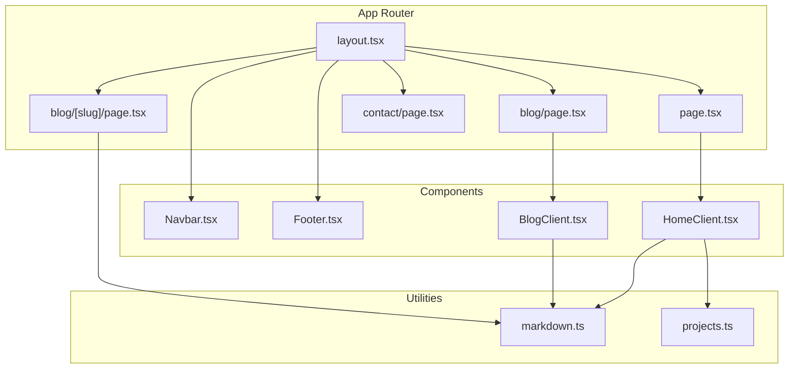
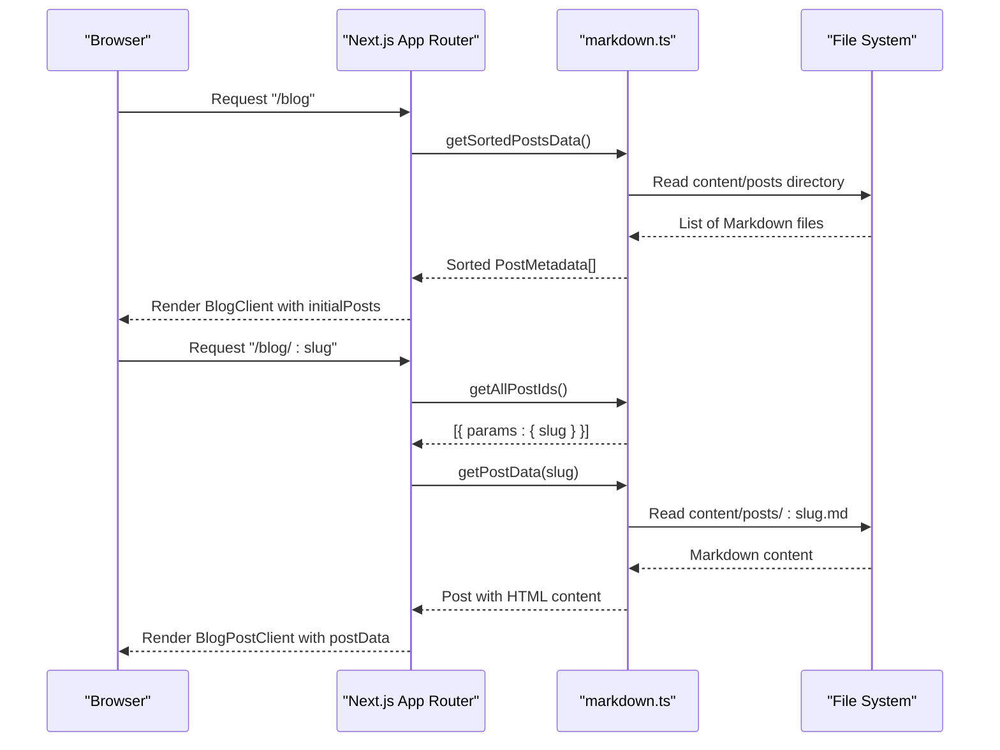
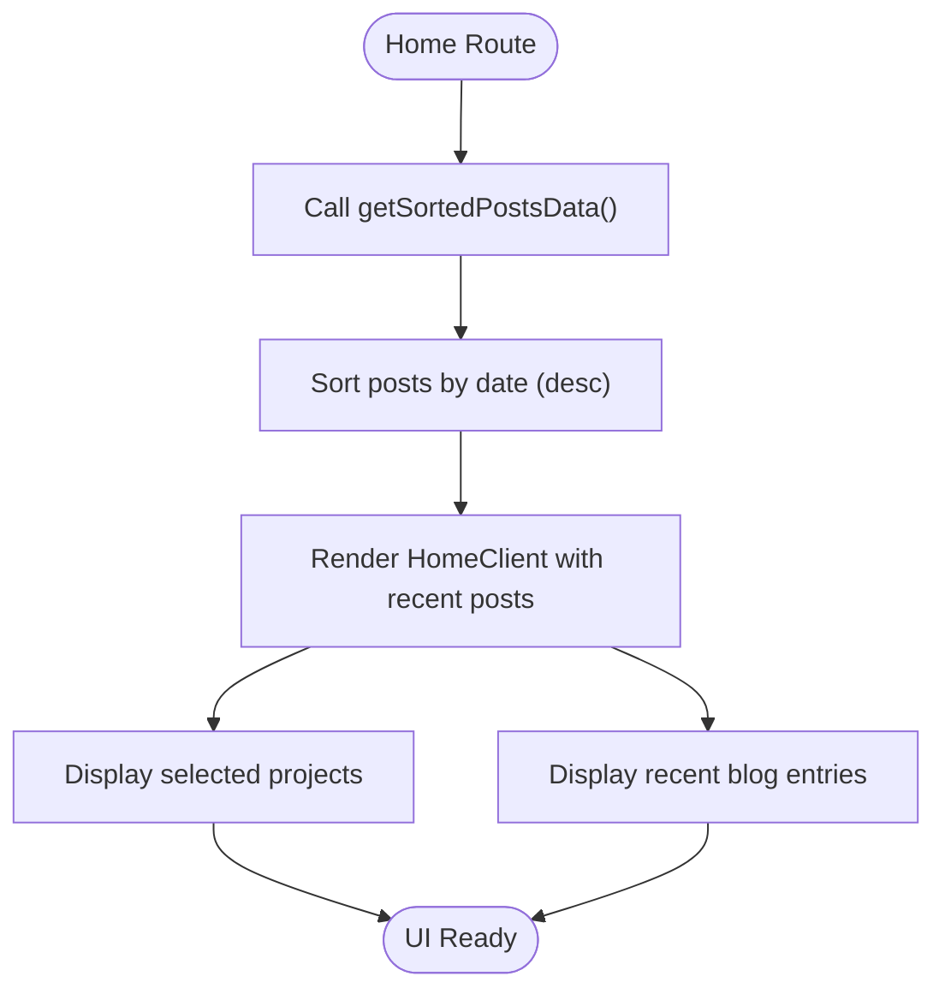
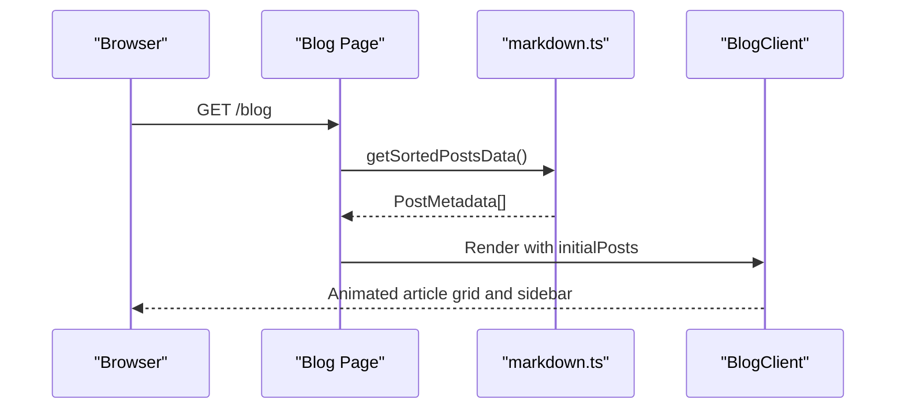
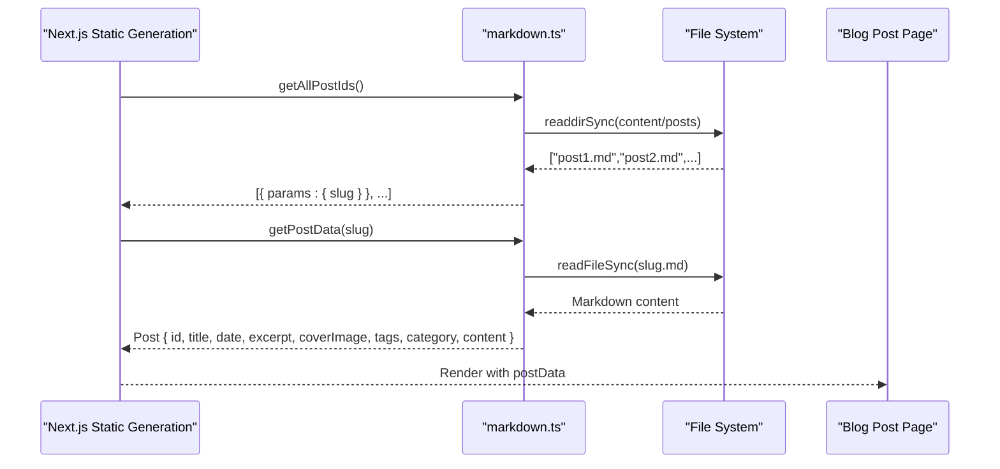
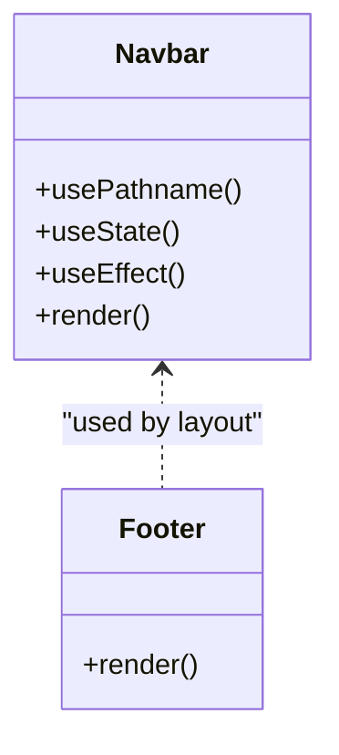
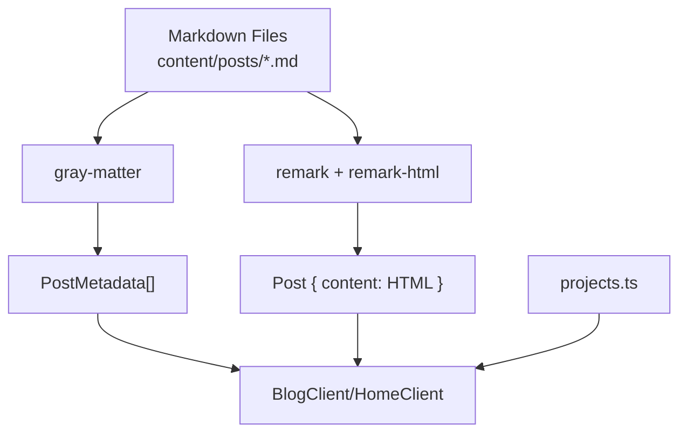
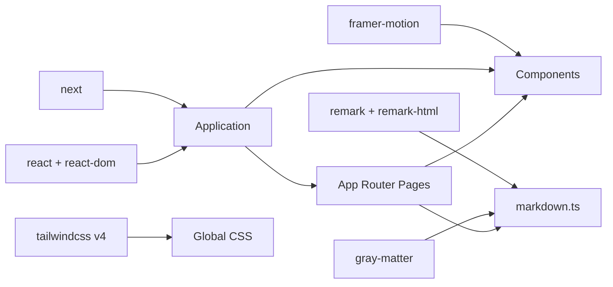

# Project Overview

<cite>
**Referenced Files in This Document**
- [package.json](file://package.json)
- [next.config.ts](file://next.config.ts)
- [src/app/layout.tsx](file://src/app/layout.tsx)
- [src/app/page.tsx](file://src/app/page.tsx)
- [src/app/blog/page.tsx](file://src/app/blog/page.tsx)
- [src/app/blog/[slug]/page.tsx](file://src/app/blog/[slug]/page.tsx)
- [src/components/Navbar.tsx](file://src/components/Navbar.tsx)
- [src/components/Footer.tsx](file://src/components/Footer.tsx)
- [src/components/HomeClient.tsx](file://src/components/HomeClient.tsx)
- [src/components/BlogClient.tsx](file://src/components/BlogClient.tsx)
- [src/utils/markdown.ts](file://src/utils/markdown.ts)
- [src/data/projects.ts](file://src/data/projects.ts)
- [src/app/contact/page.tsx](file://src/app/contact/page.tsx)
</cite>

## Table of Contents
1. [Introduction](#introduction)
2. [Project Structure](#project-structure)
3. [Core Components](#core-components)
4. [Architecture Overview](#architecture-overview)
5. [Detailed Component Analysis](#detailed-component-analysis)
6. [Dependency Analysis](#dependency-analysis)
7. [Performance Considerations](#performance-considerations)
8. [Troubleshooting Guide](#troubleshooting-guide)
9. [Conclusion](#conclusion)

## Introduction
This project is a modern personal portfolio and technical blog platform built with Next.js 15. It showcases a Full-Stack Engineer’s professional work through a dual-purpose design: a curated portfolio of projects and a technical blog. The site leverages Next.js app router, static generation, and modern React patterns to deliver a responsive, accessible, and visually engaging experience. Content is authored in Markdown and transformed at build time, while the UI is styled with Tailwind CSS and enhanced with animations and interactive elements.

## Project Structure
The application follows Next.js app directory conventions with a clear separation of routes, components, utilities, and data. Key areas:
- Routes under src/app define pages and nested layouts, including the home page, blog listing, individual blog post pages, and static informational pages.
- Shared UI is encapsulated in src/components with reusable header, footer, and client-side components.
- Content is stored as Markdown files under content/posts and project metadata under src/data.
- Utilities in src/utils handle Markdown parsing and conversion to HTML.

**Diagram sources**
- [src/app/layout.tsx:1-58](file://src/app/layout.tsx#L1-L58)
- [src/app/page.tsx:1-15](file://src/app/page.tsx#L1-L15)
- [src/app/blog/page.tsx:1-15](file://src/app/blog/page.tsx#L1-L15)
- [src/app/blog/[slug]/page.tsx](file://src/app/blog/[slug]/page.tsx#L1-L18)
- [src/app/contact/page.tsx:1-154](file://src/app/contact/page.tsx#L1-L154)
- [src/components/Navbar.tsx:1-140](file://src/components/Navbar.tsx#L1-L140)
- [src/components/Footer.tsx:1-49](file://src/components/Footer.tsx#L1-L49)
- [src/components/HomeClient.tsx:1-212](file://src/components/HomeClient.tsx#L1-L212)
- [src/components/BlogClient.tsx:1-166](file://src/components/BlogClient.tsx#L1-L166)
- [src/utils/markdown.ts:1-108](file://src/utils/markdown.ts#L1-L108)
- [src/data/projects.ts:1-43](file://src/data/projects.ts#L1-L43)

**Section sources**
- [package.json:1-35](file://package.json#L1-L35)
- [next.config.ts:1-8](file://next.config.ts#L1-L8)
- [src/app/layout.tsx:1-58](file://src/app/layout.tsx#L1-L58)

## Core Components
- Root layout and metadata: Defines global fonts, theme, and shared layout structure.
- Home page: Aggregates recent blog posts and selected projects for a unified hero and showcase.
- Blog listing: Renders a feed of posts with a featured article and sidebar.
- Individual blog post: Static generation with dynamic slugs and Markdown-to-HTML conversion.
- Navigation and footer: Responsive navigation with mobile overlay and consistent branding.
- Data and utilities: Project metadata and Markdown parsing utilities for content discovery and rendering.

Key interfaces and responsibilities:
- Home route exports metadata and passes sorted posts to HomeClient.
- Blog listing route exports metadata and renders BlogClient with initial posts.
- Dynamic blog post route generates static paths and renders BlogPostClient with processed content.
- Markdown utilities expose functions to list post IDs, sort posts, and render a single post’s HTML content.

**Section sources**
- [src/app/page.tsx:1-15](file://src/app/page.tsx#L1-L15)
- [src/app/blog/page.tsx:1-15](file://src/app/blog/page.tsx#L1-L15)
- [src/app/blog/[slug]/page.tsx](file://src/app/blog/[slug]/page.tsx#L1-L18)
- [src/utils/markdown.ts:1-108](file://src/utils/markdown.ts#L1-L108)
- [src/data/projects.ts:1-43](file://src/data/projects.ts#L1-L43)

## Architecture Overview
The platform combines static generation with client-side interactivity:
- Static generation: Blog listing and individual posts are statically generated at build time for fast delivery and SEO.
- Client-side rendering: Interactive elements, animations, and lightweight UI logic run on the client.
- Content pipeline: Markdown files are parsed and transformed into HTML using remark and gray-matter.
- Routing: Next.js app router handles nested routes, dynamic segments, and metadata.

**Diagram sources**
- [src/app/blog/page.tsx:1-15](file://src/app/blog/page.tsx#L1-L15)
- [src/app/blog/[slug]/page.tsx](file://src/app/blog/[slug]/page.tsx#L1-L18)
- [src/utils/markdown.ts:24-107](file://src/utils/markdown.ts#L24-L107)

## Detailed Component Analysis

### Home Page and Portfolio Showcase
The home page integrates recent blog posts and featured projects into a cohesive landing experience:
- Fetches sorted posts via getSortedPostsData and passes them to HomeClient.
- HomeClient displays a hero section, stats, featured projects, and a recent blog feed.
- Projects data is imported from src/data/projects.ts and rendered with images and technology tags.

**Diagram sources**
- [src/app/page.tsx:1-15](file://src/app/page.tsx#L1-L15)
- [src/components/HomeClient.tsx:1-212](file://src/components/HomeClient.tsx#L1-L212)
- [src/data/projects.ts:1-43](file://src/data/projects.ts#L1-L43)
- [src/utils/markdown.ts:40-77](file://src/utils/markdown.ts#L40-L77)

**Section sources**
- [src/app/page.tsx:1-15](file://src/app/page.tsx#L1-L15)
- [src/components/HomeClient.tsx:1-212](file://src/components/HomeClient.tsx#L1-L212)
- [src/data/projects.ts:1-43](file://src/data/projects.ts#L1-L43)
- [src/utils/markdown.ts:40-77](file://src/utils/markdown.ts#L40-L77)

### Blog Listing and Client Rendering
The blog listing page:
- Exports metadata for SEO.
- Calls getSortedPostsData and renders BlogClient with initialPosts.
- BlogClient applies animations and responsive layouts for featured and regular articles.

**Diagram sources**
- [src/app/blog/page.tsx:1-15](file://src/app/blog/page.tsx#L1-L15)
- [src/components/BlogClient.tsx:1-166](file://src/components/BlogClient.tsx#L1-L166)
- [src/utils/markdown.ts:40-77](file://src/utils/markdown.ts#L40-L77)

**Section sources**
- [src/app/blog/page.tsx:1-15](file://src/app/blog/page.tsx#L1-L15)
- [src/components/BlogClient.tsx:1-166](file://src/components/BlogClient.tsx#L1-L166)
- [src/utils/markdown.ts:40-77](file://src/utils/markdown.ts#L40-L77)

### Dynamic Blog Post Pages
Individual blog posts are generated statically:
- generateStaticParams builds paths from getAllPostIds.
- getPostData reads the Markdown file, parses front matter, and converts content to HTML.
- The page renders BlogPostClient with the processed post.

**Diagram sources**
- [src/app/blog/[slug]/page.tsx](file://src/app/blog/[slug]/page.tsx#L1-L18)
- [src/utils/markdown.ts:24-107](file://src/utils/markdown.ts#L24-L107)

**Section sources**
- [src/app/blog/[slug]/page.tsx](file://src/app/blog/[slug]/page.tsx#L1-L18)
- [src/utils/markdown.ts:24-107](file://src/utils/markdown.ts#L24-L107)

### Navigation and Footer
- Navbar provides responsive desktop and mobile navigation with scroll-aware styling and animated mobile overlay.
- Footer includes branding, links, and status information.

**Diagram sources**
- [src/components/Navbar.tsx:1-140](file://src/components/Navbar.tsx#L1-L140)
- [src/components/Footer.tsx:1-49](file://src/components/Footer.tsx#L1-L49)

**Section sources**
- [src/components/Navbar.tsx:1-140](file://src/components/Navbar.tsx#L1-L140)
- [src/components/Footer.tsx:1-49](file://src/components/Footer.tsx#L1-L49)

### Content Management and Data Flow
- Markdown utilities:
  - getAllPostIds: Lists available posts for static generation.
  - getSortedPostsData: Reads and sorts posts by date.
  - getPostData: Parses front matter and converts Markdown to HTML.
- Project data:
  - projects.ts defines project entries with metadata and categorization.

**Diagram sources**
- [src/utils/markdown.ts:1-108](file://src/utils/markdown.ts#L1-L108)
- [src/data/projects.ts:1-43](file://src/data/projects.ts#L1-L43)

**Section sources**
- [src/utils/markdown.ts:1-108](file://src/utils/markdown.ts#L1-L108)
- [src/data/projects.ts:1-43](file://src/data/projects.ts#L1-L43)

## Dependency Analysis
External dependencies include Next.js, React, remark ecosystem for Markdown processing, and framer-motion for animations. The project uses Turbopack during development and Tailwind CSS v4 for styling.

**Diagram sources**
- [package.json:11-21](file://package.json#L11-L21)
- [src/utils/markdown.ts:1-108](file://src/utils/markdown.ts#L1-L108)
- [src/components/HomeClient.tsx:1-212](file://src/components/HomeClient.tsx#L1-L212)
- [src/app/layout.tsx:1-58](file://src/app/layout.tsx#L1-L58)

**Section sources**
- [package.json:11-21](file://package.json#L11-L21)
- [next.config.ts:1-8](file://next.config.ts#L1-L8)

## Performance Considerations
- Static generation: Pre-renders blog listings and individual posts to minimize server load and improve latency.
- Client-side hydration: Keeps UI interactive while deferring heavy logic to the client.
- Asset optimization: Uses Next.js Image for optimized media and minimal CSS via Tailwind.
- Font loading: Preloads Google Fonts through Next.js font optimization.
- Animations: Uses framer-motion sparingly to avoid layout shifts and maintain smooth interactions.

## Troubleshooting Guide
Common issues and resolutions:
- Missing content directory: If content/posts does not exist, Markdown utilities return empty arrays. Ensure the directory exists and contains properly formatted Markdown files with front matter.
- Incorrect front matter: Verify presence of required fields (title, date, author, excerpt) and optional fields (coverImage, tags, category).
- Static generation errors: Confirm generateStaticParams returns valid slug arrays and that each Markdown file matches its slug.
- Build failures: Ensure Turbopack is compatible with installed packages and that TypeScript types align with runtime behavior.

**Section sources**
- [src/utils/markdown.ts:24-77](file://src/utils/markdown.ts#L24-L77)
- [src/app/blog/[slug]/page.tsx](file://src/app/blog/[slug]/page.tsx#L5-L10)

## Conclusion
This Next.js 15 application demonstrates a modern, dual-purpose portfolio and blog platform. It blends static generation for performance and SEO with client-side interactivity for an engaging user experience. The clean separation of concerns—routing, components, utilities, and data—enables maintainability and scalability. By leveraging Markdown-driven content and contemporary React patterns, the platform serves as both a professional showcase and a technical knowledge base.