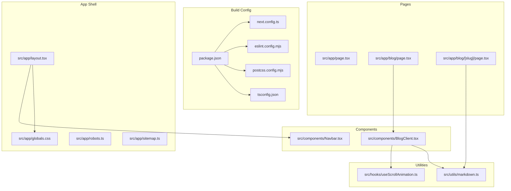
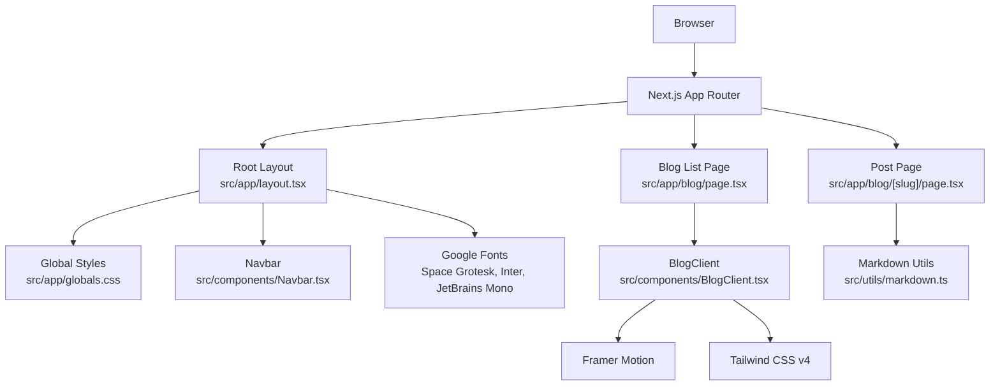
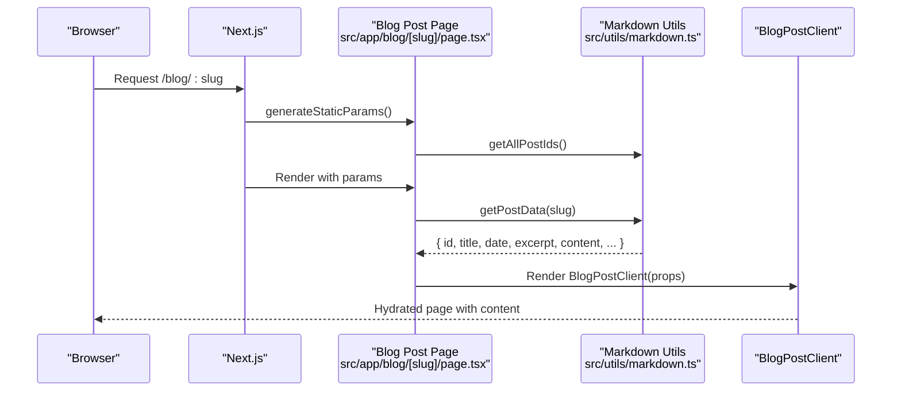
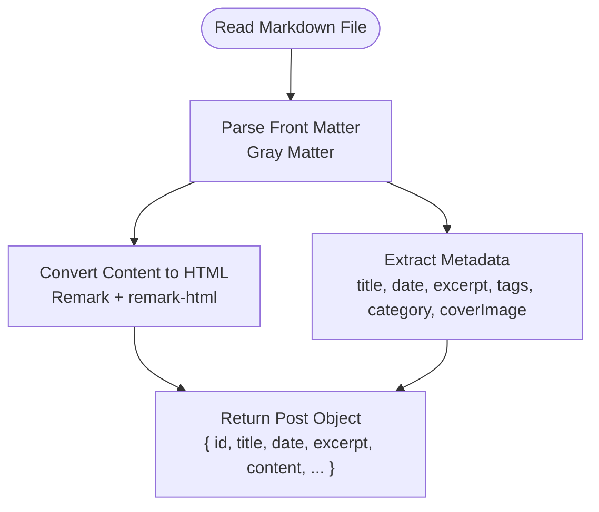
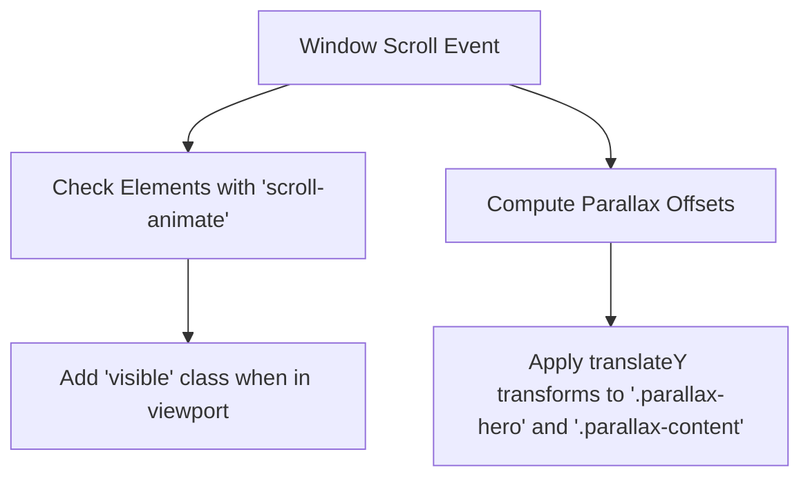
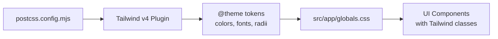
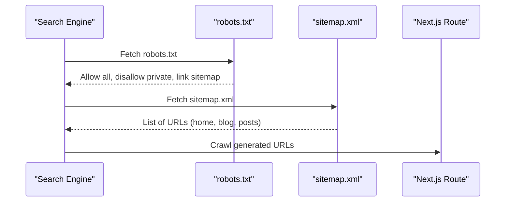
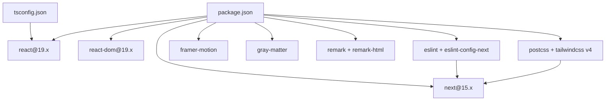

# Technology Stack

<cite>
**Referenced Files in This Document**
- [package.json](file://package.json)
- [next.config.ts](file://next.config.ts)
- [tsconfig.json](file://tsconfig.json)
- [eslint.config.mjs](file://eslint.config.mjs)
- [postcss.config.mjs](file://postcss.config.mjs)
- [src/app/layout.tsx](file://src/app/layout.tsx)
- [src/app/globals.css](file://src/app/globals.css)
- [src/utils/markdown.ts](file://src/utils/markdown.ts)
- [src/components/BlogClient.tsx](file://src/components/BlogClient.tsx)
- [src/hooks/useScrollAnimation.ts](file://src/hooks/useScrollAnimation.ts)
- [src/components/Navbar.tsx](file://src/components/Navbar.tsx)
- [src/app/blog/[slug]/page.tsx](file://src/app/blog/[slug]/page.tsx)
- [src/app/robots.ts](file://src/app/robots.ts)
- [src/app/sitemap.ts](file://src/app/sitemap.ts)
</cite>

## Table of Contents
1. [Introduction](#introduction)
2. [Project Structure](#project-structure)
3. [Core Components](#core-components)
4. [Architecture Overview](#architecture-overview)
5. [Detailed Component Analysis](#detailed-component-analysis)
6. [Dependency Analysis](#dependency-analysis)
7. [Performance Considerations](#performance-considerations)
8. [Troubleshooting Guide](#troubleshooting-guide)
9. [Conclusion](#conclusion)

## Introduction
This document explains the technology stack powering the portfolio and blog platform. It focuses on the modern web stack: Next.js 15 with the App Router, React 19, TypeScript, and Tailwind CSS v4. It also covers build-time tools (Turbopack optimization, ESLint, PostCSS), animation (Framer Motion), and markdown processing (Gray Matter and the Remark ecosystem). The document outlines version compatibility, integration patterns, and how these technologies collectively deliver performance, SEO, and user experience for a personal portfolio and technical blog.

## Project Structure
The project follows Next.js App Router conventions with a clear separation of server-side routes, client components, shared utilities, and styling. Key areas:
- Application shell and global styles live under src/app
- Shared UI components are in src/components
- Utilities for data and markdown processing are in src/utils
- Hooks for client-side behavior are in src/hooks
- Build configuration files reside at the repository root

**Diagram sources**
- [package.json:1-35](file://package.json#L1-L35)
- [next.config.ts:1-8](file://next.config.ts#L1-L8)
- [tsconfig.json:1-28](file://tsconfig.json#L1-L28)
- [eslint.config.mjs:1-26](file://eslint.config.mjs#L1-L26)
- [postcss.config.mjs:1-6](file://postcss.config.mjs#L1-L6)
- [src/app/layout.tsx:1-58](file://src/app/layout.tsx#L1-L58)
- [src/app/globals.css:1-113](file://src/app/globals.css#L1-L113)
- [src/app/robots.ts:1-13](file://src/app/robots.ts#L1-L13)
- [src/app/sitemap.ts:1-37](file://src/app/sitemap.ts#L1-L37)
- [src/app/blog/[slug]/page.tsx:1-18](file://src/app/blog/[slug]/page.tsx#L1-L18)
- [src/components/Navbar.tsx:1-140](file://src/components/Navbar.tsx#L1-L140)
- [src/components/BlogClient.tsx:1-166](file://src/components/BlogClient.tsx#L1-L166)
- [src/utils/markdown.ts:1-108](file://src/utils/markdown.ts#L1-L108)
- [src/hooks/useScrollAnimation.ts:1-51](file://src/hooks/useScrollAnimation.ts#L1-L51)

**Section sources**
- [package.json:1-35](file://package.json#L1-L35)
- [next.config.ts:1-8](file://next.config.ts#L1-L8)
- [tsconfig.json:1-28](file://tsconfig.json#L1-L28)
- [eslint.config.mjs:1-26](file://eslint.config.mjs#L1-L26)
- [postcss.config.mjs:1-6](file://postcss.config.mjs#L1-L6)
- [src/app/layout.tsx:1-58](file://src/app/layout.tsx#L1-L58)
- [src/app/globals.css:1-113](file://src/app/globals.css#L1-L113)
- [src/app/robots.ts:1-13](file://src/app/robots.ts#L1-L13)
- [src/app/sitemap.ts:1-37](file://src/app/sitemap.ts#L1-L37)
- [src/app/blog/[slug]/page.tsx:1-18](file://src/app/blog/[slug]/page.tsx#L1-L18)
- [src/components/Navbar.tsx:1-140](file://src/components/Navbar.tsx#L1-L140)
- [src/components/BlogClient.tsx:1-166](file://src/components/BlogClient.tsx#L1-L166)
- [src/utils/markdown.ts:1-108](file://src/utils/markdown.ts#L1-L108)
- [src/hooks/useScrollAnimation.ts:1-51](file://src/hooks/useScrollAnimation.ts#L1-L51)

## Core Components
- Next.js 15 with App Router: Provides static generation, server-side rendering, ISR, and route handlers for pages, API routes, and metadata.
- React 19: Latest React runtime with concurrent features and improved performance characteristics.
- TypeScript: Strict type checking across the codebase for safer development and better DX.
- Tailwind CSS v4: Utility-first CSS framework with v4 plugin support and a custom theme system.
- Framer Motion: Animation library enabling smooth, declarative motion for interactive elements.
- Gray Matter + Remark ecosystem: Markdown parsing and HTML conversion pipeline for blog posts.
- Turbopack: Fast development server and bundler for rapid iteration.
- ESLint + PostCSS: Code quality linting and CSS processing pipeline.

Version compatibility highlights:
- Next.js 15.5.9 aligns with React 19.1.0 and uses the App Router.
- Tailwind CSS v4 integrates via @tailwindcss/postcss plugin.
- ESLint 9 with Next.js’s recommended configs for web vitals and TypeScript.
- Framer Motion 12.x integrates with React 19.

How they work together:
- Next.js orchestrates routing, metadata, and static generation.
- React 19 renders components with concurrent features.
- TypeScript enforces type safety across server and client boundaries.
- Tailwind CSS v4 generates atomic styles and custom tokens.
- Framer Motion animates UI transitions and micro-interactions.
- Gray Matter parses front matter; Remark transforms markdown to HTML.
- Turbopack accelerates builds and hot reloads during development.
- ESLint and PostCSS maintain code quality and CSS processing.

**Section sources**
- [package.json:11-32](file://package.json#L11-L32)
- [src/app/layout.tsx:1-58](file://src/app/layout.tsx#L1-L58)
- [src/app/globals.css:1-113](file://src/app/globals.css#L1-L113)
- [src/utils/markdown.ts:1-108](file://src/utils/markdown.ts#L1-L108)
- [src/components/BlogClient.tsx:1-166](file://src/components/BlogClient.tsx#L1-L166)
- [eslint.config.mjs:12-23](file://eslint.config.mjs#L12-L23)
- [postcss.config.mjs:1-6](file://postcss.config.mjs#L1-L6)

## Architecture Overview
The application uses Next.js App Router with a root layout that injects fonts, global CSS, and shared UI. Pages under src/app/blog render static lists and individual posts. Markdown content is parsed at build time and rendered to HTML. Animations are applied via Framer Motion in client components. SEO is handled by robots.txt and sitemap generation.

**Diagram sources**
- [src/app/layout.tsx:1-58](file://src/app/layout.tsx#L1-L58)
- [src/app/globals.css:1-113](file://src/app/globals.css#L1-L113)
- [src/components/Navbar.tsx:1-140](file://src/components/Navbar.tsx#L1-L140)
- [src/components/BlogClient.tsx:1-166](file://src/components/BlogClient.tsx#L1-L166)
- [src/app/blog/[slug]/page.tsx:1-18](file://src/app/blog/[slug]/page.tsx#L1-L18)
- [src/utils/markdown.ts:1-108](file://src/utils/markdown.ts#L1-L108)

## Detailed Component Analysis

### Next.js App Router and Pages
- Root layout sets metadata, dark mode, Google Fonts, and global classes. It composes Navbar, Sidebar, and Footer.
- Blog list page uses client components to render a feed with animations.
- Individual post page statically generates slugs from markdown files and delegates rendering to a client component.

**Diagram sources**
- [src/app/blog/[slug]/page.tsx:1-18](file://src/app/blog/[slug]/page.tsx#L1-L18)
- [src/utils/markdown.ts:79-107](file://src/utils/markdown.ts#L79-L107)

**Section sources**
- [src/app/layout.tsx:23-57](file://src/app/layout.tsx#L23-L57)
- [src/app/blog/[slug]/page.tsx:1-18](file://src/app/blog/[slug]/page.tsx#L1-L18)
- [src/utils/markdown.ts:24-77](file://src/utils/markdown.ts#L24-L77)

### Markdown Processing Pipeline (Gray Matter + Remark)
- Gray Matter extracts front matter (title, date, excerpt, tags, category, coverImage).
- Remark + remark-html converts markdown content to HTML.
- The pipeline is synchronous for build-time data extraction and returns typed Post and PostMetadata interfaces.

**Diagram sources**
- [src/utils/markdown.ts:3-90](file://src/utils/markdown.ts#L3-L90)

**Section sources**
- [src/utils/markdown.ts:1-108](file://src/utils/markdown.ts#L1-L108)

### Animation and Interactions (Framer Motion + Scroll Effects)
- Framer Motion powers entrance animations for blog articles and hover effects.
- A custom hook applies scroll-triggered visibility and parallax effects to enhance perceived depth.

**Diagram sources**
- [src/hooks/useScrollAnimation.ts:5-49](file://src/hooks/useScrollAnimation.ts#L5-L49)
- [src/components/BlogClient.tsx:20-87](file://src/components/BlogClient.tsx#L20-L87)

**Section sources**
- [src/components/BlogClient.tsx:1-166](file://src/components/BlogClient.tsx#L1-L166)
- [src/hooks/useScrollAnimation.ts:1-51](file://src/hooks/useScrollAnimation.ts#L1-L51)

### Styling and Theming (Tailwind CSS v4)
- Tailwind CSS v4 is configured via PostCSS and a plugin for typography.
- A custom theme defines semantic color tokens, font families, and radii.
- Global styles leverage CSS variables and utility classes for consistent design.

**Diagram sources**
- [postcss.config.mjs:1-6](file://postcss.config.mjs#L1-L6)
- [src/app/globals.css:1-66](file://src/app/globals.css#L1-L66)

**Section sources**
- [postcss.config.mjs:1-6](file://postcss.config.mjs#L1-L6)
- [src/app/globals.css:1-113](file://src/app/globals.css#L1-L113)

### SEO and Metadata
- robots.ts defines crawl rules and links to sitemap.xml.
- sitemap.ts dynamically generates URLs for the home, blog, about, contact, and all blog posts.

**Diagram sources**
- [src/app/robots.ts:1-13](file://src/app/robots.ts#L1-L13)
- [src/app/sitemap.ts:1-37](file://src/app/sitemap.ts#L1-L37)

**Section sources**
- [src/app/robots.ts:1-13](file://src/app/robots.ts#L1-L13)
- [src/app/sitemap.ts:1-37](file://src/app/sitemap.ts#L1-L37)

## Dependency Analysis
The stack balances modern tooling with strong defaults:
- Next.js 15 provides the runtime and routing layer.
- React 19 ensures efficient rendering and concurrency.
- TypeScript with strict mode and bundler module resolution improves reliability.
- Tailwind CSS v4 with PostCSS enables utility-first styling and theming.
- ESLint 9 with Next’s recommended configs enforces best practices.
- Turbopack is enabled via scripts for fast dev builds.
- Framer Motion integrates with React 19 for motion primitives.
- Gray Matter and Remark form a robust markdown pipeline.

**Diagram sources**
- [package.json:11-32](file://package.json#L11-L32)
- [tsconfig.json:1-28](file://tsconfig.json#L1-L28)
- [eslint.config.mjs:12-23](file://eslint.config.mjs#L12-L23)
- [postcss.config.mjs:1-6](file://postcss.config.mjs#L1-L6)

**Section sources**
- [package.json:11-32](file://package.json#L11-L32)
- [tsconfig.json:1-28](file://tsconfig.json#L1-L28)
- [eslint.config.mjs:12-23](file://eslint.config.mjs#L12-L23)
- [postcss.config.mjs:1-6](file://postcss.config.mjs#L1-L6)

## Performance Considerations
- Turbopack optimization: Enabled in dev/build scripts for faster rebuilds and improved DX.
- Static generation: Blog post slugs are generated statically, reducing server load.
- Concurrent React features: React 19’s concurrency helps with progressive hydration and rendering.
- Minimal global styles: Tailwind utilities reduce CSS payload while maintaining consistency.
- Efficient markdown pipeline: Parsing and HTML conversion occur at build time, serving lightweight HTML at runtime.
- Optimized images: Next/image usage reduces bandwidth and improves CLS.

[No sources needed since this section provides general guidance]

## Troubleshooting Guide
Common checks and remedies:
- Dev server not starting: Verify Turbopack is enabled in scripts and dependencies are installed.
- Type errors: Ensure tsconfig strictness and bundler module resolution are configured correctly.
- Lint failures: Run the linter and review ignored paths; confirm Next’s recommended configs are extended.
- Tailwind not generating styles: Confirm PostCSS plugin is present and Tailwind directives are included in globals.css.
- Markdown parsing issues: Validate front matter keys and ensure remark plugins are imported.
- Animations not working: Confirm “use client” directive and that Framer Motion is installed.

**Section sources**
- [package.json:5-10](file://package.json#L5-L10)
- [tsconfig.json:7,11,13](file://tsconfig.json#L7,L11,L13)
- [eslint.config.mjs:12-23](file://eslint.config.mjs#L12-L23)
- [postcss.config.mjs:1-6](file://postcss.config.mjs#L1-L6)
- [src/utils/markdown.ts:3-90](file://src/utils/markdown.ts#L3-L90)
- [src/components/BlogClient.tsx:1-6](file://src/components/BlogClient.tsx#L1-L6)

## Conclusion
This stack combines Next.js 15, React 19, TypeScript, and Tailwind CSS v4 with complementary tools—Turbopack, ESLint, PostCSS—to deliver a modern, performant, and developer-friendly portfolio and blog platform. Framer Motion enhances UX, while Gray Matter and Remark streamline content creation. Together, these technologies support fast builds, strong SEO, and a polished user experience tailored for a personal brand and technical writing.