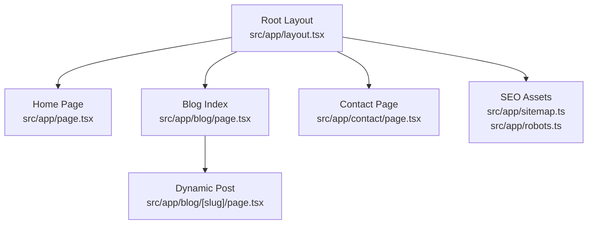
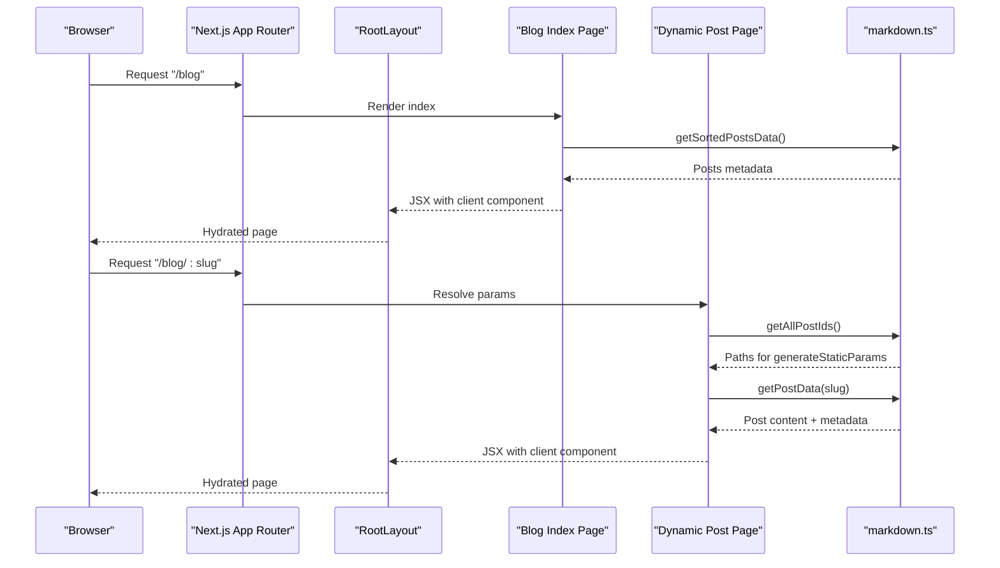
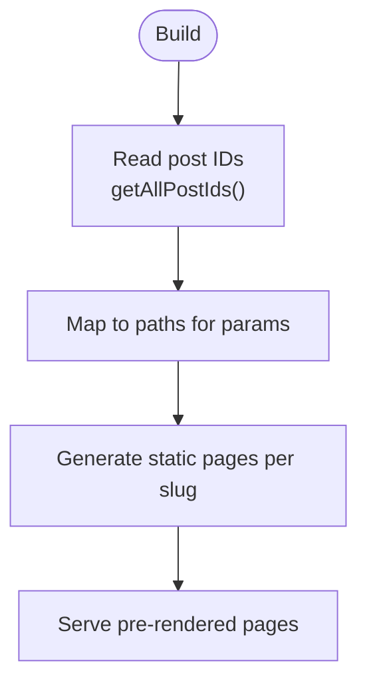
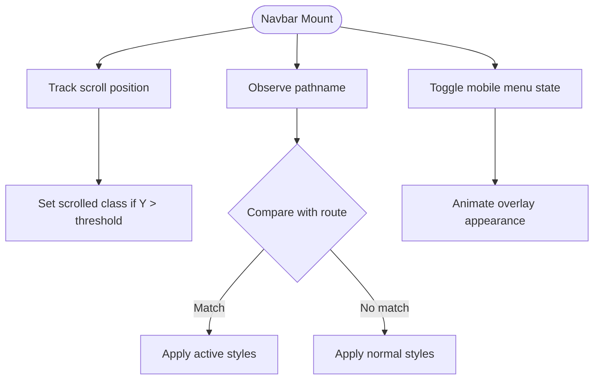
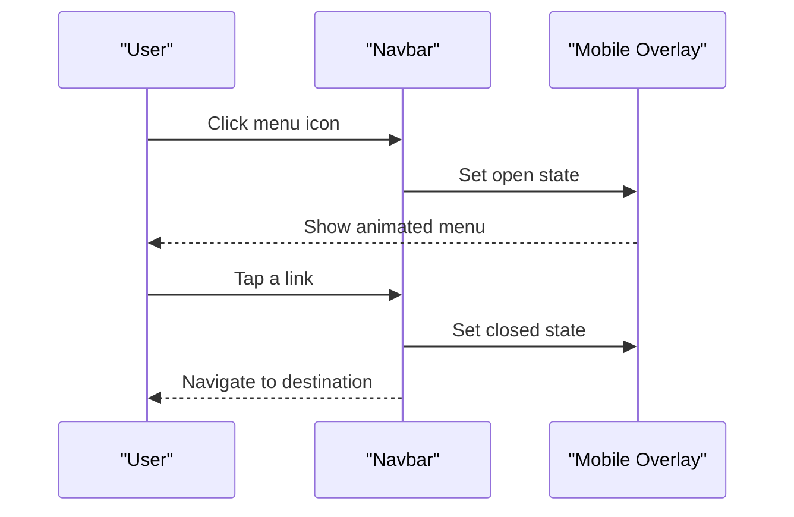
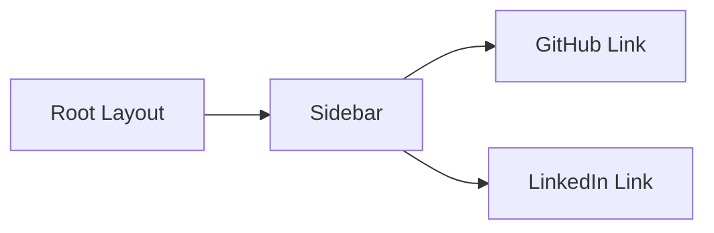
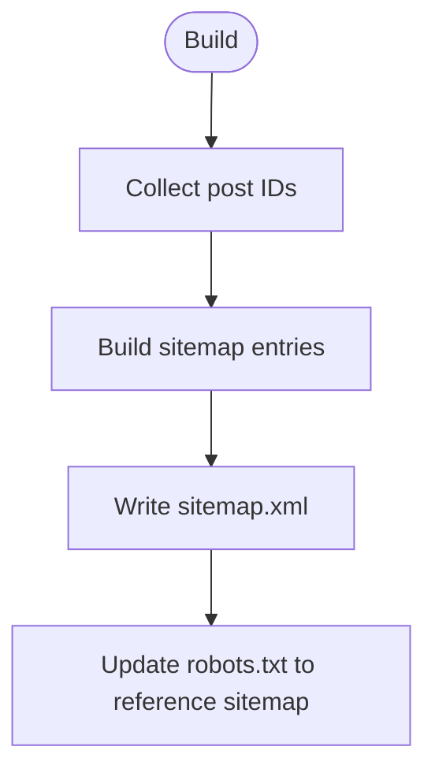
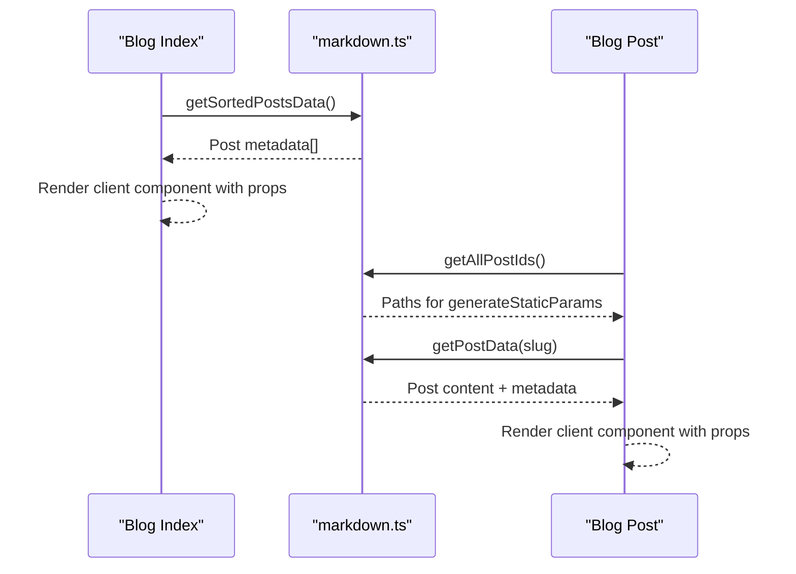
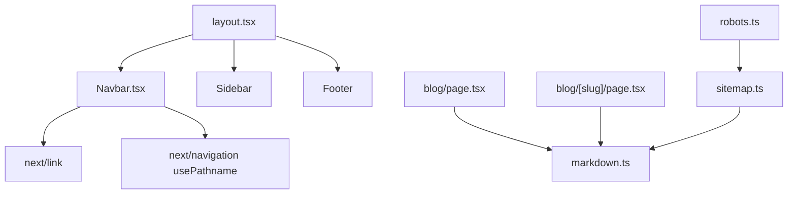

# Routing & Navigation

<cite>
**Referenced Files in This Document**
- [layout.tsx](file://src/app/layout.tsx)
- [page.tsx](file://src/app/page.tsx)
- [blog/page.tsx](file://src/app/blog/page.tsx)
- [blog/[slug]/page.tsx](file://src/app/blog/[slug]/page.tsx)
- [sitemap.ts](file://src/app/sitemap.ts)
- [robots.ts](file://src/app/robots.ts)
- [Navbar.tsx](file://src/components/Navbar.tsx)
- [Sidebar.tsx](file://src/components/Sidebar.tsx)
- [Footer.tsx](file://src/components/Footer.tsx)
- [markdown.ts](file://src/utils/markdown.ts)
- [next.config.ts](file://next.config.ts)
- [package.json](file://package.json)
</cite>

## Table of Contents
1. [Introduction](#introduction)
2. [Project Structure](#project-structure)
3. [Core Components](#core-components)
4. [Architecture Overview](#architecture-overview)
5. [Detailed Component Analysis](#detailed-component-analysis)
6. [Dependency Analysis](#dependency-analysis)
7. [Performance Considerations](#performance-considerations)
8. [Troubleshooting Guide](#troubleshooting-guide)
9. [Conclusion](#conclusion)
10. [Appendices](#appendices)

## Introduction
This document explains the routing and navigation system of the Next.js app router implementation in this project. It covers file-based routing, dynamic routes for blog posts, navigation state management, desktop and mobile navigation patterns, social media sidebar integration, internal linking strategies, SEO optimization (automatic sitemap generation, robots.txt configuration, and meta tag management), and practical guidance for extending the navigation system with new routes, parameters, guards, and performance enhancements.

## Project Structure
The routing model follows Next.js file conventions under the src/app directory. Key routes include:
- Root page at src/app/page.tsx
- Static pages such as /contact, /hakkimda (about), and /projects (not shown here but part of the structure)
- Dynamic blog post route at src/app/blog/[slug]/page.tsx
- Blog index at src/app/blog/page.tsx
- Global layout and metadata at src/app/layout.tsx
- SEO assets at src/app/sitemap.ts and src/app/robots.ts

**Diagram sources**
- [layout.tsx:28-57](file://src/app/layout.tsx#L28-L57)
- [page.tsx:10-14](file://src/app/page.tsx#L10-L14)
- [blog/page.tsx:10-14](file://src/app/blog/page.tsx#L10-L14)
- [blog/[slug]/page.tsx](file://src/app/blog/[slug]/page.tsx#L12-L17)
- [sitemap.ts:4-36](file://src/app/sitemap.ts#L4-L36)
- [robots.ts:3-12](file://src/app/robots.ts#L3-L12)

**Section sources**
- [layout.tsx:28-57](file://src/app/layout.tsx#L28-L57)
- [page.tsx:10-14](file://src/app/page.tsx#L10-L14)
- [blog/page.tsx:10-14](file://src/app/blog/page.tsx#L10-L14)
- [blog/[slug]/page.tsx](file://src/app/blog/[slug]/page.tsx#L12-L17)
- [sitemap.ts:4-36](file://src/app/sitemap.ts#L4-L36)
- [robots.ts:3-12](file://src/app/robots.ts#L3-L12)

## Core Components
- Root layout injects global fonts, metadata, and renders shared UI (Navbar, Sidebar, Footer) around page content.
- Blog index page fetches sorted posts and delegates rendering to a client component.
- Dynamic blog post page resolves slugs at build time and renders individual posts.
- SEO assets define sitemap entries and robots directives.

Key responsibilities:
- Navigation: Navbar handles desktop/mobile menus and highlights active routes.
- Social integration: Sidebar links to external profiles.
- Content sourcing: markdown utility reads front matter and converts Markdown to HTML.
- SEO: sitemap.ts generates XML entries; robots.ts defines crawl rules and sitemap location.

**Section sources**
- [layout.tsx:23-26](file://src/app/layout.tsx#L23-L26)
- [layout.tsx:48-53](file://src/app/layout.tsx#L48-L53)
- [blog/page.tsx:10-14](file://src/app/blog/page.tsx#L10-L14)
- [blog/[slug]/page.tsx](file://src/app/blog/[slug]/page.tsx#L5-L10)
- [blog/[slug]/page.tsx](file://src/app/blog/[slug]/page.tsx#L12-L17)
- [markdown.ts:24-38](file://src/utils/markdown.ts#L24-L38)
- [markdown.ts:40-77](file://src/utils/markdown.ts#L40-L77)
- [markdown.ts:79-107](file://src/utils/markdown.ts#L79-L107)
- [sitemap.ts:4-36](file://src/app/sitemap.ts#L4-L36)
- [robots.ts:3-12](file://src/app/robots.ts#L3-L12)

## Architecture Overview
The routing architecture combines static generation with dynamic routes:
- Static routes are resolved by Next.js file system conventions.
- Dynamic routes (blog posts) use generateStaticParams to statically generate all post pages at build time.
- Navigation state is managed client-side using Next.js’s usePathname hook and local state for mobile menu toggling.

**Diagram sources**
- [blog/page.tsx:10-14](file://src/app/blog/page.tsx#L10-L14)
- [blog/[slug]/page.tsx](file://src/app/blog/[slug]/page.tsx#L5-L10)
- [blog/[slug]/page.tsx](file://src/app/blog/[slug]/page.tsx#L12-L17)
- [markdown.ts:24-38](file://src/utils/markdown.ts#L24-L38)
- [markdown.ts:40-77](file://src/utils/markdown.ts#L40-L77)
- [markdown.ts:79-107](file://src/utils/markdown.ts#L79-L107)
- [layout.tsx:48-53](file://src/app/layout.tsx#L48-L53)

## Detailed Component Analysis

### File-Based Routing and Dynamic Routes
- Static routes: Next.js maps files under src/app to URLs automatically. Examples include the home page and contact page.
- Dynamic route: The folder [slug] under blog enables dynamic segments. The page.tsx receives params asynchronously and resolves the post content.
- Static generation of dynamic routes: generateStaticParams enumerates all post IDs and instructs Next.js to statically render each post page during build.

**Diagram sources**
- [blog/[slug]/page.tsx](file://src/app/blog/[slug]/page.tsx#L5-L10)
- [markdown.ts:24-38](file://src/utils/markdown.ts#L24-L38)

**Section sources**
- [blog/[slug]/page.tsx](file://src/app/blog/[slug]/page.tsx#L5-L10)
- [blog/[slug]/page.tsx](file://src/app/blog/[slug]/page.tsx#L12-L17)
- [markdown.ts:24-38](file://src/utils/markdown.ts#L24-L38)

### Navigation State Management
- Active link highlighting: Navbar uses usePathname to compare current path and apply active styles. It supports partial matches for nested routes (e.g., blog index vs. post).
- Mobile menu: Local state toggles overlay visibility and animates entrance/exit.
- Scroll-aware header: Header styling changes after scroll threshold.

**Diagram sources**
- [Navbar.tsx:8-18](file://src/components/Navbar.tsx#L8-L18)
- [Navbar.tsx:28-53](file://src/components/Navbar.tsx#L28-L53)
- [Navbar.tsx:77-134](file://src/components/Navbar.tsx#L77-L134)

**Section sources**
- [Navbar.tsx:8-18](file://src/components/Navbar.tsx#L8-L18)
- [Navbar.tsx:28-53](file://src/components/Navbar.tsx#L28-L53)
- [Navbar.tsx:77-134](file://src/components/Navbar.tsx#L77-L134)

### Desktop and Mobile Navigation Patterns
- Desktop: Horizontal nav with hover effects and active underline. External links open in new tabs with safe attributes.
- Mobile: Full-screen overlay with staggered entrance animations for menu items. Clicking a link closes the menu.

**Diagram sources**
- [Navbar.tsx:66-74](file://src/components/Navbar.tsx#L66-L74)
- [Navbar.tsx:77-134](file://src/components/Navbar.tsx#L77-L134)
- [Navbar.tsx:121-131](file://src/components/Navbar.tsx#L121-L131)

**Section sources**
- [Navbar.tsx:28-53](file://src/components/Navbar.tsx#L28-L53)
- [Navbar.tsx:66-74](file://src/components/Navbar.tsx#L66-L74)
- [Navbar.tsx:77-134](file://src/components/Navbar.tsx#L77-L134)
- [Navbar.tsx:121-131](file://src/components/Navbar.tsx#L121-L131)

### Social Media Sidebar Integration
- Sidebar provides persistent vertical links to external profiles with hover feedback and labels.
- Integrated into the root layout as a fixed-position element visible on larger screens.

**Diagram sources**
- [layout.tsx:49-49](file://src/app/layout.tsx#L49-L49)
- [Sidebar.tsx:6-15](file://src/components/Sidebar.tsx#L6-L15)

**Section sources**
- [layout.tsx:49-49](file://src/app/layout.tsx#L49-L49)
- [Sidebar.tsx:6-15](file://src/components/Sidebar.tsx#L6-L15)

### Internal Linking Strategies
- next/link is used consistently for client-side navigation, enabling fast transitions without full page reloads.
- External links use native anchor tags with appropriate rel and target attributes for security and UX.

Examples of internal linking patterns:
- Navbar links to /projects, /blog, /hakkimda, and /contact.
- Footer links to external profile and internal docs.
- Contact page links to external profiles and internal sections.

**Section sources**
- [Navbar.tsx:29-52](file://src/components/Navbar.tsx#L29-L52)
- [Footer.tsx:13-23](file://src/components/Footer.tsx#L13-L23)
- [Footer.tsx:25-32](file://src/components/Footer.tsx#L25-L32)
- [contact/page.tsx:77-114](file://src/app/contact/page.tsx#L77-L114)

### SEO Optimization
- Automatic sitemap generation: sitemap.ts enumerates posts and builds a list of URLs with metadata (last modified, change frequency, priority).
- robots.txt configuration: robots.ts defines crawl rules and points to the generated sitemap.
- Meta tags: Root layout sets site-wide metadata; individual pages override or complement with page-specific metadata.

**Diagram sources**
- [sitemap.ts:4-36](file://src/app/sitemap.ts#L4-L36)
- [robots.ts:3-12](file://src/app/robots.ts#L3-L12)
- [layout.tsx:23-26](file://src/app/layout.tsx#L23-L26)

**Section sources**
- [sitemap.ts:4-36](file://src/app/sitemap.ts#L4-L36)
- [robots.ts:3-12](file://src/app/robots.ts#L3-L12)
- [layout.tsx:23-26](file://src/app/layout.tsx#L23-L26)
- [blog/page.tsx:5-8](file://src/app/blog/page.tsx#L5-L8)
- [page.tsx:5-8](file://src/app/page.tsx#L5-L8)

### Route-Level Data Fetching and Rendering
- Blog index: Fetches sorted posts metadata and passes to a client component for rendering.
- Dynamic post: Uses generateStaticParams to pre-render all posts, then resolves content via markdown utility.

**Diagram sources**
- [blog/page.tsx:10-14](file://src/app/blog/page.tsx#L10-L14)
- [blog/[slug]/page.tsx](file://src/app/blog/[slug]/page.tsx#L12-L17)
- [markdown.ts:40-77](file://src/utils/markdown.ts#L40-L77)
- [markdown.ts:24-38](file://src/utils/markdown.ts#L24-L38)
- [markdown.ts:79-107](file://src/utils/markdown.ts#L79-L107)

**Section sources**
- [blog/page.tsx:10-14](file://src/app/blog/page.tsx#L10-L14)
- [blog/[slug]/page.tsx](file://src/app/blog/[slug]/page.tsx#L12-L17)
- [markdown.ts:40-77](file://src/utils/markdown.ts#L40-L77)
- [markdown.ts:24-38](file://src/utils/markdown.ts#L24-L38)
- [markdown.ts:79-107](file://src/utils/markdown.ts#L79-L107)

## Dependency Analysis
- Navigation depends on Next.js routing primitives (usePathname, Link) and local state.
- Blog pages depend on markdown utility for content parsing and HTML conversion.
- SEO assets depend on markdown utility to enumerate posts for sitemap generation.
- Root layout composes Navbar, Sidebar, and Footer globally.

**Diagram sources**
- [Navbar.tsx:3-4](file://src/components/Navbar.tsx#L3-L4)
- [layout.tsx:4-6](file://src/app/layout.tsx#L4-L6)
- [blog/page.tsx:1-2](file://src/app/blog/page.tsx#L1-L2)
- [blog/[slug]/page.tsx](file://src/app/blog/[slug]/page.tsx#L1-L2)
- [sitemap.ts:1-2](file://src/app/sitemap.ts#L1-L2)
- [robots.ts:1-1](file://src/app/robots.ts#L1-L1)

**Section sources**
- [Navbar.tsx:3-4](file://src/components/Navbar.tsx#L3-L4)
- [layout.tsx:4-6](file://src/app/layout.tsx#L4-L6)
- [blog/page.tsx:1-2](file://src/app/blog/page.tsx#L1-L2)
- [blog/[slug]/page.tsx](file://src/app/blog/[slug]/page.tsx#L1-L2)
- [sitemap.ts:1-2](file://src/app/sitemap.ts#L1-L2)
- [robots.ts:1-1](file://src/app/robots.ts#L1-L1)

## Performance Considerations
- Static generation: Dynamic blog posts are pre-rendered at build time via generateStaticParams, reducing server load and improving initial load performance.
- Client components: Pages delegate rendering to client components to enable interactive features while keeping SSR benefits for SEO.
- Font optimization: Fonts are loaded via Next/font with variable subsets to minimize payload.
- Minimal runtime dependencies: The project relies on Next.js built-ins and lightweight libraries for Markdown processing.

Recommendations:
- Use next/link for internal navigation to leverage client-side prefetching.
- Consider code splitting by organizing route-specific components into separate modules.
- Monitor bundle size and consider lazy-loading heavy assets.

**Section sources**
- [blog/[slug]/page.tsx](file://src/app/blog/[slug]/page.tsx#L5-L10)
- [layout.tsx:8-21](file://src/app/layout.tsx#L8-L21)
- [package.json:11-21](file://package.json#L11-L21)

## Troubleshooting Guide
Common issues and resolutions:
- Dynamic route not generating: Ensure generateStaticParams returns paths matching the folder name and that getAllPostIds produces slugs consistent with file names.
- Missing content in posts: Verify markdown files exist under content/posts and include proper front matter.
- Sitemap missing posts: Confirm sitemap.ts reads from the same source as the blog index and that the base URL is correct.
- Robots directive errors: Update robots.ts to point to the correct sitemap URL.

**Section sources**
- [blog/[slug]/page.tsx](file://src/app/blog/[slug]/page.tsx#L5-L10)
- [markdown.ts:24-38](file://src/utils/markdown.ts#L24-L38)
- [sitemap.ts:5-13](file://src/app/sitemap.ts#L5-L13)
- [robots.ts:10-11](file://src/app/robots.ts#L10-L11)

## Conclusion
The routing and navigation system leverages Next.js file-based routing and static generation to deliver fast, SEO-friendly pages. The Navbar and Sidebar provide cohesive navigation across devices, while SEO assets ensure discoverability. By following the patterns documented here, developers can extend the system with new routes, dynamic parameters, and advanced navigation features while maintaining performance and accessibility.

## Appendices

### Practical Examples

- Creating a new static route:
  - Add a new page.tsx under src/app/<route>.
  - Use next/link to link internally from Navbar or other pages.

- Handling route parameters:
  - Create a folder named [paramName] under the parent route.
  - Implement generateStaticParams to supply params at build time.
  - Access params in the page component and resolve data accordingly.

- Implementing navigation guards:
  - Use client-side logic with next/navigation hooks to redirect based on conditions.
  - For protected routes, integrate with authentication state and redirect unauthenticated users.

- Preloading and code splitting:
  - Use next/link for automatic prefetching.
  - Split route-specific logic into client components to reduce server payload.

- Accessibility guidelines:
  - Ensure keyboard navigation works with Tab/Shift+Tab ordering.
  - Provide skip links for main content.
  - Use semantic markup and ARIA attributes where necessary.
  - Maintain sufficient color contrast and focus indicators.

**Section sources**
- [blog/[slug]/page.tsx](file://src/app/blog/[slug]/page.tsx#L5-L10)
- [Navbar.tsx:3-4](file://src/components/Navbar.tsx#L3-L4)
- [layout.tsx:48-53](file://src/app/layout.tsx#L48-L53)