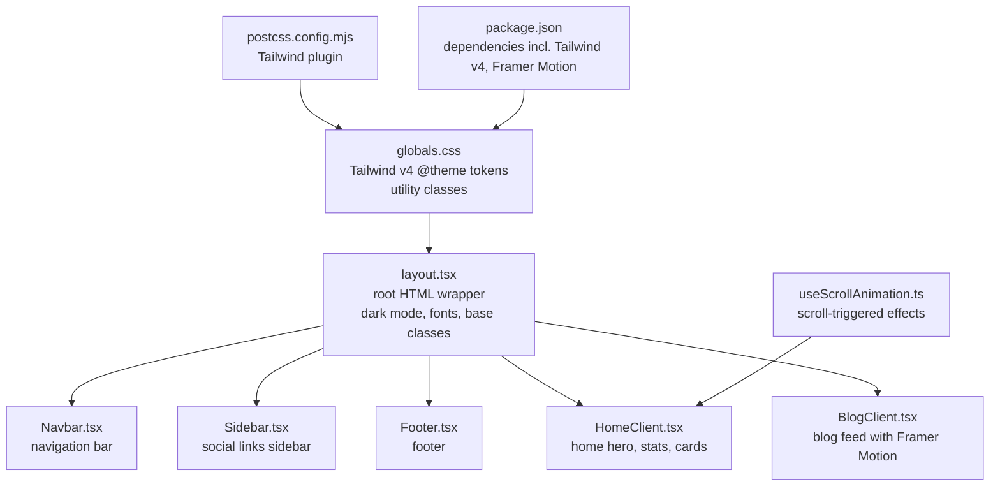
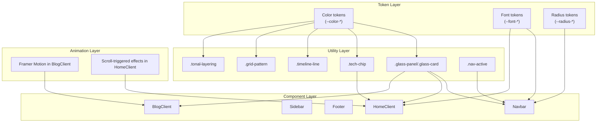
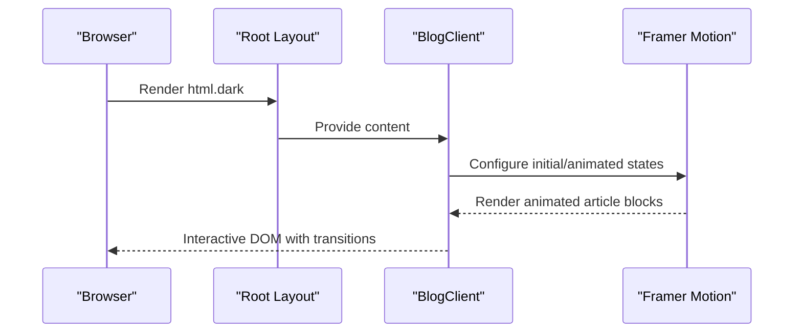
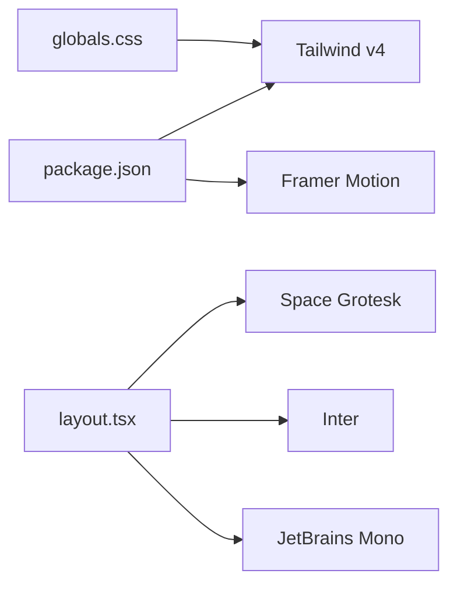

# Styling & Theming

<cite>
**Referenced Files in This Document**
- [globals.css](file://src/app/globals.css)
- [layout.tsx](file://src/app/layout.tsx)
- [Navbar.tsx](file://src/components/Navbar.tsx)
- [Footer.tsx](file://src/components/Footer.tsx)
- [Sidebar.tsx](file://src/components/Sidebar.tsx)
- [HomeClient.tsx](file://src/components/HomeClient.tsx)
- [BlogClient.tsx](file://src/components/BlogClient.tsx)
- [useScrollAnimation.ts](file://src/hooks/useScrollAnimation.ts)
- [package.json](file://package.json)
- [postcss.config.mjs](file://postcss.config.mjs)
- [next.config.ts](file://next.config.ts)
</cite>

## Table of Contents
1. [Introduction](#introduction)
2. [Project Structure](#project-structure)
3. [Core Components](#core-components)
4. [Architecture Overview](#architecture-overview)
5. [Detailed Component Analysis](#detailed-component-analysis)
6. [Dependency Analysis](#dependency-analysis)
7. [Performance Considerations](#performance-considerations)
8. [Troubleshooting Guide](#troubleshooting-guide)
9. [Conclusion](#conclusion)
10. [Appendices](#appendices)

## Introduction
This document describes the styling and theming system built with Tailwind CSS v4. It explains the design token system, color palette, typography scales, spacing units, dark theme implementation, glass-morphism effects, responsive patterns, and the integration with Framer Motion animations. It also provides guidelines for customization, extending the design system, performance optimization, and accessibility considerations.

## Project Structure
The styling system centers around a global stylesheet that defines Tailwind v4 design tokens and shared utility classes, and a root layout that applies fonts, dark mode, and base styles. Components consume these tokens and utilities to maintain consistency.

**Diagram sources**
- [globals.css:1-113](file://src/app/globals.css#L1-L113)
- [layout.tsx:1-58](file://src/app/layout.tsx#L1-L58)
- [Navbar.tsx:1-140](file://src/components/Navbar.tsx#L1-L140)
- [Sidebar.tsx:1-20](file://src/components/Sidebar.tsx#L1-L20)
- [Footer.tsx:1-49](file://src/components/Footer.tsx#L1-L49)
- [HomeClient.tsx:1-212](file://src/components/HomeClient.tsx#L1-L212)
- [BlogClient.tsx:1-166](file://src/components/BlogClient.tsx#L1-L166)
- [useScrollAnimation.ts:1-51](file://src/hooks/useScrollAnimation.ts#L1-L51)
- [postcss.config.mjs:1-6](file://postcss.config.mjs#L1-L6)
- [package.json:1-35](file://package.json#L1-L35)

**Section sources**
- [globals.css:1-113](file://src/app/globals.css#L1-L113)
- [layout.tsx:1-58](file://src/app/layout.tsx#L1-L58)
- [postcss.config.mjs:1-6](file://postcss.config.mjs#L1-L6)
- [package.json:1-35](file://package.json#L1-L35)

## Core Components
- Design tokens: Tailwind v4 @theme block defines color tokens, font families, and corner radius tokens.
- Global styles: Base body styles and reusable utility classes for glass panels, tech chips, timeline, grid pattern, tonal layering, and nav active state.
- Dark theme: Applied at the root html element with a dark class.
- Fonts: Google Fonts loaded via Next.js font objects and exposed as CSS variables for typography tokens.
- Responsive patterns: Mobile-first approach using Tailwind’s responsive prefixes and component-specific breakpoints.

**Section sources**
- [globals.css:4-66](file://src/app/globals.css#L4-L66)
- [globals.css:68-113](file://src/app/globals.css#L68-L113)
- [layout.tsx:34-57](file://src/app/layout.tsx#L34-L57)
- [Navbar.tsx:20-78](file://src/components/Navbar.tsx#L20-L78)

## Architecture Overview
The styling architecture is a layered system:
- Token layer: Tailwind v4 @theme defines semantic color tokens, fonts, and radii.
- Utility layer: Shared CSS classes encapsulate glass-morphism and common patterns.
- Component layer: UI components apply tokens and utilities consistently.
- Animation layer: Framer Motion integrates with component transitions and motion design.

**Diagram sources**
- [globals.css:4-66](file://src/app/globals.css#L4-L66)
- [globals.css:74-113](file://src/app/globals.css#L74-L113)
- [Navbar.tsx:1-140](file://src/components/Navbar.tsx#L1-L140)
- [Sidebar.tsx:1-20](file://src/components/Sidebar.tsx#L1-L20)
- [Footer.tsx:1-49](file://src/components/Footer.tsx#L1-L49)
- [HomeClient.tsx:1-212](file://src/components/HomeClient.tsx#L1-L212)
- [BlogClient.tsx:1-166](file://src/components/BlogClient.tsx#L1-L166)

## Detailed Component Analysis

### Design Token System
- Color palette: A comprehensive set of primary, secondary, tertiary, surface, background, error, and outline tokens is defined. Tokens include variants such as dim, fixed, container, and on-* variants for proper contrast and layering.
- Typography: Headline, body, label, and mono families are defined as CSS variables and consumed by components.
- Spacing and radii: Corner radius tokens align with a compact scale suitable for modern UI.

Implementation highlights:
- Tokens are declared in the global stylesheet under the Tailwind v4 @theme block.
- Body defaults bind background and text color to tokens for consistent dark theme rendering.

**Section sources**
- [globals.css:4-66](file://src/app/globals.css#L4-L66)
- [globals.css:68-72](file://src/app/globals.css#L68-L72)

### Dark Theme Implementation
- Root dark mode: The html element carries a dark class to activate dark-mode variants.
- Surface and tint tokens: Surface tokens and tint tokens support elevated surfaces and contrast.
- Backdrop blur and glass effects: Utility classes define glass panels and cards with backdrop blur and subtle borders.

**Section sources**
- [layout.tsx:34-34](file://src/app/layout.tsx#L34-L34)
- [globals.css:74-88](file://src/app/globals.css#L74-L88)

### Glass-Morphism Effects and Backdrop Blur
- Glass panel and card utilities: Provide translucent backgrounds, backdrop blur, and soft borders.
- Hover enhancements: Subtle border brightening, glow-like shadows, and lift transforms improve interactivity.
- Component usage: Applied in contact page links and hero visuals.

**Section sources**
- [globals.css:74-88](file://src/app/globals.css#L74-L88)
- [BlogClient.tsx:56-56](file://src/components/BlogClient.tsx#L56-L56)

### Typography Scale and Font Families
- Font families: Headline, body, label, and mono families are exposed as CSS variables.
- Component usage: Headings, navigation, and mono-styled elements consistently reference tokens.

**Section sources**
- [globals.css:57-60](file://src/app/globals.css#L57-L60)
- [layout.tsx:8-21](file://src/app/layout.tsx#L8-L21)
- [Navbar.tsx:23-25](file://src/components/Navbar.tsx#L23-L25)

### Spacing Units and Radius Tokens
- Radius tokens: DEFAULT, lg, xl, and full sizes enable consistent corner rounding across components.
- Component spacing: Padding, margin, and gap utilities are used throughout for rhythm and alignment.

**Section sources**
- [globals.css:62-65](file://src/app/globals.css#L62-L65)
- [HomeClient.tsx:101-114](file://src/components/HomeClient.tsx#L101-L114)

### Responsive Design Patterns and Breakpoints
- Mobile-first approach: Components progressively enhance from small screens using Tailwind’s responsive prefixes.
- Breakpoint usage: Examples include md:, lg:, and others to adjust layouts, typography, and interactive states.

**Section sources**
- [Navbar.tsx:28-53](file://src/components/Navbar.tsx#L28-L53)
- [HomeClient.tsx:129-163](file://src/components/HomeClient.tsx#L129-L163)
- [BlogClient.tsx:33-116](file://src/components/BlogClient.tsx#L33-L116)

### Navigation and Active States
- Active indicator: A dedicated utility class applies color and border to indicate current route.
- Hover and transition effects: Consistent transitions and color shifts improve feedback.

**Section sources**
- [globals.css:108-112](file://src/app/globals.css#L108-L112)
- [Navbar.tsx:29-52](file://src/components/Navbar.tsx#L29-L52)

### Scroll-Triggered Animations and Parallax
- Scroll animation hook: Adds visibility classes to elements when scrolled into view.
- Parallax effect: Background and content layers move at different speeds for depth perception.

**Section sources**
- [useScrollAnimation.ts:5-49](file://src/hooks/useScrollAnimation.ts#L5-L49)
- [HomeClient.tsx:18-21](file://src/components/HomeClient.tsx#L18-L21)

### Integration with Framer Motion
- Motion-driven entries: BlogClient uses Framer Motion to animate header and article entries with staggered delays.
- Transition patterns: Smooth opacity and positional transitions complement the glass and surface tokens.

**Diagram sources**
- [layout.tsx:34-57](file://src/app/layout.tsx#L34-L57)
- [BlogClient.tsx:19-87](file://src/components/BlogClient.tsx#L19-L87)

**Section sources**
- [BlogClient.tsx:19-87](file://src/components/BlogClient.tsx#L19-L87)

### Accessibility Considerations
- Contrast: Tokens include on-* variants for readable text on colored surfaces.
- Focus and hover: Clear color transitions and sufficient contrast for interactive states.
- Motion preferences: Consider reducing motion where appropriate; Framer Motion supports reduced-motion setups.

**Section sources**
- [globals.css:23-55](file://src/app/globals.css#L23-L55)
- [Navbar.tsx:55-63](file://src/components/Navbar.tsx#L55-L63)

## Dependency Analysis
- Tailwind CSS v4: Defined via PostCSS plugin and configured in package dependencies.
- Framer Motion: Integrated for animations in BlogClient.
- Fonts: Next.js font objects expose CSS variables for typography tokens.

**Diagram sources**
- [package.json:11-32](file://package.json#L11-L32)
- [layout.tsx:8-21](file://src/app/layout.tsx#L8-L21)
- [postcss.config.mjs:1-6](file://postcss.config.mjs#L1-L6)

**Section sources**
- [package.json:11-32](file://package.json#L11-L32)
- [postcss.config.mjs:1-6](file://postcss.config.mjs#L1-L6)

## Performance Considerations
- CSS optimization: Prefer tokenized utilities and avoid ad hoc inline styles to reduce CSS bloat.
- Critical CSS injection: Keep base tokens and essential utilities in the global stylesheet to minimize render-blocking styles.
- Component-level styling: Use local class composition and minimal overrides to maintain specificity and reduce cascade complexity.
- Motion performance: Use transform and opacity for animations; limit heavy backdrop blur to key elements.

[No sources needed since this section provides general guidance]

## Troubleshooting Guide
- Dark theme not applying: Verify the root html element has the dark class.
- Fonts not loading: Confirm Next.js font objects are imported and applied in the body class.
- Motion not animating: Ensure Framer Motion is installed and components use motion wrappers with initial/animated props.
- Scroll effects not triggering: Confirm the scroll listener hook is mounted and elements have the expected class names.

**Section sources**
- [layout.tsx:34-57](file://src/app/layout.tsx#L34-L57)
- [BlogClient.tsx:6-6](file://src/components/BlogClient.tsx#L6-L6)
- [useScrollAnimation.ts:5-49](file://src/hooks/useScrollAnimation.ts#L5-L49)

## Conclusion
The design system leverages Tailwind CSS v4’s token-driven architecture to deliver a cohesive, dark-themed interface with glass-morphism, robust typography, and smooth animations. By centralizing tokens and utilities, enforcing a mobile-first responsive strategy, and integrating Framer Motion thoughtfully, the system remains extensible, performant, and accessible.

[No sources needed since this section summarizes without analyzing specific files]

## Appendices

### Theme Customization Guidelines
- Extend color tokens: Add new semantic tokens in the @theme block and reference them in components.
- Typography updates: Modify font tokens to change headline/body styles globally.
- Radius adjustments: Update radius tokens to unify corner rounding across components.

**Section sources**
- [globals.css:4-66](file://src/app/globals.css#L4-L66)

### Extending the Design System
- Create new utilities: Define reusable classes in the global stylesheet for common patterns.
- Component-level overrides: Limit overrides to specific components to preserve global consistency.
- Motion patterns: Standardize animation timing and easing using shared configuration.

**Section sources**
- [globals.css:74-113](file://src/app/globals.css#L74-L113)
- [BlogClient.tsx:19-87](file://src/components/BlogClient.tsx#L19-L87)

### Example: Applying Glass Effects
- Apply utility classes to containers requiring translucency and blur.
- Combine with hover states for interactive feedback.

**Section sources**
- [globals.css:74-88](file://src/app/globals.css#L74-L88)
- [BlogClient.tsx:56-56](file://src/components/BlogClient.tsx#L56-L56)

### Example: Custom Component Styling
- Compose tokens and utilities to achieve brand-aligned visuals while preserving accessibility.
- Use responsive prefixes to adapt layouts across screen sizes.

**Section sources**
- [HomeClient.tsx:129-163](file://src/components/HomeClient.tsx#L129-L163)
- [Footer.tsx:5-44](file://src/components/Footer.tsx#L5-L44)